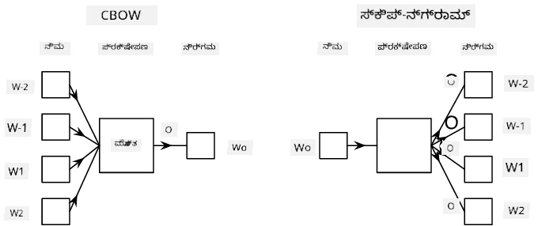

# ಭಾಷಾ ಮಾದರೀಕರಣ

ಶಬ್ದಾರ್ಥ ಸಂಯೋಜನೆಗಳು, ಉದಾಹರಣೆಗೆ Word2Vec ಮತ್ತು GloVe, ವಾಸ್ತವದಲ್ಲಿ **ಭಾಷಾ ಮಾದರೀಕರಣ**ದ ಮೊದಲ ಹಂತವಾಗಿದೆ - ಭಾಷೆಯ ಸ್ವಭಾವವನ್ನು ಹೇಗೆಂದರೆ *ಅರ್ಥಮಾಡಿಕೊಳ್ಳುವ* (ಅಥವಾ *ಪ್ರತಿನಿಧಿಸುವ*) ಮಾದರಿಗಳನ್ನು ರಚಿಸುವುದು.

## [ಪೂರ್ವ-ಪಾಠ ಪ್ರಶ್ನೋತ್ತರ](https://ff-quizzes.netlify.app/en/ai/quiz/29)

ಭಾಷಾ ಮಾದರೀಕರಣದ ಮುಖ್ಯ ತತ್ವವು ಲೇಬಲ್ ಇಲ್ಲದ ಡೇಟಾಸೆಟ್‌ಗಳ ಮೇಲೆ ಅನಿಯಂತ್ರಿತ ರೀತಿಯಲ್ಲಿ ತರಬೇತಿ ನೀಡುವುದಾಗಿದೆ. ಇದು ಮಹತ್ವದದ್ದು ಏಕೆಂದರೆ ನಮಗೆ ಲೇಬಲ್ ಇಲ್ಲದ ಬಹಳಷ್ಟು ಪಠ್ಯ ಲಭ್ಯವಿದೆ, ಆದರೆ ಲೇಬಲ್ ಮಾಡಲಾದ ಪಠ್ಯದ ಪ್ರಮಾಣವು ನಾವು ಲೇಬಲ್ ಮಾಡಲು ನೀಡಬಹುದಾದ ಪ್ರಯತ್ನದ ಪ್ರಮಾಣದಿಂದ ಸದಾ ಸೀಮಿತವಾಗಿರುತ್ತದೆ. ಬಹುಶಃ, ನಾವು ಪಠ್ಯದಲ್ಲಿ **ಕಳೆದುಹೋಗಿರುವ ಪದಗಳನ್ನು ಊಹಿಸುವ** ಭಾಷಾ ಮಾದರಿಗಳನ್ನು ನಿರ್ಮಿಸಬಹುದು, ಏಕೆಂದರೆ ಪಠ್ಯದಲ್ಲಿ ಯಾದೃಚ್ಛಿಕ ಪದವನ್ನು ಮಸ್ಕ್ ಮಾಡಿ ಅದನ್ನು ತರಬೇತಿ ಮಾದರಿಯಾಗಿ ಬಳಸುವುದು ಸುಲಭ.

## ಸಂಯೋಜನೆಗಳನ್ನು ತರಬೇತಿಗೊಳಿಸುವುದು

ನಮ್ಮ ಹಿಂದಿನ ಉದಾಹರಣೆಗಳಲ್ಲಿ, ನಾವು ಪೂರ್ವ-ತರಬೇತಿಗೊಳಿಸಿದ ಶಬ್ದಾರ್ಥ ಸಂಯೋಜನೆಗಳನ್ನು ಬಳಸಿದ್ದೇವೆ, ಆದರೆ ಆ ಸಂಯೋಜನೆಗಳನ್ನು ಹೇಗೆ ತರಬೇತಿಗೊಳಿಸಬಹುದು ಎಂಬುದನ್ನು ನೋಡುವುದು ಆಸಕ್ತಿದಾಯಕ. ಬಳಸಬಹುದಾದ ಕೆಲವು ಸಾಧ್ಯತೆಯಿರುವ ತಂತ್ರಗಳು ಇವೆ:

* **ಎನ್-ಗ್ರಾಮ್** ಭಾಷಾ ಮಾದರೀಕರಣ, ಇಲ್ಲಿ ನಾವು N ಹಿಂದಿನ ಟೋಕನ್‌ಗಳನ್ನು ನೋಡಿ ಟೋಕನ್ ಅನ್ನು ಊಹಿಸುತ್ತೇವೆ (N-ಗ್ರಾಮ್)
* **ಕಂಟಿನ್ಯೂಯಸ್ ಬ್ಯಾಗ್-ಆಫ್-ವರ್ಡ್ಸ್** (CBoW), ಇಲ್ಲಿ ನಾವು ಟೋಕನ್ ಸರಣಿಯಲ್ಲಿ ಮಧ್ಯದ ಟೋಕನ್ $W_0$ ಅನ್ನು ಊಹಿಸುತ್ತೇವೆ $W_{-N}$, ..., $W_N$.
* **ಸ್ಕಿಪ್-ಗ್ರಾಮ್**, ಇಲ್ಲಿ ನಾವು ಮಧ್ಯದ ಟೋಕನ್ $W_0$ ರಿಂದ ಸುತ್ತಲೂ ಇರುವ ಟೋಕನ್‌ಗಳ ಸಮೂಹ {$W_{-N},\dots, W_{-1}, W_1,\dots, W_N$} ಅನ್ನು ಊಹಿಸುತ್ತೇವೆ.

> ಚಿತ್ರ [ಈ ಪೇಪರ್](https://arxiv.org/pdf/1301.3781.pdf) ನಿಂದ

## ✍️ ಉದಾಹರಣಾ ನೋಟ್ಬುಕ್‌ಗಳು: CBoW ಮಾದರಿಯನ್ನು ತರಬೇತಿಗೊಳಿಸುವುದು

ಕೆಳಗಿನ ನೋಟ್ಬುಕ್‌ಗಳಲ್ಲಿ ನಿಮ್ಮ ಅಧ್ಯಯನವನ್ನು ಮುಂದುವರಿಸಿ:

* [TensorFlow ಬಳಸಿ CBoW Word2Vec ತರಬೇತಿ](CBoW-TF.ipynb)
* [PyTorch ಬಳಸಿ CBoW Word2Vec ತರಬೇತಿ](CBoW-PyTorch.ipynb)

## ಸಾರಾಂಶ

ಹಿಂದಿನ ಪಾಠದಲ್ಲಿ ನಾವು ನೋಡಿದಂತೆ ಶಬ್ದ ಸಂಯೋಜನೆಗಳು ಅದ್ಭುತವಾಗಿ ಕಾರ್ಯನಿರ್ವಹಿಸುತ್ತವೆ! ಈಗ ನಾವು ತಿಳಿದುಕೊಂಡಿದ್ದೇವೆ, ಶಬ್ದ ಸಂಯೋಜನೆಗಳನ್ನು ತರಬೇತಿಗೊಳಿಸುವುದು ತುಂಬಾ ಸಂಕೀರ್ಣ ಕೆಲಸವಲ್ಲ, ಮತ್ತು ಅಗತ್ಯವಿದ್ದರೆ ನಾವು ನಮ್ಮದೇ ಕ್ಷೇತ್ರಕ್ಕೆ ಸಂಬಂಧಿಸಿದ ಪಠ್ಯಕ್ಕಾಗಿ ಶಬ್ದ ಸಂಯೋಜನೆಗಳನ್ನು ತರಬೇತಿಗೊಳಿಸಬಹುದು.

## [ಪೋಸ್ಟ್-ಪಾಠ ಪ್ರಶ್ನೋತ್ತರ](https://ff-quizzes.netlify.app/en/ai/quiz/30)

## ವಿಮರ್ಶೆ ಮತ್ತು ಸ್ವಯಂ ಅಧ್ಯಯನ

* [ಭಾಷಾ ಮಾದರೀಕರಣದ ಅಧಿಕೃತ PyTorch ಪಾಠ](https://pytorch.org/tutorials/beginner/nlp/word_embeddings_tutorial.html).
* [Word2Vec ಮಾದರಿಯನ್ನು ತರಬೇತಿಗೊಳಿಸುವ ಅಧಿಕೃತ TensorFlow ಪಾಠ](https://www.TensorFlow.org/tutorials/text/word2vec).
* **gensim** ಫ್ರೇಮ್ವರ್ಕ್ ಬಳಸಿ ಸಾಮಾನ್ಯವಾಗಿ ಬಳಸುವ ಸಂಯೋಜನೆಗಳನ್ನು ಕೆಲವು ಸಾಲುಗಳ ಕೋಡ್‌ನಲ್ಲಿ ತರಬೇತಿಗೊಳಿಸುವುದು [ಈ ಡಾಕ್ಯುಮೆಂಟೇಶನ್‌ನಲ್ಲಿ](https://pytorch.org/tutorials/beginner/nlp/word_embeddings_tutorial.html) ವಿವರಿಸಲಾಗಿದೆ.

## 🚀 [ಕಾರ್ಯ: ಸ್ಕಿಪ್-ಗ್ರಾಮ್ ಮಾದರಿಯನ್ನು ತರಬೇತಿಗೊಳಿಸಿ](lab/README.md)

ಲ್ಯಾಬ್‌ನಲ್ಲಿ, ನಾವು ಈ ಪಾಠದ ಕೋಡ್ ಅನ್ನು ಬದಲಾಯಿಸಿ CBoW ಬದಲು ಸ್ಕಿಪ್-ಗ್ರಾಮ್ ಮಾದರಿಯನ್ನು ತರಬೇತಿಗೊಳಿಸುವಂತೆ ನಿಮಗೆ ಸವಾಲು ನೀಡುತ್ತೇವೆ. [ವಿವರಗಳನ್ನು ಓದಿ](lab/README.md)

---

<!-- CO-OP TRANSLATOR DISCLAIMER START -->
**ಅಸ್ವೀಕರಣ**:  
ಈ ದಸ್ತಾವೇಜು AI ಅನುವಾದ ಸೇವೆ [Co-op Translator](https://github.com/Azure/co-op-translator) ಬಳಸಿ ಅನುವಾದಿಸಲಾಗಿದೆ. ನಾವು ನಿಖರತೆಯಿಗಾಗಿ ಪ್ರಯತ್ನಿಸುತ್ತಿದ್ದರೂ, ಸ್ವಯಂಚಾಲಿತ ಅನುವಾದಗಳಲ್ಲಿ ತಪ್ಪುಗಳು ಅಥವಾ ಅಸತ್ಯತೆಗಳು ಇರಬಹುದು ಎಂದು ದಯವಿಟ್ಟು ಗಮನಿಸಿ. ಮೂಲ ಭಾಷೆಯಲ್ಲಿರುವ ಮೂಲ ದಸ್ತಾವೇಜನ್ನು ಅಧಿಕೃತ ಮೂಲವೆಂದು ಪರಿಗಣಿಸಬೇಕು. ಮಹತ್ವದ ಮಾಹಿತಿಗಾಗಿ, ವೃತ್ತಿಪರ ಮಾನವ ಅನುವಾದವನ್ನು ಶಿಫಾರಸು ಮಾಡಲಾಗುತ್ತದೆ. ಈ ಅನುವಾದ ಬಳಕೆಯಿಂದ ಉಂಟಾಗುವ ಯಾವುದೇ ತಪ್ಪು ಅರ್ಥಮಾಡಿಕೊಳ್ಳುವಿಕೆ ಅಥವಾ ತಪ್ಪು ವಿವರಣೆಗಳಿಗೆ ನಾವು ಹೊಣೆಗಾರರಾಗುವುದಿಲ್ಲ.
<!-- CO-OP TRANSLATOR DISCLAIMER END -->