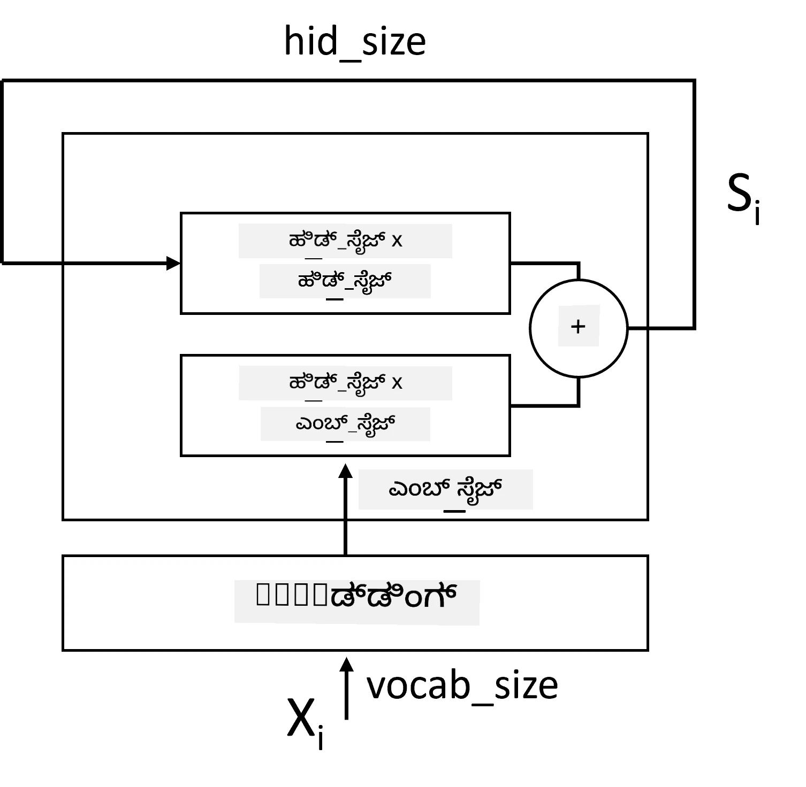
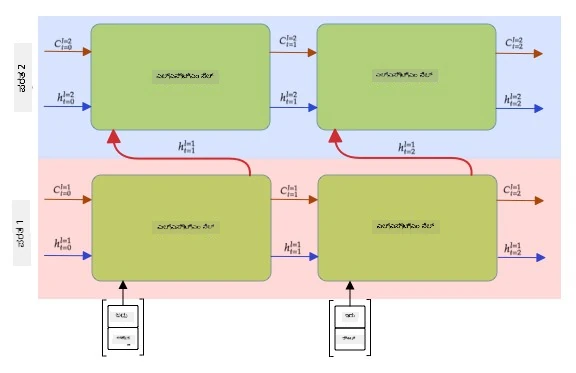

# ಪುನರಾವರ್ತಿತ ನ್ಯೂರಲ್ ನೆಟ್‌ವರ್ಕ್‌ಗಳು

## [ಪೂರ್ವ-ಲೇಕ್ಚರ್ ಕ್ವಿಜ್](https://ff-quizzes.netlify.app/en/ai/quiz/31)

ಹಿಂದಿನ ವಿಭಾಗಗಳಲ್ಲಿ, ನಾವು ಪಠ್ಯದ ಸಮೃದ್ಧ ಅರ್ಥಾತ್ಮಕ ಪ್ರತಿನಿಧಾನಗಳನ್ನು ಮತ್ತು ಎम्बೆಡ್ಡಿಂಗ್‌ಗಳ ಮೇಲೆ ಸರಳ ರೇಖೀಯ ವರ್ಗೀಕರಣವನ್ನು ಬಳಸುತ್ತಿದ್ದೇವೆ. ಈ ವಾಸ್ತುಶಿಲ್ಪವು ವಾಕ್ಯದ ಪದಗಳ ಸಂಗ್ರಹಿತ ಅರ್ಥವನ್ನು ಹಿಡಿದಿಡುತ್ತದೆ, ಆದರೆ ಪದಗಳ **ಕ್ರಮ**ವನ್ನು ಪರಿಗಣಿಸುವುದಿಲ್ಲ, ಏಕೆಂದರೆ ಎम्बೆಡ್ಡಿಂಗ್‌ಗಳ ಮೇಲಿನ ಸಂಗ್ರಹಣಾ ಕಾರ್ಯವು ಮೂಲ ಪಠ್ಯದಿಂದ ಈ ಮಾಹಿತಿಯನ್ನು ತೆಗೆದುಹಾಕುತ್ತದೆ. ಈ ಮಾದರಿಗಳು ಪದಗಳ ಕ್ರಮವನ್ನು ಮಾದರಿಮಾಡಲು ಸಾಧ್ಯವಿಲ್ಲದ ಕಾರಣ, ಪಠ್ಯ ರಚನೆ ಅಥವಾ ಪ್ರಶ್ನೋತ್ತರದಂತಹ ಹೆಚ್ಚು ಸಂಕೀರ್ಣ ಅಥವಾ ಅಸ್ಪಷ್ಟ ಕಾರ್ಯಗಳನ್ನು ಪರಿಹರಿಸಲು ಸಾಧ್ಯವಿಲ್ಲ.

ಪಠ್ಯದ ಕ್ರಮದ ಅರ್ಥವನ್ನು ಹಿಡಿಯಲು, ನಾವು ಮತ್ತೊಂದು ನ್ಯೂರಲ್ ನೆಟ್‌ವರ್ಕ್ ವಾಸ್ತುಶಿಲ್ಪವನ್ನು ಬಳಸಬೇಕಾಗುತ್ತದೆ, ಇದನ್ನು **ಪುನರಾವರ್ತಿತ ನ್ಯೂರಲ್ ನೆಟ್‌ವರ್ಕ್** ಅಥವಾ RNN ಎಂದು ಕರೆಯುತ್ತಾರೆ. RNN ನಲ್ಲಿ, ನಾವು ನಮ್ಮ ವಾಕ್ಯವನ್ನು ಒಂದು ಸಂಕೇತವನ್ನು ಒಂದೇ ಸಮಯದಲ್ಲಿ ನೆಟ್‌ವರ್ಕ್ ಮೂಲಕ ಹಾದುಹೋಗಿಸುತ್ತೇವೆ, ಮತ್ತು ನೆಟ್‌ವರ್ಕ್ ಕೆಲವು **ಸ್ಥಿತಿ**ಗಳನ್ನು ಉತ್ಪಾದಿಸುತ್ತದೆ, ಅದನ್ನು ಮುಂದಿನ ಸಂಕೇತದೊಂದಿಗೆ ಮತ್ತೆ ನೆಟ್‌ವರ್ಕ್‌ಗೆ ನೀಡುತ್ತೇವೆ.

> ಚಿತ್ರ ಲೇಖಕರಿಂದ

ನಮೂದಿಸಿದ ಟೋಕನ್ ಸರಣಿಯನ್ನು X0,...,Xn ಎಂದು ಕೊಟ್ಟಾಗ, RNN ನ್ಯೂರಲ್ ನೆಟ್‌ವರ್ಕ್ ಬ್ಲಾಕ್‌ಗಳ ಸರಣಿಯನ್ನು ರಚಿಸುತ್ತದೆ ಮತ್ತು ಬ್ಯಾಕ್ಪ್ರೊಪಗೇಶನ್ ಬಳಸಿ ಈ ಸರಣಿಯನ್ನು ಅಂತ್ಯದಿಂದ ಅಂತ್ಯಕ್ಕೆ ತರಬೇತುಗೊಳಿಸುತ್ತದೆ. ಪ್ರತಿ ನೆಟ್‌ವರ್ಕ್ ಬ್ಲಾಕ್ (Xi,Si) ಜೋಡಿಯನ್ನು ಇನ್‌ಪುಟ್ ಆಗಿ ತೆಗೆದುಕೊಳ್ಳುತ್ತದೆ ಮತ್ತು ಫಲಿತಾಂಶವಾಗಿ Si+1 ಅನ್ನು ಉತ್ಪಾದಿಸುತ್ತದೆ. ಅಂತಿಮ ಸ್ಥಿತಿ Sn ಅಥವಾ (ಔಟ್‌ಪುಟ್ Yn) ರೇಖೀಯ ವರ್ಗೀಕರಣಕ್ಕೆ ಹೋಗಿ ಫಲಿತಾಂಶವನ್ನು ನೀಡುತ್ತದೆ. ಎಲ್ಲಾ ನೆಟ್‌ವರ್ಕ್ ಬ್ಲಾಕ್‌ಗಳು ಒಂದೇ ತೂಕಗಳನ್ನು ಹಂಚಿಕೊಳ್ಳುತ್ತವೆ ಮತ್ತು ಒಂದು ಬ್ಯಾಕ್ಪ್ರೊಪಗೇಶನ್ ಪಾಸ್ ಬಳಸಿ ಅಂತ್ಯದಿಂದ ಅಂತ್ಯಕ್ಕೆ ತರಬೇತುಗೊಳ್ಳುತ್ತವೆ.

ಸ್ಥಿತಿ ವೆಕ್ಟರ್‌ಗಳು S0,...,Sn ನೆಟ್‌ವರ್ಕ್ ಮೂಲಕ ಹಾದುಹೋಗುವುದರಿಂದ, ಪದಗಳ ನಡುವಿನ ಕ್ರಮಬದ್ಧ ಅವಲಂಬನೆಗಳನ್ನು ಕಲಿಯಲು ಸಾಧ್ಯವಾಗುತ್ತದೆ. ಉದಾಹರಣೆಗೆ, ಸರಣಿಯಲ್ಲಿ *not* ಎಂಬ ಪದವು ಇದ್ದಾಗ, ಅದು ಸ್ಥಿತಿ ವೆಕ್ಟರ್‌ನ ಕೆಲವು ಅಂಶಗಳನ್ನು ನಕಾರಾತ್ಮಕವಾಗಿ ಬದಲಾಯಿಸುವುದನ್ನು ಕಲಿಯಬಹುದು, ಇದರಿಂದ ನಕಾರಾತ್ಮಕತೆ ಉಂಟಾಗುತ್ತದೆ.

> ✅ ಮೇಲಿನ ಚಿತ್ರದಲ್ಲಿ ಎಲ್ಲಾ RNN ಬ್ಲಾಕ್‌ಗಳ ತೂಕಗಳು ಹಂಚಿಕೊಳ್ಳಲ್ಪಟ್ಟಿರುವುದರಿಂದ, ಅದೇ ಚಿತ್ರವನ್ನು ಒಂದು ಬ್ಲಾಕ್ (ಬಲಭಾಗದಲ್ಲಿ) ಆಗಿ ಪ್ರತಿನಿಧಿಸಬಹುದು, ಇದರಲ್ಲಿ ಪುನರಾವರ್ತಿತ ಪ್ರತಿಕ್ರಿಯೆ ಲೂಪ್ ಇದೆ, ಇದು ನೆಟ್‌ವರ್ಕ್‌ನ ಔಟ್‌ಪುಟ್ ಸ್ಥಿತಿಯನ್ನು ಇನ್‌ಪುಟ್‌ಗೆ ಹಿಂತಿರುಗಿಸುತ್ತದೆ.

## RNN ಸೆಲ್‌ನ ರಚನೆ

ಸರಳ RNN ಸೆಲ್ ಹೇಗೆ ಸಂಘಟಿತವಾಗಿದೆ ನೋಡೋಣ. ಇದು ಹಿಂದಿನ ಸ್ಥಿತಿ Si-1 ಮತ್ತು ಪ್ರಸ್ತುತ ಸಂಕೇತ Xi ಅನ್ನು ಇನ್‌ಪುಟ್ ಆಗಿ ಸ್ವೀಕರಿಸಿ, ಔಟ್‌ಪುಟ್ ಸ್ಥಿತಿ Si (ಮತ್ತು ಕೆಲವೊಮ್ಮೆ, ಜನರೇಟಿವ್ ನೆಟ್‌ವರ್ಕ್‌ಗಳಂತೆ, ಇನ್ನೊಂದು ಔಟ್‌ಪುಟ್ Yi ಕೂಡ) ಉತ್ಪಾದಿಸಬೇಕು.

ಸರಳ RNN ಸೆಲ್ ಒಳಗೆ ಎರಡು ತೂಕ ಮ್ಯಾಟ್ರಿಕ್ಸ್‌ಗಳಿವೆ: ಒಂದು ಇನ್‌ಪುಟ್ ಸಂಕೇತವನ್ನು ಪರಿವರ್ತಿಸುತ್ತದೆ (ನಾವು ಅದನ್ನು W ಎಂದು ಕರೆಯೋಣ), ಮತ್ತೊಂದು ಇನ್‌ಪುಟ್ ಸ್ಥಿತಿಯನ್ನು ಪರಿವರ್ತಿಸುತ್ತದೆ (H). ಈ ಸಂದರ್ಭದಲ್ಲಿ ನೆಟ್‌ವರ್ಕ್ ಔಟ್‌ಪುಟ್ ಅನ್ನು &sigma;(W&times;Xi+H&times;Si-1+b) ಎಂದು ಲೆಕ್ಕಹಾಕಲಾಗುತ್ತದೆ, ಇಲ್ಲಿ &sigma; ಸಕ್ರಿಯಕರಣ ಕಾರ್ಯ ಮತ್ತು b ಹೆಚ್ಚುವರಿ ಬಯಾಸ್.

> ಚಿತ್ರ ಲೇಖಕರಿಂದ

ಬಹುಶಃ, ಇನ್‌ಪುಟ್ ಟೋಕನ್‌ಗಳನ್ನು RNN ಗೆ ಹೋಗುವ ಮೊದಲು ಎम्बೆಡ್ಡಿಂಗ್ ಲೇಯರ್ ಮೂಲಕ ಕಳುಹಿಸಲಾಗುತ್ತದೆ, ಇದರಿಂದ ಆಯಾಮ ಕಡಿಮೆಯಾಗುತ್ತದೆ. ಈ ಸಂದರ್ಭದಲ್ಲಿ, ಇನ್‌ಪುಟ್ ವೆಕ್ಟರ್‌ಗಳ ಆಯಾಮ *emb_size* ಆಗಿದ್ದರೆ ಮತ್ತು ಸ್ಥಿತಿ ವೆಕ್ಟರ್ *hid_size* ಆಗಿದ್ದರೆ - W ಗಾತ್ರವು *emb_size*&times;*hid_size* ಆಗಿರುತ್ತದೆ ಮತ್ತು H ಗಾತ್ರವು *hid_size*&times;*hid_size* ಆಗಿರುತ್ತದೆ.

## ದೀರ್ಘಕಾಲಿಕ ಸ್ಮೃತಿ (LSTM)

ಸಾಂಪ್ರದಾಯಿಕ RNN ಗಳ ಪ್ರಮುಖ ಸಮಸ್ಯೆಗಳಲ್ಲಿ ಒಂದಾಗಿದೆ **ವ್ಯಾಜಮಾನ್ಯ ಗ್ರೇಡಿಯಂಟ್‌ಗಳು** ಸಮಸ್ಯೆ. RNN ಗಳು ಒಂದು ಬ್ಯಾಕ್ಪ್ರೊಪಗೇಶನ್ ಪಾಸ್‌ನಲ್ಲಿ ಅಂತ್ಯದಿಂದ ಅಂತ್ಯಕ್ಕೆ ತರಬೇತುಗೊಳ್ಳುವ ಕಾರಣ, ಮೊದಲ ಲೇಯರ್‌ಗಳಿಗೆ ದೋಷವನ್ನು ಹರಡುವಲ್ಲಿ ಕಷ್ಟವಾಗುತ್ತದೆ, ಆದ್ದರಿಂದ ದೂರದ ಟೋಕನ್‌ಗಳ ನಡುವಿನ ಸಂಬಂಧಗಳನ್ನು ಕಲಿಯಲು ಸಾಧ್ಯವಿಲ್ಲ. ಈ ಸಮಸ್ಯೆಯನ್ನು ತಪ್ಪಿಸಲು ಒಂದು ಮಾರ್ಗವೆಂದರೆ **ಸ್ಪಷ್ಟ ಸ್ಥಿತಿ ನಿರ್ವಹಣೆ** ಅನ್ನು ಪರಿಚಯಿಸುವುದು, ಇದಕ್ಕಾಗಿ **ಗೇಟ್ಸ್** ಅನ್ನು ಬಳಸಲಾಗುತ್ತದೆ. ಈ ರೀತಿಯ ಎರಡು ಪ್ರಸಿದ್ಧ ವಾಸ್ತುಶಿಲ್ಪಗಳು: **ದೀರ್ಘಕಾಲಿಕ ಸ್ಮೃತಿ** (LSTM) ಮತ್ತು **ಗೇಟೆಡ್ ರಿಲೇ ಯೂನಿಟ್** (GRU).

> ಚಿತ್ರ ಮೂಲ TBD

LSTM ನೆಟ್‌ವರ್ಕ್ RNN ಗೆ ಹೋಲುವ ರೀತಿಯಲ್ಲಿ ಸಂಘಟಿತವಾಗಿದೆ, ಆದರೆ ಎರಡು ಸ್ಥಿತಿಗಳನ್ನು ಲೇಯರ್‌ಗಳಿಂದ ಲೇಯರ್‌ಗಳಿಗೆ ಕಳುಹಿಸಲಾಗುತ್ತದೆ: ನಿಜವಾದ ಸ್ಥಿತಿ C ಮತ್ತು ಗುಪ್ತ ವೆಕ್ಟರ್ H. ಪ್ರತಿ ಘಟಕದಲ್ಲಿ, ಗುಪ್ತ ವೆಕ್ಟರ್ Hi ಇನ್‌ಪುಟ್ Xi ಜೊತೆಗೆ ಸಂಯೋಜಿಸಲಾಗುತ್ತದೆ ಮತ್ತು ಅವು **ಗೇಟ್ಸ್** ಮೂಲಕ ಸ್ಥಿತಿ C ಮೇಲೆ ನಿಯಂತ್ರಣ ಇಡುತ್ತವೆ. ಪ್ರತಿ ಗೇಟ್ ಸಿಗ್ಮಾಯ್ಡ್ ಸಕ್ರಿಯಕರಣ (ಔಟ್‌ಪುಟ್ ಶ್ರೇಣಿ [0,1]) ಹೊಂದಿರುವ ನ್ಯೂರಲ್ ನೆಟ್‌ವರ್ಕ್ ಆಗಿದ್ದು, ಸ್ಥಿತಿ ವೆಕ್ಟರ್‌ಗೆ ಗುಣಾಕಾರ ಮಾಡಿದಾಗ ಬಿಟ್‌ವೈಸ್ ಮಾಸ್ಕ್ ಎಂದು ಭಾವಿಸಬಹುದು. ಮೇಲಿನ ಚಿತ್ರದಲ್ಲಿ ಎಡದಿಂದ ಬಲಕ್ಕೆ ಗೇಟ್ಸ್ ಇವು:

* **ಮರೆತುಹೋಗುವ ಗೇಟ್** ಗುಪ್ತ ವೆಕ್ಟರ್ ತೆಗೆದುಕೊಂಡು, ಸ್ಥಿತಿ C ಯ ಯಾವ ಅಂಶಗಳನ್ನು ಮರೆತುಹೋಗಬೇಕೆಂದು ಮತ್ತು ಯಾವುವನ್ನು ಮುಂದುವರಿಸಲು ಬೇಕೆಂದು ನಿರ್ಧರಿಸುತ್ತದೆ.
* **ಇನ್‌ಪುಟ್ ಗೇಟ್** ಇನ್‌ಪುಟ್ ಮತ್ತು ಗುಪ್ತ ವೆಕ್ಟರ್‌ನಿಂದ ಕೆಲವು ಮಾಹಿತಿಯನ್ನು ತೆಗೆದುಕೊಂಡು ಸ್ಥಿತಿಗೆ ಸೇರಿಸುತ್ತದೆ.
* **ಔಟ್‌ಪುಟ್ ಗೇಟ್** ಸ್ಥಿತಿಯನ್ನು *tanh* ಸಕ್ರಿಯಕರಣದೊಂದಿಗೆ ರೇಖೀಯ ಲೇಯರ್ ಮೂಲಕ ಪರಿವರ್ತಿಸಿ, ನಂತರ ಗುಪ್ತ ವೆಕ್ಟರ್ Hi ಬಳಸಿ ಅದರ ಕೆಲವು ಅಂಶಗಳನ್ನು ಆಯ್ಕೆಮಾಡಿ ಹೊಸ ಸ್ಥಿತಿ Ci+1 ಅನ್ನು ಉತ್ಪಾದಿಸುತ್ತದೆ.

ಸ್ಥಿತಿ C ಯ ಅಂಶಗಳನ್ನು ಕೆಲವು ಫ್ಲಾಗ್‌ಗಳಂತೆ ಭಾವಿಸಬಹುದು, ಅವುಗಳನ್ನು ಆನ್ ಅಥವಾ ಆಫ್ ಮಾಡಬಹುದು. ಉದಾಹರಣೆಗೆ, ಸರಣಿಯಲ್ಲಿ *Alice* ಎಂಬ ಹೆಸರು ಬಂದಾಗ, ಅದು ಹೆಣ್ಣು ಪಾತ್ರವನ್ನು ಸೂಚಿಸುತ್ತದೆ ಎಂದು ಊಹಿಸಿ, ನಾವು ಹೆಣ್ಣು ನಾಮಪದವಿದೆ ಎಂಬ ಫ್ಲಾಗ್ ಅನ್ನು ಸ್ಥಿತಿಯಲ್ಲಿ ಎತ್ತಬಹುದು. ನಂತರ *and Tom* ಎಂಬ ಪದಗಳು ಬಂದಾಗ, ಬಹುವಚನ ನಾಮಪದವಿದೆ ಎಂಬ ಫ್ಲಾಗ್ ಅನ್ನು ಎತ್ತಬಹುದು. ಹೀಗಾಗಿ ಸ್ಥಿತಿಯನ್ನು ನಿಯಂತ್ರಿಸುವ ಮೂಲಕ ವಾಕ್ಯದ ವ್ಯಾಕರಣಾತ್ಮಕ ಗುಣಲಕ್ಷಣಗಳನ್ನು ಟ್ರ್ಯಾಕ್ ಮಾಡಬಹುದು.

> ✅ LSTM ಒಳಗಿನ ಕಾರ್ಯವಿಧಾನವನ್ನು ಅರ್ಥಮಾಡಿಕೊಳ್ಳಲು ಅತ್ಯುತ್ತಮ ಸಂಪನ್ಮೂಲವೆಂದರೆ ಕ್ರಿಸ್ಟೋಫರ್ ಓಲಾಹ್ ಅವರ [Understanding LSTM Networks](https://colah.github.io/posts/2015-08-Understanding-LSTMs/) ಎಂಬ ಅದ್ಭುತ ಲೇಖನ.

## ದ್ವಿಮುಖಿ ಮತ್ತು ಬಹು-ಲೇಯರ್ RNN ಗಳು

ನಾವು ಒಂದು ದಿಕ್ಕಿನಲ್ಲಿ ಕಾರ್ಯನಿರ್ವಹಿಸುವ ಪುನರಾವರ್ತಿತ ನೆಟ್‌ವರ್ಕ್‌ಗಳನ್ನು ಚರ್ಚಿಸಿದ್ದೇವೆ, ಸರಣಿಯ ಆರಂಭದಿಂದ ಅಂತ್ಯಕ್ಕೆ. ಇದು ಸಹಜವಾಗಿದ್ದು, ನಾವು ಓದುವ ಮತ್ತು ಮಾತು ಕೇಳುವ ರೀತಿಗೆ ಹೋಲುತ್ತದೆ. ಆದರೆ, ಅನೇಕ ಪ್ರಾಯೋಗಿಕ ಸಂದರ್ಭಗಳಲ್ಲಿ ನಮಗೆ ಇನ್‌ಪುಟ್ ಸರಣಿಗೆ ಯಾದೃಚ್ಛಿಕ ಪ್ರವೇಶವಿರುವುದರಿಂದ, ಪುನರಾವರ್ತಿತ ಗಣನೆ ಎರಡೂ ದಿಕ್ಕಿನಲ್ಲಿ ನಡೆಯುವುದು ಅರ್ಥಪೂರ್ಣವಾಗಬಹುದು. ಇಂತಹ ನೆಟ್‌ವರ್ಕ್‌ಗಳನ್ನು **ದ್ವಿಮುಖಿ** RNN ಗಳು ಎಂದು ಕರೆಯುತ್ತಾರೆ. ದ್ವಿಮುಖಿ ನೆಟ್‌ವರ್ಕ್‌ಗಳೊಂದಿಗೆ, ಪ್ರತಿ ದಿಕ್ಕಿಗೆ ಒಂದು ಗುಪ್ತ ಸ್ಥಿತಿ ವೆಕ್ಟರ್ ಬೇಕಾಗುತ್ತದೆ.

ಒಂದು ಪುನರಾವರ್ತಿತ ನೆಟ್‌ವರ್ಕ್, ಏತಾದರೂ ಒಂದು ದಿಕ್ಕಿನ ಅಥವಾ ದ್ವಿಮುಖಿ, ಸರಣಿಯೊಳಗಿನ ಕೆಲವು ಮಾದರಿಗಳನ್ನು ಹಿಡಿದುಕೊಳ್ಳುತ್ತದೆ ಮತ್ತು ಅವುಗಳನ್ನು ಸ್ಥಿತಿ ವೆಕ್ಟರ್ ಅಥವಾ ಔಟ್‌ಪುಟ್‌ಗೆ ಸಂಗ್ರಹಿಸುತ್ತದೆ. ಕಾಂವಲ್ಯೂಷನಲ್ ನೆಟ್‌ವರ್ಕ್‌ಗಳಂತೆ, ನಾವು ಮೊದಲ ಲೇಯರ್‌ನ ಮೇಲೆ ಮತ್ತೊಂದು ಪುನರಾವರ್ತಿತ ಲೇಯರ್ ನಿರ್ಮಿಸಬಹುದು, ಇದರಿಂದ ಹೆಚ್ಚಿನ ಮಟ್ಟದ ಮಾದರಿಗಳನ್ನು ಹಿಡಿದುಕೊಳ್ಳಬಹುದು ಮತ್ತು ಮೊದಲ ಲೇಯರ್ ತೆಗೆದುಕೊಂಡ ಕಡಿಮೆ ಮಟ್ಟದ ಮಾದರಿಗಳಿಂದ ನಿರ್ಮಿಸಬಹುದು. ಇದರಿಂದ **ಬಹು-ಲೇಯರ್ RNN** ಎಂಬ ಕಲ್ಪನೆ ಬರುತ್ತದೆ, ಇದು ಎರಡು ಅಥವಾ ಹೆಚ್ಚು ಪುನರಾವರ್ತಿತ ನೆಟ್‌ವರ್ಕ್‌ಗಳಿಂದ ಕೂಡಿದೆ, ಇಲ್ಲಿ ಹಿಂದಿನ ಲೇಯರ್‌ನ ಔಟ್‌ಪುಟ್ ಮುಂದಿನ ಲೇಯರ್‌ಗೆ ಇನ್‌ಪುಟ್ ಆಗಿ ನೀಡಲಾಗುತ್ತದೆ.

*ಚಿತ್ರ [ಈ ಅದ್ಭುತ ಪೋಸ್ಟ್](https://towardsdatascience.com/from-a-lstm-cell-to-a-multilayer-lstm-network-with-pytorch-2899eb5696f3) ನಿಂದ ಫೆರ್ನಾಂಡೋ ಲೋಪೆಜ್ ಅವರಿಂದ*

## ✍️ ಅಭ್ಯಾಸಗಳು: ಎम्बೆಡ್ಡಿಂಗ್‌ಗಳು

ಕೆಳಗಿನ ನೋಟ್‌ಬುಕ್‌ಗಳಲ್ಲಿ ನಿಮ್ಮ ಅಧ್ಯಯನವನ್ನು ಮುಂದುವರಿಸಿ:

* [PyTorch ಬಳಸಿ RNN ಗಳು](RNNPyTorch.ipynb)
* [TensorFlow ಬಳಸಿ RNN ಗಳು](RNNTF.ipynb)

## ಸಾರಾಂಶ

ಈ ಘಟಕದಲ್ಲಿ, RNN ಗಳು ಸರಣಿ ವರ್ಗೀಕರಣಕ್ಕೆ ಬಳಸಬಹುದೆಂದು ನೋಡಿದೆವು, ಆದರೆ ವಾಸ್ತವದಲ್ಲಿ, ಅವು ಪಠ್ಯ ರಚನೆ, ಯಂತ್ರ ಅನುವಾದ ಮತ್ತು ಇನ್ನಷ್ಟು ಕಾರ್ಯಗಳನ್ನು ನಿರ್ವಹಿಸಬಹುದು. ಮುಂದಿನ ಘಟಕದಲ್ಲಿ ಆ ಕಾರ್ಯಗಳನ್ನು ಪರಿಗಣಿಸುವೆವು.

## 🚀 ಸವಾಲು

LSTM ಗಳ ಬಗ್ಗೆ ಕೆಲವು ಸಾಹಿತ್ಯವನ್ನು ಓದಿ ಮತ್ತು ಅವುಗಳ ಅನ್ವಯಗಳನ್ನು ಪರಿಗಣಿಸಿ:

- [Grid Long Short-Term Memory](https://arxiv.org/pdf/1507.01526v1.pdf)
- [Show, Attend and Tell: Neural Image Caption Generation with Visual Attention](https://arxiv.org/pdf/1502.03044v2.pdf)

## [ಪೋಸ್ಟ್-ಲೇಕ್ಚರ್ ಕ್ವಿಜ್](https://ff-quizzes.netlify.app/en/ai/quiz/32)

## ವಿಮರ್ಶೆ ಮತ್ತು ಸ್ವಯಂ ಅಧ್ಯಯನ

- ಕ್ರಿಸ್ಟೋಫರ್ ಓಲಾಹ್ ಅವರ [Understanding LSTM Networks](https://colah.github.io/posts/2015-08-Understanding-LSTMs/) ಲೇಖನ.

## [ಕಾರ್ಯ: ನೋಟ್‌ಬುಕ್‌ಗಳು](assignment.md)

---

<!-- CO-OP TRANSLATOR DISCLAIMER START -->
**ಅಸ್ವೀಕಾರ**:  
ಈ ದಸ್ತಾವೇಜು AI ಅನುವಾದ ಸೇವೆ [Co-op Translator](https://github.com/Azure/co-op-translator) ಬಳಸಿ ಅನುವಾದಿಸಲಾಗಿದೆ. ನಾವು ನಿಖರತೆಯಿಗಾಗಿ ಪ್ರಯತ್ನಿಸುತ್ತಿದ್ದರೂ, ಸ್ವಯಂಚಾಲಿತ ಅನುವಾದಗಳಲ್ಲಿ ತಪ್ಪುಗಳು ಅಥವಾ ಅಸತ್ಯತೆಗಳು ಇರಬಹುದು ಎಂದು ದಯವಿಟ್ಟು ಗಮನಿಸಿ. ಮೂಲ ಭಾಷೆಯಲ್ಲಿರುವ ಮೂಲ ದಸ್ತಾವೇಜನ್ನು ಅಧಿಕೃತ ಮೂಲವೆಂದು ಪರಿಗಣಿಸಬೇಕು. ಪ್ರಮುಖ ಮಾಹಿತಿಗಾಗಿ, ವೃತ್ತಿಪರ ಮಾನವ ಅನುವಾದವನ್ನು ಶಿಫಾರಸು ಮಾಡಲಾಗುತ್ತದೆ. ಈ ಅನುವಾದ ಬಳಕೆಯಿಂದ ಉಂಟಾಗುವ ಯಾವುದೇ ತಪ್ಪು ಅರ್ಥಮಾಡಿಕೊಳ್ಳುವಿಕೆ ಅಥವಾ ತಪ್ಪು ವಿವರಣೆಗಳಿಗೆ ನಾವು ಹೊಣೆಗಾರರಾಗುವುದಿಲ್ಲ.
<!-- CO-OP TRANSLATOR DISCLAIMER END -->