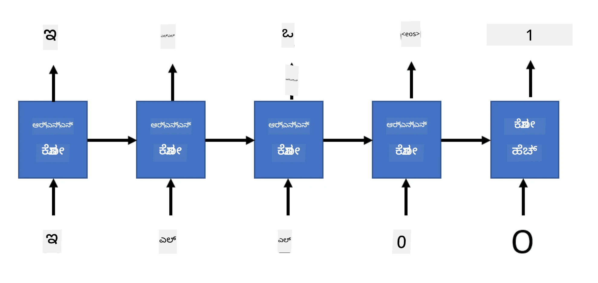

# ಜನರೇಟಿವ್ ನೆಟ್‌ವರ್ಕ್‌ಗಳು

## [ಪೂರ್ವ-ಲೆಕ್ಚರ್ ಕ್ವಿಜ್](https://ff-quizzes.netlify.app/en/ai/quiz/33)

ರಿಕರೆಂಟ್ ನ್ಯೂರಲ್ ನೆಟ್‌ವರ್ಕ್‌ಗಳು (RNNಗಳು) ಮತ್ತು ಅವುಗಳ ಗೇಟೆಡ್ ಸೆಲ್ ರೂಪಾಂತರಗಳು, ಉದಾಹರಣೆಗೆ ಲಾಂಗ್ ಶಾರ್ಟ್ ಟರ್ಮ್ ಮೆಮೊರಿ ಸೆಲ್ಸ್ (LSTMs) ಮತ್ತು ಗೇಟೆಡ್ ರಿಕರೆಂಟ್ ಯುನಿಟ್ಸ್ (GRUs), ಭಾಷಾ ಮಾದರೀಕರಣಕ್ಕೆ ಒಂದು ಯಂತ್ರವಿಧಾನವನ್ನು ಒದಗಿಸುತ್ತವೆ. ಅವು ಪದಗಳ ಕ್ರಮವನ್ನು ಕಲಿಯಬಹುದು ಮತ್ತು ಸರಣಿಯಲ್ಲಿ ಮುಂದಿನ ಪದದ ಭವಿಷ್ಯವಾಣಿ ಮಾಡಬಹುದು. ಇದರಿಂದ ನಾವು RNNಗಳನ್ನು **ಜನರೇಟಿವ್ ಕಾರ್ಯಗಳಿಗೆ** ಬಳಸಬಹುದು, ಉದಾಹರಣೆಗೆ ಸಾಮಾನ್ಯ ಪಠ್ಯ ರಚನೆ, ಯಂತ್ರ ಭಾಷಾಂತರ, ಮತ್ತು ಚಿತ್ರ ಶೀರ್ಷಿಕೆ ರಚನೆ.

> ✅ ನೀವು ಟೈಪ್ ಮಾಡುವಾಗ ಪಠ್ಯ ಪೂರ್ಣಗೊಳಿಸುವಂತಹ ಜನರೇಟಿವ್ ಕಾರ್ಯಗಳಿಂದ ಲಾಭ ಪಡೆದಿರುವ ಎಲ್ಲಾ ಸಂದರ್ಭಗಳನ್ನು ಯೋಚಿಸಿ. ನಿಮ್ಮ ಇಷ್ಟದ ಅಪ್ಲಿಕೇಶನ್‌ಗಳು RNNಗಳನ್ನು ಬಳಸಿದೆಯೇ ಎಂದು ಸಂಶೋಧನೆ ಮಾಡಿ.

ಹಿಂದಿನ ಘಟಕದಲ್ಲಿ ನಾವು ಚರ್ಚಿಸಿದ RNN ವಾಸ್ತುಶಿಲ್ಪದಲ್ಲಿ, ಪ್ರತಿ RNN ಯುನಿಟ್ ಮುಂದಿನ ಹಿಡನ್ ಸ್ಟೇಟ್ ಅನ್ನು ಔಟ್‌ಪುಟ್ ಆಗಿ ನೀಡುತ್ತಿತ್ತು. ಆದರೆ, ನಾವು ಪ್ರತಿ ರಿಕರೆಂಟ್ ಯುನಿಟ್‌ಗೆ ಮತ್ತೊಂದು ಔಟ್‌ಪುಟ್ ಅನ್ನು ಸೇರಿಸಬಹುದು, ಇದು ನಮಗೆ ಮೂಲ ಸರಣಿಯ ಉದ್ದಕ್ಕೆ ಸಮಾನವಾದ **ಸರಣಿ** ಅನ್ನು ಔಟ್‌ಪುಟ್ ಮಾಡಲು ಅವಕಾಶ ನೀಡುತ್ತದೆ. ಜೊತೆಗೆ, ನಾವು ಪ್ರತಿ ಹಂತದಲ್ಲಿ ಇನ್‌ಪುಟ್ ಸ್ವೀಕರಿಸದ RNN ಯುನಿಟ್‌ಗಳನ್ನು ಬಳಸಬಹುದು, ಆರಂಭಿಕ ಸ್ಥಿತಿ ವೆಕ್ಟರ್ ಅನ್ನು ಮಾತ್ರ ತೆಗೆದು, ನಂತರ ಔಟ್‌ಪುಟ್ ಸರಣಿಯನ್ನು ಉತ್ಪಾದಿಸಬಹುದು.

ಇದು ಕೆಳಗಿನ ಚಿತ್ರದಲ್ಲಿ ತೋರಿಸಿದಂತೆ ವಿಭಿನ್ನ ನ್ಯೂರಲ್ ವಾಸ್ತುಶಿಲ್ಪಗಳಿಗೆ ಅವಕಾಶ ನೀಡುತ್ತದೆ:


> ಚಿತ್ರವು [Unreasonable Effectiveness of Recurrent Neural Networks](http://karpathy.github.io/2015/05/21/rnn-effectiveness/) ಬ್ಲಾಗ್ ಪೋಸ್ಟ್‌ನಿಂದ [Andrej Karpaty](http://karpathy.github.io/) ಅವರಿಂದ

* **ಒಂದು-ಒಂದು** ಎಂದರೆ ಒಂದು ಇನ್‌ಪುಟ್ ಮತ್ತು ಒಂದು ಔಟ್‌ಪುಟ್ ಇರುವ ಪರಂಪರাগত ನ್ಯೂರಲ್ ನೆಟ್‌ವರ್ಕ್
* **ಒಂದು-ಬಹು** ಎಂದರೆ ಒಂದು ಇನ್‌ಪುಟ್ ಮೌಲ್ಯವನ್ನು ಸ್ವೀಕರಿಸಿ, ಔಟ್‌ಪುಟ್ ಮೌಲ್ಯಗಳ ಸರಣಿಯನ್ನು ರಚಿಸುವ ಜನರೇಟಿವ್ ವಾಸ್ತುಶಿಲ್ಪ. ಉದಾಹರಣೆಗೆ, ನಾವು **ಚಿತ್ರ ಶೀರ್ಷಿಕೆ** ನೆಟ್‌ವರ್ಕ್ ತರಬೇತುಗೊಳಿಸಲು ಬಯಸಿದರೆ, ಚಿತ್ರವನ್ನು ಇನ್‌ಪುಟ್ ಆಗಿ ತೆಗೆದು, ಅದನ್ನು CNN ಮೂಲಕ ಹಿಡನ್ ಸ್ಟೇಟ್ ಪಡೆಯಲು ಪಾಸ್ ಮಾಡಿ, ನಂತರ ರಿಕರೆಂಟ್ ಸರಣಿಯು ಪದ-ಪದವಾಗಿ ಶೀರ್ಷಿಕೆ ರಚಿಸುತ್ತದೆ
* **ಬಹು-ಒಂದು** ಎಂದರೆ ಹಿಂದಿನ ಘಟಕದಲ್ಲಿ ವಿವರಿಸಿದ RNN ವಾಸ್ತುಶಿಲ್ಪಗಳಿಗೆ ಹೊಂದಿಕೆಯಾಗುತ್ತದೆ, ಉದಾಹರಣೆಗೆ ಪಠ್ಯ ವರ್ಗೀಕರಣ
* **ಬಹು-ಬಹು**, ಅಥವಾ **ಸರಣಿ-ನಿಂದ-ಸರಣಿ** ಎಂದರೆ **ಯಂತ್ರ ಭಾಷಾಂತರ**ದಂತಹ ಕಾರ್ಯಗಳಿಗೆ ಹೊಂದಿಕೆಯಾಗುತ್ತದೆ, ಇಲ್ಲಿ ಮೊದಲ RNN ಇನ್‌ಪುಟ್ ಸರಣಿಯಿಂದ ಎಲ್ಲಾ ಮಾಹಿತಿಯನ್ನು ಹಿಡನ್ ಸ್ಟೇಟ್‌ಗೆ ಸಂಗ್ರಹಿಸುತ್ತದೆ, ಮತ್ತು ಮತ್ತೊಂದು RNN ಸರಣಿ ಈ ಸ್ಥಿತಿಯನ್ನು ಔಟ್‌ಪುಟ್ ಸರಣಿಯಾಗಿ ಅನಾವೃತಗೊಳಿಸುತ್ತದೆ.

ಈ ಘಟಕದಲ್ಲಿ, ನಾವು ಪಠ್ಯ ರಚಿಸಲು ಸಹಾಯ ಮಾಡುವ ಸರಳ ಜನರೇಟಿವ್ ಮಾದರಿಗಳ ಮೇಲೆ ಗಮನಹರಿಸುವೆವು. ಸರಳತೆಗೆ, ನಾವು ಅಕ್ಷರ ಮಟ್ಟದ ಟೋಕನೈಜೆಶನ್ ಬಳಸುತ್ತೇವೆ.

ನಾವು ಈ RNN ಅನ್ನು ಹಂತ ಹಂತವಾಗಿ ಪಠ್ಯ ರಚಿಸಲು ತರಬೇತುಗೊಳಿಸುವೆವು. ಪ್ರತಿ ಹಂತದಲ್ಲಿ, ನಾವು `nchars` ಉದ್ದದ ಅಕ್ಷರ ಸರಣಿಯನ್ನು ತೆಗೆದು, ಪ್ರತಿ ಇನ್‌ಪುಟ್ ಅಕ್ಷರಕ್ಕೆ ಮುಂದಿನ ಔಟ್‌ಪುಟ್ ಅಕ್ಷರವನ್ನು ರಚಿಸಲು ನೆಟ್‌ವರ್ಕ್‌ಗೆ ಕೇಳುತ್ತೇವೆ:



ಪಠ್ಯ ರಚಿಸುವಾಗ (ಇನ್ಫರೆನ್ಸ್ ಸಮಯದಲ್ಲಿ), ನಾವು ಕೆಲವು **ಪ್ರಾಂಪ್ಟ್**ನಿಂದ ಪ್ರಾರಂಭಿಸುತ್ತೇವೆ, ಅದನ್ನು RNN ಸೆಲ್‌ಗಳ ಮೂಲಕ ಹೋದರೆ ಮಧ್ಯಂತರ ಸ್ಥಿತಿಯನ್ನು ರಚಿಸಲಾಗುತ್ತದೆ, ಮತ್ತು ಆ ಸ್ಥಿತಿಯಿಂದ ರಚನೆ ಪ್ರಾರಂಭವಾಗುತ್ತದೆ. ನಾವು ಒಂದೊಂದು ಅಕ್ಷರವನ್ನು ರಚಿಸಿ, ಆ ಸ್ಥಿತಿಯನ್ನು ಮತ್ತು ರಚಿಸಿದ ಅಕ್ಷರವನ್ನು ಮತ್ತೊಂದು RNN ಸೆಲ್‌ಗೆ ನೀಡುತ್ತೇವೆ ಮುಂದಿನ ಅಕ್ಷರವನ್ನು ರಚಿಸಲು, ಇದನ್ನು ಬೇಕಾದಷ್ಟು ಅಕ್ಷರಗಳು ರಚಿಸುವವರೆಗೆ ಮುಂದುವರಿಸುತ್ತೇವೆ.


> ಚಿತ್ರ ಲೇಖಕರಿಂದ

## ✍️ ಅಭ್ಯಾಸಗಳು: ಜನರೇಟಿವ್ ನೆಟ್‌ವರ್ಕ್‌ಗಳು

ಕೆಳಗಿನ ನೋಟ್ಬುಕ್‌ಗಳಲ್ಲಿ ನಿಮ್ಮ ಅಧ್ಯಯನವನ್ನು ಮುಂದುವರಿಸಿ:

* [PyTorch ಬಳಸಿ ಜನರೇಟಿವ್ ನೆಟ್‌ವರ್ಕ್‌ಗಳು](GenerativePyTorch.ipynb)
* [TensorFlow ಬಳಸಿ ಜನರೇಟಿವ್ ನೆಟ್‌ವರ್ಕ್‌ಗಳು](GenerativeTF.ipynb)

## ಸಾಫ್ಟ್ ಪಠ್ಯ ರಚನೆ ಮತ್ತು ತಾಪಮಾನ

ಪ್ರತಿ RNN ಸೆಲ್‌ನ ಔಟ್‌ಪುಟ್ ಅಕ್ಷರಗಳ ಪ್ರಾಬಬಿಲಿಟಿ ವಿತರಣೆಯಾಗಿದೆ. ನಾವು ಯಾವಾಗಲೂ ಅತ್ಯಧಿಕ ಪ್ರಾಬಬಿಲಿಟಿಯ ಅಕ್ಷರವನ್ನು ಮುಂದಿನ ಅಕ್ಷರವಾಗಿ ತೆಗೆದುಕೊಂಡರೆ, ಪಠ್ಯವು ಬಹುಶಃ "ಚಕ್ರಾಕಾರ"ವಾಗಿ ಒಂದೇ ಅಕ್ಷರ ಸರಣಿಗಳನ್ನು ಮರುಕಳಿಸುವ ಸಾಧ್ಯತೆ ಇದೆ, ಈ ಉದಾಹರಣೆಯಂತೆ:

```
today of the second the company and a second the company ...
```


ಆದರೆ, ಮುಂದಿನ ಅಕ್ಷರದ ಪ್ರಾಬಬಿಲಿಟಿ ವಿತರಣೆಯನ್ನು ನೋಡಿದರೆ, ಕೆಲವು ಅತ್ಯಧಿಕ ಪ್ರಾಬಬಿಲಿಟಿಗಳ ನಡುವಿನ ವ್ಯತ್ಯಾಸ ದೊಡ್ಡದಾಗಿರದಿರಬಹುದು, ಉದಾಹರಣೆಗೆ ಒಂದು ಅಕ್ಷರಕ್ಕೆ 0.2 ಪ್ರಾಬಬಿಲಿಟಿ ಇದ್ದರೆ, ಇನ್ನೊಂದು 0.19 ಇರಬಹುದು. ಉದಾಹರಣೆಗೆ, '*play*' ಸರಣಿಯಲ್ಲಿ ಮುಂದಿನ ಅಕ್ಷರವು ಸಮಾನವಾಗಿ ಸ್ಪೇಸ್ ಅಥವಾ **e** (ಪದ *player* ನಲ್ಲಿ) ಆಗಿರಬಹುದು.

ಇದರಿಂದ ನಾವು ತಿಳಿದುಕೊಳ್ಳಬಹುದು, ಯಾವಾಗಲೂ ಅತ್ಯಧಿಕ ಪ್ರಾಬಬಿಲಿಟಿಯ ಅಕ್ಷರವನ್ನು ಆಯ್ಕೆ ಮಾಡುವುದು "ನ್ಯಾಯಸಮ್ಮತ" ಅಲ್ಲ, ಏಕೆಂದರೆ ಎರಡನೇ ಅತ್ಯಧಿಕ ಅಕ್ಷರವನ್ನು ಆಯ್ಕೆ ಮಾಡುವುದು ಸಹ ಅರ್ಥಪೂರ್ಣ ಪಠ್ಯಕ್ಕೆ ದಾರಿ ಮಾಡಿಕೊಡಬಹುದು. ನೆಟ್‌ವರ್ಕ್ ಔಟ್‌ಪುಟ್ ನೀಡುವ ಪ್ರಾಬಬಿಲಿಟಿ ವಿತರಣೆಯಿಂದ **ಸ್ಯಾಂಪಲ್** ಮಾಡುವುದು ಹೆಚ್ಚು ಜ್ಞಾನವಂತಿಕೆ. ನಾವು **ತಾಪಮಾನ** ಎಂಬ ಪರಿಮಾಣವನ್ನು ಬಳಸಬಹುದು, ಇದು ಪ್ರಾಬಬಿಲಿಟಿ ವಿತರಣೆಯನ್ನು ಸಮತೋಲನಗೊಳಿಸುತ್ತದೆ, ಹೆಚ್ಚು ಯಾದೃಚ್ಛಿಕತೆ ಸೇರಿಸಲು ಅಥವಾ ಅತ್ಯಧಿಕ ಪ್ರಾಬಬಿಲಿಟಿಯ ಅಕ್ಷರಗಳಿಗೆ ಹೆಚ್ಚು ನಿಷ್ಠೆ ಇರಿಸಲು.

ಈ ಸಾಫ್ಟ್ ಪಠ್ಯ ರಚನೆ ಹೇಗೆ ನೋಟ್ಬುಕ್‌ಗಳಲ್ಲಿ ಅನುಷ್ಠಾನಗೊಳ್ಳುತ್ತದೆ ಎಂದು ಅನ್ವೇಷಿಸಿ.

## ಸಾರಾಂಶ

ಪಠ್ಯ ರಚನೆ ತನ್ನದೇ ಆದ ಉಪಯೋಗವಿದ್ದರೂ, ಪ್ರಮುಖ ಲಾಭಗಳು RNNಗಳಿಂದ ಆರಂಭಿಕ ವೈಶಿಷ್ಟ್ಯ ವೆಕ್ಟರ್‌ನಿಂದ ಪಠ್ಯವನ್ನು ರಚಿಸುವ ಸಾಮರ್ಥ್ಯದಿಂದ ಬರುತ್ತವೆ. ಉದಾಹರಣೆಗೆ, ಪಠ್ಯ ರಚನೆ ಯಂತ್ರ ಭಾಷಾಂತರದ ಭಾಗವಾಗಿ ಬಳಸಲಾಗುತ್ತದೆ (ಸರಣಿ-ನಿಂದ-ಸರಣಿ, ಈ ಸಂದರ್ಭದಲ್ಲಿ *ಎನ್‌ಕೋಡರ್*ನಿಂದ ಸ್ಥಿತಿ ವೆಕ್ಟರ್ ಅನ್ನು ಅನುವಾದಿತ ಸಂದೇಶವನ್ನು ರಚಿಸಲು ಅಥವಾ *ಡಿಕೋಡ್* ಮಾಡಲು ಬಳಸಲಾಗುತ್ತದೆ), ಅಥವಾ ಚಿತ್ರದ ಪಠ್ಯ ವಿವರಣೆ ರಚಿಸುವಾಗ (ಈ ಸಂದರ್ಭದಲ್ಲಿ ವೈಶಿಷ್ಟ್ಯ ವೆಕ್ಟರ್ CNN ಎಕ್ಸ್ಟ್ರಾಕ್ಟರ್‌ನಿಂದ ಬರುತ್ತದೆ).

## 🚀 ಸವಾಲು

ಈ ವಿಷಯದ ಮೇಲೆ Microsoft Learn ನಲ್ಲಿ ಕೆಲವು ಪಾಠಗಳನ್ನು ತೆಗೆದುಕೊಳ್ಳಿ

* [PyTorch](https://docs.microsoft.com/learn/modules/intro-natural-language-processing-pytorch/6-generative-networks/?WT.mc_id=academic-77998-cacaste)/[TensorFlow](https://docs.microsoft.com/learn/modules/intro-natural-language-processing-tensorflow/5-generative-networks/?WT.mc_id=academic-77998-cacaste) ಬಳಸಿ ಪಠ್ಯ ರಚನೆ

## [ಪೋಸ್ಟ್-ಲೆಕ್ಚರ್ ಕ್ವಿಜ್](https://ff-quizzes.netlify.app/en/ai/quiz/34)

## ವಿಮರ್ಶೆ ಮತ್ತು ಸ್ವಯಂ ಅಧ್ಯಯನ

ನಿಮ್ಮ ಜ್ಞಾನವನ್ನು ವಿಸ್ತರಿಸಲು ಕೆಲವು ಲೇಖನಗಳು ಇಲ್ಲಿವೆ

* ಮಾರ್ಕೋವ್ ಚೈನ್, LSTM ಮತ್ತು GPT-2 ಬಳಸಿ ಪಠ್ಯ ರಚನೆಗೆ ವಿಭಿನ್ನ ವಿಧಾನಗಳು: [ಬ್ಲಾಗ್ ಪೋಸ್ಟ್](https://towardsdatascience.com/text-generation-gpt-2-lstm-markov-chain-9ea371820e1e)
* [Keras ಡಾಕ್ಯುಮೆಂಟೇಶನ್](https://keras.io/examples/generative/lstm_character_level_text_generation/) ನಲ್ಲಿ ಪಠ್ಯ ರಚನೆ ಉದಾಹರಣೆ

## [ಅಸೈನ್‌ಮೆಂಟ್](lab/README.md)

ನಾವು ಅಕ್ಷರ-ಮಟ್ಟದಲ್ಲಿ ಪಠ್ಯ ರಚಿಸುವುದನ್ನು ನೋಡಿದ್ದೇವೆ. ಲ್ಯಾಬ್‌ನಲ್ಲಿ, ನೀವು ಪದ-ಮಟ್ಟದ ಪಠ್ಯ ರಚನೆಯನ್ನು ಅನ್ವೇಷಿಸುವಿರಿ.

---

<!-- CO-OP TRANSLATOR DISCLAIMER START -->
**ಅಸ್ವೀಕರಣ**:  
ಈ ದಸ್ತಾವೇಜು AI ಅನುವಾದ ಸೇವೆ [Co-op Translator](https://github.com/Azure/co-op-translator) ಬಳಸಿ ಅನುವಾದಿಸಲಾಗಿದೆ. ನಾವು ನಿಖರತೆಯಿಗಾಗಿ ಪ್ರಯತ್ನಿಸುತ್ತಿದ್ದರೂ, ಸ್ವಯಂಚಾಲಿತ ಅನುವಾದಗಳಲ್ಲಿ ತಪ್ಪುಗಳು ಅಥವಾ ಅಸತ್ಯತೆಗಳು ಇರಬಹುದು ಎಂದು ದಯವಿಟ್ಟು ಗಮನಿಸಿ. ಮೂಲ ಭಾಷೆಯಲ್ಲಿರುವ ಮೂಲ ದಸ್ತಾವೇಜನ್ನು ಅಧಿಕೃತ ಮೂಲವೆಂದು ಪರಿಗಣಿಸಬೇಕು. ಪ್ರಮುಖ ಮಾಹಿತಿಗಾಗಿ, ವೃತ್ತಿಪರ ಮಾನವ ಅನುವಾದವನ್ನು ಶಿಫಾರಸು ಮಾಡಲಾಗುತ್ತದೆ. ಈ ಅನುವಾದ ಬಳಕೆಯಿಂದ ಉಂಟಾಗುವ ಯಾವುದೇ ತಪ್ಪು ಅರ್ಥಮಾಡಿಕೊಳ್ಳುವಿಕೆ ಅಥವಾ ತಪ್ಪು ವಿವರಣೆಗಳಿಗೆ ನಾವು ಹೊಣೆಗಾರರಾಗುವುದಿಲ್ಲ.
<!-- CO-OP TRANSLATOR DISCLAIMER END -->