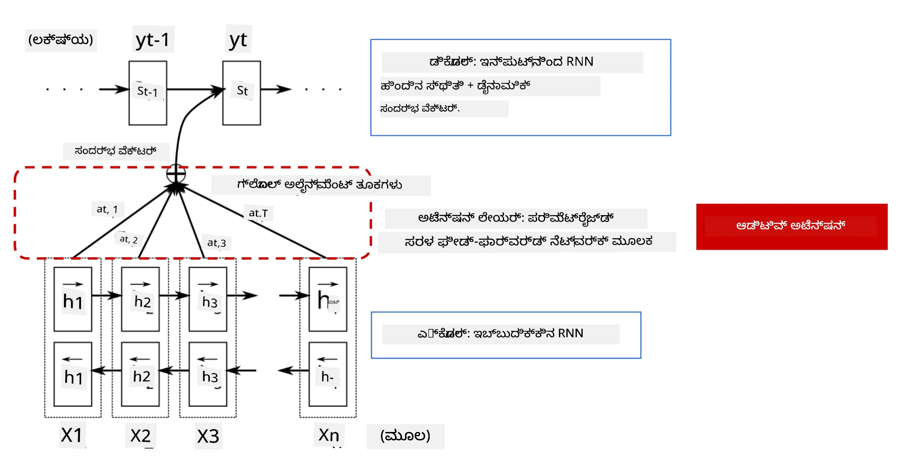
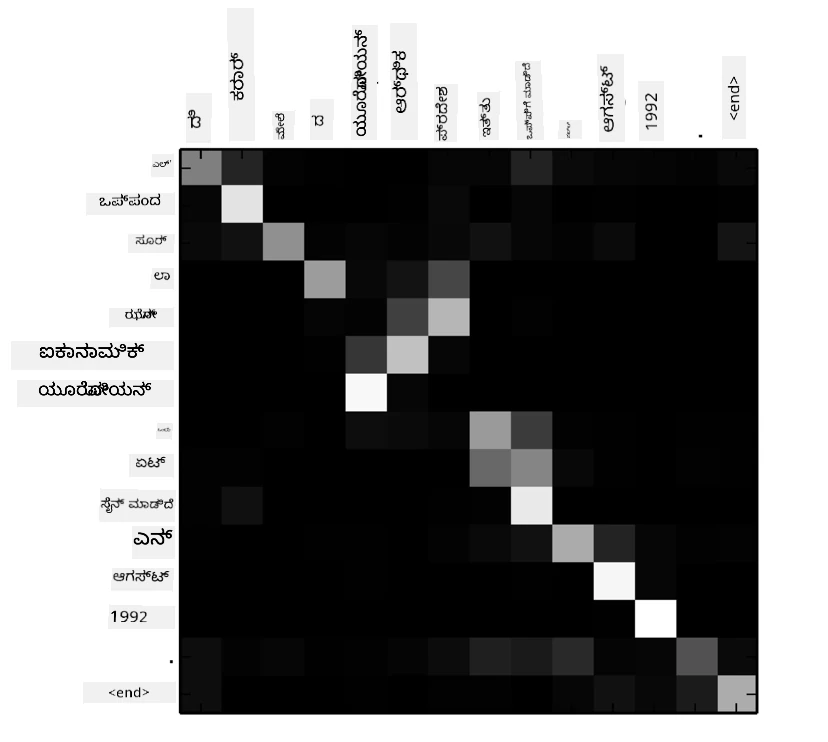
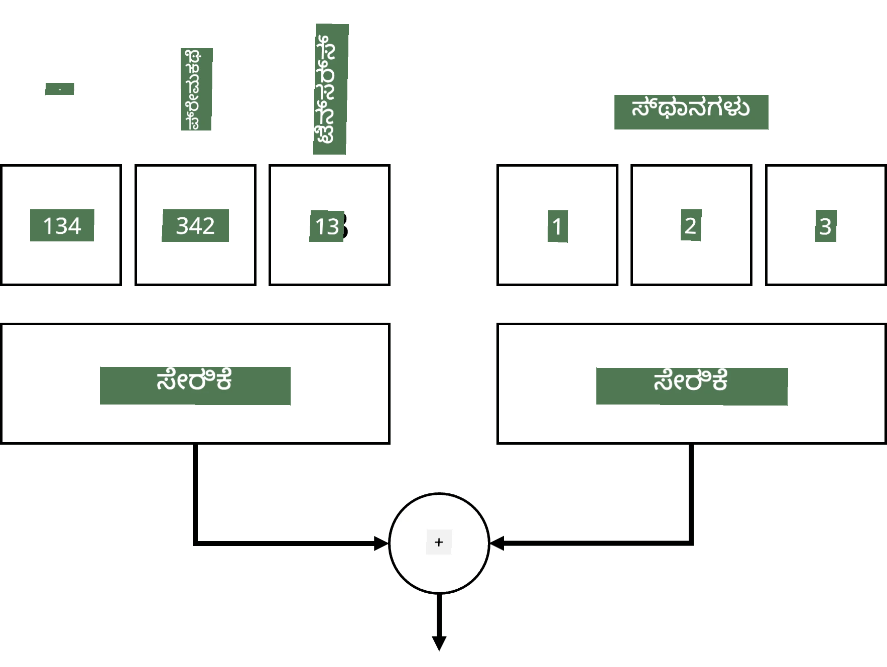
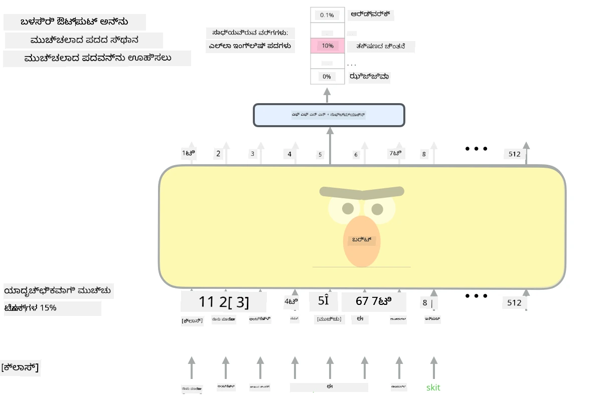

# ಗಮನ ಯಂತ್ರಗಳು ಮತ್ತು ಟ್ರಾನ್ಸ್‌ಫಾರ್ಮರ್‌ಗಳು

## [ಪೂರ್ವ-ವ್ಯಾಖ್ಯಾನ ಕ್ವಿಜ್](https://ff-quizzes.netlify.app/en/ai/quiz/35)

NLP ಕ್ಷೇತ್ರದಲ್ಲಿ ಅತ್ಯಂತ ಪ್ರಮುಖ ಸಮಸ್ಯೆಗಳಲ್ಲಿ ಒಂದಾಗಿದೆ **ಯಂತ್ರ ಅನುವಾದ**, ಇದು Google Translate ಮುಂತಾದ ಸಾಧನಗಳ ಮೂಲಭೂತ ಕಾರ್ಯವಾಗಿದೆ. ಈ ವಿಭಾಗದಲ್ಲಿ, ನಾವು ಯಂತ್ರ ಅನುವಾದ ಅಥವಾ ಸಾಮಾನ್ಯವಾಗಿ ಯಾವುದೇ *ಕ್ರಮ-ದಿಂದ-ಕ್ರಮ* ಕಾರ್ಯ (ಅಥವಾ **ವಾಕ್ಯ ಪರಿವರ್ತನೆ** ಎಂದು ಕರೆಯಲ್ಪಡುವುದು) ಮೇಲೆ ಗಮನಹರಿಸುವೆವು.

RNN ಗಳೊಂದಿಗೆ, ಕ್ರಮ-ದಿಂದ-ಕ್ರಮ ಕಾರ್ಯವನ್ನು ಎರಡು ಪುನರಾವರ್ತಿತ ಜಾಲಗಳ ಮೂಲಕ ಅನುಷ್ಠಾನಗೊಳಿಸಲಾಗುತ್ತದೆ, ಇಲ್ಲಿ ಒಂದು ಜಾಲ, **ಎನ್‌ಕೋಡರ್**, ಇನ್‌ಪುಟ್ ಕ್ರಮವನ್ನು ಒಂದು ಗುಪ್ತ ಸ್ಥಿತಿಗೆ ಸಂಕ್ಷಿಪ್ತಗೊಳಿಸುತ್ತದೆ, ಮತ್ತು ಇನ್ನೊಂದು ಜಾಲ, **ಡಿಕೋಡರ್**, ಆ ಗುಪ್ತ ಸ್ಥಿತಿಯನ್ನು ಅನುವಾದಿತ ಫಲಿತಾಂಶವಾಗಿ ವಿಸ್ತರಿಸುತ್ತದೆ. ಈ ವಿಧಾನದಲ್ಲಿ ಕೆಲವು ಸಮಸ್ಯೆಗಳಿವೆ:

* ಎನ್‌ಕೋಡರ್ ಜಾಲದ ಅಂತಿಮ ಸ್ಥಿತಿಗೆ ವಾಕ್ಯದ ಆರಂಭವನ್ನು ನೆನಪಿಡಲು ಕಷ್ಟವಾಗುತ್ತದೆ, ಇದರಿಂದ ದೀರ್ಘ ವಾಕ್ಯಗಳಿಗಾಗಿ ಮಾದರಿಯ ಗುಣಮಟ್ಟ ಕೆಳಮಟ್ಟಕ್ಕೆ ಇಳಿಯುತ್ತದೆ
* ಕ್ರಮದಲ್ಲಿನ ಎಲ್ಲಾ ಪದಗಳು ಫಲಿತಾಂಶದ ಮೇಲೆ ಸಮಾನ ಪ್ರಭಾವ ಹೊಂದಿವೆ. ಆದರೆ ವಾಸ್ತವದಲ್ಲಿ, ಇನ್‌ಪುಟ್ ಕ್ರಮದಲ್ಲಿನ ಕೆಲವು ಪದಗಳು ಕ್ರಮಬದ್ಧ ಔಟ್‌ಪುಟ್‌ಗಳಿಗಿಂತ ಹೆಚ್ಚು ಪ್ರಭಾವ ಬೀರುತ್ತವೆ.

**ಗಮನ ಯಂತ್ರಗಳು** RNN ನ ಪ್ರತಿ ಔಟ್‌ಪುಟ್ ಭವಿಷ್ಯವಾಣಿಗೆ ಪ್ರತಿ ಇನ್‌ಪುಟ್ ವೆಕ್ಟರ್‌ನ ಸಾಂದರ್ಭಿಕ ಪ್ರಭಾವವನ್ನು ತೂಕ ನೀಡುವ ವಿಧಾನವನ್ನು ಒದಗಿಸುತ್ತವೆ. ಇದನ್ನು ಅನುಷ್ಠಾನಗೊಳಿಸುವ ವಿಧಾನವೆಂದರೆ ಇನ್‌ಪುಟ್ RNN ಮತ್ತು ಔಟ್‌ಪುಟ್ RNN ನಡುವಿನ ಮಧ್ಯಂತರ ಸ್ಥಿತಿಗಳ ನಡುವೆ ಶಾರ್ಟ್‌ಕಟ್‌ಗಳನ್ನು ಸೃಷ್ಟಿಸುವುದು. ಈ ರೀತಿಯಲ್ಲಿ, ಔಟ್‌ಪುಟ್ ಚಿಹ್ನೆ yt ಅನ್ನು ರಚಿಸುವಾಗ, ನಾವು ಎಲ್ಲಾ ಇನ್‌ಪುಟ್ ಗುಪ್ತ ಸ್ಥಿತಿಗಳು hiಗಳನ್ನು ವಿಭಿನ್ನ ತೂಕ ಗುಣಾಂಕಗಳು &alpha;t,iಗಳೊಂದಿಗೆ ಪರಿಗಣಿಸುತ್ತೇವೆ.

> [Bahdanau et al., 2015](https://arxiv.org/pdf/1409.0473.pdf) ನಲ್ಲಿ ಸೇರಿಸಿದ ಗಮನ ಯಂತ್ರದೊಂದಿಗೆ ಎನ್‌ಕೋಡರ್-ಡಿಕೋಡರ್ ಮಾದರಿ, [ಈ ಬ್ಲಾಗ್ ಪೋಸ್ಟ್](https://lilianweng.github.io/lil-log/2018/06/24/attention-attention.html) ನಿಂದ ಉಲ್ಲೇಖಿಸಲಾಗಿದೆ

ಗಮನ ಮ್ಯಾಟ್ರಿಕ್ಸ್ {&alpha;i,j} ಒಂದು ನಿರ್ದಿಷ್ಟ ಔಟ್‌ಪುಟ್ ಪದವನ್ನು ರಚಿಸುವಲ್ಲಿ ಕೆಲವು ಇನ್‌ಪುಟ್ ಪದಗಳು ಎಷ್ಟು ಪ್ರಭಾವ ಬೀರುತ್ತವೆ ಎಂಬುದನ್ನು ಪ್ರತಿನಿಧಿಸುತ್ತದೆ. ಕೆಳಗಿನ ಚಿತ್ರದಲ್ಲಿ ಇಂತಹ ಮ್ಯಾಟ್ರಿಕ್ಸ್ ಉದಾಹರಣೆ ನೀಡಲಾಗಿದೆ:

> [Bahdanau et al., 2015](https://arxiv.org/pdf/1409.0473.pdf) (ಚಿತ್ರ 3) ನಿಂದ

ಗಮನ ಯಂತ್ರಗಳು NLP ಯಲ್ಲಿನ ಇತ್ತೀಚಿನ ಅಥವಾ ಸಮೀಪದ ಇತ್ತೀಚಿನ ಅತ್ಯುತ್ತಮ ಸಾಧನೆಗಳಿಗೆ ಕಾರಣವಾಗಿವೆ. ಆದರೆ ಗಮನವನ್ನು ಸೇರಿಸುವುದರಿಂದ ಮಾದರಿ ಪರಿಮಾಣಗಳು ಬಹಳಷ್ಟು ಹೆಚ್ಚಾಗುತ್ತವೆ, ಇದರಿಂದ RNN ಗಳಲ್ಲಿ ವಿಸ್ತರಣೆ ಸಮಸ್ಯೆಗಳು ಉಂಟಾಗುತ್ತವೆ. RNN ಗಳ ವಿಸ್ತರಣೆಯ ಪ್ರಮುಖ ಅಡ್ಡಿ ಎಂದರೆ, ಮಾದರಿಗಳ ಪುನರಾವರ್ತಿತ ಸ್ವಭಾವದಿಂದ ತರಬೇತಿಯನ್ನು ಬ್ಯಾಚ್ ಮತ್ತು ಪ್ಯಾರಲೆಲೈಸ್ ಮಾಡುವುದು ಕಷ್ಟವಾಗುತ್ತದೆ. RNN ನಲ್ಲಿ ಕ್ರಮದ ಪ್ರತಿ ಅಂಶವನ್ನು ಕ್ರಮಬದ್ಧವಾಗಿ ಪ್ರಕ್ರಿಯೆಗೊಳಿಸಬೇಕಾಗುತ್ತದೆ, ಆದ್ದರಿಂದ ಅದನ್ನು ಸುಲಭವಾಗಿ ಪ್ಯಾರಲೆಲೈಸ್ ಮಾಡಲಾಗುವುದಿಲ್ಲ.

> [Google ಬ್ಲಾಗ್](https://research.googleblog.com/2016/09/a-neural-network-for-machine.html) ನಿಂದ ಚಿತ್ರ

ಈ ಅಡ್ಡಿಯನ್ನು ಗಮನ ಯಂತ್ರಗಳೊಂದಿಗೆ ಸಂಯೋಜಿಸುವ ಮೂಲಕ, ನಾವು ಇಂದಿನ ದಿನದ ಅತ್ಯುತ್ತಮ ಟ್ರಾನ್ಸ್‌ಫಾರ್ಮರ್ ಮಾದರಿಗಳನ್ನು ರಚಿಸಿದ್ದೇವೆ, ಉದಾಹರಣೆಗೆ BERT ಮತ್ತು Open-GPT3.

## ಟ್ರಾನ್ಸ್‌ಫಾರ್ಮರ್ ಮಾದರಿಗಳು

ಟ್ರಾನ್ಸ್‌ಫಾರ್ಮರ್‌ಗಳ ಹಿಂದಿನ ಪ್ರಮುಖ ಆಲೋಚನೆ RNN ಗಳ ಕ್ರಮಬದ್ಧ ಸ್ವಭಾವವನ್ನು ತಪ್ಪಿಸಿ, ತರಬೇತಿಯ ಸಮಯದಲ್ಲಿ ಪ್ಯಾರಲೆಲೈಸ್ ಆಗಬಹುದಾದ ಮಾದರಿಯನ್ನು ಸೃಷ್ಟಿಸುವುದು. ಇದನ್ನು ಎರಡು ಆಲೋಚನೆಗಳ ಮೂಲಕ ಸಾಧಿಸಲಾಗುತ್ತದೆ:

* ಸ್ಥಾನಿಕ ಎನ್‌ಕೋಡಿಂಗ್
* RNN ಗಳ (ಅಥವಾ CNN ಗಳ) ಬದಲು ಸ್ವ-ಗಮನ ಯಂತ್ರವನ್ನು ಬಳಸಿಕೊಂಡು ಮಾದರಿಗಳನ್ನು ಹಿಡಿಯುವುದು (ಅದರ ಕಾರಣದಿಂದ ಟ್ರಾನ್ಸ್‌ಫಾರ್ಮರ್ ಪರಿಚಯಿಸುವ ಕಾಗದಕ್ಕೆ *[Attention is all you need](https://arxiv.org/abs/1706.03762)* ಎಂದು ಹೆಸರಿದೆ)

### ಸ್ಥಾನಿಕ ಎನ್‌ಕೋಡಿಂಗ್/ಎಂಬೆಡ್ಡಿಂಗ್

ಸ್ಥಾನಿಕ ಎನ್‌ಕೋಡಿಂಗ್ ಆಲೋಚನೆ ಹೀಗಿದೆ:  
1. RNN ಗಳಲ್ಲಿ, ಟೋಕನ್‌ಗಳ ಸಾಪೇಕ್ಷ ಸ್ಥಾನ ಕ್ರಮದ ಸಂಖ್ಯೆ ಮೂಲಕ ಪ್ರತಿನಿಧಿಸಲಾಗುತ್ತದೆ, ಆದ್ದರಿಂದ ಅದನ್ನು ಸ್ಪಷ್ಟವಾಗಿ ಪ್ರತಿನಿಧಿಸುವ ಅಗತ್ಯವಿಲ್ಲ.  
2. ಆದರೆ ಗಮನವನ್ನು ಬಳಸಿದಾಗ, ಕ್ರಮದ ಒಳಗಿನ ಟೋಕನ್‌ಗಳ ಸಾಪೇಕ್ಷ ಸ್ಥಾನಗಳನ್ನು ತಿಳಿದುಕೊಳ್ಳಬೇಕಾಗುತ್ತದೆ.  
3. ಸ್ಥಾನಿಕ ಎನ್‌ಕೋಡಿಂಗ್ ಪಡೆಯಲು, ನಾವು ಟೋಕನ್‌ಗಳ ಕ್ರಮವನ್ನು ಟೋಕನ್ ಸ್ಥಾನಗಳ ಕ್ರಮ (ಅಂದರೆ 0,1, ...) ಜೊತೆಗೆ ಸೇರಿಸುತ್ತೇವೆ.  
4. ನಂತರ ಟೋಕನ್ ಸ್ಥಾನವನ್ನು ಟೋಕನ್ ಎಂಬೆಡ್ಡಿಂಗ್ ವೆಕ್ಟರ್ ಜೊತೆಗೆ ಮಿಶ್ರಣ ಮಾಡುತ್ತೇವೆ. ಸ್ಥಾನ (ಪೂರ್ಣಾಂಕ) ಅನ್ನು ವೆಕ್ಟರ್ ಆಗಿ ಪರಿವರ್ತಿಸಲು ವಿವಿಧ ವಿಧಾನಗಳನ್ನು ಬಳಸಬಹುದು:

* ಟೋಕನ್ ಎಂಬೆಡ್ಡಿಂಗ್‌ಗೆ ಹೋಲುವ ತರಬೇತಿಗೊಳ್ಳಬಹುದಾದ ಎಂಬೆಡ್ಡಿಂಗ್. ಇದನ್ನು ಇಲ್ಲಿ ನಾವು ಪರಿಗಣಿಸುತ್ತೇವೆ. ಟೋಕನ್‌ಗಳು ಮತ್ತು ಅವುಗಳ ಸ್ಥಾನಗಳ ಮೇಲೆ ಎಂಬೆಡ್ಡಿಂಗ್ ಪದರಗಳನ್ನು ಅನ್ವಯಿಸಿ, ಸಮಾನ ಆಯಾಮಗಳ ಎಂಬೆಡ್ಡಿಂಗ್ ವೆಕ್ಟರ್‌ಗಳನ್ನು ಪಡೆಯುತ್ತೇವೆ ಮತ್ತು ಅವುಗಳನ್ನು ಸೇರಿಸುತ್ತೇವೆ.  
* ಮೂಲ ಕಾಗದದಲ್ಲಿ ಪ್ರಸ್ತಾಪಿಸಿದ ಸ್ಥಿರ ಸ್ಥಾನ ಎನ್‌ಕೋಡಿಂಗ್ ಕಾರ್ಯ.

> ಲೇಖಕರಿಂದ ಚಿತ್ರ

ಸ್ಥಾನಿಕ ಎಂಬೆಡ್ಡಿಂಗ್‌ನಿಂದ ನಾವು ಪಡೆಯುವ ಫಲಿತಾಂಶವು ಮೂಲ ಟೋಕನ್ ಮತ್ತು ಅದರ ಕ್ರಮದಲ್ಲಿನ ಸ್ಥಾನ ಎರಡನ್ನೂ ಒಳಗೊಂಡಿರುತ್ತದೆ.

### ಬಹು-ತಲೆ ಸ್ವ-ಗಮನ

ಮುಂದೆ, ನಾವು ಕ್ರಮದೊಳಗಿನ ಕೆಲವು ಮಾದರಿಗಳನ್ನು ಹಿಡಿಯಬೇಕಾಗುತ್ತದೆ. ಇದಕ್ಕಾಗಿ, ಟ್ರಾನ್ಸ್‌ಫಾರ್ಮರ್‌ಗಳು **ಸ್ವ-ಗಮನ** ಯಂತ್ರವನ್ನು ಬಳಸುತ್ತವೆ, ಇದು ಇನ್‌ಪುಟ್ ಮತ್ತು ಔಟ್‌ಪುಟ್ ಕ್ರಮ ಒಂದೇ ಆಗಿರುವ ಗಮನವಾಗಿದೆ. ಸ್ವ-ಗಮನವನ್ನು ಅನ್ವಯಿಸುವುದರಿಂದ ವಾಕ್ಯದ **ಸಂದರ್ಭ**ವನ್ನು ಪರಿಗಣಿಸಲು ಸಾಧ್ಯವಾಗುತ್ತದೆ ಮತ್ತು ಯಾವ ಪದಗಳು ಪರಸ್ಪರ ಸಂಬಂಧ ಹೊಂದಿವೆ ಎಂದು ನೋಡಬಹುದು. ಉದಾಹರಣೆಗೆ, ಇದು *it* ಮುಂತಾದ ಕೋರೆಫರೆನ್ಸ್‌ಗಳ ಮೂಲಕ ಯಾವ ಪದಗಳನ್ನು ಸೂಚಿಸಲಾಗುತ್ತಿದೆ ಎಂಬುದನ್ನು ತಿಳಿಯಲು ಸಹಾಯ ಮಾಡುತ್ತದೆ ಮತ್ತು ಸಾಂದರ್ಭಿಕ ಮಾಹಿತಿಯನ್ನು ಪರಿಗಣಿಸುತ್ತದೆ:

> [Google ಬ್ಲಾಗ್](https://research.googleblog.com/2017/08/transformer-novel-neural-network.html) ನಿಂದ ಚಿತ್ರ

ಟ್ರಾನ್ಸ್‌ಫಾರ್ಮರ್‌ಗಳಲ್ಲಿ, ನಾವು **ಬಹು-ತಲೆ ಗಮನ**ವನ್ನು ಬಳಸುತ್ತೇವೆ, ಇದರಿಂದ ಜಾಲವು ವಿವಿಧ ರೀತಿಯ ಅವಲಂಬನೆಗಳನ್ನು ಹಿಡಿಯಲು ಶಕ್ತಿ ಪಡೆಯುತ್ತದೆ, ಉದಾಹರಣೆಗೆ ದೀರ್ಘಕಾಲಿಕ ಮತ್ತು ಸಣ್ಣಕಾಲಿಕ ಪದ ಸಂಬಂಧಗಳು, ಕೋರೆಫರೆನ್ಸ್ ಮತ್ತು ಇತರ.

[TensorFlow ನೋಟ್ಬುಕ್](TransformersTF.ipynb) ನಲ್ಲಿ ಟ್ರಾನ್ಸ್‌ಫಾರ್ಮರ್ ಪದರಗಳ ಅನುಷ್ಠಾನದ ಬಗ್ಗೆ ಹೆಚ್ಚಿನ ವಿವರಗಳಿವೆ.

### ಎನ್‌ಕೋಡರ್-ಡಿಕೋಡರ್ ಗಮನ

ಟ್ರಾನ್ಸ್‌ಫಾರ್ಮರ್‌ಗಳಲ್ಲಿ, ಗಮನವನ್ನು ಎರಡು ಸ್ಥಳಗಳಲ್ಲಿ ಬಳಸಲಾಗುತ್ತದೆ:

* ಸ್ವ-ಗಮನದ ಮೂಲಕ ಇನ್‌ಪುಟ್ ಪಠ್ಯದೊಳಗಿನ ಮಾದರಿಗಳನ್ನು ಹಿಡಿಯಲು  
* ಕ್ರಮ ಅನುವಾದ ಮಾಡಲು - ಇದು ಎನ್‌ಕೋಡರ್ ಮತ್ತು ಡಿಕೋಡರ್ ನಡುವಿನ ಗಮನ ಪದರವಾಗಿದೆ.

ಎನ್‌ಕೋಡರ್-ಡಿಕೋಡರ್ ಗಮನವು RNN ಗಳಲ್ಲಿ ಬಳಸಿದ ಗಮನ ಯಂತ್ರದಂತೆ ಬಹಳ ಸಮಾನವಾಗಿದೆ, ಈ ವಿಭಾಗದ ಆರಂಭದಲ್ಲಿ ವಿವರಿಸಲಾಗಿದೆ. ಈ ಚಲಿಸುವ ಚಿತ್ರವು ಎನ್‌ಕೋಡರ್-ಡಿಕೋಡರ್ ಗಮನದ ಪಾತ್ರವನ್ನು ವಿವರಿಸುತ್ತದೆ.

ಪ್ರತಿ ಇನ್‌ಪುಟ್ ಸ್ಥಾನವು ಪ್ರತಿ ಔಟ್‌ಪುಟ್ ಸ್ಥಾನಕ್ಕೆ ಸ್ವತಂತ್ರವಾಗಿ ನಕ್ಷೆ ಮಾಡಲಾಗುವುದರಿಂದ, ಟ್ರಾನ್ಸ್‌ಫಾರ್ಮರ್‌ಗಳು RNN ಗಳಿಗಿಂತ ಉತ್ತಮವಾಗಿ ಪ್ಯಾರಲೆಲೈಸ್ ಮಾಡಬಹುದು, ಇದರಿಂದ ದೊಡ್ಡ ಮತ್ತು ಹೆಚ್ಚು ಅಭಿವ್ಯಕ್ತಿಯ ಭಾಷಾ ಮಾದರಿಗಳನ್ನು ಸೃಷ್ಟಿಸಲು ಸಾಧ್ಯವಾಗುತ್ತದೆ. ಪ್ರತಿ ಗಮನ ತಲೆ ಪದಗಳ ನಡುವಿನ ವಿಭಿನ್ನ ಸಂಬಂಧಗಳನ್ನು ಕಲಿಯಲು ಬಳಸಬಹುದು, ಇದು NLP ಕಾರ್ಯಗಳನ್ನು ಸುಧಾರಿಸುತ್ತದೆ.

## BERT

**BERT** (Bidirectional Encoder Representations from Transformers) ಒಂದು ಬಹುಮಟ್ಟದ ಟ್ರಾನ್ಸ್‌ಫಾರ್ಮರ್ ಜಾಲವಾಗಿದೆ, *BERT-base* ಗೆ 12 ಪದರಗಳು ಮತ್ತು *BERT-large* ಗೆ 24 ಪದರಗಳಿವೆ. ಈ ಮಾದರಿಯನ್ನು ಮೊದಲು ದೊಡ್ಡ ಪಠ್ಯ ಸಂಗ್ರಹ (ವಿಕಿಪೀಡಿಯ + ಪುಸ್ತಕಗಳು) ಮೇಲೆ ಸ್ವಯಂನಿರೀಕ್ಷಿತ ತರಬೇತಿಯಲ್ಲಿ (ವಾಕ್ಯದಲ್ಲಿ ಮಸ್ಕ್ ಮಾಡಿದ ಪದಗಳನ್ನು ಊಹಿಸುವುದು) ಪೂರ್ವ-ತರಬೇತಿ ಮಾಡಲಾಗುತ್ತದೆ. ಪೂರ್ವ-ತರಬೇತಿಯ ಸಮಯದಲ್ಲಿ, ಮಾದರಿ ಭಾಷಾ ಅರ್ಥಮಾಡಿಕೊಳ್ಳುವ ಮಹತ್ವಪೂರ್ಣ ಮಟ್ಟವನ್ನು ಅಳವಡಿಸಿಕೊಂಡು, ನಂತರ ಇತರ ಡೇಟಾಸೆಟ್‌ಗಳೊಂದಿಗೆ ಸೂಕ್ಷ್ಮ-ತರಬೇತಿ ಮೂಲಕ ಉಪಯೋಗಿಸಬಹುದು. ಈ ಪ್ರಕ್ರಿಯೆಯನ್ನು **ಟ್ರಾನ್ಸ್‌ಫರ್ ಲರ್ನಿಂಗ್** ಎಂದು ಕರೆಯುತ್ತಾರೆ.

> ಚಿತ್ರ [ಮೂಲ](http://jalammar.github.io/illustrated-bert/)

## ✍️ ಅಭ್ಯಾಸಗಳು: ಟ್ರಾನ್ಸ್‌ಫಾರ್ಮರ್‌ಗಳು

ಕೆಳಗಿನ ನೋಟ್ಬುಕ್‌ಗಳಲ್ಲಿ ನಿಮ್ಮ ಅಧ್ಯಯನವನ್ನು ಮುಂದುವರಿಸಿ:

* [PyTorch ನಲ್ಲಿ ಟ್ರಾನ್ಸ್‌ಫಾರ್ಮರ್‌ಗಳು](TransformersPyTorch.ipynb)  
* [TensorFlow ನಲ್ಲಿ ಟ್ರಾನ್ಸ್‌ಫಾರ್ಮರ್‌ಗಳು](TransformersTF.ipynb)

## ಸಾರಾಂಶ

ಈ ಪಾಠದಲ್ಲಿ ನೀವು ಟ್ರಾನ್ಸ್‌ಫಾರ್ಮರ್‌ಗಳು ಮತ್ತು ಗಮನ ಯಂತ್ರಗಳ ಬಗ್ಗೆ ಕಲಿತಿರಿ, NLP ಉಪಕರಣಗಳ ಪ್ರಮುಖ ಭಾಗಗಳು. BERT, DistilBERT, BigBird, OpenGPT3 ಮುಂತಾದ ವಿವಿಧ ಟ್ರಾನ್ಸ್‌ಫಾರ್ಮರ್ ವಾಸ್ತುಶಿಲ್ಪಗಳಿವೆ, ಅವುಗಳನ್ನು ಸೂಕ್ಷ್ಮ-ತರಬೇತಿಗೆ ಬಳಸಬಹುದು. [HuggingFace ಪ್ಯಾಕೇಜ್](https://github.com/huggingface/) PyTorch ಮತ್ತು TensorFlow ಎರಡರಲ್ಲಿಯೂ ಈ ವಾಸ್ತುಶಿಲ್ಪಗಳ ತರಬೇತಿಗಾಗಿ ಸಂಗ್ರಹಾಲಯವನ್ನು ಒದಗಿಸುತ್ತದೆ.

## 🚀 ಸವಾಲು

## [ಪೋಸ್ಟ್-ವ್ಯಾಖ್ಯಾನ ಕ್ವಿಜ್](https://ff-quizzes.netlify.app/en/ai/quiz/36)

## ವಿಮರ್ಶೆ ಮತ್ತು ಸ್ವಯಂ ಅಧ್ಯಯನ

* [ಬ್ಲಾಗ್ ಪೋಸ್ಟ್](https://mchromiak.github.io/articles/2017/Sep/12/Transformer-Attention-is-all-you-need/), ಟ್ರಾನ್ಸ್‌ಫಾರ್ಮರ್‌ಗಳ ಕ್ಲಾಸಿಕ್ [Attention is all you need](https://arxiv.org/abs/1706.03762) ಕಾಗದವನ್ನು ವಿವರಿಸುತ್ತದೆ.  
* [ಬ್ಲಾಗ್ ಪೋಸ್ಟ್ ಸರಣಿ](https://towardsdatascience.com/transformers-explained-visually-part-1-overview-of-functionality-95a6dd460452), ಟ್ರಾನ್ಸ್‌ಫಾರ್ಮರ್ ವಾಸ್ತುಶಿಲ್ಪವನ್ನು ವಿವರವಾಗಿ ವಿವರಿಸುತ್ತದೆ.

## [ಕಾರ್ಯ](assignment.md)

---

<!-- CO-OP TRANSLATOR DISCLAIMER START -->
**ಅಸ್ವೀಕರಣ**:  
ಈ ದಸ್ತಾವೇಜು [Co-op Translator](https://github.com/Azure/co-op-translator) ಎಂಬ AI ಅನುವಾದ ಸೇವೆಯನ್ನು ಬಳಸಿ ಅನುವಾದಿಸಲಾಗಿದೆ. ನಾವು ಶುದ್ಧತೆಯತ್ತ ಪ್ರಯತ್ನಿಸುತ್ತಿದ್ದರೂ, ಸ್ವಯಂಚಾಲಿತ ಅನುವಾದಗಳಲ್ಲಿ ತಪ್ಪುಗಳು ಅಥವಾ ಅಸತ್ಯತೆಗಳು ಇರಬಹುದು ಎಂದು ದಯವಿಟ್ಟು ಗಮನಿಸಿ. ಮೂಲ ಭಾಷೆಯಲ್ಲಿರುವ ಮೂಲ ದಸ್ತಾವೇಜನ್ನು ಅಧಿಕೃತ ಮೂಲವೆಂದು ಪರಿಗಣಿಸಬೇಕು. ಮಹತ್ವದ ಮಾಹಿತಿಗಾಗಿ, ವೃತ್ತಿಪರ ಮಾನವ ಅನುವಾದವನ್ನು ಶಿಫಾರಸು ಮಾಡಲಾಗುತ್ತದೆ. ಈ ಅನುವಾದ ಬಳಕೆಯಿಂದ ಉಂಟಾಗುವ ಯಾವುದೇ ತಪ್ಪು ಅರ್ಥಮಾಡಿಕೊಳ್ಳುವಿಕೆ ಅಥವಾ ತಪ್ಪು ವಿವರಣೆಗಳಿಗೆ ನಾವು ಹೊಣೆಗಾರರಾಗುವುದಿಲ್ಲ.
<!-- CO-OP TRANSLATOR DISCLAIMER END -->