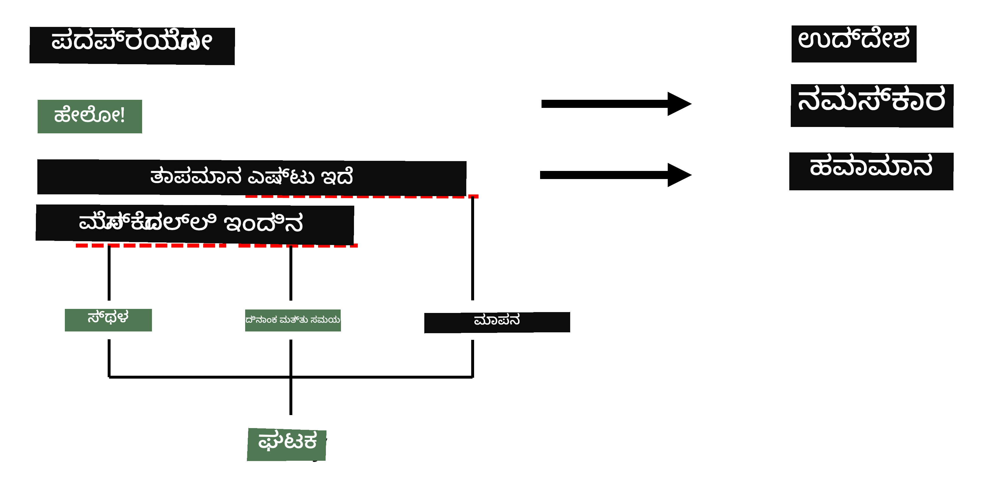
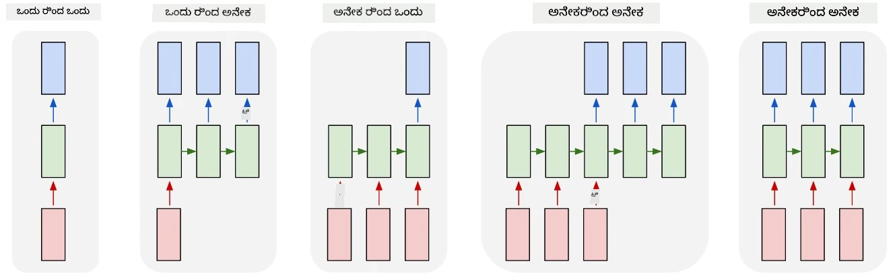

# ನಾಮಿತ ಘಟಕ ಗುರುತಿಸುವಿಕೆ

ಈವರೆಗೆ, ನಾವು ಮುಖ್ಯವಾಗಿ ಒಂದು NLP ಕಾರ್ಯ - ವರ್ಗೀಕರಣದ ಮೇಲೆ ಗಮನಹರಿಸಿದ್ದೇವೆ. ಆದರೆ, ನ್ಯೂರಲ್ ನೆಟ್‌ವರ್ಕ್‌ಗಳೊಂದಿಗೆ ಸಾಧಿಸಬಹುದಾದ ಇತರ NLP ಕಾರ್ಯಗಳೂ ಇವೆ. ಅವುಗಳಲ್ಲಿ ಒಂದು **[ನಾಮಿತ ಘಟಕ ಗುರುತಿಸುವಿಕೆ](https://wikipedia.org/wiki/Named-entity_recognition)** (NER), ಇದು ಪಠ್ಯದಲ್ಲಿ ನಿರ್ದಿಷ್ಟ ಘಟಕಗಳನ್ನು ಗುರುತಿಸುವುದನ್ನು ಒಳಗೊಂಡಿದೆ, ಉದಾಹರಣೆಗೆ ಸ್ಥಳಗಳು, ವ್ಯಕ್ತಿ ಹೆಸರುಗಳು, ದಿನಾಂಕ-ಸಮಯ ಅವಧಿಗಳು, ರಾಸಾಯನಿಕ ಸೂತ್ರಗಳು ಮತ್ತು ಇತ್ಯಾದಿ.

## [ಪೂರ್ವ-ವ್ಯಾಖ್ಯಾನ ಕ್ವಿಜ್](https://ff-quizzes.netlify.app/en/ai/quiz/37)

## NER ಬಳಸಿ ಉದಾಹರಣೆ

ನೀವು ಅಮೆಜಾನ್ ಅಲೆಕ್ಸಾ ಅಥವಾ ಗೂಗಲ್ ಅಸಿಸ್ಟೆಂಟ್‌ನಂತೆ ನೈಸರ್ಗಿಕ ಭಾಷೆ ಚಾಟ್ ಬಾಟ್ ಅಭಿವೃದ್ಧಿಪಡಿಸಲು ಬಯಸಿದರೆ, ಬುದ್ಧಿವಂತ ಚಾಟ್ ಬಾಟ್‌ಗಳು ಬಳಕೆದಾರನು ಏನು ಬಯಸುತ್ತಾನೆ ಎಂಬುದನ್ನು *ಅರ್ಥಮಾಡಿಕೊಳ್ಳಲು* ಇನ್‌ಪುಟ್ ವಾಕ್ಯದಲ್ಲಿ ಪಠ್ಯ ವರ್ಗೀಕರಣವನ್ನು ಮಾಡುತ್ತವೆ. ಈ ವರ್ಗೀಕರಣದ ಫಲಿತಾಂಶವನ್ನು **ಉದ್ದೇಶ** ಎಂದು ಕರೆಯುತ್ತಾರೆ, ಇದು ಚಾಟ್ ಬಾಟ್ ಏನು ಮಾಡಬೇಕು ಎಂದು ನಿರ್ಧರಿಸುತ್ತದೆ.

> ಚಿತ್ರ ಲೇಖಕರಿಂದ

ಆದರೆ, ಬಳಕೆದಾರನು ವಾಕ್ಯದ ಭಾಗವಾಗಿ ಕೆಲವು ಪರಿಮಾಣಗಳನ್ನು ನೀಡಬಹುದು. ಉದಾಹರಣೆಗೆ, ಹವಾಮಾನವನ್ನು ಕೇಳುವಾಗ, ಅವಳು ಸ್ಥಳ ಅಥವಾ ದಿನಾಂಕವನ್ನು ಸೂಚಿಸಬಹುದು. ಬಾಟ್ ಆ ಘಟಕಗಳನ್ನು ಅರ್ಥಮಾಡಿಕೊಳ್ಳಬೇಕು ಮತ್ತು ಕ್ರಮವಾಗಿ ಪರಿಮಾಣ ಸ್ಲಾಟ್‌ಗಳನ್ನು ತುಂಬಿ ಕ್ರಿಯೆಯನ್ನು ನಿರ್ವಹಿಸಬೇಕು. ಇದೇ NER ನ ಪಾತ್ರ.

> ✅ ಇನ್ನೊಂದು ಉದಾಹರಣೆ [ವೈಜ್ಞಾನಿಕ ವೈದ್ಯಕೀಯ ಪೇಪರ್‌ಗಳನ್ನು ವಿಶ್ಲೇಷಿಸುವುದು](https://soshnikov.com/science/analyzing-medical-papers-with-azure-and-text-analytics-for-health/). ಮುಖ್ಯವಾಗಿ ನಾವು ಹುಡುಕಬೇಕಾದವು ನಿರ್ದಿಷ್ಟ ವೈದ್ಯಕೀಯ ಪದಗಳು, ಉದಾಹರಣೆಗೆ ರೋಗಗಳು ಮತ್ತು ವೈದ್ಯಕೀಯ ಪದಾರ್ಥಗಳು. ಕೆಲವು ರೋಗಗಳನ್ನು ಸಬ್ಸ್ಟ್ರಿಂಗ್ ಹುಡುಕಾಟದಿಂದ ತೆಗೆದುಕೊಳ್ಳಬಹುದು, ಆದರೆ ರಾಸಾಯನಿಕ ಸಂಯುಕ್ತಗಳು ಮತ್ತು ಔಷಧಿ ಹೆಸರುಗಳಂತಹ ಜಟಿಲ ಘಟಕಗಳಿಗೆ ಹೆಚ್ಚು ಸಂಕೀರ್ಣ ವಿಧಾನ ಬೇಕಾಗುತ್ತದೆ.

## NER ಅನ್ನು ಟೋಕನ್ ವರ್ಗೀಕರಣವಾಗಿ

NER ಮಾದರಿಗಳು ಮೂಲತಃ **ಟೋಕನ್ ವರ್ಗೀಕರಣ ಮಾದರಿಗಳು**, ಏಕೆಂದರೆ ಪ್ರತಿಯೊಂದು ಇನ್‌ಪುಟ್ ಟೋಕನ್‌ಗೆ ಅದು ಘಟಕಕ್ಕೆ ಸೇರಿದೆಯೇ ಅಥವಾ ಇಲ್ಲವೇ ಎಂದು ನಿರ್ಧರಿಸಬೇಕು, ಮತ್ತು ಇದ್ದರೆ - ಯಾವ ಘಟಕ ವರ್ಗಕ್ಕೆ ಸೇರಿದೆ ಎಂದು ತಿಳಿಯಬೇಕು.

ಕೆಳಗಿನ ಪೇಪರ್ ಶೀರ್ಷಿಕೆಯನ್ನು ಪರಿಗಣಿಸಿ:

**ಟ್ರಿಕಸ್ಪಿಡ್ ವಾಲ್ವ್ ರೆಗರ್ಗಿಟೇಶನ್** ಮತ್ತು **ಲಿಥಿಯಂ ಕಾರ್ಬೋನೇಟ್** **ವಿಷಕಾರಿ ಪರಿಣಾಮ** ಹೊಸ ಜನನ ಶಿಶುವಿನಲ್ಲಿ.

ಇಲ್ಲಿ ಘಟಕಗಳು:

* ಟ್ರಿಕಸ್ಪಿಡ್ ವಾಲ್ವ್ ರೆಗರ್ಗಿಟೇಶನ್ ಒಂದು ರೋಗ (`DIS`)
* ಲಿಥಿಯಂ ಕಾರ್ಬೋನೇಟ್ ಒಂದು ರಾಸಾಯನಿಕ ಪದಾರ್ಥ (`CHEM`)
* ವಿಷಕಾರಿ ಪರಿಣಾಮ ಕೂಡ ಒಂದು ರೋಗ (`DIS`)

ಒಂದು ಘಟಕವು ಹಲವಾರು ಟೋಕನ್‌ಗಳನ್ನು ವ್ಯಾಪಿಸಬಹುದು. ಮತ್ತು ಈ ಪ್ರಕರಣದಲ್ಲಿ, ಎರಡು連続 ಘಟಕಗಳನ್ನು ವಿಭಿನ್ನಗೊಳಿಸಬೇಕಾಗುತ್ತದೆ. ಆದ್ದರಿಂದ, ಪ್ರತಿ ಘಟಕಕ್ಕೆ ಎರಡು ವರ್ಗಗಳನ್ನು ಬಳಸುವುದು ಸಾಮಾನ್ಯ - ಒಂದು ಘಟಕದ ಮೊದಲ ಟೋಕನ್ ಸೂಚಿಸಲು (ಸಾಮಾನ್ಯವಾಗಿ `B-` ಪೂರ್ವಪ್ರತ್ಯಯವನ್ನು ಬಳಸುತ್ತಾರೆ, ಅಂದರೆ **b**eginning), ಮತ್ತೊಂದು - ಘಟಕದ ಮುಂದುವರಿದ ಟೋಕನ್ (`I-`, ಅಂದರೆ **i**nner token). ನಾವು `O` ಅನ್ನು ಎಲ್ಲಾ ಇತರ ಟೋಕನ್‌ಗಳನ್ನು ಸೂಚಿಸಲು ಬಳಸುತ್ತೇವೆ. ಇಂತಹ ಟೋಕನ್ ಟ್ಯಾಗಿಂಗ್ ಅನ್ನು [BIO ಟ್ಯಾಗಿಂಗ್](https://en.wikipedia.org/wiki/Inside%E2%80%93outside%E2%80%93beginning_(tagging)) (ಅಥವಾ IOB) ಎಂದು ಕರೆಯುತ್ತಾರೆ. ಟ್ಯಾಗ್ ಮಾಡಿದಾಗ, ನಮ್ಮ ಶೀರ್ಷಿಕೆ ಹೀಗೆ ಕಾಣುತ್ತದೆ:

ಟೋಕನ್ | ಟ್ಯಾಗ್
------|-----
Tricuspid | B-DIS
valve | I-DIS
regurgitation | I-DIS
and | O
lithium | B-CHEM
carbonate | I-CHEM
toxicity | B-DIS
in | O
a | O
newborn | O
infant | O
. | O

ಟೋಕನ್‌ಗಳು ಮತ್ತು ವರ್ಗಗಳ ನಡುವೆ ಒಂದರೊಂದರ ಹೊಂದಾಣಿಕೆಯನ್ನು ನಿರ್ಮಿಸಬೇಕಾಗಿರುವುದರಿಂದ, ಈ ಚಿತ್ರದಿಂದ ನಾವು ಬಲಭಾಗದ **ಬಹು-ದಿಂದ-ಬಹು** ನ್ಯೂರಲ್ ನೆಟ್‌ವರ್ಕ್ ಮಾದರಿಯನ್ನು ತರಬೇತುಗೊಳಿಸಬಹುದು:

> *ಚಿತ್ರ [ಈ ಬ್ಲಾಗ್ ಪೋಸ್ಟ್](http://karpathy.github.io/2015/05/21/rnn-effectiveness/) ನಿಂದ [ಅಂದ್ರೇಜ್ ಕಾರ್ಪಥಿ](http://karpathy.github.io/) ಅವರಿಂದ. NER ಟೋಕನ್ ವರ್ಗೀಕರಣ ಮಾದರಿಗಳು ಈ ಚಿತ್ರದಲ್ಲಿ ಬಲಭಾಗದ ನೆಟ್‌ವರ್ಕ್ ವಾಸ್ತುಶಿಲ್ಪಕ್ಕೆ ಹೊಂದಿಕೆಯಾಗುತ್ತವೆ.*

## NER ಮಾದರಿಗಳನ್ನು ತರಬೇತುಗೊಳಿಸುವುದು

NER ಮಾದರಿ ಮೂಲತಃ ಟೋಕನ್ ವರ್ಗೀಕರಣ ಮಾದರಿ ಆದ್ದರಿಂದ, ನಾವು ಈಗಾಗಲೇ ಪರಿಚಿತರಾದ RNNಗಳನ್ನು ಈ ಕಾರ್ಯಕ್ಕೆ ಬಳಸಬಹುದು. ಈ ಸಂದರ್ಭದಲ್ಲಿ, ಪ್ರತಿಯೊಂದು ಪುನರಾವರ್ತಿತ ನೆಟ್‌ವರ್ಕ್ ಬ್ಲಾಕ್ ಟೋಕನ್ ID ಅನ್ನು ನೀಡುತ್ತದೆ. ಕೆಳಗಿನ ಉದಾಹರಣೆ ನೋಟ್ಬುಕ್ LSTM ಅನ್ನು ಟೋಕನ್ ವರ್ಗೀಕರಣಕ್ಕೆ ತರಬೇತುಗೊಳಿಸುವುದನ್ನು ತೋರಿಸುತ್ತದೆ.

## ✍️ ಉದಾಹರಣೆ ನೋಟ್ಬುಕ್‌ಗಳು: NER

ಕೆಳಗಿನ ನೋಟ್ಬುಕ್‌ನಲ್ಲಿ ನಿಮ್ಮ ಅಧ್ಯಯನವನ್ನು ಮುಂದುವರಿಸಿ:

* [TensorFlow ನೊಂದಿಗೆ NER](NER-TF.ipynb)

## ಸಾರಾಂಶ

NER ಮಾದರಿ ಒಂದು **ಟೋಕನ್ ವರ್ಗೀಕರಣ ಮಾದರಿ**, ಅಂದರೆ ಇದು ಟೋಕನ್ ವರ್ಗೀಕರಣವನ್ನು ನಿರ್ವಹಿಸಲು ಬಳಸಬಹುದು. ಇದು NLP ನಲ್ಲಿ ಬಹುಮಾನ್ಯ ಕಾರ್ಯ, ಪಠ್ಯದಲ್ಲಿ ನಿರ್ದಿಷ್ಟ ಘಟಕಗಳನ್ನು ಗುರುತಿಸಲು ಸಹಾಯ ಮಾಡುತ್ತದೆ, ಉದಾಹರಣೆಗೆ ಸ್ಥಳಗಳು, ಹೆಸರುಗಳು, ದಿನಾಂಕಗಳು ಮತ್ತು ಇನ್ನಷ್ಟು.

## 🚀 ಸವಾಲು

ಕೆಳಗಿನ ಲಿಂಕ್‌ನಲ್ಲಿ ನೀಡಲಾದ ಕಾರ್ಯವನ್ನು ಪೂರ್ಣಗೊಳಿಸಿ, ವೈದ್ಯಕೀಯ ಪದಗಳಿಗಾಗಿ ನಾಮಿತ ಘಟಕ ಗುರುತಿಸುವಿಕೆ ಮಾದರಿಯನ್ನು ತರಬೇತುಗೊಳಿಸಿ, ನಂತರ ಬೇರೆ ಡೇಟಾಸೆಟ್‌ನಲ್ಲಿ ಪ್ರಯತ್ನಿಸಿ.

## [ಪೋಸ್ಟ್-ವ್ಯಾಖ್ಯಾನ ಕ್ವಿಜ್](https://ff-quizzes.netlify.app/en/ai/quiz/38)

## ವಿಮರ್ಶೆ ಮತ್ತು ಸ್ವಯಂ ಅಧ್ಯಯನ

[The Unreasonable Effectiveness of Recurrent Neural Networks](http://karpathy.github.io/2015/05/21/rnn-effectiveness/) ಎಂಬ ಬ್ಲಾಗ್ ಓದಿ ಮತ್ತು ಆ ಲೇಖನದ Further Reading ವಿಭಾಗವನ್ನು ಅನುಸರಿಸಿ ನಿಮ್ಮ ಜ್ಞಾನವನ್ನು ಗಾಢಗೊಳಿಸಿ.

## [ಕಾರ್ಯ](lab/README.md)

ಈ ಪಾಠದ ಕಾರ್ಯದಲ್ಲಿ, ನೀವು ವೈದ್ಯಕೀಯ ಘಟಕ ಗುರುತಿಸುವಿಕೆ ಮಾದರಿಯನ್ನು ತರಬೇತುಗೊಳಿಸಬೇಕಾಗುತ್ತದೆ. ಈ ಪಾಠದಲ್ಲಿ ವಿವರಿಸಿದಂತೆ LSTM ಮಾದರಿಯನ್ನು ತರಬೇತುಗೊಳಿಸುವುದರಿಂದ ಪ್ರಾರಂಭಿಸಿ, ನಂತರ BERT ಟ್ರಾನ್ಸ್‌ಫಾರ್ಮರ್ ಮಾದರಿಯನ್ನು ಬಳಸಬಹುದು. ಎಲ್ಲಾ ವಿವರಗಳಿಗೆ [ಸೂಚನೆಗಳನ್ನು](lab/README.md) ಓದಿ.

---

<!-- CO-OP TRANSLATOR DISCLAIMER START -->
**ಅಸ್ವೀಕರಣ**:  
ಈ ದಸ್ತಾವೇಜು AI ಅನುವಾದ ಸೇವೆ [Co-op Translator](https://github.com/Azure/co-op-translator) ಬಳಸಿ ಅನುವಾದಿಸಲಾಗಿದೆ. ನಾವು ನಿಖರತೆಯಿಗಾಗಿ ಪ್ರಯತ್ನಿಸುತ್ತಿದ್ದರೂ, ಸ್ವಯಂಚಾಲಿತ ಅನುವಾದಗಳಲ್ಲಿ ದೋಷಗಳು ಅಥವಾ ಅಸತ್ಯತೆಗಳು ಇರಬಹುದು ಎಂದು ದಯವಿಟ್ಟು ಗಮನಿಸಿ. ಮೂಲ ಭಾಷೆಯಲ್ಲಿರುವ ಮೂಲ ದಸ್ತಾವೇಜನ್ನು ಅಧಿಕೃತ ಮೂಲವೆಂದು ಪರಿಗಣಿಸಬೇಕು. ಪ್ರಮುಖ ಮಾಹಿತಿಗಾಗಿ, ವೃತ್ತಿಪರ ಮಾನವ ಅನುವಾದವನ್ನು ಶಿಫಾರಸು ಮಾಡಲಾಗುತ್ತದೆ. ಈ ಅನುವಾದ ಬಳಕೆಯಿಂದ ಉಂಟಾಗುವ ಯಾವುದೇ ತಪ್ಪು ಅರ್ಥಮಾಡಿಕೊಳ್ಳುವಿಕೆ ಅಥವಾ ತಪ್ಪು ವಿವರಣೆಗಳಿಗೆ ನಾವು ಹೊಣೆಗಾರರಾಗುವುದಿಲ್ಲ.
<!-- CO-OP TRANSLATOR DISCLAIMER END -->