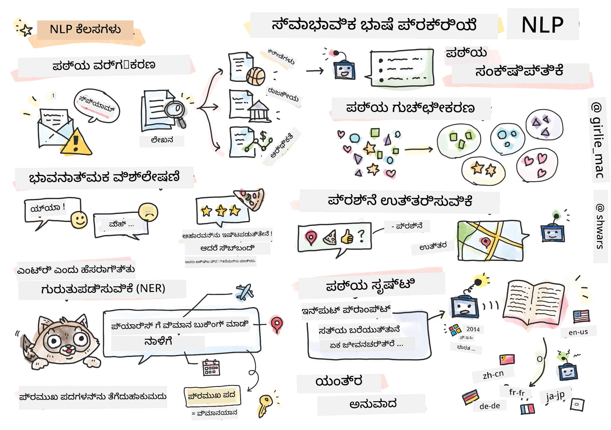

# ನೈಸರ್ಗಿಕ ಭಾಷಾ ಪ್ರಕ್ರಿಯೆ



ಈ ವಿಭಾಗದಲ್ಲಿ, ನಾವು ನ್ಯೂರಲ್ ನೆಟ್‌ವರ್ಕ್‌ಗಳನ್ನು ಬಳಸಿಕೊಂಡು **ನೈಸರ್ಗಿಕ ಭಾಷಾ ಪ್ರಕ್ರಿಯೆ (NLP)** ಸಂಬಂಧಿತ ಕಾರ್ಯಗಳನ್ನು ನಿರ್ವಹಿಸುವುದಕ್ಕೆ ಗಮನ ಹರಿಸುವೆವು. ಗಣಕ ಯಂತ್ರಗಳು ಅನೇಕ NLP ಸಮಸ್ಯೆಗಳನ್ನು ಪರಿಹರಿಸಲು ಸಾಧ್ಯವಾಗಬೇಕು:

* **ಟೆಕ್ಸ್ಟ್ ವರ್ಗೀಕರಣ** ಎನ್ನುವುದು ಪಠ್ಯ ಕ್ರಮಗಳ ಸಾದಾರಣ ವರ್ಗೀಕರಣ ಸಮಸ್ಯೆಯಾಗಿದೆ. ಉದಾಹರಣೆಗೆ, ಇಮೇಲ್ ಸಂದೇಶಗಳನ್ನು ಸ್ಪ್ಯಾಮ್ ಅಥವಾ ಸ್ಪ್ಯಾಮ್ ಅಲ್ಲದಂತೆ ವರ್ಗೀಕರಿಸುವುದು, ಅಥವಾ ಲೇಖನಗಳನ್ನು ಕ್ರೀಡೆ, ವ್ಯಾಪಾರ, ರಾಜಕಾರಣ ಮುಂತಾದಂತೆ ವರ್ಗೀಕರಿಸುವುದು. ಚಾಟ್ ಬಾಟ್‌ಗಳನ್ನು ಅಭಿವೃದ್ಧಿಪಡಿಸುವಾಗ, ನಾವು ಸಾಮಾನ್ಯವಾಗಿ ಬಳಕೆದಾರನ ಉದ್ದೇಶವನ್ನು ಅರ್ಥಮಾಡಿಕೊಳ್ಳಬೇಕಾಗುತ್ತದೆ -- ಈ ಸಂದರ್ಭದಲ್ಲಿ ನಾವು **ಉದ್ದೇಶ ವರ್ಗೀಕರಣ** ಜೊತೆ ಕಾರ್ಯನಿರ್ವಹಿಸುತ್ತೇವೆ. ಬಹುಶಃ, ಉದ್ದೇಶ ವರ್ಗೀಕರಣದಲ್ಲಿ ಅನೇಕ ವರ್ಗಗಳನ್ನು ಕೈಗಾರಿಕೆ ಮಾಡಬೇಕಾಗಬಹುದು.
* **ಭಾವ ವಿಶ್ಲೇಷಣೆ** ಎನ್ನುವುದು ಸಾದಾರಣ ರಿಗ್ರೇಶನ್ ಸಮಸ್ಯೆಯಾಗಿದ್ದು, ವಾಕ್ಯದ ಅರ್ಥವು ಧನಾತ್ಮಕ ಅಥವಾ ಋಣಾತ್ಮಕವೆಂಬುದನ್ನು ತೋರುವ ಸಂಖ್ಯೆಯನ್ನು (ಭಾವನೆಯನ್ನು) ಅಂಕೆ ಮಾಡಬೇಕಾಗುತ್ತದೆ. ಭಾವ ವಿಶ್ಲೇಷಣೆಯ ಮುಂದುವರೆದ ರೂಪವು **ಪರಿಕಲ್ಪನೆ ಆಧಾರಿತ ಭಾವ ವಿಶ್ಲೇಷಣೆ** (ABSA), ಇಲ್ಲಿ ನಾವು ಭಾವವನ್ನು ಸಂಪೂರ್ಣ ವಾಕ್ಯದಿಗಿಂತ ವಿಭಿನ್ನ ಭಾಗಗಳಿಗೆ (ಪರಿಕಲ್ಪನೆಗಳಿಗೆ) ನೀಡುತ್ತೇವೆ, ಉದಾ. *ಈ ರೆಸ್ಟೋರೆಂಟ್‌ನಲ್ಲಿ, ನನಗೆ ಆಹಾರ ಇಷ್ಟವಾಯಿತು, ಆದರೆ ವಾತಾವರಣ ತುಂಬಾ ಕೆಟ್ಟದ್ದಾಯಿತು*.
* **ನಾಮಿತ ಘಟಕ ಗುರುತಿಸುವಿಕೆ** (NER) ಎನ್ನುವುದು ಪಠ್ಯದಿಂದ ನಿರ್ದಿಷ್ಟ ಘಟಕಗಳನ್ನು ತೆಗೆದುಕೊಂಡು ಬರುವುದರ ಸಮಸ್ಯೆಗೆ ಸಂಬಂಧಿಸಿದೆ. ಉದಾಹರಣೆಗೆ, *ನಾನು ನಾಳೆ ಪಂಚಿಗೆ ಹಾರಬೇಕಿದೆ* ಎಂಬ ವಾಕ್ಯದಲ್ಲಿ *ನಾಳೆ* ಎಂಬ ಪದವು ದಿನಾಂಕ (DATE) ಅನ್ನು ಸೂಚಿಸುತ್ತದೆ ಮತ್ತು *ಪ್ಯಾರಿಸ್* ಸ್ಥಳ (LOCATION) ಎಂದು ಹುಡುಕಬೇಕಾಗುತ್ತದೆ.  
* **ಕೀವರ್ಡ್ ಹಿನ್ನಡೆ** NERಗೆ ಸಮಾನವಾಗಿದೆ, ಆದರೆ ನಾವು ವಾಕ್ಯದ ಅರ್ಥಕ್ಕೆ ಮುಖ್ಯವಾದ ಶಬ್ದಗಳನ್ನು ಸ್ವಯಂಚಾಲಿತವಾಗಿ, ನಿರ್ದಿಷ್ಟ ಘಟಕ ವಿಧಗಳಿಗೆ ಪೂರ್ವಪ್ರಶಿಕ್ಷಣವಿಲ್ಲದೆ ತೆಗೆದುಕೊಳ್ಳಬೇಕಾಗುತ್ತದೆ.
* **ಪಠ್ಯ ಕ್ಲಸ್ಟರಿಂಗ್** ಎಂದು ನಾವು ಸಮಾನವಾದ ವಾಕ್ಯಗಳನ್ನು ಗುಂಪುಮಾಡಲು ಉಪಯೋಗಿಸಬಹುದು, ಉದಾಹರಣೆಗೆ ತಾಂತ್ರಿಕ ಬೆಂಬಲ ಸಂಭಾಷಣೆಗಳಲ್ಲಿ ಸಮಾನ ವಿನಂತಿಗಳನ್ನು ಗುಂಪುಮಾಡುವುದು.
* **ಪ್ರಶ್ನೆ ಉತ್ತರಿಸುವಿಕೆ** ಅಂದರೆ ಮಾದರಿಯು ನಿರ್ದಿಷ್ಟ ಪ್ರಶ್ನೆಗೆ ಉತ್ತರಿಸುವ ಸಾಮರ್ಥ್ಯ. ಮಾದರಿ ಒಂದು ಪಠ್ಯ ಭಾಗ ಮತ್ತು ಪ್ರಶ್ನೆಯನ್ನು ಇನ್ಪುಟ್ ಆಗಿ ಪಡೆಯುತ್ತದೆ ಮತ್ತು ಆ ಪ್ರಶ್ನೆಗೆ ઉત્તર ಇರುವ ಪಠ್ಯದಲ್ಲಿ ಸ್ಥಳ ಒದಗಿಸಬೇಕಾಗುತ್ತದೆ (ಅಥವಾ ಕೆಲವೊಂದು ಸಂದರ್ಭಗಳಲ್ಲಿ ಉತ್ತರದ ಪಠ್ಯವನ್ನು ಸೃಷ್ಟಿಸಬೇಕು).
* **ಪಠ್ಯ ಸೃಷ್ಟಿ** ಎನ್ನುವುದು ಮಾದರಿಯ ಹೊಸ ಪಠ್ಯಗಳನ್ನು ಸೃಷ್ಟಿಸುವ ಸಾಮರ್ಥ್ಯವಾಗಿದೆ. ಇದನ್ನು ಕೆಲವೊಂದು *ಪಠ್ಯ ಸೂಚನೆ* ಆಧರಿಸಿ ಮುಂದಿನ ಅಕ್ಷರ/ಪದವನ್ನು ಊಹಿಸುವ ವರ್ಗೀಕರಣ ಕಾರ್ಯವೆಂದು ಪರಿಗಣಿಸಬಹುದು. GPT-3ಂತಹ ಮುಂದುವರೆದ ಪಠ್ಯ ಸೃಷ್ಟಿ ಮಾದರಿಗಳು [ಪ್ರಾಂಪ್ಟ್ ಪ್ರೋಗ್ರಾಮಿಂಗ್](https://towardsdatascience.com/software-3-0-how-prompting-will-change-the-rules-of-the-game-a982fbfe1e0) ಅಥವಾ [ಪ್ರಾಂಪ್ಟ್ ಇಂಜಿನಿಯರಿಂಗ್](https://medium.com/swlh/openai-gpt-3-and-prompt-engineering-dcdc2c5fcd29) ಎನ್ನುವ ತಂತ್ರಗಳನ್ನು ಬಳಸಿ ಇತರೆ NLP ಕಾರ್ಯಗಳನ್ನು ವಿಶ್ಲೇಷಣೆ ಸೇರಿದಂತೆ ಬಗೆಹರಿಸಬಲ್ಲವು.
* **ಪಠ್ಯ ಸಂಕ್ಷೇಪಣೆ** ಎಂದರೆ ಗಣಕ ಯಂತ್ರವು ದೀರ್ಘ ಪಠ್ಯವನ್ನು "ಓದಿ" ಕೆಲವು ವಾಕ್ಯಗಳಲ್ಲಿ ಸಂಕ್ಷೇಪಿಸುವ ತಂತ್ರ.
* **ಯಂತ್ರ ಭಾಷಾಂತರ** ಅನ್ನು ಒಂದು ಭಾಷೆಯಲ್ಲಿ ಪಠ್ಯ ಬುದ್ಧಿವಂತಿಕೆಯನ್ನು ಮತ್ತು ಇನ್ನೊಂದು ಭಾಷೆಯಲ್ಲಿ ಪಠ್ಯ ಸೃಷ್ಟಿಮಾಡುವ ಸಂಯೋಜನೆಯಾಗಿ ನೋಡಬಹುದು.

ಪ್ರಾರಂಭದಲ್ಲಿ ಬಹುತೇಕ NLP ಕಾರ್ಯಗಳನ್ನು ವ್ಯಾಕರಣಗಳಂತಹ ಪರಂಪರागत ವಿಧಾನಗಳನ್ನು ಬಳಸಿಕೊಂಡು ಪರಿಹರಿಸಲಾಗುತಿತ್ತು. ಉದಾಹರಣೆಗೆ, ಯಂತ್ರ ಭಾಷಾಂತರದಲ್ಲಿ ಆವೃತ್ತಿ ವಾಕ್ಯವನ್ನು ವಾಕ್ಯವಿಜ್ಞಾನ ಮರವಾಗಿಕೊಡಲು ಪಾರ್ಸರ್‌ಗಳು ಉಪಯೋಗಿಸಲಾಯಿತು, ನಂತರ ವಾಕ್ಯದ ಅರ್ಥವನ್ನು ಪ್ರತಿನಿಧಿಸುವ ಉನ್ನತತಮ ಸ್ಥಾನದ ಅರ್ಥಿಕ ರಚನೆಗಳನ್ನು ತೆಗೆಯಲಾಯಿತು ಮತ್ತು ಗುರಿ ಭಾಷೆಯ ವ್ಯಾಕರಣ ಆಧರಿಸಿ ಫಲಿತಾಂಶವನ್ನು ಸೃಷ್ಟಿಸಲಾಯಿತು. ಇತ್ತೀಚೆಗೆ, ಅನೇಕ NLP ಕಾರ್ಯಗಳನ್ನು ನ್ಯೂರಲ್ ನೆಟ್‌ವರ್ಕ್‌ಗಳ ಬಳಕೆಯೊಂದಿಗೆ ಹೆಚ್ಚು ಪರಿಣಾಮಕಾರಿಯಾಗಿ ಪರಿಹರಿಸಲಾಗುತ್ತಿದೆ.

> ಬಹುತೇಕ ಶ್ರೇಷ್ಟ ಪರಂಪರাগত NLP ವಿಧಾನಗಳು [ನೈಸರ್ಗಿಕ ಭಾಷಾ ಪ್ರಕ್ರಿಯೆ ಉಪಕರಣ ಕಿಟ್ (NLTK)](https://www.nltk.org) ಮೇಲಾಗಿರುವ ಪೈಥಾನ್ ಗ್ರಂಥಾಲಯದಲ್ಲಿ ಅಳವಡಿಸಲಾಗಿವೆ. ವಿಭಿನ್ನ NLP ಕಾರ್ಯಗಳನ್ನು NLTK ಬಳಸಿಕೊಂಡು ಹೇಗೆ ಬಗೆಹರಿಸಬಹುದು ಎಂಬುದನ್ನು ಒಳಗೊಂಡ ಅತ್ಯುತ್ತಮ [NLTK ಪುಸ್ತಕ](https://www.nltk.org/book/) ಆನ್‌ಲાઈન ಲಭ್ಯವಿದೆ.

ನಮ್ಮ ಕೋರ್ಸ್‌ನಲ್ಲಿ, ನಾವು ಹೆಚ್ಚಿನ ಅವಧಿಗೆ NLPಗಾಗಿ ನ್ಯೂರಲ್ ನೆಟ್‌ವರ್ಕ್‌ಗಳನ್ನು ಬಳಸುತ್ತೇವೆ ಮತ್ತು ಅಗತ್ಯಪಡಿಸಿದರೆ NLTK ಕೂಡ ಬಳಸುತ್ತೇವೆ.

ನಾವು ಈಗಾಗಲೇ ಟ್ಯಾಬ್ಯುಲರ್ ಡೇಟಾ ಮತ್ತು ಚಿತ್ರಗಳನ್ನು ಹೊಂದಿರುವಲ್ಲಿ ನ್ಯೂರಲ್ ನೆಟ್‌ವರ್ಕ್‌ಗಳನ್ನು ಬಳಸಿದ ಬಗ್ಗೆ ಕಲಿತಿದ್ದೇವೆ. ಆ ಡೇಟಾ ಪ್ರಕಾರಗಳ ಮತ್ತು ಪಠ್ಯದ ಮುಖ್ಯ ಅಂತರ್ಬೇದವು ಪಠ್ಯದ ಕ್ರಮವು ಬದಲಾಗುವ ಉದ್ದದ ಒಂದು ಶ್ರೇಣಿ ಆಗಿದ್ದರೆ, ಚಿತ್ರಗಳ ಇನ್ಪುಟ್ ಗಾತ್ರವನ್ನು ಪೂರ್ವನಿಗದಿಪಡಿಸಲಾಗಿದೆ ಎಂದು ತಿಳಿದುಕೊಳ್ಳಲಾಗಿದೆ. ಸಮೂಕ ಗುಣಗಳು ಇನ್‌ಪುಟ್ ಡೇಟಾದಿಂದ ಹೊರತರಬಹುದು ಎಂದು ಸನ್‌ವಲಯಿತ ಜಾಲಗಳು ಹೇಗೆ ಪ್ರಕಾರಗಳನ್ನು ತೆಗೆದುಕೊಳ್ಳುತ್ತದೆಯೋ, ಪಠ್ಯದ ಪ್ರಕಾರಗಳು ಹೆಚ್ಚು ಸಂಕೀರ್ಣವಾಗಿವೆ. ಉದಾ., ನಿರಾಕರಣವು ವಿಷಯದಿಂದ ಬೇರ್ಪಡಿಸಬಹುದಾದಷ್ಟು ಹಲವಾರು ಪದಗಳಿಗೆ (ಉದಾ. *ನನಗೆ ಬೆರಳುಹಣ್ಣುಗಳ ಇಷ್ಟವಿಲ್ಲ*, ಹೋಲಿಕೆ ಮಾಡಿರುವಂತೆ *ನನಗೆ ಆ ದೊಡ್ಡ ಬಣ್ಣಬರದ ರುಚಿಕರ ಬೆರಳುಹಣ್ಣುಗಳು ಇಷ್ಟವಿಲ್ಲ*) ಇರಬಹುದು, ಆದರೂ ಇದು ಒಂದು ಪ್ರಕಾರವನು ತಾಳಿಕೊಳ್ಳಬೇಕು. ಹೀಗಾಗಿ, ಭಾಷೆಯನ್ನು ನಿರ್ವಹಿಸಲು ನಾವು ಹೊಸ ನ್ಯೂರಲ್ ನೆಟ್‌ವರ್ಕ್ ಪ್ರಕಾರಗಳನ್ನು ಪರಿಚಯಿಸಬೇಕಾಗುತ್ತದೆ, ಉದಾ., *ಪುನರಾವೃತ್ತ ಜಾಲಗಳು* ಮತ್ತು *ರೂಪಾಂತರಕಗಳು*.

## ಗ್ರಂಥಾಲಯಗಳನ್ನು ಸ್ಥಾಪಿಸಿ

ನೀವು ಈ ಕೋರ್ಸ್ ಅನ್ನು ಚಾಲನೆ ಮಾಡಲು ಸ್ಥಳೀಯ ಪೈಥಾನ್ ಸ್ಥಾಪನೆ ಅನ್ನು ಬಳಸುತ್ತಿದ್ದರೆ, ಕೆಳಗಿನ ಆಜ್ಞೆಗಳನ್ನು ಬಳಸಿ NLPಗೆ ಅಗತ್ಯವಿರುವ ಎಲ್ಲಾ ಗ್ರಂಥಾಲಯಗಳನ್ನು ಸ್ಥಾಪಿಸಬೇಕಾಗಬಹುದು:

**ಪೈಟಾರ್ಚ್‌ಗಾಗಿ**
```bash
pip install -r requirements-pytorch.txt
```
**ಟೆನ್ಸರ್‌ಫ್ಲೋಗಾಗಿ**
```bash
pip install -r requirements-tf.txt
```

> ನೀವು [Microsoft Learn](https://docs.microsoft.com/learn/modules/intro-natural-language-processing-tensorflow/?WT.mc_id=academic-77998-cacaste) ನಲ್ಲಿ ಟೆನ್ಸರ್‌ಫ್ಲೋ ಸಹಿತ NLP ಪ್ರಯತ್ನಿಸಬಹುದು

## ಜಿಪಿಯು ಎಚ್ಚರಿಕೆ

ಈ ವಿಭಾಗದಲ್ಲಿ, ಕೆಲವು ಉದಾಹರಣೆಗಳಲ್ಲಿ ನಾವು ತುಂಬಾ ದೊಡ್ಡ ಮಾದರಿಗಳನ್ನು ತರಬೇತಿ ನೀಡಲಿದ್ದೇವೆ.
* **ಜಿಪಿಯು ಸಕ್ರೀಯ ಕಂಪ್ಯೂಟರ್ ಬಳಸಿ**: ದೊಡ್ಡ ಮಾದರಿಗಳೊಂದಿಗೆ ಕೆಲಸ ಮಾಡುವಾಗ ಕಾಯುವ ಸಮಯವನ್ನು ಕಡಿಮೆ ಮಾಡಲು ಜಿಪಿಯು ಸಕ್ರೀಯ ಕಂಪ್ಯೂಟರ್‌ನಲ್ಲಿ ನಿಮ್ಮ ನೋಟ್ಬುಕ್‌ಗಳನ್ನು ಚಾಲನೆಯಲ್ಲಿಡುವುದು ಸೂಕ್ತ.
* **ಜಿಪಿಯು ಸ್ಮೃತಿ ನಿರ್ಬಂಧಗಳು**: ದೊಡ್ಡ ಮಾದರಿಗಳನ್ನು ತರಬೇತಿ ನೀಡಬಹುದಾದಾಗ ಜಿಪಿಯು ಸ್ಮೃತಿಯನ್ನು ದಾಟಿ ಹೋಗುವ ಸ್ಥಿತಿಗಳು ಬರುವ ಸಾಧ್ಯತೆ ಇದೆ.
* **ಜಿಪಿಯು ಸ್ಮೃತಿ ಬಳಕೆ**: ತರಬೇತಿ ವೇಳೆ ಬಳಕೆಯಾಗುವ ಜಿಪಿಯು ಸ್ಮೃತಿ ಪ್ರಮಾಣವು ವಿಭಿನ್ನ ಅಂಶಗಳ ಮೇಲೆ ಅವಲಂಬಿತವಾಗಿರುತ್ತದೆ, ತನಿಖಾ ಬ್ಯಾಚ್ ಗಾತ್ರ ಕೂಡ ಒಂದಾಗಿದೆ.
* **ತನಿಖಾ ಬ್ಯಾಚ್ ಗಾತ್ರ ಕಡಿಮೆ ಮಾಡಿ**: ನೀವು ಜಿಪಿಯು ಸ್ಮೃತಿ ಸಮಸ್ಯೆಗಳನ್ನು ಎದುರಿಸಿದರೆ, ನಿಮ್ಮ ಕೋಡ್‌ನಲ್ಲಿ tiny ಬ್ಯಾಚ್ ಗಾತ್ರವನ್ನು ಕಡಿಮೆ ಮಾಡುವುದನ್ನು ಪರಿಗಣಿಸಿ.
* **ಟೆನ್ಸರ್‌ಫ್ಲೋ ಜಿಪಿಯು ಸ್ಮೃತಿ ಬಿಡುಗಡೆ**: ಹಳೆಯ ಟENSORFLOW ಆವೃತ್ತಿಗಳು ಒಂದು ಪೈಥಾನ್ ಕರ್ಣಲ್‌ನಲ್ಲಿ ಹಲವು ಮಾದರಿಗಳನ್ನು ತರಬೇತಿ ನೀಡುವಾಗ ಜಿಪಿಯು ಸ್ಮೃತಿಯನ್ನು ಸರಿಯಾಗಿ ಬಿಡುಗಡೆ ಮಾಡದೆ ಇರಬಹುದು. ಜಿಪಿಯು ಸ್ಮೃತಿ ಬಳಕೆಯನ್ನು ಪರಿಣಾಮಕಾರಿಯಾಗಿ ನಿರ್ವಹಿಸಲು, ಟೆನ್ಸರ್‌ಫ್ಲೋಯನ್ನು ಜಿಪಿಯು ಸ್ಮೃತಿ ಅಗತ್ಯವಿರುವಾಗ ಮಾತ್ರ ಹಂಚಿಕೊಂಡಂತೆ ಕಾನ್ಫಿಗರ್ ಮಾಡಬಹುದು.
* **ಕೋಡ್ ಸೇರಿಸೋದು**: ಟೆನ್ಸರ್‌ಫ್ಲೋಯನ್ನು ಜಿಪಿಯು ಸ್ಮೃತಿ ಅಗತ್ಯವಿರುವಾಗ ಮಾತ್ರ ವಿಸ್ತರಿಸುವಂತೆ ಸೆಟ್ಟು ಮಾಡಲು, ನಿಮ್ಮ ನೋಟ್ಬುಕ್‌ಗಳಲ್ಲಿ ಕೆಳಗಿನ ಕೋಡ್ ಸೇರಿಸಿ:

```python
physical_devices = tf.config.list_physical_devices('GPU') 
if len(physical_devices)>0:
    tf.config.experimental.set_memory_growth(physical_devices[0], True) 
```

ನೀವು ಶ್ರೇಷ್ಟ ML ದೃಷ್ಟಿಕೋನದಿಂದ NLP ಕಲಿಯಲು ಆಸಕ್ತಿ ಹೊಂದಿದ್ದರೆ, [ಈ ಪಾಠಗಳ ಸರಣಿಯನ್ನು](https://github.com/microsoft/ML-For-Beginners/tree/main/6-NLP) ಭೇಟಿ ಮಾಡಿ

## ಈ ವಿಭಾಗದಲ್ಲಿ
ಈ ವಿಭಾಗದಲ್ಲಿ ನಾವು ಕಲಿಯಲಿರುವುದು:

* [ಪಠ್ಯವನ್ನು ಟೆನ್ಸರ್‌ಗಳಾಗಿ ಪ್ರತಿನಿಧಿಸುವಿಕೆ](13-TextRep/README.md)
* [ಪದ embeddings](14-Embeddings/README.md)
* [ಭಾಷಾ ಮಾದರಿಕರಣ](15-LanguageModeling/README.md)
* [ಪುನರಾವೃತ್ತ ನ್ಯೂರಲ್ ನೆಟ್‌ವರ್ಕ್‌ಗಳು](16-RNN/README.md)
* [ಸೃಜನಾತ್ಮಕ ಜಾಲಗಳು](17-GenerativeNetworks/README.md)
* [ರೂಪಾಂತರಕಗಳು](18-Transformers/README.md)

---

<!-- CO-OP TRANSLATOR DISCLAIMER START -->
**ಅಸ್ವೀಕಾರ**:
ಈ ದಸ್ತಾವೇಜು AI ಅನುವಾದ ಸೇವೆ [Co-op Translator](https://github.com/Azure/co-op-translator) ಬಳಸಿ ಅನುವಾದಿಸಲಾಗಿದೆ. ನಾವು ನಿಖರತೆಯನ್ನು ಸಾಧಿಸಲು ಪ್ರಯತ್ನಿಸುತ್ತಿದ್ದರೂ, ದಯವಿಟ್ಟು ಗಮನಿಸಿ, ಸ್ವಯಂಚಾಲಿತ ಅನುವಾದಗಳಲ್ಲಿ ದೋಷಗಳು ಅಥವಾ ಅಸಡ್ಡೆಗಳು ಇರಬಹುದು. ಮೂಲ ಭಾಷೆಯಲ್ಲಿರುವ ಮೂಲ ದಸ್ತಾವೇಜು ಪ್ರಾಮಾಣಿಕ ಮೂಲವೆಂದು ಪರಿಗಣಿಸಬೇಕು. ಪ್ರಮುಖ ಮಾಹಿತಿಗಾಗಿ, ವೃತ್ತಿಪರ ಮಾನವ ಅನುವಾದವನ್ನು ಶಿಫಾರಸು ಮಾಡಲಾಗುತ್ತದೆ. ಈ ಅನುವಾದವನ್ನು ಬಳಸುವ ಮೂಲಕ ಉಂಟಾಗುವ ಯಾವುದೇ ತಪ್ಪು ಅರ್ಥಗಳ ಅಥವಾ ತಪ್ಪು ವ್ಯಾಖ್ಯಾನಗಳ ಬಗ್ಗೆ ನಾವು ಹೊಣೆಗಾರರಲ್ಲ.
<!-- CO-OP TRANSLATOR DISCLAIMER END -->