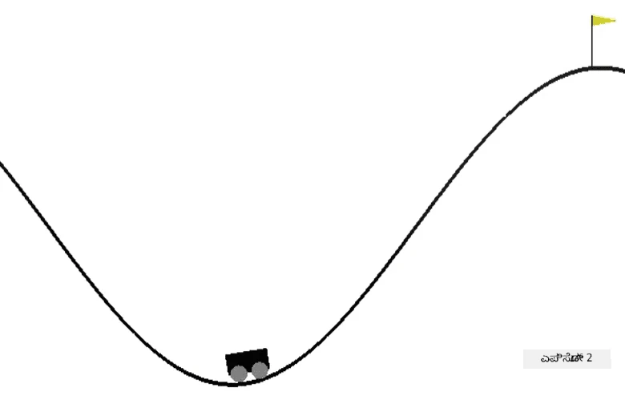

# ಪರ್ವತ ಕಾರ್ ಅನ್ನು ತಪ್ಪಿಸಲು ತರಬೇತಿ

[AI for Beginners Curriculum](https://github.com/microsoft/ai-for-beginners) ನಿಂದ ಪ್ರಯೋಗಾಲಯದ ಕಾರ್ಯ.

## ಕಾರ್ಯ

ನಿಮ್ಮ ಗುರಿ RL ಏಜೆಂಟ್ ಅನ್ನು OpenAI ಪರಿಸರದಲ್ಲಿ [ಪರ್ವತ ಕಾರ್](https://www.gymlibrary.ml/environments/classic_control/mountain_car/) ಅನ್ನು ನಿಯಂತ್ರಿಸಲು ತರಬೇತಿ ನೀಡುವುದು.

## ಪರಿಸರ

ಪರ್ವತ ಕಾರ್ ಪರಿಸರವು ಕಾರ್ ಅನ್ನು ಒಂದು ಕಣಿವೆ ಒಳಗೆ ಸೆರೆಯಲಾಗಿರುವಂತೆ ಹೊಂದಿದೆ. ನಿಮ್ಮ ಗುರಿ ಕಾರ್ ಅನ್ನು ಕಣಿವೆಯಿಂದ ಹೊರಗೆ ಹಾರಿಸಿ ಧ್ವಜವನ್ನು ತಲುಪಿಸುವುದು. ನೀವು ಮಾಡಬಹುದಾದ ಕ್ರಿಯೆಗಳು ಎಡಕ್ಕೆ ವೇಗವರ್ಧನೆ, ಬಲಕ್ಕೆ ವೇಗವರ್ಧನೆ ಅಥವಾ ಏನೂ ಮಾಡದಿರುವುದು. ನೀವು ಕಾರಿನ ಸ್ಥಾನವನ್ನು x-ಅಕ್ಷದ ಮೇಲೆ ಮತ್ತು ವೇಗವನ್ನು ಗಮನಿಸಬಹುದು.

## ಪ್ರಾರಂಭಿಸುವ ನೋಟ್ಬುಕ್

ಪ್ರಯೋಗಾಲಯವನ್ನು ಪ್ರಾರಂಭಿಸಲು [MountainCar.ipynb](MountainCar.ipynb) ಅನ್ನು ತೆರೆಯಿರಿ

## ಕಲಿಕೆಯ ಅಂಶ

ಈ ಪ್ರಯೋಗಾಲಯದ ಮೂಲಕ ನೀವು ಕಲಿಯಬೇಕಾದದ್ದು, RL ಆಲ್ಗಾರಿದಮ್ಗಳನ್ನು ಹೊಸ ಪರಿಸರಕ್ಕೆ ಹೊಂದಿಸುವುದು ಸಾಮಾನ್ಯವಾಗಿ ಸರಳವಾಗಿರುತ್ತದೆ, ಏಕೆಂದರೆ OpenAI Gym ಎಲ್ಲಾ ಪರಿಸರಗಳಿಗೆ ಒಂದೇ ಇಂಟರ್ಫೇಸ್ ಅನ್ನು ಹೊಂದಿದೆ ಮತ್ತು ಆಲ್ಗಾರಿದಮ್ಗಳು ಪರಿಸರದ ಸ್ವಭಾವದ ಮೇಲೆ ಬಹಳಷ್ಟು ಅವಲಂಬಿತವಾಗಿಲ್ಲ. ನೀವು Python ಕೋಡ್ ಅನ್ನು ಇಂತಹ ರೀತಿಯಲ್ಲಿ ಪುನರ್‌ರಚಿಸಬಹುದು, ಇದರಿಂದ ಯಾವುದೇ ಪರಿಸರವನ್ನು RL ಆಲ್ಗಾರಿದಮ್ಗೆ ಪ್ಯಾರಾಮೀಟರ್ ಆಗಿ ನೀಡಬಹುದು.

---

<!-- CO-OP TRANSLATOR DISCLAIMER START -->
**ಅಸ್ವೀಕಾರ**:  
ಈ ದಸ್ತಾವೇಜು AI ಅನುವಾದ ಸೇವೆ [Co-op Translator](https://github.com/Azure/co-op-translator) ಬಳಸಿ ಅನುವಾದಿಸಲಾಗಿದೆ. ನಾವು ನಿಖರತೆಯಿಗಾಗಿ ಪ್ರಯತ್ನಿಸುತ್ತಿದ್ದರೂ, ಸ್ವಯಂಚಾಲಿತ ಅನುವಾದಗಳಲ್ಲಿ ತಪ್ಪುಗಳು ಅಥವಾ ಅಸತ್ಯತೆಗಳು ಇರಬಹುದು ಎಂದು ದಯವಿಟ್ಟು ಗಮನಿಸಿ. ಮೂಲ ಭಾಷೆಯಲ್ಲಿರುವ ಮೂಲ ದಸ್ತಾವೇಜನ್ನು ಅಧಿಕೃತ ಮೂಲವೆಂದು ಪರಿಗಣಿಸಬೇಕು. ಪ್ರಮುಖ ಮಾಹಿತಿಗಾಗಿ, ವೃತ್ತಿಪರ ಮಾನವ ಅನುವಾದವನ್ನು ಶಿಫಾರಸು ಮಾಡಲಾಗುತ್ತದೆ. ಈ ಅನುವಾದ ಬಳಕೆಯಿಂದ ಉಂಟಾಗುವ ಯಾವುದೇ ತಪ್ಪು ಅರ್ಥಮಾಡಿಕೊಳ್ಳುವಿಕೆ ಅಥವಾ ತಪ್ಪು ವಿವರಣೆಗಳಿಗೆ ನಾವು ಹೊಣೆಗಾರರಾಗುವುದಿಲ್ಲ.
<!-- CO-OP TRANSLATOR DISCLAIMER END -->