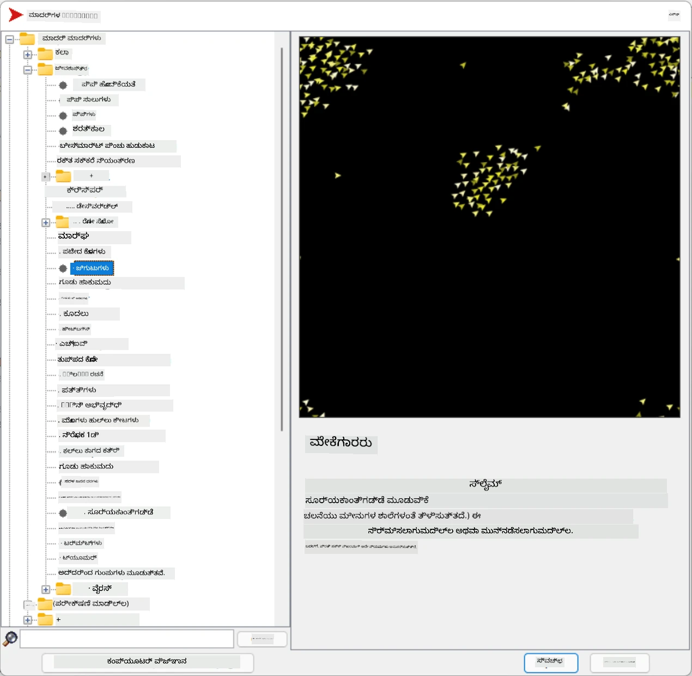
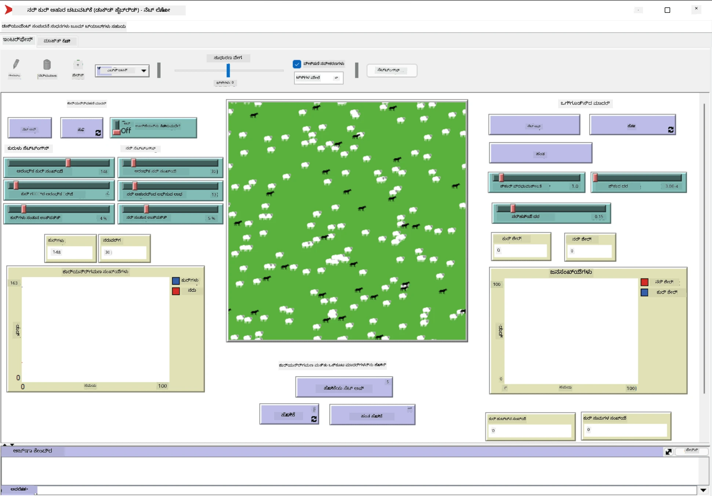

# ಬಹು-ಏಜೆಂಟ್ ವ್ಯವಸ್ಥೆಗಳು

ಬುದ್ಧಿಮತ್ತೆಯನ್ನು ಸಾಧಿಸುವ ಸಾಧ್ಯವಾದ ಮಾರ್ಗಗಳಲ್ಲಿ ಒಂದಾಗಿದೆ **ಉದ್ಭವಿಸುವ** (ಅಥವಾ **ಸಂಯೋಜಕ**) ವಿಧಾನ, ಇದು ಅನೇಕ ಸರಳ ಏಜೆಂಟ್‌ಗಳ ಸಂಯುಕ್ತ ವರ್ತನೆ ಸಂಪೂರ್ಣ ವ್ಯವಸ್ಥೆಯ ಒಟ್ಟಾರೆ ಹೆಚ್ಚು ಸಂಕೀರ್ಣ (ಅಥವಾ ಬುದ್ಧಿವಂತ) ವರ್ತನೆಗೆ ಕಾರಣವಾಗಬಹುದು ಎಂಬ ತತ್ವದ ಮೇಲೆ ಆಧಾರಿತವಾಗಿದೆ. ಸೈದ್ಧಾಂತಿಕವಾಗಿ, ಇದು [ಸಾಮೂಹಿಕ ಬುದ್ಧಿಮತ್ತೆ](https://en.wikipedia.org/wiki/Collective_intelligence), [ಉದ್ಭವವಾದಿ](https://en.wikipedia.org/wiki/Global_brain) ಮತ್ತು [ವಿಕಾಸಾತ್ಮಕ ಸೈಬರ್‌ನೆಟಿಕ್ಸ್](https://en.wikipedia.org/wiki/Global_brain) ತತ್ವಗಳ ಮೇಲೆ ಆಧಾರಿತವಾಗಿದೆ, ಇದು ಹೇಳುತ್ತದೆ ಕೆಳಮಟ್ಟದ ವ್ಯವಸ್ಥೆಗಳಿಂದ ಸರಿಯಾಗಿ ಸಂಯೋಜಿಸಿದಾಗ ಮೇಲ್ಮಟ್ಟದ ವ್ಯವಸ್ಥೆಗಳು ಕೆಲವು ಹೆಚ್ಚುವರಿ ಮೌಲ್ಯವನ್ನು ಪಡೆಯುತ್ತವೆ (ಇದನ್ನು *ಮೆಟಾಸಿಸ್ಟಮ್ ಪರಿವರ್ತನೆಯ ತತ್ವ* ಎಂದು ಕರೆಯುತ್ತಾರೆ).

## [ಪೂರ್ವ-ವ್ಯಾಖ್ಯಾನ ಕ್ವಿಜ್](https://ff-quizzes.netlify.app/en/ai/quiz/45)

**ಬಹು-ಏಜೆಂಟ್ ವ್ಯವಸ್ಥೆಗಳ** ದಿಕ್ಕು 1990ರ ದಶಕದಲ್ಲಿ ಇಂಟರ್ನೆಟ್ ಮತ್ತು ವಿತರಿತ ವ್ಯವಸ್ಥೆಗಳ ವೃದ್ಧಿಗೆ ಪ್ರತಿಕ್ರಿಯೆಯಾಗಿ AI ನಲ್ಲಿ ಉದ್ಭವಿಸಿತು. ಒಂದು ಶ್ರೇಷ್ಟ AI ಪಠ್ಯಪುಸ್ತಕ, [ಕೃತಕ ಬುದ್ಧಿಮತ್ತೆ: ಆಧುನಿಕ ವಿಧಾನ](https://en.wikipedia.org/wiki/Artificial_Intelligence:_A_Modern_Approach), ಬಹು-ಏಜೆಂಟ್ ವ್ಯವಸ್ಥೆಗಳ ದೃಷ್ಟಿಕೋನದಿಂದ ಶ್ರೇಷ್ಟ AI ನ ದೃಷ್ಟಿಕೋನವನ್ನು ಗಮನಿಸುತ್ತದೆ.

ಬಹು-ಏಜೆಂಟ್ ವಿಧಾನದಲ್ಲಿ ಕೇಂದ್ರಭೂತವಾದುದು **ಏಜೆಂಟ್** ಎಂಬ ಕಲ್ಪನೆ - ಇದು ಕೆಲವು **ಪರಿಸರದಲ್ಲಿ** ಜೀವಿಸುವ ಘಟಕ, ಅದನ್ನು ಅದು ಗ್ರಹಿಸಬಹುದು ಮತ್ತು ಅದರ ಮೇಲೆ ಕ್ರಿಯೆ ಮಾಡಬಹುದು. ಇದು ಬಹಳ ವ್ಯಾಪಕ ವ್ಯಾಖ್ಯಾನ, ಮತ್ತು ವಿವಿಧ ವಿಧಗಳು ಮತ್ತು ವರ್ಗೀಕರಣಗಳ ಏಜೆಂಟ್‌ಗಳು ಇರಬಹುದು:

* ಅವರ ತರ್ಕಶಕ್ತಿಯ ಆಧಾರದಲ್ಲಿ:
   - **ಪ್ರತಿಕ್ರಿಯಾತ್ಮಕ** ಏಜೆಂಟ್‌ಗಳು ಸಾಮಾನ್ಯವಾಗಿ ಸರಳ ವಿನಂತಿ-ಪ್ರತಿಕ್ರಿಯೆ ರೀತಿಯ ವರ್ತನೆ ಹೊಂದಿರುತ್ತವೆ
   - **ಚಿಂತನಾತ್ಮಕ** ಏಜೆಂಟ್‌ಗಳು ಕೆಲವು ತರ್ಕಶಕ್ತಿಯ reasoning ಮತ್ತು/ಅಥವಾ ಯೋಜನೆ ಸಾಮರ್ಥ್ಯಗಳನ್ನು ಬಳಸುತ್ತವೆ
* ಏಜೆಂಟ್ ತನ್ನ ಕೋಡ್ ಅನ್ನು ಎಲ್ಲಿ ನಿರ್ವಹಿಸುತ್ತದೆ ಎಂಬ ಆಧಾರದಲ್ಲಿ:
   - **ಸ್ಥಿರ** ಏಜೆಂಟ್‌ಗಳು ನಿಗದಿತ ನೆಟ್‌ವರ್ಕ್ ನೋಡ್‌ನಲ್ಲಿ ಕಾರ್ಯನಿರ್ವಹಿಸುತ್ತವೆ
   - **ಚಲಿಸುವ** ಏಜೆಂಟ್‌ಗಳು ತಮ್ಮ ಕೋಡ್ ಅನ್ನು ನೆಟ್‌ವರ್ಕ್ ನೋಡ್‌ಗಳ ನಡುವೆ ಸರಿಸಲು ಸಾಧ್ಯ
* ಅವರ ವರ್ತನೆಯ ಆಧಾರದಲ್ಲಿ:
   - **ನಿಷ್ಕ್ರಿಯ ಏಜೆಂಟ್‌ಗಳು** ನಿರ್ದಿಷ್ಟ ಗುರಿಗಳನ್ನು ಹೊಂದಿಲ್ಲ. ಇಂತಹ ಏಜೆಂಟ್‌ಗಳು ಬಾಹ್ಯ ಪ್ರೇರಣೆಗೆ ಪ್ರತಿಕ್ರಿಯಿಸಬಹುದು, ಆದರೆ ಸ್ವತಃ ಯಾವುದೇ ಕ್ರಿಯೆಯನ್ನು ಪ್ರಾರಂಭಿಸುವುದಿಲ್ಲ.
   - **ಸಕ್ರಿಯ ಏಜೆಂಟ್‌ಗಳು** ಕೆಲವು ಗುರಿಗಳನ್ನು ಹೊಂದಿದ್ದು ಅವುಗಳನ್ನು ಅನುಸರಿಸುತ್ತವೆ
   - **ಜ್ಞಾನಾತ್ಮಕ ಏಜೆಂಟ್‌ಗಳು** ಸಂಕೀರ್ಣ ಯೋಜನೆ ಮತ್ತು ತರ್ಕಶಕ್ತಿಯನ್ನು ಒಳಗೊಂಡಿರುತ್ತವೆ

ಇಂದಿನ ದಿನಗಳಲ್ಲಿ ಬಹು-ಏಜೆಂಟ್ ವ್ಯವಸ್ಥೆಗಳು ಹಲವಾರು ಅನ್ವಯಗಳಲ್ಲಿ ಬಳಸಲಾಗುತ್ತವೆ:

* ಆಟಗಳಲ್ಲಿ, ಅನೇಕ ಆಟಗಾರರಲ್ಲದ ಪಾತ್ರಗಳು ಕೆಲವು ರೀತಿಯ AI ಅನ್ನು ಬಳಸುತ್ತವೆ ಮತ್ತು ಬುದ್ಧಿವಂತ ಏಜೆಂಟ್‌ಗಳಾಗಿ ಪರಿಗಣಿಸಬಹುದು
* ವೀಡಿಯೋ ಉತ್ಪಾದನೆಯಲ್ಲಿ, ಜನಸಂದೋಹಗಳನ್ನು ಒಳಗೊಂಡ ಸಂಕೀರ್ಣ 3D ದೃಶ್ಯಗಳನ್ನು ರೆಂಡರ್ ಮಾಡಲು ಸಾಮಾನ್ಯವಾಗಿ ಬಹು-ಏಜೆಂಟ್ ಅನುಕರಣೆ ಬಳಸಲಾಗುತ್ತದೆ
* ವ್ಯವಸ್ಥೆಗಳ ಮಾದರೀಕರಣದಲ್ಲಿ, ಬಹು-ಏಜೆಂಟ್ ವಿಧಾನವನ್ನು ಸಂಕೀರ್ಣ ಮಾದರಿಯ ವರ್ತನೆಯನ್ನು ಅನುಕರಿಸಲು ಬಳಸಲಾಗುತ್ತದೆ. ಉದಾಹರಣೆಗೆ, COVID-19 ರೋಗದ ವ್ಯಾಪನೆಯನ್ನು ವಿಶ್ವದಾದ್ಯಾಂತ ಭವಿಷ್ಯವಾಣಿ ಮಾಡಲು ಬಹು-ಏಜೆಂಟ್ ವಿಧಾನ ಯಶಸ್ವಿಯಾಗಿ ಬಳಸಲಾಗಿದೆ. ಸಮಾನ ವಿಧಾನವನ್ನು ನಗರದಲ್ಲಿ ಟ್ರಾಫಿಕ್ ಮಾದರೀಕರಣಕ್ಕೆ ಬಳಸಬಹುದು ಮತ್ತು ಟ್ರಾಫಿಕ್ ನಿಯಮಗಳ ಬದಲಾವಣೆಗಳಿಗೆ ಅದು ಹೇಗೆ ಪ್ರತಿಕ್ರಿಯಿಸುತ್ತದೆ ಎಂದು ನೋಡಬಹುದು.
* ಸಂಕೀರ್ಣ ಸ್ವಯಂಚಾಲಿತ ವ್ಯವಸ್ಥೆಗಳಲ್ಲಿ, ಪ್ರತಿ ಸಾಧನವು ಸ್ವತಂತ್ರ ಏಜೆಂಟ್ ಆಗಿ ಕಾರ್ಯನಿರ್ವಹಿಸಬಹುದು, ಇದು ಸಂಪೂರ್ಣ ವ್ಯವಸ್ಥೆಯನ್ನು ಕಡಿಮೆ ಏಕಮುಖ ಮತ್ತು ಹೆಚ್ಚು ದೃಢವಾಗಿಸುತ್ತದೆ.

ನಾವು ಬಹು-ಏಜೆಂಟ್ ವ್ಯವಸ್ಥೆಗಳ ಆಳವಾದ ಅಧ್ಯಯನಕ್ಕೆ ಹೆಚ್ಚು ಸಮಯ ನೀಡುವುದಿಲ್ಲ, ಆದರೆ ಒಂದು ಉದಾಹರಣೆಯಾಗಿ **ಬಹು-ಏಜೆಂಟ್ ಮಾದರೀಕರಣ** ಅನ್ನು ಪರಿಗಣಿಸೋಣ.

## ನೆಟ್‌ಲೋಗೋ

[NetLogo](https://ccl.northwestern.edu/netlogo/) ಒಂದು ಬಹು-ಏಜೆಂಟ್ ಮಾದರೀಕರಣ ಪರಿಸರ, ಇದು [Logo](https://en.wikipedia.org/wiki/Logo_(programming_language)) ಪ್ರೋಗ್ರಾಮಿಂಗ್ ಭಾಷೆಯ ಪರಿಷ್ಕೃತ ಆವೃತ್ತಿಯ ಮೇಲೆ ಆಧಾರಿತವಾಗಿದೆ. ಈ ಭಾಷೆಯನ್ನು ಮಕ್ಕಳಿಗೆ ಪ್ರೋಗ್ರಾಮಿಂಗ್ ತತ್ವಗಳನ್ನು ಕಲಿಸಲು ಅಭಿವೃದ್ಧಿಪಡಿಸಲಾಗಿದೆ, ಮತ್ತು ಇದು **ಟರ್ಟಲ್** ಎಂಬ ಏಜೆಂಟ್ ಅನ್ನು ನಿಯಂತ್ರಿಸಲು ಅವಕಾಶ ನೀಡುತ್ತದೆ, ಇದು ಚಲಿಸಿ ಹಿಂಬಾಲಿಸುವ ಗುರುತು ಬಿಡುತ್ತದೆ. ಇದರಿಂದ ಸಂಕೀರ್ಣ ಜ್ಯಾಮಿತೀಯ ಆಕಾರಗಳನ್ನು ರಚಿಸುವುದು ಸಾಧ್ಯವಾಗುತ್ತದೆ, ಇದು ಏಜೆಂಟ್‌ನ ವರ್ತನೆಯನ್ನು ದೃಶ್ಯವಾಗಿ ಅರ್ಥಮಾಡಿಕೊಳ್ಳಲು ಸಹಾಯಕ.

ನೆಟ್‌ಲೋಗೋದಲ್ಲಿ, ನಾವು `create-turtles` ಕಮಾಂಡ್ ಬಳಸಿ ಅನೇಕ ಟರ್ಟಲ್‌ಗಳನ್ನು ರಚಿಸಬಹುದು. ನಂತರ ನಾವು ಎಲ್ಲಾ ಟರ್ಟಲ್‌ಗಳಿಗೆ ಕೆಲವು ಕ್ರಿಯೆಗಳನ್ನು ಮಾಡಲು ಸೂಚಿಸಬಹುದು (ಕೆಳಗಿನ ಉದಾಹರಣೆಯಲ್ಲಿ - 10 ಪಾಯಿಂಟ್ ಮುಂದೆ ಸಾಗಲು):

```
create-turtles 10
ask turtles [
  forward 10
]
```

ನಿಜವಾಗಿಯೂ, ಎಲ್ಲಾ ಟರ್ಟಲ್‌ಗಳು ಒಂದೇ ಕೆಲಸ ಮಾಡುವಾಗ ಆಸಕ್ತಿಕರವಾಗುವುದಿಲ್ಲ, ಆದ್ದರಿಂದ ನಾವು `ask` ಬಳಸಿ ಟರ್ಟಲ್‌ಗಳ ಗುಂಪುಗಳಿಗೆ, ಉದಾ. ನಿರ್ದಿಷ್ಟ ಬಿಂದುವಿನ ಸಮೀಪದಲ್ಲಿರುವವರಿಗೆ, ಸೂಚಿಸಬಹುದು. ನಾವು `breed [cats cat]` ಕಮಾಂಡ್ ಬಳಸಿ ವಿಭಿನ್ನ *ಬ್ರೀಡ್* ಗಳ ಟರ್ಟಲ್‌ಗಳನ್ನು ರಚಿಸಬಹುದು. ಇಲ್ಲಿ `cat` ಒಂದು ಬ್ರೀಡ್‌ನ ಹೆಸರು, ಮತ್ತು ಸ್ಪಷ್ಟತೆಗಾಗಿ ಏಕವಚನ ಮತ್ತು ಬಹುವಚನ ಪದಗಳನ್ನು ಎರಡನ್ನೂ ನೀಡಬೇಕು, ಏಕೆಂದರೆ ವಿಭಿನ್ನ ಕಮಾಂಡ್‌ಗಳು ವಿಭಿನ್ನ ರೂಪಗಳನ್ನು ಬಳಸುತ್ತವೆ.

> ✅ ನಾವು ನೆಟ್‌ಲೋಗೋ ಭಾಷೆಯನ್ನು ಸ್ವತಃ ಕಲಿಯುವುದಕ್ಕೆ ಹೋಗುವುದಿಲ್ಲ - ನೀವು ಆಸಕ್ತರಾಗಿದ್ದರೆ ಅದ್ಭುತವಾದ [ಆರಂಭಿಕರ ಇಂಟರಾಕ್ಟಿವ್ ನೆಟ್‌ಲೋಗೋ ನಿಘಂಟು](https://ccl.northwestern.edu/netlogo/bind/) ಸಂಪನ್ಮೂಲವನ್ನು ಭೇಟಿ ಮಾಡಬಹುದು.

ನೀವು [ಡೌನ್‌ಲೋಡ್](https://ccl.northwestern.edu/netlogo/download.shtml) ಮಾಡಿ ನೆಟ್‌ಲೋಗೋ ಅನ್ನು ಪ್ರಯತ್ನಿಸಬಹುದು.

### ಮಾದರಿ ಗ್ರಂಥಾಲಯ

ನೆಟ್‌ಲೋಗೋದಲ್ಲಿ ಒಂದು ಅದ್ಭುತ ವಿಷಯವೆಂದರೆ, ನೀವು ಪ್ರಯತ್ನಿಸಬಹುದಾದ ಕಾರ್ಯನಿರ್ವಹಿಸುವ ಮಾದರಿಗಳ ಗ್ರಂಥಾಲಯವಿದೆ. **File → Models Library** ಗೆ ಹೋಗಿ, ಮತ್ತು ನೀವು ಅನೇಕ ವರ್ಗಗಳ ಮಾದರಿಗಳನ್ನು ಆಯ್ಕೆಮಾಡಬಹುದು.



> ಡಿಮಿಟ್ರಿ ಸೋಶ್ನಿಕೋವ್ ಅವರ ಮಾದರಿ ಗ್ರಂಥಾಲಯದ ಸ್ಕ್ರೀನ್‌ಶಾಟ್

ನೀವು ಒಂದು ಮಾದರಿಯನ್ನು ತೆರೆಯಬಹುದು, ಉದಾಹರಣೆಗೆ **Biology → Flocking**.

### ಮುಖ್ಯ ತತ್ವಗಳು

ಮಾದರಿಯನ್ನು ತೆರೆಯುವ ನಂತರ, ನೀವು ಮುಖ್ಯ ನೆಟ್‌ಲೋಗೋ ಪರದೆಗೆ ಹೋಗುತ್ತೀರಿ. ಇಲ್ಲಿ ನಾಯಿ ಮತ್ತು ಕುರಿಗಳ ಜನಸಂಖ್ಯೆಯನ್ನು ವಿವರಿಸುವ ಮಾದರಿ ಇದೆ, ನಿರ್ದಿಷ್ಟ ಸಂಪನ್ಮೂಲಗಳ (ಹುಲ್ಲು)ೊಂದಿಗೆ.



> ಡಿಮಿಟ್ರಿ ಸೋಶ್ನಿಕೋವ್ ಅವರ ಸ್ಕ್ರೀನ್‌ಶಾಟ್

ಈ ಪರದೆ ಮೇಲೆ ನೀವು ನೋಡಬಹುದು:

* **ಇಂಟರ್ಫೇಸ್** ವಿಭಾಗದಲ್ಲಿ:
  - ಎಲ್ಲಾ ಏಜೆಂಟ್‌ಗಳು ಜೀವಿಸುವ ಮುಖ್ಯ ಕ್ಷೇತ್ರ
  - ಬಟನ್‌ಗಳು, ಸ್ಲೈಡರ್‌ಗಳು ಮುಂತಾದ ನಿಯಂತ್ರಣಗಳು
  - ಅನುಕರಣೆಯ ಪರಿಮಾಣಗಳನ್ನು ಪ್ರದರ್ಶಿಸಲು ಗ್ರಾಫ್‌ಗಳು
* **ಕೋಡ್** ಟ್ಯಾಬ್‌ನಲ್ಲಿ ಸಂಪಾದಕ, ಇಲ್ಲಿ ನೀವು ನೆಟ್‌ಲೋಗೋ ಪ್ರೋಗ್ರಾಂ ಟೈಪ್ ಮಾಡಬಹುದು

ಬಹುತೇಕ ಸಂದರ್ಭಗಳಲ್ಲಿ, ಇಂಟರ್ಫೇಸ್‌ನಲ್ಲಿ **Setup** ಬಟನ್ ಇರುತ್ತದೆ, ಇದು ಅನುಕರಣೆ ಸ್ಥಿತಿಯನ್ನು ಪ್ರಾರಂಭಿಸುತ್ತದೆ, ಮತ್ತು **Go** ಬಟನ್ ಇರುತ್ತದೆ, ಇದು ಕಾರ್ಯಾಚರಣೆಯನ್ನು ಪ್ರಾರಂಭಿಸುತ್ತದೆ. ಅವುಗಳನ್ನು ಕೆಳಗಿನಂತಿರುವ ಕೋಡ್‌ನ ಹ್ಯಾಂಡ್ಲರ್‌ಗಳು ನಿರ್ವಹಿಸುತ್ತವೆ:

```
to go [
...
]
```

ನೆಟ್‌ಲೋಗೋ ವಿಶ್ವದಲ್ಲಿ ಈ ಕೆಳಗಿನ ವಸ್ತುಗಳಿವೆ:

* **ಏಜೆಂಟ್‌ಗಳು** (ಟರ್ಟಲ್‌ಗಳು) ಕ್ಷೇತ್ರದ ಮೇಲೆ ಚಲಿಸಿ ಏನಾದರೂ ಮಾಡಬಹುದು. ನೀವು `ask turtles [...]` ವಾಕ್ಯರಚನೆ ಬಳಸಿ ಏಜೆಂಟ್‌ಗಳಿಗೆ ಸೂಚನೆ ನೀಡುತ್ತೀರಿ, ಮತ್ತು ಕೊಠಡಿಯೊಳಗಿನ ಕೋಡ್ ಎಲ್ಲಾ ಏಜೆಂಟ್‌ಗಳು *ಟರ್ಟಲ್ ಮೋಡ್* ನಲ್ಲಿ ಕಾರ್ಯಗತಗೊಳ್ಳುತ್ತದೆ.
* **ಪ್ಯಾಚ್‌ಗಳು** ಕ್ಷೇತ್ರದ ಚೌಕಾಕಾರದ ಪ್ರದೇಶಗಳು, ಇಲ್ಲಿ ಏಜೆಂಟ್‌ಗಳು ಜೀವಿಸುತ್ತವೆ. ನೀವು ಅದೇ ಪ್ಯಾಚ್‌ನಲ್ಲಿರುವ ಎಲ್ಲಾ ಏಜೆಂಟ್‌ಗಳನ್ನು ಉಲ್ಲೇಖಿಸಬಹುದು, ಅಥವಾ ಪ್ಯಾಚ್ ಬಣ್ಣಗಳು ಮತ್ತು ಇತರ ಗುಣಲಕ್ಷಣಗಳನ್ನು ಬದಲಾಯಿಸಬಹುದು. ನೀವು `ask patches` ಅನ್ನು ಕೂಡ ಬಳಸಬಹುದು.
* **ನಿರೀಕ್ಷಕ** ಒಂದು ವಿಶಿಷ್ಟ ಏಜೆಂಟ್, ಇದು ವಿಶ್ವವನ್ನು ನಿಯಂತ್ರಿಸುತ್ತದೆ. ಎಲ್ಲಾ ಬಟನ್ ಹ್ಯಾಂಡ್ಲರ್‌ಗಳು *ನಿರೀಕ್ಷಕ ಮೋಡ್* ನಲ್ಲಿ ಕಾರ್ಯಗತಗೊಳ್ಳುತ್ತವೆ.

> ✅ ಬಹು-ಏಜೆಂಟ್ ಪರಿಸರದ ಸೌಂದರ್ಯವೆಂದರೆ, ಟರ್ಟಲ್ ಮೋಡ್ ಅಥವಾ ಪ್ಯಾಚ್ ಮೋಡ್‌ನಲ್ಲಿ ನಡೆಯುವ ಕೋಡ್ ಎಲ್ಲಾ ಏಜೆಂಟ್‌ಗಳ ಮೂಲಕ ಸಮಕಾಲೀನವಾಗಿ ಕಾರ್ಯಗತಗೊಳ್ಳುತ್ತದೆ. ಹೀಗಾಗಿ, ಸ್ವಲ್ಪ ಕೋಡ್ ಬರೆಯುವ ಮೂಲಕ ಮತ್ತು ವೈಯಕ್ತಿಕ ಏಜೆಂಟ್‌ನ ವರ್ತನೆಯನ್ನು ಪ್ರೋಗ್ರಾಮ್ ಮಾಡುವ ಮೂಲಕ, ನೀವು ಸಂಪೂರ್ಣ ಅನುಕರಣೆಯ ಸಂಕೀರ್ಣ ವರ್ತನೆಯನ್ನು ರಚಿಸಬಹುದು.

### ಫ್ಲಾಕಿಂಗ್

ಬಹು-ಏಜೆಂಟ್ ವರ್ತನೆಯ ಉದಾಹರಣೆಯಾಗಿ, **[ಫ್ಲಾಕಿಂಗ್](https://en.wikipedia.org/wiki/Flocking_(behavior))** ಅನ್ನು ಪರಿಗಣಿಸೋಣ. ಫ್ಲಾಕಿಂಗ್ ಒಂದು ಸಂಕೀರ್ಣ ಮಾದರಿ, ಇದು ಹಕ್ಕಿಗಳ ಗುಂಪು ಹಾರುವ ರೀತಿಗೆ ಬಹಳ ಸಮಾನವಾಗಿದೆ. ಅವು ಹಾರುತ್ತಿರುವುದನ್ನು ನೋಡಿದಾಗ ನೀವು ಭಾವಿಸಬಹುದು ಅವು ಕೆಲವು ಸಾಮೂಹಿಕ ಅಲ್ಗೋರಿದಮ್ ಅನ್ನು ಅನುಸರಿಸುತ್ತವೆ ಅಥವಾ ಅವುಗಳಲ್ಲಿ ಕೆಲವು ರೀತಿಯ *ಸಾಮೂಹಿಕ ಬುದ್ಧಿಮತ್ತೆ* ಇದೆ. ಆದರೆ ಈ ಸಂಕೀರ್ಣ ವರ್ತನೆ ಉಂಟಾಗುವುದು ಪ್ರತಿಯೊಬ್ಬ ಏಜೆಂಟ್ (ಈ ಸಂದರ್ಭದಲ್ಲಿ, *ಹಕ್ಕಿ*) ತನ್ನ ಸುತ್ತಲೂ ಕೆಲವು ದೂರದ ಏಜೆಂಟ್‌ಗಳನ್ನು ಮಾತ್ರ ಗಮನಿಸಿ, ಮೂರು ಸರಳ ನಿಯಮಗಳನ್ನು ಅನುಸರಿಸುವಾಗ:

* **ಸಮರೇಖೆ** - ಅದು ಸಮೀಪದ ಏಜೆಂಟ್‌ಗಳ ಸರಾಸರಿ ದಿಕ್ಕಿಗೆ ತಿರುಗುತ್ತದೆ
* **ಸಮಗ್ರತೆ** - ಅದು ಸಮೀಪದ ಏಜೆಂಟ್‌ಗಳ ಸರಾಸರಿ ಸ್ಥಾನಕ್ಕೆ ತಿರುಗಲು ಪ್ರಯತ್ನಿಸುತ್ತದೆ (*ದೀರ್ಘ ದೂರ ಆಕರ್ಷಣೆ*)
* **ವಿಭಜನೆ** - ಇತರ ಹಕ್ಕಿಗಳಿಂದ ತುಂಬಾ ಹತ್ತಿರ ಬಂದಾಗ, ಅದು ದೂರ ಸರಿಯಲು ಪ್ರಯತ್ನಿಸುತ್ತದೆ (*ಸಣ್ಣ ದೂರ ತಿರಸ್ಕರಣೆ*)

ನೀವು ಫ್ಲಾಕಿಂಗ್ ಉದಾಹರಣೆಯನ್ನು ಚಾಲನೆ ಮಾಡಿ ವರ್ತನೆಯನ್ನು ಗಮನಿಸಬಹುದು. ನೀವು *ವಿಭಜನೆ ಪ್ರಮಾಣ* ಅಥವಾ *ನೋಟದ ವ್ಯಾಪ್ತಿ* ಮುಂತಾದ ಪರಿಮಾಣಗಳನ್ನು ಹೊಂದಿಸಬಹುದು, ಇದು ಪ್ರತಿ ಹಕ್ಕಿ ಎಷ್ಟು ದೂರ ನೋಡಬಹುದು ಎಂದು ನಿರ್ಧರಿಸುತ್ತದೆ. ಗಮನಿಸಿ, ನೀವು ನೋಟದ ವ್ಯಾಪ್ತಿಯನ್ನು 0ಕ್ಕೆ ಇಳಿಸಿದರೆ, ಎಲ್ಲಾ ಹಕ್ಕಿಗಳು ಕಣ್ಣು ಕಳೆದುಕೊಳ್ಳುತ್ತವೆ ಮತ್ತು ಫ್ಲಾಕಿಂಗ್ ನಿಲ್ಲುತ್ತದೆ. ವಿಭಜನೆ 0ಕ್ಕೆ ಇಳಿಸಿದರೆ, ಎಲ್ಲಾ ಹಕ್ಕಿಗಳು ಸರಳ ರೇಖೆಯಲ್ಲಿ ಸೇರಿಕೊಳ್ಳುತ್ತವೆ.

> ✅ **ಕೋಡ್** ಟ್ಯಾಬ್‌ಗೆ ಬದಲಾಯಿಸಿ ಮತ್ತು ಫ್ಲಾಕಿಂಗ್‌ನ ಮೂರು ನಿಯಮಗಳು (ಸಮರೇಖೆ, ಸಮಗ್ರತೆ ಮತ್ತು ವಿಭಜನೆ) ಕೋಡ್‌ನಲ್ಲಿ ಎಲ್ಲಿ ಜಾರಿಗೆ ಬರುತ್ತವೆ ಎಂದು ನೋಡಿ. ನಾವು ಕೇವಲ ದೃಷ್ಟಿಯಲ್ಲಿ ಇರುವ ಏಜೆಂಟ್‌ಗಳನ್ನು ಮಾತ್ರ ಉಲ್ಲೇಖಿಸುವುದನ್ನು ಗಮನಿಸಿ.

### ಇತರ ಮಾದರಿಗಳು ನೋಡಲು

ನೀವು ಪ್ರಯೋಗಿಸಬಹುದಾದ ಇನ್ನಷ್ಟು ಆಸಕ್ತಿದಾಯಕ ಮಾದರಿಗಳು ಇವೆ:

* **ಕಲಾ → ಫೈರ್ವರ್ಕ್ಸ್** ಒಂದು ಫೈರ್ವರ್ಕ್ ಅನ್ನು ವೈಯಕ್ತಿಕ ಅಗ್ನಿ ಹರಿವುಗಳ ಸಾಮೂಹಿಕ ವರ್ತನೆ ಎಂದು ತೋರಿಸುತ್ತದೆ
* **ಸಾಮಾಜಿಕ ವಿಜ್ಞಾನ → ಟ್ರಾಫಿಕ್ ಬೇಸಿಕ್** ಮತ್ತು **ಸಾಮಾಜಿಕ ವಿಜ್ಞಾನ → ಟ್ರಾಫಿಕ್ ಗ್ರಿಡ್** 1D ಮತ್ತು 2D ಗ್ರಿಡ್‌ನಲ್ಲಿ ಟ್ರಾಫಿಕ್ ಮಾದರಿಯನ್ನು ಟ್ರಾಫಿಕ್ ಲೈಟ್‌ಗಳೊಂದಿಗೆ ಅಥವಾ ಇಲ್ಲದೆ ತೋರಿಸುತ್ತವೆ. ಪ್ರತಿ ಕಾರು ಈ ನಿಯಮಗಳನ್ನು ಅನುಸರಿಸುತ್ತದೆ:
   - ಮುಂದೆ ಸ್ಥಳ ಖಾಲಿ ಇದ್ದರೆ - ವೇಗ ಹೆಚ್ಚಿಸು (ನಿಗದಿತ ಗರಿಷ್ಠ ವೇಗದವರೆಗೆ)
   - ಮುಂದೆ ಅಡ್ಡಿ ಕಂಡರೆ - ಬ್ರೇಕ್ ಹಾಕು (ನೀವು ಚಾಲಕ ಎಷ್ಟು ದೂರ ನೋಡಬಹುದು ಎಂಬುದನ್ನು ಹೊಂದಿಸಬಹುದು)
* **ಸಾಮಾಜಿಕ ವಿಜ್ಞಾನ → ಪಾರ್ಟಿ** ಜನರು ಕಾಕ್ಟೇಲ್ ಪಾರ್ಟಿಯಲ್ಲಿ ಹೇಗೆ ಗುಂಪಾಗುತ್ತಾರೆ ಎಂದು ತೋರಿಸುತ್ತದೆ. ನೀವು ಗುಂಪಿನ ಸಂತೋಷದ ವೇಗವನ್ನು ಹೆಚ್ಚಿಸುವ ಪರಿಮಾಣಗಳ ಸಂಯೋಜನೆಯನ್ನು ಕಂಡುಹಿಡಿಯಬಹುದು.

ಈ ಉದಾಹರಣೆಗಳಿಂದ ನೀವು ನೋಡಬಹುದು, ಬಹು-ಏಜೆಂಟ್ ಅನುಕರಣೆಗಳು ಒಂದೇ ಅಥವಾ ಸಮಾನ ತರ್ಕವನ್ನು ಅನುಸರಿಸುವ ವೈಯಕ್ತಿಕರ ಸಂಯುಕ್ತ ವ್ಯವಸ್ಥೆಯ ವರ್ತನೆಯನ್ನು ಅರ್ಥಮಾಡಿಕೊಳ್ಳಲು ಬಹಳ ಉಪಯುಕ್ತವಾಗಬಹುದು. ಇದನ್ನು ಕಂಪ್ಯೂಟರ್ ಆಟಗಳಲ್ಲಿ [NPCಗಳು](https://en.wikipedia.org/wiki/NPC) ಅಥವಾ 3D ಅನಿಮೇಟೆಡ್ ಜಗತ್ತಿನಲ್ಲಿ ಏಜೆಂಟ್‌ಗಳನ್ನು ನಿಯಂತ್ರಿಸಲು ಕೂಡ ಬಳಸಬಹುದು.

## ಚಿಂತನಾತ್ಮಕ ಏಜೆಂಟ್‌ಗಳು

ಮೇಲಿನ ಏಜೆಂಟ್‌ಗಳು ಬಹಳ ಸರಳವಾಗಿದ್ದು, ಪರಿಸರದ ಬದಲಾವಣೆಗಳಿಗೆ ಕೆಲವು ಅಲ್ಗೋರಿದಮ್ ಬಳಸಿ ಪ್ರತಿಕ್ರಿಯಿಸುತ್ತವೆ. ಅವುಗಳನ್ನು **ಪ್ರತಿಕ್ರಿಯಾತ್ಮಕ ಏಜೆಂಟ್‌ಗಳು** ಎಂದು ಕರೆಯುತ್ತಾರೆ. ಆದರೆ, ಕೆಲವೊಮ್ಮೆ ಏಜೆಂಟ್‌ಗಳು ತರ್ಕಮಾಡಿ ತಮ್ಮ ಕ್ರಿಯೆಯನ್ನು ಯೋಜಿಸಬಹುದು, ಇಂತಹವುಗಳನ್ನು **ಚಿಂತನಾತ್ಮಕ** ಎಂದು ಕರೆಯುತ್ತಾರೆ.

ಸಾಮಾನ್ಯ ಉದಾಹರಣೆ ಎಂದರೆ ಮಾನವನಿಂದ ಪ್ರವಾಸ ಟೂರ್ ಬುಕ್ ಮಾಡಲು ಸೂಚನೆ ಪಡೆಯುವ ವೈಯಕ್ತಿಕ ಏಜೆಂಟ್. ಇಂಟರ್ನೆಟ್‌ನಲ್ಲಿ ಸಹಾಯ ಮಾಡುವ ಅನೇಕ ಏಜೆಂಟ್‌ಗಳು ಇದ್ದರೆ, ಅದು ಇತರ ಏಜೆಂಟ್‌ಗಳನ್ನು ಸಂಪರ್ಕಿಸಿ ಲಭ್ಯವಿರುವ ವಿಮಾನಗಳು ಯಾವುವು, ವಿವಿಧ ದಿನಾಂಕಗಳ ಹೋಟೆಲ್ ಬೆಲೆಗಳು ಏನು, ಮತ್ತು ಉತ್ತಮ ಬೆಲೆಗೆ ಮಾತುಕತೆ ಮಾಡಬಹುದು. ಪ್ರವಾಸ ಯೋಜನೆ ಪೂರ್ಣಗೊಂಡು ಮಾಲೀಕನಿಂದ ದೃಢೀಕರಿಸಿದ ನಂತರ, ಬುಕ್ಕಿಂಗ್ ಪ್ರಕ್ರಿಯೆ ಮುಂದುವರಿಯಬಹುದು.

ಅದಕ್ಕಾಗಿ, ಏಜೆಂಟ್‌ಗಳು **ಸಂವಹನ** ಮಾಡಬೇಕಾಗುತ್ತದೆ. ಯಶಸ್ವಿ ಸಂವಹನಕ್ಕೆ ಅವುಗಳಿಗೆ ಬೇಕಾಗುವವು:

* ಜ್ಞಾನ ವಿನಿಮಯಕ್ಕೆ ಕೆಲವು **ಪ್ರಮಾಣಿತ ಭಾಷೆಗಳು**, ಉದಾ. [Knowledge Interchange Format](https://en.wikipedia.org/wiki/Knowledge_Interchange_Format) (KIF) ಮತ್ತು [Knowledge Query and Manipulation Language](https://en.wikipedia.org/wiki/Knowledge_Query_and_Manipulation_Language) (KQML). ಈ ಭಾಷೆಗಳು [Speech Act theory](https://en.wikipedia.org/wiki/Speech_act) ಆಧಾರಿತವಾಗಿವೆ.
* ಈ ಭಾಷೆಗಳು ವಿವಿಧ **ಹರಾಜು ಪ್ರಕಾರಗಳ** ಆಧಾರದ ಮೇಲೆ **ಮಾತುಕತೆ ಪ್ರೋಟೋಕಾಲ್‌ಗಳನ್ನು** ಒಳಗೊಂಡಿರಬೇಕು.
* ಅವುಗಳು ಒಂದೇ ಅರ್ಥವನ್ನು ತಿಳಿಯುವಂತೆ **ಸಾಮಾನ್ಯ ಅಂಟಾಲಜಿ** ಹೊಂದಿರಬೇಕು.
* ವಿಭಿನ್ನ ಏಜೆಂಟ್‌ಗಳು ಏನು ಮಾಡಬಹುದು ಎಂಬುದನ್ನು ಕಂಡುಹಿಡಿಯುವ ವಿಧಾನ, ಇದು ಕೂಡ ಕೆಲವು ರೀತಿಯ ಅಂಟಾಲಜಿ ಆಧಾರಿತವಾಗಿರಬೇಕು.

ಚಿಂತನಾತ್ಮಕ ಏಜೆಂಟ್‌ಗಳು ಪ್ರತಿಕ್ರಿಯಾತ್ಮಕ ಏಜೆಂಟ್‌ಗಳಿಗಿಂತ ಬಹಳ ಸಂಕೀರ್ಣ, ಏಕೆಂದರೆ ಅವು ಪರಿಸರದ ಬದಲಾವಣೆಗಳಿಗೆ ಮಾತ್ರ ಪ್ರತಿಕ್ರಿಯಿಸುವುದಲ್ಲದೆ, ಸ್ವತಃ ಕ್ರಿಯೆಗಳನ್ನು *ಪ್ರಾರಂಭಿಸಬೇಕಾಗುತ್ತದೆ*. ಚಿಂತನಾತ್ಮಕ ಏಜೆಂಟ್‌ಗಳಿಗೆ ಪ್ರಸ್ತಾಪಿಸಲಾದ ವಾಸ್ತುಶಿಲ್ಪಗಳಲ್ಲಿ ಒಂದು ಎಂದರೆ ನಂಬಿಕೆ-ಆಕಾಂಕ್ಷೆ-ಉದ್ದೇಶ (BDI) ಏಜೆಂಟ್:

* **ನಂಬಿಕೆಗಳು** ಏಜೆಂಟ್‌ನ ಪರಿಸರದ ಬಗ್ಗೆ ಜ್ಞಾನದ ಸಮೂಹ. ಇದು ಜ್ಞಾನ ಆಧಾರ ಅಥವಾ ನಿಯಮಗಳ ಸಮೂಹವಾಗಿ ರಚಿಸಬಹುದು, ಏಜೆಂಟ್ ಅದನ್ನು ಪರಿಸರದ ನಿರ್ದಿಷ್ಟ ಪರಿಸ್ಥಿತಿಗೆ ಅನ್ವಯಿಸಬಹುದು.
* **ಆಕಾಂಕ್ಷೆಗಳು** ಏಜೆಂಟ್ ಏನು ಮಾಡಲು ಬಯಸುತ್ತದೆ, ಅಂದರೆ ಅದರ ಗುರಿಗಳು. ಉದಾಹರಣೆಗೆ, ಮೇಲಿನ ವೈಯಕ್ತಿಕ ಸಹಾಯಕ ಏಜೆಂಟ್‌ನ ಗುರಿ ಪ್ರವಾಸ ಬುಕ್ಕಿಂಗ್ ಮಾಡುವುದು, ಮತ್ತು ಹೋಟೆಲ್ ಏಜೆಂಟ್‌ನ ಗುರಿ ಲಾಭವನ್ನು ಗರಿಷ್ಠಗೊಳಿಸುವುದು.
* **ಉದ್ದೇಶಗಳು** ಗುರಿಗಳನ್ನು ಸಾಧಿಸಲು ಏಜೆಂಟ್ ಯೋಜಿಸುವ ನಿರ್ದಿಷ್ಟ ಕ್ರಿಯೆಗಳು. ಕ್ರಿಯೆಗಳು ಸಾಮ

---

<!-- CO-OP TRANSLATOR DISCLAIMER START -->
**ಅಸ್ವೀಕಾರ**:  
ಈ ದಸ್ತಾವೇಜು AI ಅನುವಾದ ಸೇವೆ [Co-op Translator](https://github.com/Azure/co-op-translator) ಬಳಸಿ ಅನುವಾದಿಸಲಾಗಿದೆ. ನಾವು ನಿಖರತೆಯಿಗಾಗಿ ಪ್ರಯತ್ನಿಸುತ್ತಿದ್ದರೂ, ಸ್ವಯಂಚಾಲಿತ ಅನುವಾದಗಳಲ್ಲಿ ತಪ್ಪುಗಳು ಅಥವಾ ಅಸತ್ಯತೆಗಳು ಇರಬಹುದು ಎಂದು ದಯವಿಟ್ಟು ಗಮನಿಸಿ. ಮೂಲ ಭಾಷೆಯಲ್ಲಿರುವ ಮೂಲ ದಸ್ತಾವೇಜನ್ನು ಅಧಿಕೃತ ಮೂಲವೆಂದು ಪರಿಗಣಿಸಬೇಕು. ಪ್ರಮುಖ ಮಾಹಿತಿಗಾಗಿ, ವೃತ್ತಿಪರ ಮಾನವ ಅನುವಾದವನ್ನು ಶಿಫಾರಸು ಮಾಡಲಾಗುತ್ತದೆ. ಈ ಅನುವಾದ ಬಳಕೆಯಿಂದ ಉಂಟಾಗುವ ಯಾವುದೇ ತಪ್ಪು ಅರ್ಥಮಾಡಿಕೊಳ್ಳುವಿಕೆ ಅಥವಾ ತಪ್ಪು ವಿವರಣೆಗಳಿಗೆ ನಾವು ಹೊಣೆಗಾರರಾಗುವುದಿಲ್ಲ.
<!-- CO-OP TRANSLATOR DISCLAIMER END -->