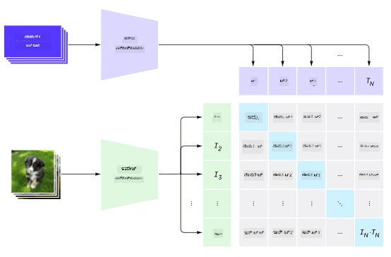
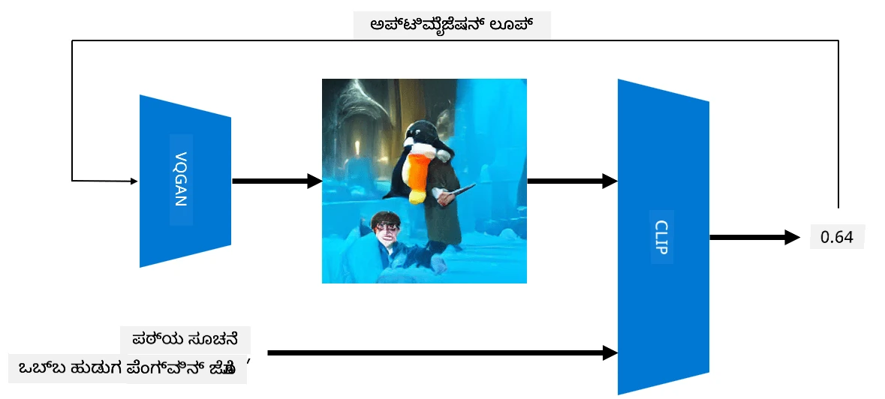

# ಬಹು-ಮೋಡಲ್ ನೆಟ್‌ವರ್ಕ್‌ಗಳು

NLP ಕಾರ್ಯಗಳನ್ನು ಪರಿಹರಿಸಲು ಟ್ರಾನ್ಸ್‌ಫಾರ್ಮರ್ ಮಾದರಿಗಳ ಯಶಸ್ಸಿನ ನಂತರ, ಅದೇ ಅಥವಾ ಸಮಾನ ವಾಸ್ತುಶಿಲ್ಪಗಳನ್ನು ಕಂಪ್ಯೂಟರ್ ದೃಷ್ಟಿ ಕಾರ್ಯಗಳಿಗೆ ಅನ್ವಯಿಸಲಾಗಿದೆ. ದೃಷ್ಟಿ ಮತ್ತು ನೈಸರ್ಗಿಕ ಭಾಷಾ ಸಾಮರ್ಥ್ಯಗಳನ್ನು *ಸಂಯೋಜಿಸುವ* ಮಾದರಿಗಳನ್ನು ನಿರ್ಮಿಸುವಲ್ಲಿ ಹೆಚ್ಚುತ್ತಿರುವ ಆಸಕ್ತಿ ಇದೆ. ಇಂತಹ ಪ್ರಯತ್ನಗಳಲ್ಲಿ ಒಂದನ್ನು OpenAI ಮಾಡಿದ್ದು, ಅದನ್ನು CLIP ಮತ್ತು DALL.E ಎಂದು ಕರೆಯುತ್ತಾರೆ.

## ವಿರೋಧಾತ್ಮಕ ಚಿತ್ರ ಪೂರ್ವ-ಪ್ರಶಿಕ್ಷಣ (CLIP)

CLIP ನ ಮುಖ್ಯ ಆಲೋಚನೆ ಎಂದರೆ ಪಠ್ಯ ಪ್ರಾಂಪ್ಟ್‌ಗಳನ್ನು ಚಿತ್ರದೊಂದಿಗೆ ಹೋಲಿಸಿ, ಚಿತ್ರವು ಪ್ರಾಂಪ್ಟ್‌ಗೆ ಎಷ್ಟು ಹೊಂದಿಕೆಯಾಗುತ್ತದೆ ಎಂದು ನಿರ್ಧರಿಸುವುದು.

> *ಚಿತ್ರ [ಈ ಬ್ಲಾಗ್ ಪೋಸ್ಟ್](https://openai.com/blog/clip/) ನಿಂದ*

ಮಾದರಿಯನ್ನು ಇಂಟರ್ನೆಟ್‌ನಿಂದ ಪಡೆದ ಚಿತ್ರಗಳು ಮತ್ತು ಅವುಗಳ ಕ್ಯಾಪ್ಷನ್‌ಗಳ ಮೇಲೆ ತರಬೇತಿ ನೀಡಲಾಗಿದೆ. ಪ್ರತಿ ಬ್ಯಾಚ್‌ಗೆ, ನಾವು N ಜೋಡಿಗಳ (ಚಿತ್ರ, ಪಠ್ಯ) ಅನ್ನು ತೆಗೆದು, ಅವುಗಳನ್ನು ಕೆಲವು ವೆಕ್ಟರ್ ಪ್ರತಿನಿಧಾನಗಳಾಗಿ ಪರಿವರ್ತಿಸುತ್ತೇವೆ I1,..., IN / T1, ..., TN. ಆ ಪ್ರತಿನಿಧಾನಗಳನ್ನು ನಂತರ ಪರಸ್ಪರ ಹೊಂದಿಸಲಾಗುತ್ತದೆ. ಲಾಸ್ ಫಂಕ್ಷನ್ ಅನ್ನು ಒಂದು ಜೋಡಿಗೆ (ಉದಾ. Ii ಮತ್ತು Ti) ಹೊಂದಿರುವ ವೆಕ್ಟರ್‌ಗಳ ನಡುವೆ ಕೋಸೈನ್ ಸಾದೃಶ್ಯತೆಯನ್ನು ಗರಿಷ್ಠಗೊಳಿಸಲು ಮತ್ತು ಇತರ ಎಲ್ಲಾ ಜೋಡಿಗಳ ನಡುವೆ ಕೋಸೈನ್ ಸಾದೃಶ್ಯತೆಯನ್ನು ಕನಿಷ್ಠಗೊಳಿಸಲು ನಿರ್ಧರಿಸಲಾಗಿದೆ. ಇದರಿಂದ ಈ ವಿಧಾನವನ್ನು **ವಿರೋಧಾತ್ಮಕ** ಎಂದು ಕರೆಯುತ್ತಾರೆ.

CLIP ಮಾದರಿ/ಲೈಬ್ರರಿ [OpenAI GitHub](https://github.com/openai/CLIP) ನಲ್ಲಿ ಲಭ್ಯವಿದೆ. ಈ ವಿಧಾನವನ್ನು [ಈ ಬ್ಲಾಗ್ ಪೋಸ್ಟ್](https://openai.com/blog/clip/) ನಲ್ಲಿ ವಿವರಿಸಲಾಗಿದೆ ಮತ್ತು ಹೆಚ್ಚಿನ ವಿವರಗಳಿಗೆ [ಈ ಪೇಪರ್](https://arxiv.org/pdf/2103.00020.pdf) ನೋಡಿ.

ಈ ಮಾದರಿಯನ್ನು ಪೂರ್ವ-ತರಬೇತಿ ಮಾಡಿದ ನಂತರ, ನಾವು ಅದಕ್ಕೆ ಚಿತ್ರಗಳ ಬ್ಯಾಚ್ ಮತ್ತು ಪಠ್ಯ ಪ್ರಾಂಪ್ಟ್‌ಗಳ ಬ್ಯಾಚ್ ನೀಡಬಹುದು, ಮತ್ತು ಅದು ಪ್ರಾಬಬಿಲಿಟಿಗಳೊಂದಿಗೆ ಟೆನ್ಸರ್ ಅನ್ನು ನೀಡುತ್ತದೆ. CLIP ಅನ್ನು ಹಲವಾರು ಕಾರ್ಯಗಳಿಗೆ ಬಳಸಬಹುದು:

**ಚಿತ್ರ ವರ್ಗೀಕರಣ**

ನಾವು ಚಿತ್ರಗಳನ್ನು, ಉದಾಹರಣೆಗೆ, ಬೆಕ್ಕುಗಳು, ನಾಯಿ ಮತ್ತು ಮಾನವರ ನಡುವೆ ವರ್ಗೀಕರಿಸಬೇಕಾದರೆ, ಈ ಸಂದರ್ಭದಲ್ಲಿ ನಾವು ಮಾದರಿಗೆ ಒಂದು ಚಿತ್ರ ಮತ್ತು ಪಠ್ಯ ಪ್ರಾಂಪ್ಟ್‌ಗಳ ಸರಣಿಯನ್ನು ನೀಡಬಹುದು: "*ಬೆಕ್ಕಿನ ಚಿತ್ರ*", "*ನಾಯಿಯ ಚಿತ್ರ*", "*ಮಾನವರ ಚಿತ್ರ*". 3 ಪ್ರಾಬಬಿಲಿಟಿಗಳ ಫಲಿತಾಂಶ ವೆಕ್ಟರ್‌ನಲ್ಲಿ ಅತ್ಯಧಿಕ ಮೌಲ್ಯದ ಸೂಚ್ಯಂಕವನ್ನು ಆಯ್ಕೆ ಮಾಡಬೇಕಾಗುತ್ತದೆ.

> *ಚಿತ್ರ [ಈ ಬ್ಲಾಗ್ ಪೋಸ್ಟ್](https://openai.com/blog/clip/) ನಿಂದ*

**ಪಠ್ಯ ಆಧಾರಿತ ಚಿತ್ರ ಹುಡುಕಾಟ**

ನಾವು ವಿರುದ್ಧವೂ ಮಾಡಬಹುದು. ಚಿತ್ರಗಳ ಸಂಗ್ರಹವಿದ್ದರೆ, ಅದನ್ನು ಮಾದರಿಗೆ ನೀಡಬಹುದು ಮತ್ತು ಪಠ್ಯ ಪ್ರಾಂಪ್ಟ್ ನೀಡಬಹುದು - ಇದು ನಮಗೆ ಆ ಪ್ರಾಂಪ್ಟ್‌ಗೆ ಅತ್ಯಂತ ಸಮಾನವಾದ ಚಿತ್ರವನ್ನು ನೀಡುತ್ತದೆ.

## ✍️ ಉದಾಹರಣೆ: [ಚಿತ್ರ ವರ್ಗೀಕರಣ ಮತ್ತು ಚಿತ್ರ ಹುಡುಕಾಟಕ್ಕೆ CLIP ಬಳಕೆ](Clip.ipynb)

CLIP ನ ಕಾರ್ಯಾಚರಣೆಯನ್ನು ನೋಡಲು [Clip.ipynb](Clip.ipynb) ನೋಟ್ಬುಕ್ ತೆರೆಯಿರಿ.

## VQGAN+ CLIP ಬಳಸಿ ಚಿತ್ರ ರಚನೆ

CLIP ಅನ್ನು ಪಠ್ಯ ಪ್ರಾಂಪ್ಟ್‌ನಿಂದ **ಚಿತ್ರ ರಚನೆ**ಗಾಗಿ ಕೂಡ ಬಳಸಬಹುದು. ಇದಕ್ಕಾಗಿ, ನಾವು ಕೆಲವು ವೆಕ್ಟರ್ ಇನ್‌ಪುಟ್ ಆಧಾರಿತ ಚಿತ್ರಗಳನ್ನು ರಚಿಸಲು ಸಾಧ್ಯವಿರುವ **ಜನರೇಟರ್ ಮಾದರಿ** ಬೇಕಾಗುತ್ತದೆ. ಇಂತಹ ಮಾದರಿಗಳಲ್ಲಿ ಒಂದು [VQGAN](https://compvis.github.io/taming-transformers/) (ವೆಕ್ಟರ್-ಕ್ವಾಂಟೈಜ್ಡ್ GAN) ಎಂದು ಕರೆಯಲ್ಪಡುವುದು.

VQGAN ನ ಮುಖ್ಯ ಆಲೋಚನೆಗಳು ಸಾಮಾನ್ಯ [GAN](../../4-ComputerVision/10-GANs/README.md) ಗಿಂತ ಭಿನ್ನವಾಗಿವೆ:
* ದೃಶ್ಯ ಭಾಗಗಳ ಸರಣಿಯನ್ನು ರಚಿಸಲು ಸ್ವಯಂಪ್ರೇರಿತ ಟ್ರಾನ್ಸ್‌ಫಾರ್ಮರ್ ವಾಸ್ತುಶಿಲ್ಪವನ್ನು ಬಳಸುವುದು, ಅವು ಚಿತ್ರವನ್ನು ರಚಿಸುತ್ತವೆ. ಆ ದೃಶ್ಯ ಭಾಗಗಳನ್ನು [CNN](../../4-ComputerVision/07-ConvNets/README.md) ಮೂಲಕ ಕಲಿಯಲಾಗುತ್ತದೆ.
* ಚಿತ್ರ ಭಾಗಗಳು "ನಿಜ" ಅಥವಾ "ನಕಲಿ" ಎಂದು ಪತ್ತೆಹಚ್ಚುವ ಉಪ-ಚಿತ್ರ ಡಿಸ್ಕ್ರಿಮಿನೇಟರ್ ಬಳಕೆ (ಸಾಂಪ್ರದಾಯಿಕ GAN ನಲ್ಲಿ "ಎಲ್ಲ ಅಥವಾ ಏನೂ ಇಲ್ಲ" ವಿಧಾನಕ್ಕಿಂತ ಭಿನ್ನ).

VQGAN ಬಗ್ಗೆ ಹೆಚ್ಚಿನ ಮಾಹಿತಿಗಾಗಿ [Taming Transformers](https://compvis.github.io/taming-transformers/) ವೆಬ್‌ಸೈಟ್ ನೋಡಿ.

VQGAN ಮತ್ತು ಸಾಂಪ್ರದಾಯಿಕ GAN ನಡುವಿನ ಪ್ರಮುಖ ವ್ಯತ್ಯಾಸವೆಂದರೆ, GAN ಯಾವುದೇ ಇನ್‌ಪುಟ್ ವೆಕ್ಟರ್‌ನಿಂದ ಸಮರ್ಪಕ ಚಿತ್ರವನ್ನು ಉತ್ಪಾದಿಸಬಹುದು, ಆದರೆ VQGAN ಅಸಂಬದ್ಧ ಚಿತ್ರವನ್ನು ಉತ್ಪಾದಿಸುವ ಸಾಧ್ಯತೆ ಇದೆ. ಆದ್ದರಿಂದ, ಚಿತ್ರ ರಚನೆ ಪ್ರಕ್ರಿಯೆಯನ್ನು ಇನ್ನಷ್ಟು ಮಾರ್ಗದರ್ಶನ ಮಾಡಬೇಕಾಗುತ್ತದೆ, ಮತ್ತು ಅದನ್ನು CLIP ಬಳಸಿ ಮಾಡಬಹುದು.

ಪಠ್ಯ ಪ್ರಾಂಪ್ಟ್‌ಗೆ ಹೊಂದುವ ಚಿತ್ರವನ್ನು ರಚಿಸಲು, ನಾವು ಕೆಲವು ಯಾದೃಚ್ಛಿಕ ಎನ್‌ಕೋಡಿಂಗ್ ವೆಕ್ಟರ್‌ನಿಂದ ಪ್ರಾರಂಭಿಸಿ ಅದನ್ನು VQGAN ಮೂಲಕ ಚಿತ್ರವಾಗಿ ಉತ್ಪಾದಿಸುತ್ತೇವೆ. ನಂತರ CLIP ಅನ್ನು ಬಳಸಿಕೊಂಡು ಚಿತ್ರವು ಪಠ್ಯ ಪ್ರಾಂಪ್ಟ್‌ಗೆ ಎಷ್ಟು ಹೊಂದಿಕೆಯಾಗುತ್ತದೆ ಎಂಬುದನ್ನು ತೋರಿಸುವ ಲಾಸ್ ಫಂಕ್ಷನ್ ರಚಿಸಲಾಗುತ್ತದೆ. ಗುರಿ ಈ ಲಾಸ್ ಅನ್ನು ಕನಿಷ್ಠಗೊಳಿಸುವುದು, ಬ್ಯಾಕ್ ಪ್ರೋಪಗೇಶನ್ ಬಳಸಿ ಇನ್‌ಪುಟ್ ವೆಕ್ಟರ್ ಪರಿಮಾಣಗಳನ್ನು ಸರಿಹೊಂದಿಸುವುದು.

VQGAN+CLIP ಅನ್ನು ಅನುಷ್ಠಾನಗೊಳಿಸುವ ಅತ್ಯುತ್ತಮ ಲೈಬ್ರರಿ [Pixray](http://github.com/pixray/pixray)

 |   | 
----|----|----
ಪ್ರಾಂಪ್ಟ್ *ಪುಸ್ತಕದೊಂದಿಗೆ ಯುವ ಸಾಹಿತ್ಯ ಶಿಕ್ಷಕರ ನೀರಾವರಿ ಚಿತ್ರ* ನಿಂದ ರಚಿಸಲಾದ ಚಿತ್ರ | ಪ್ರಾಂಪ್ಟ್ *ಕಂಪ್ಯೂಟರ್ ವಿಜ್ಞಾನ ಯುವ ಶಿಕ್ಷಕಿ ಕಂಪ್ಯೂಟರ್ ಜೊತೆಗೆ ತೈಲ ಚಿತ್ರ* ನಿಂದ ರಚಿಸಲಾದ ಚಿತ್ರ | ಪ್ರಾಂಪ್ಟ್ *ಹಳೆಯ ಗಣಿತ ಶಿಕ್ಷಕ ಬ್ಲ್ಯಾಕ್ಬೋರ್ಡ್ ಮುಂದೆ ತೈಲ ಚಿತ್ರ* ನಿಂದ ರಚಿಸಲಾದ ಚಿತ್ರ

> ಚಿತ್ರಗಳು **ಕೃತಕ ಶಿಕ್ಷಕರು** ಸಂಗ್ರಹದಿಂದ [Dmitry Soshnikov](http://soshnikov.com) ಅವರಿಂದ

## DALL-E
### [DALL-E 1](https://openai.com/research/dall-e)
DALL-E GPT-3 ನ ಒಂದು ಆವೃತ್ತಿ, ಇದು ಪ್ರಾಂಪ್ಟ್‌ಗಳಿಂದ ಚಿತ್ರಗಳನ್ನು ರಚಿಸಲು ತರಬೇತಿಗೊಂಡಿದೆ. ಇದರಲ್ಲಿ 12-ಬಿಲಿಯನ್ ಪರಿಮಾಣಗಳಿವೆ.

CLIP ಗಿಂತ ಭಿನ್ನವಾಗಿ, DALL-E ಪಠ್ಯ ಮತ್ತು ಚಿತ್ರಗಳನ್ನು ಒಂದೇ ಟೋಕನ್ ಸರಣಿಯಾಗಿ ಸ್ವೀಕರಿಸುತ್ತದೆ. ಆದ್ದರಿಂದ, ಬಹು ಪ್ರಾಂಪ್ಟ್‌ಗಳಿಂದ ಪಠ್ಯ ಆಧಾರಿತ ಚಿತ್ರಗಳನ್ನು ರಚಿಸಬಹುದು.

### [DALL-E 2](https://openai.com/dall-e-2)
DALL.E 1 ಮತ್ತು 2 ನಡುವಿನ ಮುಖ್ಯ ವ್ಯತ್ಯಾಸವೆಂದರೆ, DALL.E 2 ಹೆಚ್ಚು ವಾಸ್ತವಿಕ ಚಿತ್ರಗಳು ಮತ್ತು ಕಲೆಯನ್ನು ರಚಿಸುತ್ತದೆ.

DALL-E ಮೂಲಕ ರಚಿಸಲಾದ ಚಿತ್ರಗಳ ಉದಾಹರಣೆಗಳು:
 |   | 
----|----|----
ಪ್ರಾಂಪ್ಟ್ *ಪುಸ್ತಕದೊಂದಿಗೆ ಯುವ ಸಾಹಿತ್ಯ ಶಿಕ್ಷಕರ ನೀರಾವರಿ ಚಿತ್ರ* ನಿಂದ ರಚಿಸಲಾದ ಚಿತ್ರ | ಪ್ರಾಂಪ್ಟ್ *ಕಂಪ್ಯೂಟರ್ ವಿಜ್ಞಾನ ಯುವ ಶಿಕ್ಷಕಿ ಕಂಪ್ಯೂಟರ್ ಜೊತೆಗೆ ತೈಲ ಚಿತ್ರ* ನಿಂದ ರಚಿಸಲಾದ ಚಿತ್ರ | ಪ್ರಾಂಪ್ಟ್ *ಹಳೆಯ ಗಣಿತ ಶಿಕ್ಷಕ ಬ್ಲ್ಯಾಕ್ಬೋರ್ಡ್ ಮುಂದೆ ತೈಲ ಚಿತ್ರ* ನಿಂದ ರಚಿಸಲಾದ ಚಿತ್ರ

## ಉಲ್ಲೇಖಗಳು

* VQGAN ಪೇಪರ್: [ಹೆಚ್ಚು-ರಿಜಲ್ಯೂಶನ್ ಚಿತ್ರ ಸಂಶ್ಲೇಷಣೆಗೆ ಟ್ರಾನ್ಸ್‌ಫಾರ್ಮರ್‌ಗಳನ್ನು ನಿಯಂತ್ರಿಸುವುದು](https://compvis.github.io/taming-transformers/paper/paper.pdf)
* CLIP ಪೇಪರ್: [ನೈಸರ್ಗಿಕ ಭಾಷಾ ಮೇಲ್ವಿಚಾರಣೆಯಿಂದ ವರ್ಗಾಯಿಸಬಹುದಾದ ದೃಶ್ಯ ಮಾದರಿಗಳನ್ನು ಕಲಿಯುವುದು](https://arxiv.org/pdf/2103.00020.pdf)

---

<!-- CO-OP TRANSLATOR DISCLAIMER START -->
**ಅಸ್ವೀಕರಣ**:  
ಈ ದಸ್ತಾವೇಜು AI ಅನುವಾದ ಸೇವೆ [Co-op Translator](https://github.com/Azure/co-op-translator) ಬಳಸಿ ಅನುವಾದಿಸಲಾಗಿದೆ. ನಾವು ನಿಖರತೆಯಿಗಾಗಿ ಪ್ರಯತ್ನಿಸುತ್ತಿದ್ದರೂ, ಸ್ವಯಂಚಾಲಿತ ಅನುವಾದಗಳಲ್ಲಿ ದೋಷಗಳು ಅಥವಾ ಅಸತ್ಯತೆಗಳು ಇರಬಹುದು ಎಂದು ದಯವಿಟ್ಟು ಗಮನಿಸಿ. ಮೂಲ ಭಾಷೆಯಲ್ಲಿರುವ ಮೂಲ ದಸ್ತಾವೇಜನ್ನು ಅಧಿಕೃತ ಮೂಲವಾಗಿ ಪರಿಗಣಿಸಬೇಕು. ಮಹತ್ವದ ಮಾಹಿತಿಗಾಗಿ, ವೃತ್ತಿಪರ ಮಾನವ ಅನುವಾದವನ್ನು ಶಿಫಾರಸು ಮಾಡಲಾಗುತ್ತದೆ. ಈ ಅನುವಾದ ಬಳಕೆಯಿಂದ ಉಂಟಾಗುವ ಯಾವುದೇ ತಪ್ಪು ಅರ್ಥಮಾಡಿಕೊಳ್ಳುವಿಕೆ ಅಥವಾ ತಪ್ಪು ವಿವರಣೆಗಳಿಗೆ ನಾವು ಹೊಣೆಗಾರರಾಗುವುದಿಲ್ಲ.
<!-- CO-OP TRANSLATOR DISCLAIMER END -->