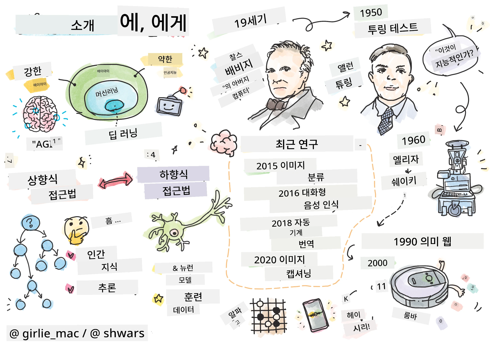
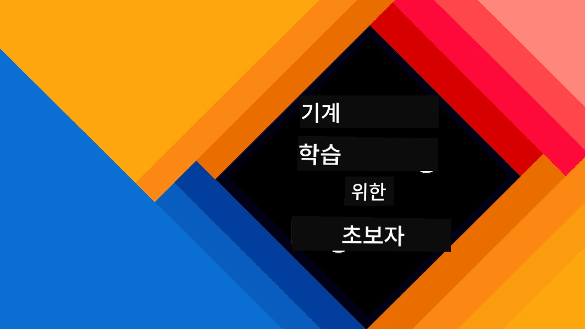
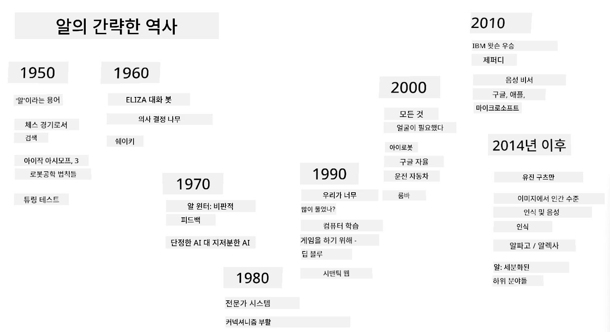
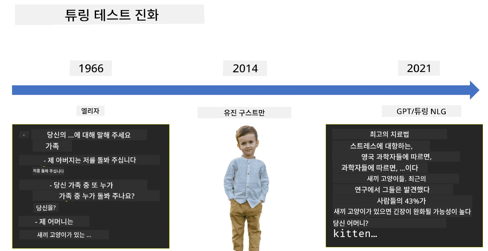

# AI 소개

> 스케치노트: [Tomomi Imura](https://twitter.com/girlie_mac)

## [강의 전 퀴즈](https://ff-quizzes.netlify.app/en/ai/quiz/1)

**인공지능**은 컴퓨터가 인간이 잘하는 일을 할 수 있도록 지능적인 행동을 보이게 만드는 방법을 연구하는 흥미로운 과학 분야입니다.

원래 컴퓨터는 [찰스 배비지](https://en.wikipedia.org/wiki/Charles_Babbage)에 의해 명확히 정의된 절차, 즉 알고리즘을 따라 숫자를 처리하기 위해 발명되었습니다. 현대의 컴퓨터는 19세기에 제안된 원래 모델보다 훨씬 더 발전했지만, 여전히 제어된 계산이라는 동일한 아이디어를 따릅니다. 따라서 목표를 달성하기 위해 필요한 정확한 단계의 순서를 알고 있다면 컴퓨터를 프로그래밍하여 작업을 수행할 수 있습니다.

> 사진 제공: [Vickie Soshnikova](http://twitter.com/vickievalerie)

> ✅ 사진에서 사람의 나이를 정의하는 것은 명시적으로 프로그래밍할 수 없는 작업입니다. 왜냐하면 우리가 머릿속에서 숫자를 떠올리는 방법을 정확히 알지 못하기 때문입니다.

---

그러나 우리가 명시적으로 해결 방법을 알지 못하는 작업도 있습니다. 예를 들어, 사진에서 사람의 나이를 판단하는 것을 생각해 보세요. 우리는 다양한 나이의 사람들을 많이 보았기 때문에 이를 학습하게 되지만, 우리가 어떻게 그것을 하는지 명확히 설명할 수 없으며, 컴퓨터를 프로그래밍하여 이를 수행하도록 만들 수도 없습니다. 이것이 바로 **인공지능**(AI)이 관심을 가지는 작업 유형입니다.

✅ AI를 활용하여 컴퓨터에 맡길 수 있는 작업을 생각해 보세요. 금융, 의학, 예술 분야를 고려해 보세요. 오늘날 이 분야들이 AI로부터 어떻게 혜택을 받고 있는지 생각해 보세요.

## 약한 AI와 강한 AI

약한 AI | 강한 AI
---------------------------------------|-------------------------------------
약한 AI는 특정 작업이나 제한된 작업 집합을 위해 설계되고 훈련된 AI 시스템을 의미합니다.|강한 AI, 또는 인공지능 일반(AGI)은 인간 수준의 지능과 이해력을 가진 AI 시스템을 의미합니다.
이러한 AI 시스템은 일반적인 지능을 가지지 않으며, 미리 정의된 작업을 수행하는 데 뛰어나지만 진정한 이해나 의식을 가지지 못합니다.|이러한 AI 시스템은 인간이 할 수 있는 모든 지적 작업을 수행하고, 다양한 분야에 적응하며, 일종의 의식이나 자기 인식을 가질 수 있습니다.
약한 AI의 예로는 Siri나 Alexa 같은 가상 비서, 스트리밍 서비스에서 사용되는 추천 알고리즘, 특정 고객 서비스 작업을 위해 설계된 챗봇 등이 있습니다.|강한 AI를 달성하는 것은 AI 연구의 장기적인 목표이며, 이는 다양한 작업과 맥락에서 추론, 학습, 이해, 적응할 수 있는 AI 시스템의 개발을 필요로 합니다.
약한 AI는 매우 전문화되어 있으며, 제한된 영역을 넘어서는 인간과 같은 인지 능력이나 일반적인 문제 해결 능력을 가지지 않습니다.|강한 AI는 현재 이론적인 개념이며, 아직 이 수준의 일반 지능에 도달한 AI 시스템은 없습니다.

자세한 내용은 **[인공지능 일반](https://en.wikipedia.org/wiki/Artificial_general_intelligence)**(AGI)을 참조하세요.

## 지능의 정의와 튜링 테스트

**[지능](https://en.wikipedia.org/wiki/Intelligence)**이라는 용어를 다룰 때의 문제 중 하나는 이 용어에 대한 명확한 정의가 없다는 점입니다. 지능이 **추상적 사고** 또는 **자기 인식**과 연결되어 있다고 주장할 수 있지만, 이를 제대로 정의할 수는 없습니다.

> [사진](https://unsplash.com/photos/75715CVEJhI) 제공: [Amber Kipp](https://unsplash.com/@sadmax) (Unsplash)

*지능*이라는 용어의 모호성을 이해하려면 "고양이는 지능적인가?"라는 질문에 답해 보세요. 이 질문에 대해 사람마다 다른 답을 내놓는 경향이 있습니다. 왜냐하면 이 주장이 참인지 아닌지를 증명할 수 있는 보편적으로 받아들여지는 테스트가 없기 때문입니다. 만약 그런 테스트가 있다고 생각한다면, 고양이에게 IQ 테스트를 시도해 보세요...

✅ 지능을 어떻게 정의하는지 잠시 생각해 보세요. 미로를 풀고 음식을 얻을 수 있는 까마귀는 지능적인가요? 아이는 지능적인가요?

---

AGI에 대해 이야기할 때, 우리가 진정으로 지능적인 시스템을 만들었는지 확인할 방법이 필요합니다. [앨런 튜링](https://en.wikipedia.org/wiki/Alan_Turing)은 **[튜링 테스트](https://en.wikipedia.org/wiki/Turing_test)**라는 방법을 제안했으며, 이는 지능의 정의로도 작용합니다. 이 테스트는 주어진 시스템을 본질적으로 지능적인 것, 즉 실제 인간과 비교합니다. 자동 비교는 컴퓨터 프로그램에 의해 우회될 수 있기 때문에, 우리는 인간 심문자를 사용합니다. 따라서 인간이 텍스트 기반 대화에서 실제 사람과 컴퓨터 시스템을 구별할 수 없다면, 그 시스템은 지능적이라고 간주됩니다.

> [Eugene Goostman](https://en.wikipedia.org/wiki/Eugene_Goostman)이라는 챗봇은 2014년 상트페테르부르크에서 개발되었으며, 영리한 성격 트릭을 사용하여 튜링 테스트를 거의 통과했습니다. 이 챗봇은 자신이 13세의 우크라이나 소년이라고 미리 밝혀 지식 부족과 텍스트의 일부 불일치를 설명했습니다. 이 챗봇은 5분간의 대화 후 심판의 30%를 설득하여 자신이 인간이라고 믿게 했습니다. 튜링은 2000년까지 기계가 이 기준을 통과할 수 있을 것이라고 믿었습니다. 그러나 이것이 우리가 지능적인 시스템을 만들었다는 것을 의미하거나 컴퓨터 시스템이 인간 심문자를 속였다는 것을 의미하지는 않습니다. 시스템이 인간을 속인 것이 아니라, 챗봇 제작자가 속인 것입니다!

✅ 챗봇과 대화하면서 인간과 대화하고 있다고 착각한 적이 있나요? 어떻게 설득당했나요?

## AI에 대한 다양한 접근 방식

컴퓨터가 인간처럼 행동하도록 하려면, 컴퓨터 내부에 우리의 사고 방식을 모델링해야 합니다. 따라서 인간이 지능적인 이유를 이해하려고 노력해야 합니다.

> 기계에 지능을 프로그래밍하려면, 우리의 의사 결정 과정이 어떻게 작동하는지 이해해야 합니다. 스스로를 조금만 성찰해 보면, 어떤 과정은 무의식적으로 일어난다는 것을 알 수 있습니다. 예를 들어, 우리는 고양이와 개를 구분할 수 있지만, 이에 대해 깊이 생각하지 않습니다. 반면, 다른 과정은 추론을 포함합니다.

이 문제에 접근하는 두 가지 가능한 방법이 있습니다:

상향식 접근법 (기호적 추론) | 하향식 접근법 (신경망)
---------------------------------------|-------------------------------------
상향식 접근법은 사람이 문제를 해결하기 위해 추론하는 방식을 모델링합니다. 이는 인간으로부터 **지식**을 추출하고, 이를 컴퓨터가 읽을 수 있는 형태로 표현하는 것을 포함합니다. 또한 컴퓨터 내부에서 **추론**을 모델링하는 방법을 개발해야 합니다. | 하향식 접근법은 인간 뇌의 구조를 모델링하며, 이는 **뉴런**이라는 단순한 단위로 구성됩니다. 각 뉴런은 입력의 가중 평균처럼 작동하며, **훈련 데이터**를 제공하여 뉴런 네트워크를 유용한 문제를 해결하도록 훈련시킬 수 있습니다.

또한 지능에 접근하는 다른 방법들도 있습니다:

* **발현적**, **시너지적** 또는 **다중 에이전트 접근법**은 많은 단순한 에이전트의 상호작용을 통해 복잡한 지능적 행동이 얻어질 수 있다는 사실에 기반합니다. [진화적 사이버네틱스](https://en.wikipedia.org/wiki/Global_brain#Evolutionary_cybernetics)에 따르면, 지능은 *메타시스템 전환* 과정에서 더 단순하고 반응적인 행동에서 *발현*될 수 있습니다.

* **진화적 접근법** 또는 **유전 알고리즘**은 진화 원칙에 기반한 최적화 과정입니다.

이러한 접근법은 나중에 강의에서 다룰 예정이지만, 지금은 상향식과 하향식이라는 두 가지 주요 방향에 초점을 맞추겠습니다.

### 상향식 접근법

**상향식 접근법**에서는 우리의 추론 방식을 모델링하려고 합니다. 우리가 추론할 때 우리의 생각을 따라갈 수 있기 때문에, 이 과정을 형식화하여 컴퓨터 내부에 프로그래밍하려고 합니다. 이를 **기호적 추론**이라고 합니다.

사람들은 의사 결정 과정을 안내하는 몇 가지 규칙을 머릿속에 가지고 있는 경향이 있습니다. 예를 들어, 의사가 환자를 진단할 때, 환자가 열이 있다는 것을 깨닫고, 따라서 신체 내부에 염증이 있을 수 있다고 판단할 수 있습니다. 의사는 특정 문제에 대해 많은 규칙을 적용하여 최종 진단을 내릴 수 있습니다.

이 접근법은 **지식 표현**과 **추론**에 크게 의존합니다. 인간 전문가로부터 지식을 추출하는 것은 가장 어려운 부분일 수 있습니다. 왜냐하면 의사는 많은 경우 특정 진단을 내리는 이유를 정확히 알지 못하기 때문입니다. 때로는 명시적인 사고 없이 해결책이 머릿속에 떠오르기도 합니다. 사진에서 사람의 나이를 판단하는 것과 같은 일부 작업은 지식 조작으로 전혀 축소될 수 없습니다.

### 하향식 접근법

대안적으로, 우리는 뇌 내부의 가장 단순한 요소인 뉴런을 모델링하려고 할 수 있습니다. 컴퓨터 내부에 **인공 신경망**을 구성한 다음, 예제를 제공하여 문제를 해결하도록 가르칠 수 있습니다. 이 과정은 신생아가 관찰을 통해 주변 환경을 배우는 방식과 유사합니다.

✅ 아기들이 어떻게 배우는지에 대해 조금 조사해 보세요. 아기 뇌의 기본 요소는 무엇인가요?

> | 기계 학습은?         |      |
> |--------------|-----------|
> | 일부 데이터를 기반으로 문제를 해결하도록 컴퓨터가 학습하는 인공지능의 한 부분을 **기계 학습**이라고 합니다. 이 강의에서는 고전적인 기계 학습을 다루지 않습니다. 별도의 [기계 학습 초보자용](http://aka.ms/ml-beginners) 커리큘럼을 참조하세요. |       |

## AI의 간략한 역사

인공지능은 20세기 중반에 하나의 분야로 시작되었습니다. 초기에는 기호적 추론이 우세한 접근법이었으며, 제한된 문제 영역에서 전문가처럼 행동할 수 있는 컴퓨터 프로그램인 전문가 시스템과 같은 중요한 성공을 거두었습니다. 그러나 곧 이러한 접근법이 잘 확장되지 않는다는 것이 명확해졌습니다. 전문가로부터 지식을 추출하고, 이를 컴퓨터에 표현하며, 지식 기반을 정확하게 유지하는 것은 매우 복잡하고 많은 경우 실용적이지 않을 정도로 비용이 많이 드는 작업임이 밝혀졌습니다. 이는 1970년대의 소위 [AI 겨울](https://en.wikipedia.org/wiki/AI_winter)로 이어졌습니다.

> 이미지 제공: [Dmitry Soshnikov](http://soshnikov.com)

시간이 지나면서 컴퓨팅 자원이 저렴해지고 더 많은 데이터가 사용 가능해지면서, 신경망 접근법은 컴퓨터 비전이나 음성 이해와 같은 많은 분야에서 인간과 경쟁하는 데 있어 뛰어난 성능을 보여주기 시작했습니다. 지난 10년 동안, 인공지능이라는 용어는 대부분 신경망의 동의어로 사용되었습니다. 우리가 듣는 대부분의 AI 성공 사례가 신경망에 기반하고 있기 때문입니다.

체스 프로그램 개발에서 접근법이 어떻게 변화했는지 관찰할 수 있습니다:

* 초기 체스 프로그램은 탐색에 기반했습니다. 프로그램은 주어진 수의 다음 움직임에 대해 상대방의 가능한 움직임을 명시적으로 추정하고, 몇 번의 움직임 내에서 달성할 수 있는 최적의 위치를 기반으로 최적의 움직임을 선택했습니다. 이는 소위 [알파-베타 가지치기](https://en.wikipedia.org/wiki/Alpha%E2%80%93beta_pruning) 탐색 알고리즘의 개발로 이어졌습니다.
* 탐색 전략은 가능한 움직임의 수가 제한된 게임 후반부에 잘 작동합니다. 그러나 게임 초반에는 탐색 공간이 방대하며, 알고리즘은 인간 플레이어 간의 기존 경기에서 학습함으로써 개선될 수 있습니다. 이후 실험에서는 소위 [사례 기반 추론](https://en.wikipedia.org/wiki/Case-based_reasoning)을 사용했으며, 프로그램은 게임의 현재 위치와 매우 유사한 사례를 지식 기반에서 찾았습니다.
* 인간 플레이어를 이기는 현대 프로그램은 신경망과 [강화 학습](https://en.wikipedia.org/wiki/Reinforcement_learning)에 기반하며, 프로그램은 오랜 시간 동안 스스로와 대결하며 자신의 실수로부터 학습함으로써 체스를 배우게 됩니다. 그러나 컴퓨터 프로그램은 훨씬 더 짧은 시간에 훨씬 더 많은 게임을 플레이할 수 있으므로 훨씬 더 빠르게 학습할 수 있습니다.

✅ AI가 플레이한 다른 게임들에 대해 조금 조사해 보세요.

마찬가지로, "대화형 프로그램"(튜링 테스트를 통과할 수 있는 프로그램)을 만드는 접근법이 어떻게 변화했는지 볼 수 있습니다:

* [Eliza](https://en.wikipedia.org/wiki/ELIZA)와 같은 초기 프로그램은 매우 간단한 문법 규칙과 입력 문장을 질문으로 재구성하는 방식에 기반했습니다.
* Cortana, Siri, Google Assistant와 같은 현대의 비서는 모두 음성을 텍스트로 변환하고 우리의 의도를 인식하기 위해 신경망을 사용하는 하이브리드 시스템이며, 이후 필요한 작업을 수행하기 위해 일부 추론이나 명시적 알고리즘을 사용합니다.
* 미래에는 대화 자체를 처리할 수 있는 완전한 신경망 기반 모델을 기대할 수 있습니다. 최근의 GPT 및 [Turing-NLG](https://www.microsoft.com/research/blog/turing-nlg-a-17-billion-parameter-language-model-by-microsoft) 계열의 신경망은 이 분야에서 큰 성공을 보여주고 있습니다.

> 이미지 제공: Dmitry Soshnikov, [사진](https://unsplash.com/photos/r8LmVbUKgns) 제공: [Marina Abrosimova](https://unsplash.com/@abrosimova_marina_foto), Unsplash

## 최근 AI 연구

신경망 연구의 최근 급격한 성장은 2010년경 대규모 공개 데이터셋이 이용 가능해지면서 시작되었습니다. 약 1,400만 개의 주석이 달린 이미지를 포함한 방대한 이미지 컬렉션인 [ImageNet](https://en.wikipedia.org/wiki/ImageNet)은 [ImageNet Large Scale Visual Recognition Challenge](https://image-net.org/challenges/LSVRC/)의 탄생을 이끌었습니다.

> 이미지 제공: [Dmitry Soshnikov](http://soshnikov.com)

2012년, [Convolutional Neural Networks](../4-ComputerVision/07-ConvNets/README.md)가 처음으로 이미지 분류에 사용되었으며, 이는 분류 오류를 크게 감소시키는 결과를 가져왔습니다(거의 30%에서 16.4%로 감소). 2015년, Microsoft Research의 ResNet 아키텍처는 [인간 수준의 정확도](https://doi.org/10.1109/ICCV.2015.123)를 달성했습니다.

그 이후로 신경망은 많은 작업에서 매우 성공적인 성과를 보여주었습니다:

---

연도 | 인간 수준 성과 달성
-----|--------
2015 | [이미지 분류](https://doi.org/10.1109/ICCV.2015.123)
2016 | [대화형 음성 인식](https://arxiv.org/abs/1610.05256)
2018 | [자동 기계 번역](https://arxiv.org/abs/1803.05567) (중국어-영어)
2020 | [이미지 캡션 생성](https://arxiv.org/abs/2009.13682)

최근 몇 년 동안 BERT와 GPT-3와 같은 대규모 언어 모델의 큰 성공을 목격했습니다. 이는 주로 일반 텍스트 데이터가 풍부하게 존재하여 모델이 텍스트의 구조와 의미를 학습하고, 일반 텍스트 컬렉션에서 사전 학습한 후 특정 작업에 맞게 모델을 전문화할 수 있었기 때문입니다. 우리는 이 과정에서 [자연어 처리](../5-NLP/README.md)에 대해 더 배울 것입니다.

## 🚀 도전 과제

인터넷을 탐색하며 AI가 가장 효과적으로 사용되고 있는 곳이 어디인지 여러분의 의견을 정리해 보세요. 지도 앱, 음성-텍스트 서비스, 비디오 게임 중 어디일까요? 해당 시스템이 어떻게 구축되었는지 조사해 보세요.

## [강의 후 퀴즈](https://ff-quizzes.netlify.app/en/ai/quiz/2)

## 복습 및 자기 학습

[이 강의](https://github.com/microsoft/ML-For-Beginners/tree/main/1-Introduction/2-history-of-ML)를 읽으며 AI와 ML의 역사를 복습하세요. 이 강의 또는 이전 강의의 스케치노트에서 하나의 요소를 선택하여 더 깊이 연구하고, 그것의 진화에 영향을 준 문화적 맥락을 이해해 보세요.

**과제**: [게임 잼](assignment.md)

---

<!-- CO-OP TRANSLATOR DISCLAIMER START -->
**면책 조항**:  
이 문서는 AI 번역 서비스 [Co-op Translator](https://github.com/Azure/co-op-translator)를 사용하여 번역되었습니다. 정확성을 위해 노력하고 있지만, 자동 번역에는 오류나 부정확성이 포함될 수 있습니다. 원본 문서를 해당 언어로 작성된 상태에서 권위 있는 자료로 간주해야 합니다. 중요한 정보의 경우, 전문적인 인간 번역을 권장합니다. 이 번역 사용으로 인해 발생하는 오해나 잘못된 해석에 대해 당사는 책임을 지지 않습니다.
<!-- CO-OP TRANSLATOR DISCLAIMER END -->