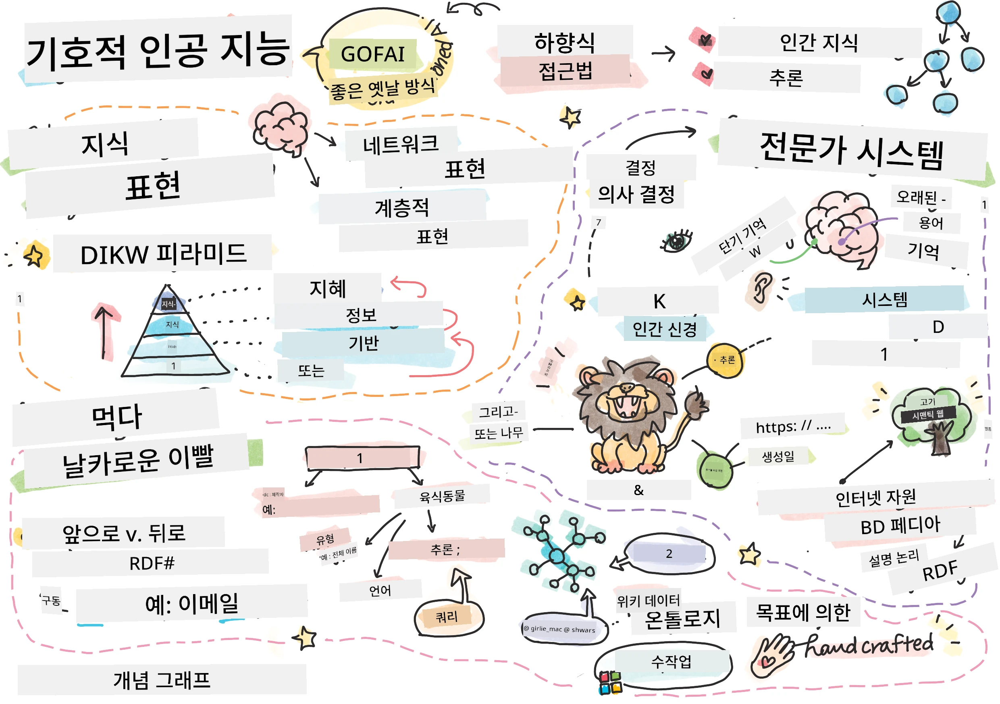
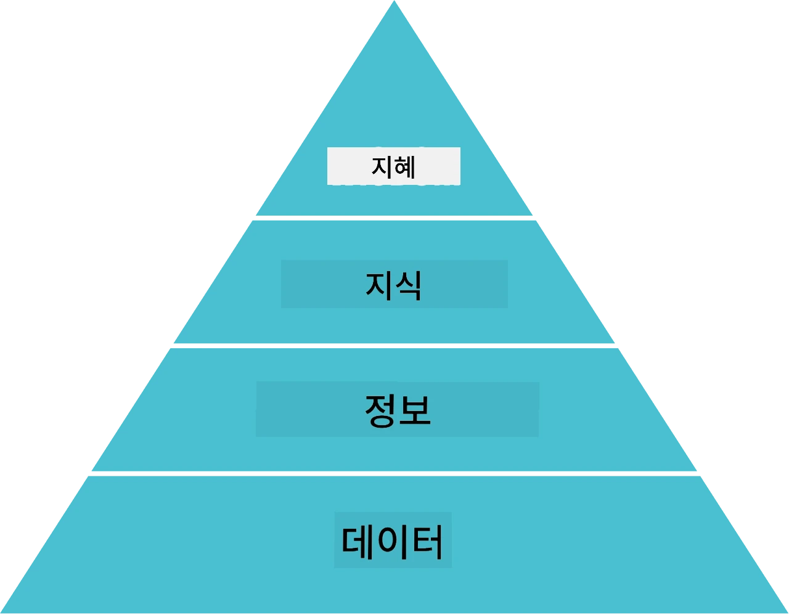
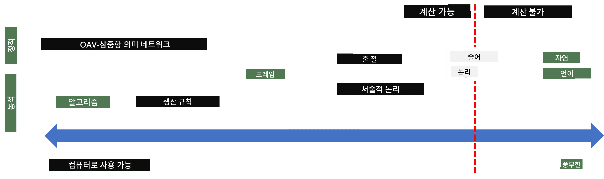
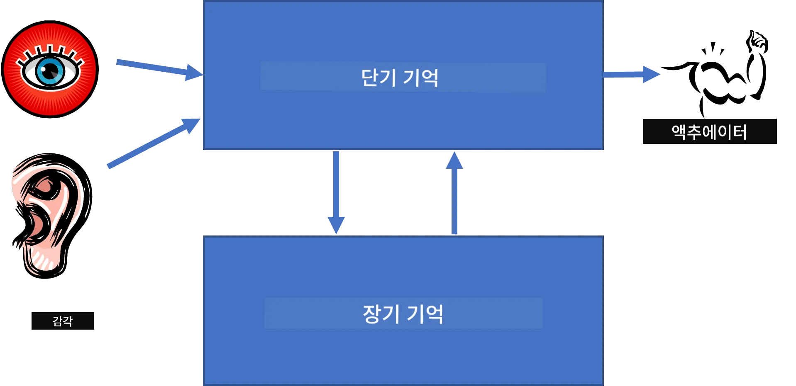
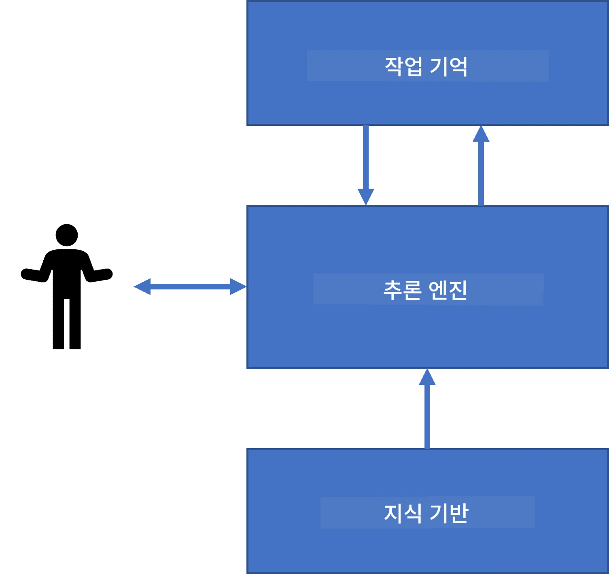
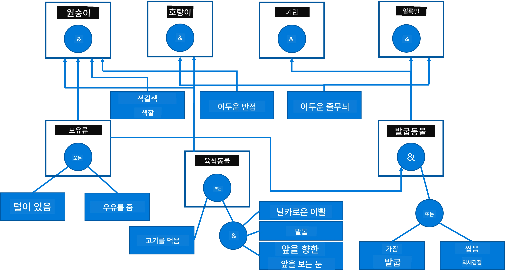
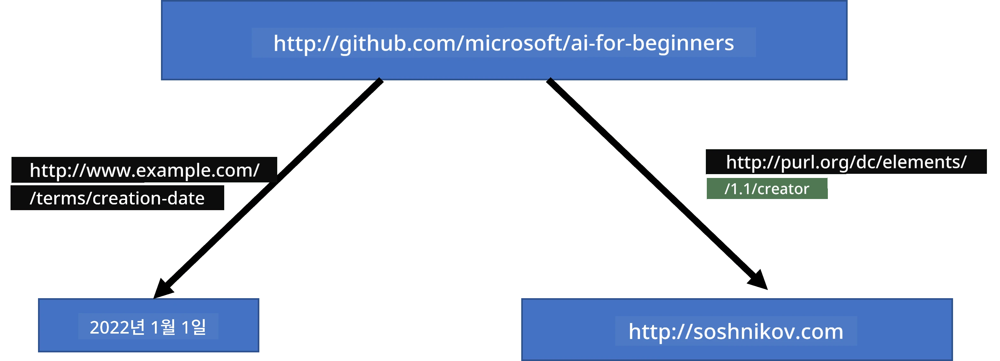
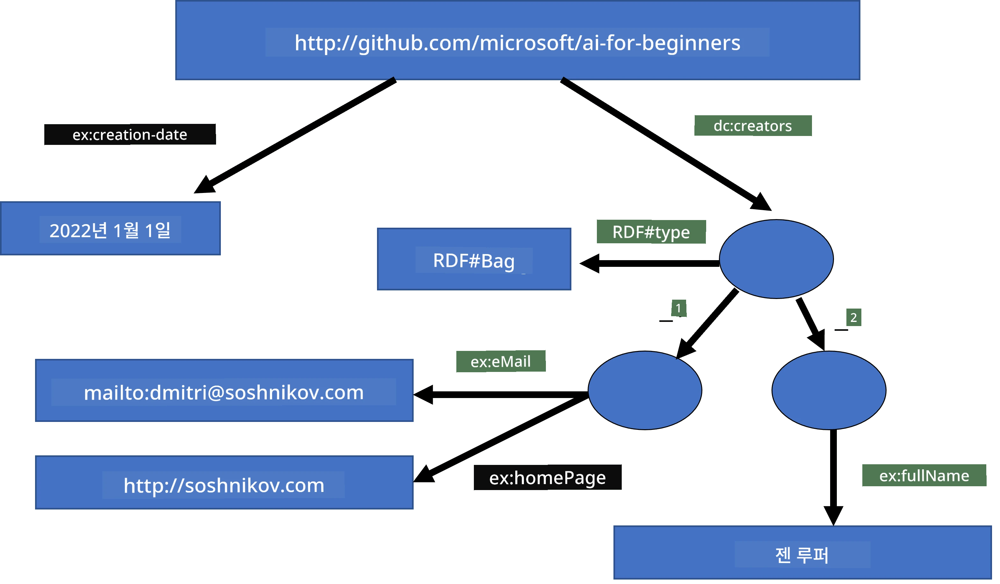

# 지식 표현 및 전문가 시스템



> 스케치노트 작성자: [Tomomi Imura](https://twitter.com/girlie_mac)

인공 지능에 대한 탐구는 인간처럼 세상을 이해하기 위한 지식의 탐색에 기반합니다. 하지만 이것을 어떻게 해낼 수 있을까요?

## [사전 강의 퀴즈](https://ff-quizzes.netlify.app/en/ai/quiz/3)

AI 초기에는 지능 시스템을 만들기 위한 탑다운 접근법(이전 수업에서 논의한)이 널리 쓰였습니다. 그 아이디어는 사람으로부터 지식을 추출하여 기계가 읽을 수 있는 형식으로 만든 후, 이를 자동으로 문제 해결에 활용하는 것이었습니다. 이 접근법은 두 가지 큰 개념에 기반합니다:

* 지식 표현
* 추론

## 지식 표현

상징적 AI에서 중요한 개념 중 하나가 **지식**입니다. 지식을 *정보*나 *데이터*와 구분하는 것이 중요합니다. 예를 들어, 책은 지식을 담고 있다고 말할 수 있는데, 책을 공부하면 전문가가 될 수 있기 때문입니다. 하지만 실제로 책이 담고 있는 것은 *데이터*라고 하며, 책을 읽고 이 데이터를 우리의 세계 모델에 통합함으로써 이 데이터를 지식으로 변환합니다.

> ✅ **지식**은 우리의 머릿속에 들어 있고 세상에 대한 이해를 나타내는 것입니다. 이는 우리가 받은 다양한 정보를 적극적으로 배우는 **학습** 과정에서 얻어진 것으로, 세계에 대한 우리의 능동적인 모델에 이 정보를 통합하는 과정을 포함합니다.

대부분의 경우 지식을 엄밀히 정의하지 않고, [DIKW 피라미드](https://en.wikipedia.org/wiki/DIKW_pyramid)를 통해 관련 개념들과 정렬합니다. 피라미드에는 다음과 같은 개념들이 포함됩니다:

* **데이터**는 물리적 매체에 표현된 것으로, 예를 들어 쓰여진 텍스트나 말한 단어 등이 있습니다. 데이터는 인간과 독립적으로 존재하며, 사람들 사이에서 전달될 수 있습니다.
* **정보**는 데이터를 머릿속에서 해석하는 방식입니다. 예를 들어, "컴퓨터"라는 단어를 들으면 그것이 무엇인지에 대해 어느 정도 이해하게 됩니다.
* **지식**은 정보를 우리 세계 모델에 통합한 것입니다. 예를 들어, 컴퓨터가 무엇인지 알게 되면 어떻게 작동하는지, 비용은 얼마인지, 무엇에 사용되는지에 대한 아이디어를 갖게 됩니다. 이러한 상호 연관된 개념들의 네트워크가 지식을 형성합니다.
* **지혜**는 세상을 이해하는 또 다른 수준이며, 이는 *메타 지식*으로, 예를 들어 지식을 언제 어떻게 사용해야 하는지에 대한 개념을 나타냅니다.



*이미지 출처: [위키피디아](https://commons.wikimedia.org/w/index.php?curid=37705247), Longlivetheux 저작, CC BY-SA 4.0*

따라서, **지식 표현** 문제는 지식을 컴퓨터 내부에 데이터 형태로 효과적으로 표현하여 자동으로 활용할 수 있도록 하는 방법을 찾는 문제로 볼 수 있습니다. 이는 다음과 같은 스펙트럼으로 나타낼 수 있습니다:



> 이미지 출처: [Dmitry Soshnikov](http://soshnikov.com)

* 왼쪽에는 컴퓨터가 효율적으로 사용할 수 있는 매우 단순한 종류의 지식 표현이 있습니다. 가장 단순한 형태는 알고리즘적 표현으로, 지식을 컴퓨터 프로그램으로 나타내는 것입니다. 하지만 이것은 유연하지 않아 지식을 표현하는 최선의 방법은 아닙니다. 우리의 머릿속 지식은 종종 비알고리즘적입니다.
* 오른쪽에는 자연어와 같은 표현이 있는데, 가장 강력하지만 자동 추론에는 사용할 수 없습니다.

> ✅ 잠깐 생각해보세요. 여러분은 머릿속의 지식을 어떻게 표현하고 메모로 변환하나요? 기억 유지에 특히 효과적인 형식이 있나요?

## 컴퓨터 지식 표현 분류

다양한 컴퓨터 지식 표현 방법은 다음과 같이 분류할 수 있습니다:

* **네트워크 표현**은 우리 머릿속에 상호 연관된 개념의 네트워크가 존재한다는 점에 기반합니다. 컴퓨터 내에서 그래프로 같은 네트워크를 재현할 수 있으며, 이를 **시맨틱 네트워크**라고 합니다.

1. **객체-속성-값 삼중항** 또는 **속성-값 쌍**. 그래프는 노드와 엣지 목록으로 컴퓨터 내 표현할 수 있으므로, 시맨틱 네트워크는 객체, 속성, 값을 포함하는 삼중항 목록으로 표현할 수 있습니다. 예를 들어, 프로그래밍 언어에 대해 다음과 같은 삼중항을 만듭니다:

객체 | 속성 | 값
-------|-----------|------
Python | is | Untyped-Language
Python | invented-by | Guido van Rossum
Python | block-syntax | indentation
Untyped-Language | doesn't have | type definitions

> ✅ 삼중항이 다른 종류의 지식을 표현하는 데 어떻게 사용될 수 있을지 생각해보세요.

2. **계층적 표현**은 우리가 머릿속에 객체 계층을 만드는 경향에 집중합니다. 예를 들어, 카나리아는 새라는 것을 알고, 모든 새는 날개가 있다는 것도 압니다. 또한 카나리아의 보통 색깔과 비행 속도에 대해서도 어느 정도 알고 있습니다.

   - **프레임 표현**은 각 객체 또는 객체 클래스를 **프레임**으로 나타내며, 프레임은 **슬롯**을 포함합니다. 슬롯에는 기본값, 값 제한, 또는 값을 얻기 위해 호출할 수 있는 저장된 절차가 있을 수 있습니다. 모든 프레임은 객체 지향 프로그래밍의 객체 계층과 유사한 계층 구조를 이룹니다.
   - **시나리오**는 시간에 따라 전개될 수 있는 복잡한 상황을 나타내는 특별한 프레임 종류입니다.

**Python**

슬롯 | 값 | 기본값 | 구간 |
-----|-------|---------------|----------|
Name | Python | | |
Is-A | Untyped-Language | | |
Variable Case | | CamelCase | |
Program Length | | | 5-5000 lines |
Block Syntax | Indent | | |

3. **절차적 표현**은 특정 조건이 발생했을 때 실행할 수 있는 액션 목록으로 지식을 표현하는 방법입니다.
   - 생산 규칙은 if-then 문장으로, 결론을 도출할 수 있게 해줍니다. 예를 들어, 의사에게 "만약 환자가 고열이 있거나 혈액 검사에서 C-반응성 단백질 수치가 높으면 염증이 있다"는 규칙이 있을 수 있습니다. 조건 하나가 만족되면 염증에 대해 결론을 내리고, 이후 추론에 사용할 수 있습니다.
   - 알고리즘은 절차적 표현의 다른 형태로 볼 수 있지만, 지식 기반 시스템에서 직접 사용되는 경우는 거의 없습니다.

4. **논리**는 원래 아리스토텔레스가 보편적인 인간 지식을 표현하기 위해 제안한 방법입니다.
   - 술어 논리는 수학 이론으로서 계산 가능성이 너무 높아, 일부 부분집합만 일반적으로 사용됩니다. 예를 들어 Prolog에서 사용하는 Horn 절이 있습니다.
   - 기술 논리는 계층 구조와 분산된 지식 표현(예: *시맨틱 웹*)에 대해 표현하고 추론하기 위해 사용되는 논리 시스템 가족입니다.

## 전문가 시스템

상징적 AI의 초기 성공 중 하나는 **전문가 시스템**이었습니다. 전문가 시스템은 제한된 문제 영역에서 전문가처럼 행동하도록 설계된 컴퓨터 시스템입니다. 이는 한 명 이상의 인간 전문가로부터 추출한 **지식 기반**을 바탕으로 하고, 그 위에서 추론을 수행하는 **추론 엔진**을 포함합니다.

 | 
---------------------------------------------|------------------------------------------------
간략화된 인간 신경 시스템 구조 | 지식 기반 시스템 아키텍처

전문가 시스템은 인간 추론 시스템처럼 **단기 기억**과 **장기 기억**을 포함합니다. 마찬가지로 지식 기반 시스템에서는 다음 구성 요소를 구분합니다:

* **문제 기억**: 현재 해결 중인 문제에 대한 지식을 담고 있습니다. 예를 들어 환자의 체온, 혈압, 염증 여부 등이 해당합니다. 이 지식은 **정적 지식**이라고도 하는데, 이는 현재 문제에 대해 알고 있는 내용의 스냅샷, 즉 *문제 상태*를 포함하기 때문입니다.
* **지식 기반**: 문제 영역에 관한 장기 지식을 나타냅니다. 인간 전문가로부터 수동으로 추출하며 상담마다 변하지 않습니다. 문제 상태 간 탐색을 가능하게 하므로 **동적 지식**이라고도 불립니다.
* **추론 엔진**: 문제 상태 공간 탐색 과정을 조율하며, 필요할 때 사용자에게 질문합니다. 각 상태에 적용할 올바른 규칙을 찾는 역할도 합니다.

예를 들어, 동물의 신체 특성에 기반해 동물을 판별하는 전문가 시스템을 고려해보겠습니다:



> 이미지 출처: [Dmitry Soshnikov](http://soshnikov.com)

이 다이어그램은 **AND-OR 트리**라고 불리며, 생산 규칙 세트를 그래픽으로 나타낸 것입니다. 전문가로부터 지식을 추출할 때 초기 단계에서 트리를 그리는 것이 유용합니다. 컴퓨터 내부에 지식을 표현할 때는 규칙을 사용하는 것이 더 편리합니다:

```
IF the animal eats meat
OR (animal has sharp teeth
    AND animal has claws
    AND animal has forward-looking eyes
) 
THEN the animal is a carnivore
```

규칙의 왼쪽 조건과 동작은 본질적으로 객체-속성-값(OAV) 삼중항임을 알 수 있습니다. **작업 기억**은 현재 해결 중인 문제에 해당하는 OAV 삼중항 집합을 포함합니다. **규칙 엔진**은 조건이 만족되는 규칙을 찾아 적용하며, 작업 기억에 새로운 삼중항을 추가합니다.

> ✅ 관심 분야에 대해 자신의 AND-OR 트리를 만들어 보세요!

### 순방향 추론 vs 역방향 추론

위에서 설명한 과정은 **순방향 추론**이라고 합니다. 이는 작업 기억에 초기 문제 데이터가 주어지고, 다음 추론 루프를 실행합니다:

1. 목표 속성이 작업 기억에 있으면 - 중단하고 결과를 반환
2. 현재 조건이 만족되는 모든 규칙을 찾아 **충돌 집합**을 얻음
3. **충돌 해결**을 수행하여 이 단계에서 실행할 한 규칙을 선택. 충돌 해결 전략에는 다음이 있을 수 있음:
   - 지식 기반에서 처음 적용 가능한 규칙 선택
   - 임의 규칙 선택
   - *더 구체적인* 규칙 선택, 즉 왼쪽 조건(LHS)을 가장 많이 충족하는 규칙 선택
4. 선택한 규칙 적용 후 문제 상태에 새로운 지식 삽입
5. 1단계부터 반복

하지만 어떤 경우에는 문제에 대한 지식이 전혀 없는 상태에서 시작해 결론에 도달하는 질문을 하고 싶을 수 있습니다. 예를 들어, 의료 진단 시 환자진단 전에 모든 검사를 미리 하지 않고, 결정할 필요가 있을 때 검사를 수행합니다.

이 과정은 **역방향 추론**으로 모델링할 수 있습니다. 이는 우리가 구하려는 **목표** 속성 값을 기반으로 합니다:

1. 목표 값(즉 오른쪽 조건 RHS에 목표가 있는 규칙)과 관련된 모든 규칙 선택 - 충돌 집합 형성
2. 해당 속성에 규칙이 없거나 사용자에게 값을 물어야 한다는 규칙이 있으면 사용자에게 질문, 그렇지 않으면:
3. 충돌 해결 전략으로 한 규칙을 선택해 *가설*로 설정 - 이를 증명해봄
4. 선택한 규칙 왼쪽 조건(LHS)에 있는 모든 속성을 목표로 설정하고 재귀적으로 증명 시도
5. 과정이 실패하면 3단계에서 다른 규칙 사용

> ✅ 어떤 상황에서 순방향 추론이 더 적합할까요? 역방향 추론은 어떻게 다를까요?

### 전문가 시스템 구현

전문가 시스템은 다양한 도구로 구현할 수 있습니다:

* 고급 프로그래밍 언어로 직접 프로그래밍. 하지만 지식 기반 시스템의 주요 장점인 지식과 추론 분리가 어렵고, 문제 영역 전문가가 추론 세부사항을 모른 채 규칙을 작성하기 어렵기 때문에 최선의 방법은 아닙니다.
* **전문가 시스템 셸** 사용, 즉 지식 표현 언어를 활용해 지식을 채우도록 설계된 시스템.

## ✍️ 실습: 동물 추론

순방향 및 역방향 추론 전문가 시스템 구현 예제는 [Animals.ipynb](https://github.com/microsoft/AI-For-Beginners/blob/main/lessons/2-Symbolic/Animals.ipynb)를 참고하세요.

> **참고**: 이 예제는 다소 단순하며 전문가 시스템의 기본 아이디어를 제공합니다. 실제로 전문가 시스템을 구축하면 약 200개 이상의 규칙을 넘어서면서부터 "지능적인" 동작이 나타나기 시작합니다. 그 때부터는 모든 규칙을 머릿속에 담기 어려워지고, 시스템이 어떻게 특정 결정을 내리나 궁금해질 수 있습니다. 하지만 지식 기반 시스템의 중요한 특성은 어떤 결정이 어떻게 내려졌는지 **명확하게 설명할 수 있다는 점**입니다.

## 온톨로지와 시맨틱 웹

20세기 말에는 지식 표현을 이용해 인터넷 자원에 주석을 달아 매우 구체적인 질의에도 맞는 자원을 검색할 수 있게 하는 시도가 있었습니다. 이를 **시맨틱 웹**이라고 하며, 여러 개념에 기반합니다:

- **[기술 논리](https://en.wikipedia.org/wiki/Description_logic)**(DL)을 기반으로 한 특별한 지식 표현. 이는 객체들 간 계층 구조를 만들며 속성을 표현하는 프레임 지식 표현과 비슷하지만, 형식 논리 의미론과 추론을 갖추고 있습니다. 표현력과 알고리즘적 계산 복잡성 사이에 균형을 맞춘 DL 종류가 다양하게 존재합니다.
- 전 세계적으로 모든 개념에 글로벌 URI 식별자를 부여하여, 인터넷 전체에 걸친 지식 계층을 만드는 분산 지식 표현.
- 지식 기술을 위한 XML 기반 언어 패밀리: RDF(Resource Description Framework), RDFS(RDF Schema), OWL(Ontology Web Language).

시맨틱 웹의 핵심 개념 중 하나는 **온톨로지** 개념입니다. 이는 어떤 공식적인 지식 표현을 사용하여 문제 영역을 명확하게 명세하는 것을 의미합니다. 가장 단순한 온톨로지는 문제 영역 내 개체들의 계층 구조일 수 있지만, 더 복잡한 온톨로지는 추론에 사용할 수 있는 규칙들을 포함합니다.

시맨틱 웹에서는 모든 표현이 삼중항(triplet)을 기반으로 합니다. 각 객체와 각 관계는 URI로 고유하게 식별됩니다. 예를 들어, 이 AI 커리큘럼이 2022년 1월 1일에 Dmitry Soshnikov에 의해 개발되었다는 사실을 표현하려면 다음과 같은 삼중항을 사용할 수 있습니다:



```
http://github.com/microsoft/ai-for-beginners http://www.example.com/terms/creation-date “Jan 1, 2022”
http://github.com/microsoft/ai-for-beginners http://purl.org/dc/elements/1.1/creator http://soshnikov.com
```

> ✅ 여기서 `http://www.example.com/terms/creation-date` 와 `http://purl.org/dc/elements/1.1/creator` 는 *작성자*와 *작성 날짜* 개념을 표현하는 잘 알려져 있고 보편적으로 수용된 URI입니다.

더 복잡한 경우, 작성자 목록을 정의하고 싶다면 RDF에 정의된 일부 데이터 구조를 사용할 수 있습니다.



> 위 다이어그램은 [Dmitry Soshnikov](http://soshnikov.com) 제공.

시맨틱 웹 구축의 진전은 검색 엔진과 자연어 처리 기술의 발전으로 다소 둔화되었습니다. 이 기술들은 텍스트에서 구조화된 데이터를 추출할 수 있게 해줍니다. 하지만 일부 분야에서는 여전히 온톨로지와 지식 베이스를 유지하려는 상당한 노력이 있습니다. 주목할 만한 몇 가지 프로젝트는 다음과 같습니다:

* [WikiData](https://wikidata.org/)는 위키백과와 연결된 기계 판독 가능한 지식 베이스 모음입니다. 대부분의 데이터는 위키백과 페이지 내 구조화된 콘텐츠 조각인 *InfoBoxes*에서 추출되었습니다. SPARQL이라는 시맨틱 웹을 위한 특수 쿼리 언어로 [wikidata를 쿼리](https://query.wikidata.org/)할 수 있습니다. 아래는 인간들 사이에서 가장 인기 있는 눈 색깔을 보여주는 샘플 쿼리입니다:

```sparql
#defaultView:BubbleChart
SELECT ?eyeColorLabel (COUNT(?human) AS ?count)
WHERE
{
  ?human wdt:P31 wd:Q5.       # human instance-of homo sapiens
  ?human wdt:P1340 ?eyeColor. # human eye-color ?eyeColor
  SERVICE wikibase:label { bd:serviceParam wikibase:language "en". }
}
GROUP BY ?eyeColorLabel
```

* [DBpedia](https://www.dbpedia.org/) 역시 WikiData와 유사한 노력입니다.

> ✅ 온톨로지를 직접 만들거나 기존 온톨로지를 열어보고 싶다면, 훌륭한 시각적 온톨로지 편집기인 [Protégé](https://protege.stanford.edu/)를 이용해보세요. 다운로드하거나 온라인으로 사용할 수 있습니다.


*Web Protégé 편집기로 Romanov Family 온톨로지를 연 모습. 스크린샷 제공: Dmitry Soshnikov*

## ✍️ 연습: 가족 온톨로지

시맨틱 웹 기술을 사용해 가족 관계를 추론하는 예시를 보려면 [FamilyOntology.ipynb](https://github.com/Ezana135/AI-For-Beginners/blob/main/lessons/2-Symbolic/FamilyOntology.ipynb)를 참조하세요. 우리는 일반적인 GEDCOM 형식으로 표현된 가족 트리와 가족 관계 온톨로지를 사용해 주어진 개체 집합에 대한 모든 가족 관계 그래프를 구축할 것입니다.

## Microsoft Concept Graph

대부분의 경우, 온톨로지는 수작업으로 신중하게 생성됩니다. 그러나 비정형 데이터, 예를 들어 자연어 텍스트에서 온톨로지를 **추출**하는 것도 가능합니다.

이런 시도 중 하나가 Microsoft Research에서 이루어졌으며, [Microsoft Concept Graph](https://blogs.microsoft.com/ai/microsoft-researchers-release-graph-that-helps-machines-conceptualize/?WT.mc_id=academic-77998-cacaste)로 결실을 맺었습니다.

이 그래프는 `is-a` 상속 관계를 이용해 그룹화된 방대한 개체 모음입니다. "마이크로소프트가 무엇인가?"라는 질문에 "0.87 확률로 회사이고, 0.75 확률로 브랜드"라는 식으로 답할 수 있도록 합니다.

그래프는 REST API 또는 모든 엔티티 쌍을 나열한 대용량 텍스트 파일 형태로 이용 가능합니다.

## ✍️ 연습: 개념 그래프

[MSConceptGraph.ipynb](https://github.com/microsoft/AI-For-Beginners/blob/main/lessons/2-Symbolic/MSConceptGraph.ipynb) 노트북을 시도해보고 마이크로소프트 개념 그래프를 사용해 뉴스 기사를 여러 범주로 분류하는 방법을 살펴보세요.

## 결론

오늘날 AI는 흔히 *머신러닝* 또는 *신경망*의 동의어로 간주됩니다. 그러나 인간은 명시적 추론도 수행하는데, 이는 현재 신경망이 다루지 못하는 영역입니다. 실제 프로젝트에서는 명시적 추론이 설명을 요구하거나 시스템 행동을 통제 가능한 방식으로 수정해야 하는 작업에 여전히 사용됩니다.

## 🚀 도전 과제

이 강의와 연계된 Family Ontology 노트북에서 다른 가족 관계를 실험해볼 기회가 있습니다. 가족 트리 내 사람들 간에 새로운 연결을 발견해 보세요.

## [강의 후 퀴즈](https://ff-quizzes.netlify.app/en/ai/quiz/4)

## 복습 및 자습

인터넷에서 인간이 지식을 정량화하고 체계화하려 노력한 분야를 조사해보세요. 블룸의 분류학(Bloom's Taxonomy)을 살펴보고, 인간이 세상을 이해하려 시도했던 역사적 과정을 공부해보세요. 생물 분류학을 만든 Linnaeus의 작업을 탐구하고, Dmitri Mendeleev가 화학 원소를 기술하고 분류한 방식을 관찰하세요. 또 어떤 흥미로운 사례를 찾을 수 있나요?

**과제**: [온톨로지 구축하기](assignment.md)

---

<!-- CO-OP TRANSLATOR DISCLAIMER START -->
**면책 조항**:  
이 문서는 AI 번역 서비스 [Co-op Translator](https://github.com/Azure/co-op-translator)를 사용하여 번역되었습니다. 정확성을 위해 노력하고 있지만, 자동 번역에는 오류나 부정확한 부분이 있을 수 있음을 유의하시기 바랍니다. 원본 문서는 원어로 된 문서가 권위 있는 자료로 간주되어야 합니다. 중요한 정보에 대해서는 전문적인 사람이 번역한 자료를 이용하시는 것을 권장합니다. 본 번역 사용으로 인해 발생하는 어떠한 오해나 잘못된 해석에 대해서도 당사는 책임을 지지 않습니다.
<!-- CO-OP TRANSLATOR DISCLAIMER END -->