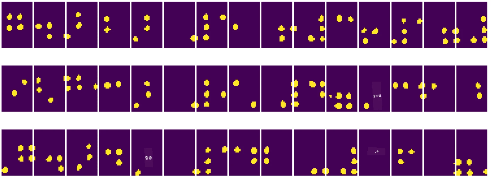
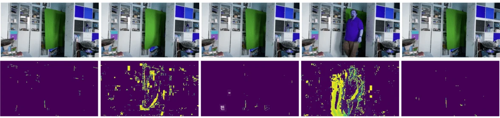

# 컴퓨터 비전 소개

[컴퓨터 비전](https://wikipedia.org/wiki/Computer_vision)은 디지털 이미지를 통해 컴퓨터가 고수준의 이해를 할 수 있도록 하는 학문입니다. 이 정의는 매우 광범위한데, *이해*라는 것이 사진에서 객체를 찾는 것(**객체 탐지**), 무슨 일이 일어나고 있는지 파악하는 것(**이벤트 탐지**), 사진을 텍스트로 설명하는 것, 또는 3D로 장면을 재구성하는 것 등 다양한 의미를 가질 수 있기 때문입니다. 사람의 이미지를 다루는 특별한 작업도 있습니다. 예를 들어, 나이와 감정 추정, 얼굴 탐지 및 식별, 3D 자세 추정 등이 있습니다.

## [강의 전 퀴즈](https://ff-quizzes.netlify.app/en/ai/quiz/11)

컴퓨터 비전의 가장 간단한 작업 중 하나는 **이미지 분류**입니다.

컴퓨터 비전은 종종 AI의 한 분야로 간주됩니다. 오늘날 대부분의 컴퓨터 비전 작업은 신경망을 사용하여 해결됩니다. 이 섹션에서는 컴퓨터 비전에 사용되는 특별한 유형의 신경망인 [합성곱 신경망](../07-ConvNets/README.md)에 대해 더 배울 것입니다.

하지만 이미지를 신경망에 전달하기 전에, 많은 경우 알고리즘 기법을 사용하여 이미지를 개선하는 것이 합리적입니다.

이미지 처리를 위한 여러 Python 라이브러리가 있습니다:

* **[imageio](https://imageio.readthedocs.io/en/stable/)**: 다양한 이미지 형식을 읽고/쓰는 데 사용할 수 있습니다. 또한 비디오 프레임을 이미지로 변환하는 데 유용한 ffmpeg를 지원합니다.
* **[Pillow](https://pillow.readthedocs.io/en/stable/index.html)**: PIL로도 알려져 있으며, 이미지 변형, 팔레트 조정 등 몇 가지 이미지 조작을 지원하는 더 강력한 라이브러리입니다.
* **[OpenCV](https://opencv.org/)**: C++로 작성된 강력한 이미지 처리 라이브러리로, 이미지 처리의 *사실상 표준*이 되었습니다. Python 인터페이스도 제공합니다.
* **[dlib](http://dlib.net/)**: 여러 머신러닝 알고리즘을 구현한 C++ 라이브러리로, 일부 컴퓨터 비전 알고리즘도 포함되어 있습니다. Python 인터페이스를 제공하며, 얼굴 및 얼굴 랜드마크 탐지와 같은 어려운 작업에 사용할 수 있습니다.

## OpenCV

[OpenCV](https://opencv.org/)는 이미지 처리의 *사실상 표준*으로 간주됩니다. C++로 구현된 많은 유용한 알고리즘을 포함하고 있습니다. Python에서도 OpenCV를 호출할 수 있습니다.

OpenCV를 배우기에 좋은 자료는 [이 Learn OpenCV 강좌](https://learnopencv.com/getting-started-with-opencv/)입니다. 이 커리큘럼에서는 OpenCV를 배우는 것이 목표가 아니라, OpenCV를 사용할 수 있는 예제와 방법을 보여주는 것이 목표입니다.

### 이미지 로드

Python에서 이미지는 NumPy 배열로 편리하게 표현할 수 있습니다. 예를 들어, 320x200 픽셀 크기의 그레이스케일 이미지는 200x320 배열에 저장되며, 동일한 크기의 컬러 이미지는 200x320x3 형태(3개의 색상 채널)로 저장됩니다. 이미지를 로드하려면 다음 코드를 사용할 수 있습니다:

```python
import cv2
import matplotlib.pyplot as plt

im = cv2.imread('image.jpeg')
plt.imshow(im)
```

전통적으로 OpenCV는 컬러 이미지를 BGR(파랑-초록-빨강) 인코딩을 사용하지만, Python의 다른 도구들은 더 일반적인 RGB(빨강-초록-파랑)를 사용합니다. 이미지를 올바르게 보이게 하려면 NumPy 배열에서 차원을 교환하거나 OpenCV 함수를 호출하여 RGB 색상 공간으로 변환해야 합니다:

```python
im = cv2.cvtColor(im,cv2.COLOR_BGR2RGB)
```

`cvtColor` 함수는 이미지를 그레이스케일로 변환하거나 HSV(색상-채도-명도) 색상 공간으로 변환하는 등 다른 색상 공간 변환에도 사용할 수 있습니다.

OpenCV를 사용하여 비디오를 프레임별로 로드할 수도 있습니다. 예제는 [OpenCV 노트북](OpenCV.ipynb)에 나와 있습니다.

### 이미지 처리

이미지를 신경망에 전달하기 전에 몇 가지 전처리 단계를 적용할 수 있습니다. OpenCV는 다음과 같은 작업을 수행할 수 있습니다:

* `im = cv2.resize(im, (320,200),interpolation=cv2.INTER_LANCZOS)`를 사용하여 이미지를 **크기 조정**
* `im = cv2.medianBlur(im,3)` 또는 `im = cv2.GaussianBlur(im, (3,3), 0)`를 사용하여 이미지를 **블러 처리**
* 이미지의 **밝기와 대비**를 변경하려면 [이 Stackoverflow 노트](https://stackoverflow.com/questions/39308030/how-do-i-increase-the-contrast-of-an-image-in-python-opencv)를 참고하여 NumPy 배열 조작을 사용할 수 있습니다.
* `cv2.threshold`/`cv2.adaptiveThreshold` 함수를 호출하여 [임계값 처리](https://docs.opencv.org/4.x/d7/d4d/tutorial_py_thresholding.html)를 사용하는 것이 밝기나 대비 조정보다 선호될 수 있습니다.
* 이미지에 다양한 [변환](https://docs.opencv.org/4.5.5/da/d6e/tutorial_py_geometric_transformations.html)을 적용:
    - **[아핀 변환](https://docs.opencv.org/4.5.5/d4/d61/tutorial_warp_affine.html)**: 이미지에서 세 점의 원본 및 대상 위치를 알고 있을 때 회전, 크기 조정, 왜곡을 결합해야 할 경우 유용합니다. 아핀 변환은 평행선을 유지합니다.
    - **[투시 변환](https://medium.com/analytics-vidhya/opencv-perspective-transformation-9edffefb2143)**: 이미지에서 네 점의 원본 및 대상 위치를 알고 있을 때 유용합니다. 예를 들어, 스마트폰 카메라로 직사각형 문서를 특정 각도에서 촬영한 후 문서 자체의 직사각형 이미지를 만들고 싶을 때 사용할 수 있습니다.
* **[광학 흐름](https://docs.opencv.org/4.5.5/d4/dee/tutorial_optical_flow.html)**을 사용하여 이미지 내부의 움직임 이해.

## 컴퓨터 비전 활용 예제

[OpenCV 노트북](OpenCV.ipynb)에서는 컴퓨터 비전을 사용하여 특정 작업을 수행할 수 있는 몇 가지 예제를 제공합니다:

* **점자 책 사진 전처리**. 임계값 처리, 특징 탐지, 투시 변환 및 NumPy 조작을 사용하여 개별 점자 기호를 분리하고, 이를 신경망으로 추가 분류하는 방법에 초점을 맞춥니다.

 |  | 
----|-----|-----

> 이미지 출처: [OpenCV.ipynb](OpenCV.ipynb)

* **프레임 차이를 사용한 비디오에서의 움직임 탐지**. 카메라가 고정되어 있다면, 카메라 피드의 프레임은 서로 매우 유사해야 합니다. 프레임이 배열로 표현되므로, 두 연속 프레임의 배열을 빼면 픽셀 차이를 얻을 수 있습니다. 정적인 프레임에서는 차이가 작고, 이미지에 상당한 움직임이 있을 때 차이가 커집니다.



> 이미지 출처: [OpenCV.ipynb](OpenCV.ipynb)

* **광학 흐름을 사용한 움직임 탐지**. [광학 흐름](https://docs.opencv.org/3.4/d4/dee/tutorial_optical_flow.html)은 비디오 프레임에서 개별 픽셀이 어떻게 이동하는지 이해할 수 있게 합니다. 광학 흐름에는 두 가지 유형이 있습니다:

   - **밀집 광학 흐름**: 각 픽셀이 어디로 이동하는지 보여주는 벡터 필드를 계산합니다.
   - **희소 광학 흐름**: 이미지에서 일부 특징적인 요소(예: 가장자리)를 선택하고, 프레임 간의 궤적을 생성합니다.


> 이미지 출처: [OpenCV.ipynb](OpenCV.ipynb)

## ✍️ 예제 노트북: OpenCV [OpenCV 실습](OpenCV.ipynb)

[OpenCV 노트북](OpenCV.ipynb)을 탐색하며 OpenCV로 실험을 진행해 봅시다.

## 결론

움직임 탐지나 손끝 탐지와 같은 비교적 복잡한 작업도 순수하게 컴퓨터 비전만으로 해결할 수 있습니다. 따라서 컴퓨터 비전의 기본 기술과 OpenCV와 같은 라이브러리가 할 수 있는 일을 아는 것이 매우 유용합니다.

## 🚀 도전 과제

AI 쇼의 [이 비디오](https://docs.microsoft.com/shows/ai-show/ai-show--2021-opencv-ai-competition--grand-prize-winners--cortic-tigers--episode-32?WT.mc_id=academic-77998-cacaste)를 시청하여 Cortic Tigers 프로젝트와 로봇을 통해 컴퓨터 비전 작업을 민주화하는 블록 기반 솔루션을 구축한 방법을 알아보세요. 이와 유사하게 새로운 학습자를 이 분야로 유도하는 데 도움을 주는 다른 프로젝트를 조사해 보세요.

## [강의 후 퀴즈](https://ff-quizzes.netlify.app/en/ai/quiz/12)

## 복습 및 자기 학습

광학 흐름에 대해 더 알아보려면 [이 훌륭한 튜토리얼](https://learnopencv.com/optical-flow-in-opencv/)을 읽어보세요.

## [과제](lab/README.md)

이 실습에서는 간단한 제스처가 포함된 비디오를 촬영하고, 광학 흐름을 사용하여 위/아래/왼쪽/오른쪽 움직임을 추출하는 것이 목표입니다.


---

