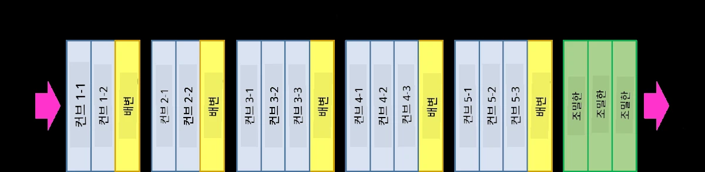
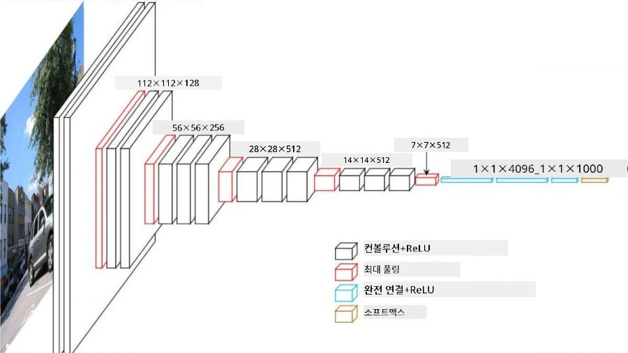
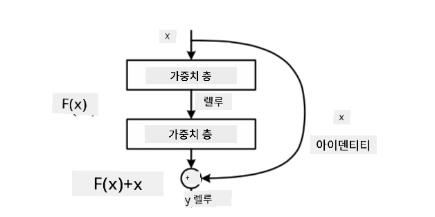
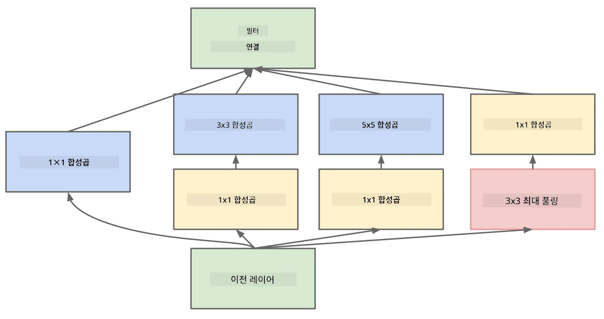

# 잘 알려진 CNN 아키텍처

### VGG-16

VGG-16은 2014년 ImageNet의 top-5 분류에서 92.7%의 정확도를 달성한 네트워크입니다. 이 네트워크는 다음과 같은 계층 구조를 가지고 있습니다:

보시다시피, VGG는 전통적인 피라미드 아키텍처를 따르며, 이는 컨볼루션-풀링 계층의 연속입니다.

> 이미지 출처: [Researchgate](https://www.researchgate.net/figure/Vgg16-model-structure-To-get-the-VGG-NIN-model-we-replace-the-2-nd-4-th-6-th-7-th_fig2_335194493)

### ResNet

ResNet은 2015년 Microsoft Research에서 제안한 모델 계열입니다. ResNet의 핵심 아이디어는 **잔차 블록(residual blocks)**을 사용하는 것입니다:

> 이미지 출처: [이 논문](https://arxiv.org/pdf/1512.03385.pdf)

잔차 블록을 사용하는 이유는 각 계층이 이전 계층의 결과와 잔차 블록의 출력을 비교하여 **차이**를 예측하도록 하기 위함입니다. 그래서 이를 *잔차(Residual)*라고 부릅니다. 이러한 블록은 훈련이 훨씬 쉬우며, 수백 개의 블록으로 구성된 네트워크를 구축할 수 있습니다(가장 일반적인 변형은 ResNet-52, ResNet-101, ResNet-152입니다).

이 네트워크는 데이터셋에 따라 복잡성을 조정할 수 있는 네트워크로 생각할 수도 있습니다. 초기 훈련 단계에서는 가중치 값이 작아 대부분의 신호가 패스스루(identity) 계층을 통해 전달됩니다. 훈련이 진행되고 가중치가 커지면 네트워크 매개변수의 중요성이 증가하며, 네트워크는 필요한 표현력을 조정하여 훈련 이미지를 올바르게 분류할 수 있도록 합니다.

### Google Inception

Google Inception 아키텍처는 이 아이디어를 한 단계 더 발전시켜, 각 네트워크 계층을 여러 경로의 조합으로 구성합니다:

> 이미지 출처: [Researchgate](https://www.researchgate.net/figure/Inception-module-with-dimension-reductions-left-and-schema-for-Inception-ResNet-v1_fig2_355547454)

여기서 1x1 컨볼루션의 역할을 강조할 필요가 있습니다. 처음에는 1x1 필터로 이미지를 처리하는 것이 이해되지 않을 수 있습니다. 하지만 컨볼루션 필터는 여러 깊이 채널(RGB 색상, 이후 계층에서는 다양한 필터 채널)에서도 작동하며, 1x1 컨볼루션은 서로 다른 학습 가능한 가중치를 사용하여 이러한 입력 채널을 혼합하는 데 사용됩니다. 이는 채널 차원에서 다운샘플링(풀링)으로도 볼 수 있습니다.

이 주제에 대한 [좋은 블로그 글](https://medium.com/analytics-vidhya/talented-mr-1x1-comprehensive-look-at-1x1-convolution-in-deep-learning-f6b355825578)과 [원본 논문](https://arxiv.org/pdf/1312.4400.pdf)을 참고하세요.

### MobileNet

MobileNet은 크기가 줄어든 모델 계열로, 모바일 기기에 적합합니다. 자원이 부족하고 약간의 정확도를 희생할 수 있다면 이 모델을 사용하세요. MobileNet의 주요 아이디어는 **깊이별 분리 컨볼루션(depthwise separable convolution)**으로, 이는 컨볼루션 필터를 공간적 컨볼루션과 깊이 채널에 대한 1x1 컨볼루션의 조합으로 표현할 수 있게 합니다. 이를 통해 매개변수 수가 크게 줄어들어 네트워크 크기가 작아지고, 적은 데이터로도 훈련이 더 쉬워집니다.

여기 [MobileNet에 대한 좋은 블로그 글](https://medium.com/analytics-vidhya/image-classification-with-mobilenet-cc6fbb2cd470)을 참고하세요.

## 결론

이번 단원에서는 컴퓨터 비전 신경망의 주요 개념인 컨볼루션 네트워크에 대해 배웠습니다. 이미지 분류, 객체 탐지, 심지어 이미지 생성 네트워크를 구동하는 실제 아키텍처는 모두 CNN을 기반으로 하며, 단지 더 많은 계층과 추가적인 훈련 기법이 사용됩니다.

## 🚀 도전 과제

동봉된 노트북의 하단에는 더 높은 정확도를 얻는 방법에 대한 메모가 있습니다. 실험을 통해 더 높은 정확도를 달성할 수 있는지 확인해 보세요.

## [강의 후 퀴즈](https://ff-quizzes.netlify.app/en/ai/quiz/14)

## 복습 및 자기 학습

CNN은 주로 컴퓨터 비전 작업에 사용되지만, 고정 크기의 패턴을 추출하는 데 일반적으로 유용합니다. 예를 들어, 소리를 다룰 때도 CNN을 사용하여 오디오 신호에서 특정 패턴을 찾을 수 있습니다. 이 경우 필터는 1차원(1D-CNN)일 것입니다. 또한, 비디오에서 발생하는 특정 이벤트와 같은 다차원 공간의 특징을 추출하기 위해 3D-CNN이 사용되기도 합니다. CNN으로 수행할 수 있는 다른 작업에 대해 복습하고 자기 학습을 해보세요.

## [과제](lab/README.md)

이번 실습에서는 다양한 고양이와 개 품종을 분류하는 작업을 수행합니다. 이 이미지들은 MNIST 데이터셋보다 더 복잡하고 고해상도이며, 10개 이상의 클래스를 포함하고 있습니다.

---

