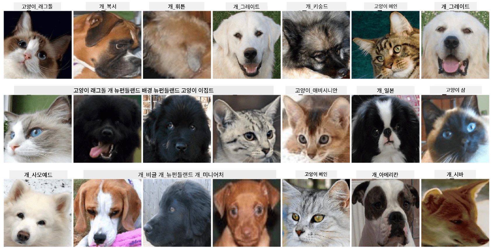

# 애완동물 얼굴 분류

[AI for Beginners Curriculum](https://github.com/microsoft/ai-for-beginners)에서 제공하는 실습 과제입니다.

## 과제

애완동물 보육원을 위한 애플리케이션을 개발해야 한다고 상상해보세요. 이러한 애플리케이션의 훌륭한 기능 중 하나는 사진을 통해 품종을 자동으로 식별하는 것입니다. 이는 신경망을 사용하여 성공적으로 구현할 수 있습니다.

**Pet Faces** 데이터셋을 사용하여 고양이와 개의 다양한 품종을 분류하는 컨볼루션 신경망을 훈련해야 합니다.

## 데이터셋

우리는 [Oxford-IIIT Pet Dataset](https://www.robots.ox.ac.uk/~vgg/data/pets/)을 사용할 것입니다. 이 데이터셋은 37가지 다른 품종의 개와 고양이 이미지를 포함하고 있습니다.



데이터셋을 다운로드하려면 아래 코드 스니펫을 사용하세요:

```python
!wget https://thor.robots.ox.ac.uk/~vgg/data/pets/images.tar.gz
!tar xfz images.tar.gz
!rm images.tar.gz
```

**참고:** Oxford-IIIT Pet Dataset의 이미지는 파일 이름(예: `Abyssinian_1.jpg`, `Bengal_2.jpg`)으로 정리되어 있습니다. 노트북에는 이러한 이미지를 품종별 하위 디렉토리로 정리하여 분류를 더 쉽게 할 수 있도록 하는 코드가 포함되어 있습니다.

## 시작 노트북

[PetFaces.ipynb](PetFaces.ipynb)를 열어 실습을 시작하세요.

## 주요 학습 내용

여러분은 이미지를 분류하는 비교적 복잡한 문제를 처음부터 해결했습니다! 클래스가 꽤 많았음에도 불구하고 합리적인 정확도를 얻을 수 있었습니다! 또한, top-k 정확도를 측정하는 것이 합리적입니다. 왜냐하면 인간에게도 명확히 구분되지 않는 일부 클래스는 혼동하기 쉽기 때문입니다.

---

**면책 조항**:  
이 문서는 AI 번역 서비스 [Co-op Translator](https://github.com/Azure/co-op-translator)를 사용하여 번역되었습니다. 정확성을 위해 최선을 다하고 있으나, 자동 번역에는 오류나 부정확성이 포함될 수 있습니다. 원본 문서의 원어 버전을 권위 있는 자료로 간주해야 합니다. 중요한 정보의 경우, 전문적인 인간 번역을 권장합니다. 이 번역 사용으로 인해 발생하는 오해나 잘못된 해석에 대해 당사는 책임을 지지 않습니다.