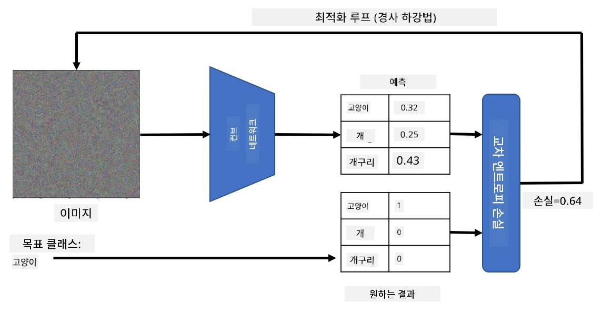

# 사전 학습된 네트워크와 전이 학습

CNN을 훈련시키는 데는 많은 시간이 걸리며, 이를 위해 많은 데이터가 필요합니다. 하지만 대부분의 시간은 네트워크가 이미지를 통해 패턴을 추출할 수 있는 최적의 저수준 필터를 학습하는 데 소비됩니다. 여기서 자연스럽게 이런 질문이 떠오릅니다. 한 데이터셋에서 훈련된 신경망을 사용하여 완전한 훈련 과정 없이 다른 이미지를 분류하도록 적응시킬 수 있을까요?

## [강의 전 퀴즈](https://ff-quizzes.netlify.app/en/ai/quiz/15)

이 접근법은 **전이 학습**이라고 불리며, 한 신경망 모델에서 다른 모델로 지식을 전이하는 것을 의미합니다. 전이 학습에서는 일반적으로 **ImageNet**과 같은 대규모 이미지 데이터셋에서 훈련된 사전 학습 모델을 시작점으로 사용합니다. 이러한 모델은 이미 일반적인 이미지에서 다양한 특징을 추출하는 데 능숙하며, 많은 경우 이러한 특징 위에 분류기를 구축하는 것만으로도 좋은 결과를 얻을 수 있습니다.

> ✅ 전이 학습은 교육과 같은 다른 학문 분야에서도 사용되는 용어입니다. 이는 한 영역에서 얻은 지식을 다른 영역에 적용하는 과정을 의미합니다.

## 사전 학습된 모델을 특징 추출기로 사용하기

이전 섹션에서 다룬 컨볼루션 네트워크는 여러 층으로 구성되어 있으며, 각 층은 이미지에서 특징을 추출하도록 설계되었습니다. 저수준 픽셀 조합(예: 수평/수직 선 또는 획)에서 시작하여, 더 높은 수준의 특징 조합(예: 불꽃의 눈과 같은 것)에 이르기까지 다양한 특징을 추출합니다. 충분히 크고 다양한 이미지 데이터셋에서 CNN을 훈련시키면 네트워크는 이러한 공통된 특징을 추출하는 방법을 학습할 수 있습니다.

Keras와 PyTorch는 대부분 ImageNet 이미지로 훈련된 일반적인 아키텍처에 대해 사전 학습된 신경망 가중치를 쉽게 로드할 수 있는 기능을 제공합니다. 가장 자주 사용되는 모델은 이전 강의의 [CNN 아키텍처](../07-ConvNets/CNN_Architectures.md) 페이지에서 설명되어 있습니다. 특히 다음 모델을 고려해볼 수 있습니다:

* **VGG-16/VGG-19**: 비교적 간단한 모델로 여전히 좋은 정확도를 제공합니다. 전이 학습이 어떻게 작동하는지 확인하기 위해 처음 시도할 모델로 VGG를 사용하는 것이 좋은 선택일 수 있습니다.
* **ResNet**: 2015년 Microsoft Research에서 제안한 모델 계열로, 더 많은 층을 포함하고 있어 더 많은 자원이 필요합니다.
* **MobileNet**: 크기가 줄어든 모델 계열로, 모바일 장치에 적합합니다. 자원이 부족하고 약간의 정확도를 희생할 수 있다면 사용해보세요.

다음은 VGG-16 네트워크가 고양이 사진에서 추출한 특징의 예입니다:

## 고양이 vs. 개 데이터셋

이 예제에서는 [고양이와 개](https://www.microsoft.com/download/details.aspx?id=54765&WT.mc_id=academic-77998-cacaste) 데이터셋을 사용합니다. 이는 실제 이미지 분류 시나리오와 매우 유사합니다.

## ✍️ 연습: 전이 학습

다음 노트북에서 전이 학습을 직접 확인해보세요:

* [전이 학습 - PyTorch](TransferLearningPyTorch.ipynb)
* [전이 학습 - TensorFlow](TransferLearningTF.ipynb)

## 이상적인 고양이 시각화

사전 학습된 신경망은 **이상적인 고양이**(이상적인 개, 이상적인 얼룩말 등)에 대한 개념을 포함하여 다양한 패턴을 내부에 가지고 있습니다. 이러한 이미지를 **시각화**하는 것은 흥미로울 것입니다. 하지만 이는 간단하지 않습니다. 패턴이 네트워크 가중치 전체에 퍼져 있고 계층적 구조로 조직되어 있기 때문입니다.

한 가지 접근법은 랜덤 이미지를 시작점으로 사용하여 **경사 하강 최적화** 기법을 통해 이미지를 조정하는 것입니다. 이를 통해 네트워크가 해당 이미지를 고양이라고 생각하도록 만들 수 있습니다.

하지만 이렇게 하면 랜덤 노이즈와 매우 유사한 결과를 얻을 수 있습니다. 이는 *네트워크가 입력 이미지를 고양이라고 생각하도록 만드는 방법이 많기 때문*이며, 그중 일부는 시각적으로 의미가 없을 수 있습니다. 이러한 이미지는 고양이에 일반적인 많은 패턴을 포함하고 있지만, 시각적으로 뚜렷하게 보이도록 제한하는 요소가 없습니다.

결과를 개선하기 위해 손실 함수에 **변동 손실**이라는 항목을 추가할 수 있습니다. 이는 이미지의 인접 픽셀이 얼마나 유사한지를 보여주는 메트릭입니다. 변동 손실을 최소화하면 이미지가 더 부드러워지고 노이즈가 제거되어 시각적으로 더 매력적인 패턴이 드러납니다. 아래는 고양이와 얼룩말로 높은 확률로 분류된 "이상적인" 이미지의 예입니다:

 | 
-----|-----
*이상적인 고양이* | *이상적인 얼룩말*

유사한 접근법은 **적대적 공격**을 수행하는 데도 사용할 수 있습니다. 예를 들어, 신경망을 속여 개를 고양이처럼 보이게 만들고 싶다고 가정해봅시다. 네트워크가 개로 인식하는 개 이미지를 가져와 경사 하강 최적화를 사용해 약간 조정하면 네트워크가 이를 고양이로 분류하기 시작할 때까지 조정할 수 있습니다:

 | 
-----|-----
*원래 개 사진* | *고양이로 분류된 개 사진*

위 결과를 재현하는 코드는 다음 노트북에서 확인할 수 있습니다:

* [이상적인 고양이와 적대적 고양이 - TensorFlow](AdversarialCat_TF.ipynb)

## 결론

전이 학습을 사용하면 사용자 정의 객체 분류 작업을 위한 분류기를 빠르게 구성하고 높은 정확도를 달성할 수 있습니다. 더 복잡한 작업을 해결하려면 더 높은 계산 능력이 필요하며, CPU만으로는 쉽게 해결할 수 없습니다. 다음 단원에서는 동일한 모델을 더 낮은 계산 자원을 사용하여 훈련하는 경량 구현을 시도해보며, 약간 낮은 정확도를 얻는 방법을 살펴보겠습니다.

## 🚀 도전 과제

첨부된 노트북 하단에는 전이 학습이 어느 정도 유사한 훈련 데이터(예: 새로운 종류의 동물)에서 가장 잘 작동한다는 내용이 있습니다. 완전히 새로운 유형의 이미지를 사용하여 전이 학습 모델이 얼마나 잘 또는 못 작동하는지 실험해보세요.

## [강의 후 퀴즈](https://ff-quizzes.netlify.app/en/ai/quiz/16)

## 복습 및 자기 학습

[TrainingTricks.md](TrainingTricks.md)를 읽고 모델을 훈련시키는 다른 방법에 대한 지식을 심화하세요.

## [과제](lab/README.md)

이 실습에서는 35종의 고양이와 개 품종이 포함된 실제 [Oxford-IIIT](https://www.robots.ox.ac.uk/~vgg/data/pets/) 애완동물 데이터셋을 사용하여 전이 학습 분류기를 구축합니다.

---

