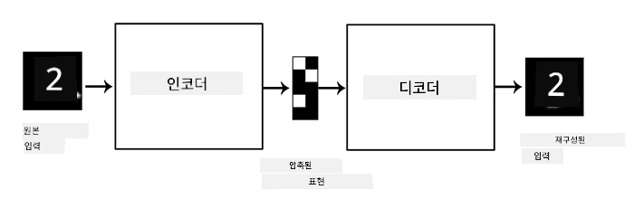
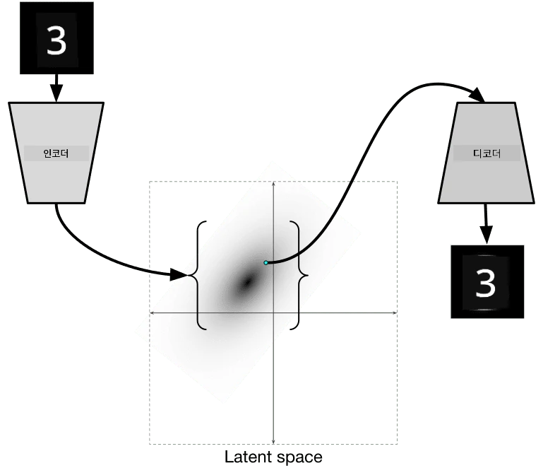

# 오토인코더

CNN을 훈련할 때, 문제 중 하나는 많은 라벨링된 데이터가 필요하다는 점입니다. 이미지 분류의 경우, 이미지를 서로 다른 클래스에 나누는 작업이 수작업으로 이루어져야 합니다.

## [강의 전 퀴즈](https://ff-quizzes.netlify.app/en/ai/quiz/17)

하지만, CNN 특징 추출기를 훈련하기 위해 라벨링되지 않은 원시 데이터를 사용하고 싶을 때가 있습니다. 이를 **자기 지도 학습**이라고 합니다. 라벨 대신, 훈련 이미지를 네트워크 입력과 출력으로 사용합니다. **오토인코더**의 주요 아이디어는 **인코더 네트워크**가 입력 이미지를 **잠재 공간**(일반적으로 더 작은 크기의 벡터)으로 변환하고, **디코더 네트워크**가 원본 이미지를 재구성하는 것입니다.

> ✅ [오토인코더](https://wikipedia.org/wiki/Autoencoder)는 "라벨링되지 않은 데이터의 효율적인 코딩을 학습하기 위해 사용되는 인공 신경망의 한 유형"입니다.

오토인코더를 훈련하여 원본 이미지의 정보를 최대한 많이 캡처하여 정확히 재구성하려고 할 때, 네트워크는 입력 이미지를 가장 잘 표현할 수 있는 **임베딩**을 찾으려고 합니다.

> 이미지 출처: [Keras 블로그](https://blog.keras.io/building-autoencoders-in-keras.html)

## 오토인코더 활용 시나리오

원본 이미지를 재구성하는 것이 자체적으로는 유용하지 않아 보일 수 있지만, 오토인코더가 특히 유용한 몇 가지 시나리오가 있습니다:

* **이미지 차원 축소를 통한 시각화** 또는 **이미지 임베딩 훈련**. 오토인코더는 이미지의 공간적 특성과 계층적 특징을 고려하기 때문에 PCA보다 더 나은 결과를 제공하는 경우가 많습니다.
* **노이즈 제거**, 즉 이미지에서 노이즈를 제거하는 작업. 노이즈는 쓸모없는 정보를 많이 포함하고 있기 때문에, 오토인코더는 상대적으로 작은 잠재 공간에 모든 정보를 담을 수 없으며, 따라서 이미지의 중요한 부분만 캡처합니다. 노이즈 제거기를 훈련할 때는 원본 이미지를 시작점으로 하고, 인위적으로 추가된 노이즈가 포함된 이미지를 오토인코더의 입력으로 사용합니다.
* **초해상도**, 즉 이미지 해상도를 높이는 작업. 고해상도 이미지를 시작점으로 하고, 낮은 해상도의 이미지를 오토인코더 입력으로 사용합니다.
* **생성 모델**. 오토인코더를 훈련한 후, 디코더 부분을 사용하여 랜덤 잠재 벡터에서 시작하여 새로운 객체를 생성할 수 있습니다.

## 변분 오토인코더 (VAE)

전통적인 오토인코더는 입력 데이터의 차원을 줄여 입력 이미지의 중요한 특징을 파악합니다. 하지만 잠재 벡터는 종종 큰 의미를 가지지 않습니다. 예를 들어, MNIST 데이터셋을 사용한다고 가정했을 때, 서로 다른 잠재 벡터가 어떤 숫자에 해당하는지 파악하는 것은 쉽지 않습니다. 가까운 잠재 벡터가 반드시 동일한 숫자에 해당하지 않을 수 있기 때문입니다.

반면, *생성* 모델을 훈련하려면 잠재 공간에 대한 이해가 있는 것이 더 좋습니다. 이 아이디어는 **변분 오토인코더**(VAE)로 이어집니다.

VAE는 잠재 매개변수의 *통계적 분포*를 예측하도록 학습하는 오토인코더로, 이를 **잠재 분포**라고 합니다. 예를 들어, 잠재 벡터가 평균 zmean과 표준편차 zsigma를 가진 정규 분포로 분포되기를 원할 수 있습니다(평균과 표준편차는 모두 특정 차원의 벡터입니다). VAE의 인코더는 이러한 매개변수를 예측하도록 학습하며, 디코더는 이 분포에서 랜덤 벡터를 가져와 객체를 재구성합니다.

요약하자면:

* 입력 벡터에서 `z_mean`과 `z_log_sigma`를 예측합니다(표준편차 자체를 예측하는 대신, 그 로그값을 예측합니다).
* 분포 N(zmean,exp(zlog\_sigma))에서 벡터 `sample`을 샘플링합니다.
* 디코더는 `sample`을 입력 벡터로 사용하여 원본 이미지를 디코딩하려고 합니다.

> 이미지 출처: [Isaak Dykeman의 블로그 글](https://ijdykeman.github.io/ml/2016/12/21/cvae.html)

변분 오토인코더는 두 부분으로 구성된 복잡한 손실 함수를 사용합니다:

* **재구성 손실**은 재구성된 이미지가 목표 이미지와 얼마나 가까운지를 보여주는 손실 함수입니다(Mean Squared Error, MSE 등을 사용할 수 있음). 이는 일반 오토인코더에서 사용하는 손실 함수와 동일합니다.
* **KL 손실**은 잠재 변수 분포가 정규 분포에 가까워지도록 보장합니다. 이는 [Kullback-Leibler 발산](https://www.countbayesie.com/blog/2017/5/9/kullback-leibler-divergence-explained)의 개념을 기반으로 하며, 두 통계적 분포가 얼마나 유사한지를 추정하는 척도입니다.

VAE의 중요한 장점 중 하나는 잠재 벡터를 샘플링할 분포를 알고 있기 때문에 새로운 이미지를 비교적 쉽게 생성할 수 있다는 점입니다. 예를 들어, MNIST 데이터셋에서 2D 잠재 벡터를 사용하여 VAE를 훈련하면, 잠재 벡터의 구성 요소를 변화시켜 서로 다른 숫자를 얻을 수 있습니다:

> 이미지 출처: [Dmitry Soshnikov](http://soshnikov.com)

잠재 매개변수 공간의 다른 부분에서 잠재 벡터를 가져오면서 이미지가 서로 섞이는 과정을 관찰할 수 있습니다. 또한 이 공간을 2D로 시각화할 수도 있습니다:

 

> 이미지 출처: [Dmitry Soshnikov](http://soshnikov.com)

## ✍️ 연습: 오토인코더

다음 노트북에서 오토인코더에 대해 더 알아보세요:

* [TensorFlow를 사용한 오토인코더](AutoencodersTF.ipynb)
* [PyTorch를 사용한 오토인코더](AutoEncodersPyTorch.ipynb)

## 오토인코더의 특성

* **데이터 특화** - 훈련된 이미지 유형에 대해서만 잘 작동합니다. 예를 들어, 꽃에 대해 초해상도 네트워크를 훈련하면, 초상화에는 잘 작동하지 않습니다. 이는 네트워크가 훈련 데이터셋에서 학습한 특징에서 세부 정보를 가져와 고해상도 이미지를 생성하기 때문입니다.
* **손실 있음** - 재구성된 이미지는 원본 이미지와 동일하지 않습니다. 손실의 성격은 훈련 중 사용된 *손실 함수*에 의해 정의됩니다.
* **라벨링되지 않은 데이터**에서 작동

## [강의 후 퀴즈](https://ff-quizzes.netlify.app/en/ai/quiz/18)

## 결론

이 강의에서는 AI 연구자가 사용할 수 있는 다양한 유형의 오토인코더에 대해 배웠습니다. 오토인코더를 구축하는 방법과 이미지를 재구성하는 데 사용하는 방법을 배웠습니다. 또한 VAE에 대해 배우고 이를 사용하여 새로운 이미지를 생성하는 방법을 익혔습니다.

## 🚀 도전 과제

이 강의에서는 이미지를 위한 오토인코더 사용에 대해 배웠습니다. 하지만 오토인코더는 음악에도 사용할 수 있습니다! Magenta 프로젝트의 [MusicVAE](https://magenta.tensorflow.org/music-vae) 프로젝트를 확인해보세요. 이 프로젝트는 오토인코더를 사용하여 음악을 재구성하는 방법을 학습합니다. 이 라이브러리를 사용하여 [실험](https://colab.research.google.com/github/magenta/magenta-demos/blob/master/colab-notebooks/Multitrack_MusicVAE.ipynb)을 진행하며 무엇을 만들 수 있는지 확인해보세요.

## [강의 후 퀴즈](https://ff-quizzes.netlify.app/en/ai/quiz/16)

## 복습 및 자기 학습

참고로, 다음 자료에서 오토인코더에 대해 더 읽어보세요:

* [Keras에서 오토인코더 구축하기](https://blog.keras.io/building-autoencoders-in-keras.html)
* [NeuroHive 블로그 글](https://neurohive.io/ru/osnovy-data-science/variacionnyj-avtojenkoder-vae/)
* [변분 오토인코더 설명](https://kvfrans.com/variational-autoencoders-explained/)
* [조건부 변분 오토인코더](https://ijdykeman.github.io/ml/2016/12/21/cvae.html)

## 과제

[TensorFlow를 사용한 이 노트북](AutoencodersTF.ipynb)의 끝부분에 '과제'가 있습니다. 이를 과제로 사용하세요.

---

