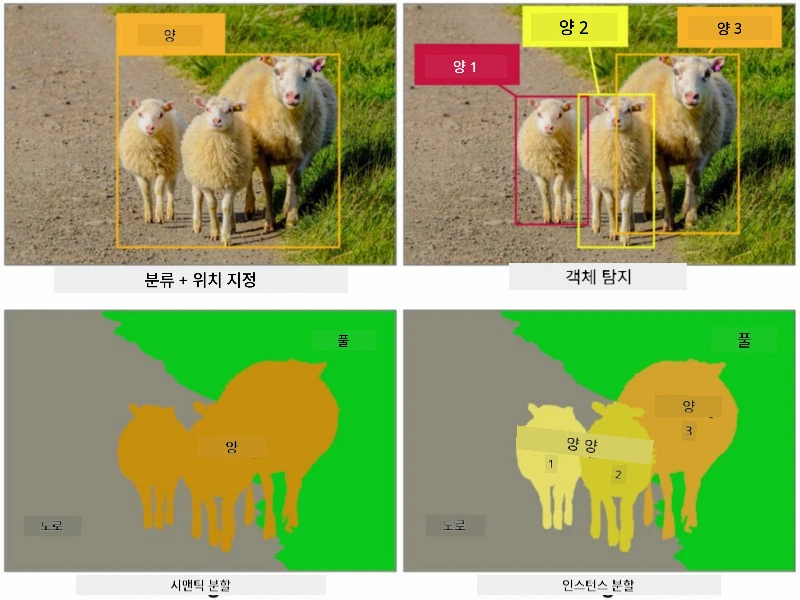
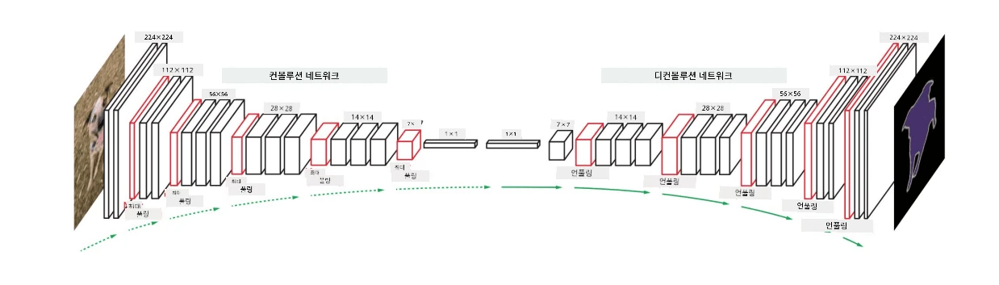

# 세그멘테이션

이전에 우리는 객체 감지(Object Detection)에 대해 배웠습니다. 객체 감지는 이미지에서 *바운딩 박스*를 예측하여 객체의 위치를 찾을 수 있게 해줍니다. 하지만 일부 작업에서는 바운딩 박스뿐만 아니라 더 정밀한 객체 위치 정보가 필요합니다. 이러한 작업을 **세그멘테이션(Segmentation)**이라고 합니다.

## [강의 전 퀴즈](https://ff-quizzes.netlify.app/en/ai/quiz/23)

세그멘테이션은 **픽셀 분류**로 볼 수 있습니다. 이미지의 **각** 픽셀에 대해 해당 픽셀이 속하는 클래스를 예측해야 합니다 (*배경*도 클래스 중 하나로 간주됩니다). 주요 세그멘테이션 알고리즘은 두 가지가 있습니다:

* **Semantic Segmentation**은 픽셀의 클래스만 알려주며, 동일한 클래스에 속하는 객체 간의 구분은 하지 않습니다.
* **Instance Segmentation**은 클래스를 서로 다른 인스턴스로 나눕니다.

예를 들어, 인스턴스 세그멘테이션에서는 이 양들이 서로 다른 객체로 구분되지만, 세맨틱 세그멘테이션에서는 모든 양이 하나의 클래스로 표현됩니다.

> 이미지 출처: [이 블로그 글](https://nirmalamurali.medium.com/image-classification-vs-semantic-segmentation-vs-instance-segmentation-625c33a08d50)

세그멘테이션을 위한 다양한 신경망 구조가 있지만, 모두 동일한 구조를 가지고 있습니다. 이전에 배운 오토인코더(autoencoder)와 유사한 방식이지만, 원본 이미지를 복원하는 대신 **마스크**를 복원하는 것이 목표입니다. 따라서 세그멘테이션 네트워크는 다음과 같은 구성 요소를 포함합니다:

* **인코더(Encoder)**: 입력 이미지에서 특징을 추출합니다.
* **디코더(Decoder)**: 추출된 특징을 **마스크 이미지**로 변환하며, 마스크 이미지는 원본 이미지와 동일한 크기를 가지며 클래스 수에 해당하는 채널을 포함합니다.

> 이미지 출처: [이 논문](https://arxiv.org/pdf/2001.05566.pdf)

특히 세그멘테이션에서 사용되는 손실 함수에 대해 언급해야 합니다. 일반적인 오토인코더를 사용할 때는 두 이미지 간의 유사성을 측정해야 하며, 이를 위해 평균 제곱 오차(MSE)를 사용할 수 있습니다. 세그멘테이션에서는 목표 마스크 이미지의 각 픽셀이 클래스 번호를 나타내며 (세 번째 차원에서 원-핫 인코딩됨), 따라서 분류에 특화된 손실 함수인 교차 엔트로피 손실(cross-entropy loss)을 사용해야 합니다. 이 손실은 모든 픽셀에 대해 평균화됩니다. 마스크가 이진(binary)일 경우 **이진 교차 엔트로피 손실(BCE)**이 사용됩니다.

> ✅ 원-핫 인코딩은 클래스 레이블을 클래스 수와 동일한 길이의 벡터로 인코딩하는 방법입니다. [이 기사](https://datagy.io/sklearn-one-hot-encode/)에서 이 기술에 대해 자세히 알아보세요.

## 의료 영상에서의 세그멘테이션

이번 강의에서는 네트워크를 훈련시켜 의료 이미지에서 인간의 모반(일명 점)을 인식하는 세그멘테이션을 실습해 보겠습니다. 우리는 <a href="https://www.fc.up.pt/addi/ph2%20database.html">PH2 데이터베이스</a>의 피부경 검사를 위한 이미지를 사용할 것입니다. 이 데이터셋은 세 가지 클래스(일반 모반, 비정형 모반, 흑색종)의 200개 이미지를 포함하고 있습니다. 모든 이미지에는 모반을 윤곽으로 표시한 **마스크**도 포함되어 있습니다.

> ✅ 이 기술은 특히 이러한 유형의 의료 영상에 적합하지만, 다른 실생활 응용 사례를 상상해볼 수 있나요?

> 이미지 출처: PH2 데이터베이스

우리는 모델을 훈련시켜 배경에서 모반을 분리하는 세그멘테이션을 수행할 것입니다.

## ✍️ 연습: 세맨틱 세그멘테이션

아래 노트북을 열어 다양한 세맨틱 세그멘테이션 구조에 대해 배우고, 이를 실습하며 실제로 작동하는 모습을 확인해 보세요.

* [Semantic Segmentation Pytorch](SemanticSegmentationPytorch.ipynb)
* [Semantic Segmentation TensorFlow](SemanticSegmentationTF.ipynb)

## [강의 후 퀴즈](https://ff-quizzes.netlify.app/en/ai/quiz/24)

## 결론

세그멘테이션은 이미지 분류를 위한 매우 강력한 기술로, 바운딩 박스를 넘어 픽셀 수준의 분류를 수행합니다. 이 기술은 의료 영상 등 다양한 응용 분야에서 사용됩니다.

## 🚀 도전 과제

신체 세그멘테이션은 사람 이미지를 활용하여 수행할 수 있는 일반적인 작업 중 하나입니다. 또 다른 중요한 작업으로는 **골격 감지**와 **자세 감지**가 있습니다. [OpenPose](https://github.com/CMU-Perceptual-Computing-Lab/openpose) 라이브러리를 사용하여 자세 감지가 어떻게 활용될 수 있는지 확인해 보세요.

## 복습 및 자기 학습

이 [위키피디아 기사](https://wikipedia.org/wiki/Image_segmentation)는 이 기술의 다양한 응용 사례에 대한 좋은 개요를 제공합니다. 인스턴스 세그멘테이션과 파노프틱 세그멘테이션의 하위 분야에 대해 스스로 더 알아보세요.

## [과제](lab/README.md)

이번 실습에서는 [Segmentation Full Body MADS Dataset](https://www.kaggle.com/datasets/tapakah68/segmentation-full-body-mads-dataset)을 사용하여 **인간 신체 세그멘테이션**을 시도해 보세요.

---

