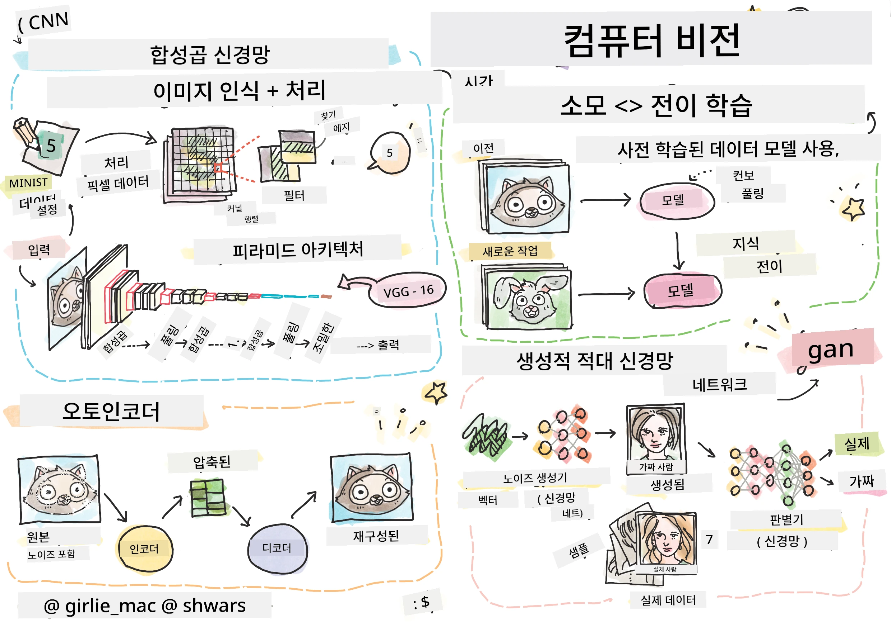

# 컴퓨터 비전

이 섹션에서는 다음 내용을 학습합니다:

* [컴퓨터 비전과 OpenCV 소개](06-IntroCV/README.md)
* [합성곱 신경망](07-ConvNets/README.md)
* [사전 학습된 네트워크와 전이 학습](08-TransferLearning/README.md) 
* [오토인코더](09-Autoencoders/README.md)
* [생성적 적대 신경망](10-GANs/README.md)
* [객체 탐지](11-ObjectDetection/README.md)
* [시맨틱 분할](12-Segmentation/README.md)

**면책 조항**:  
이 문서는 AI 번역 서비스 [Co-op Translator](https://github.com/Azure/co-op-translator)를 사용하여 번역되었습니다. 정확성을 위해 최선을 다하고 있지만, 자동 번역에는 오류나 부정확성이 포함될 수 있습니다. 원본 문서의 원어 버전을 권위 있는 출처로 간주해야 합니다. 중요한 정보의 경우, 전문적인 인간 번역을 권장합니다. 이 번역 사용으로 인해 발생하는 오해나 잘못된 해석에 대해 책임을 지지 않습니다.