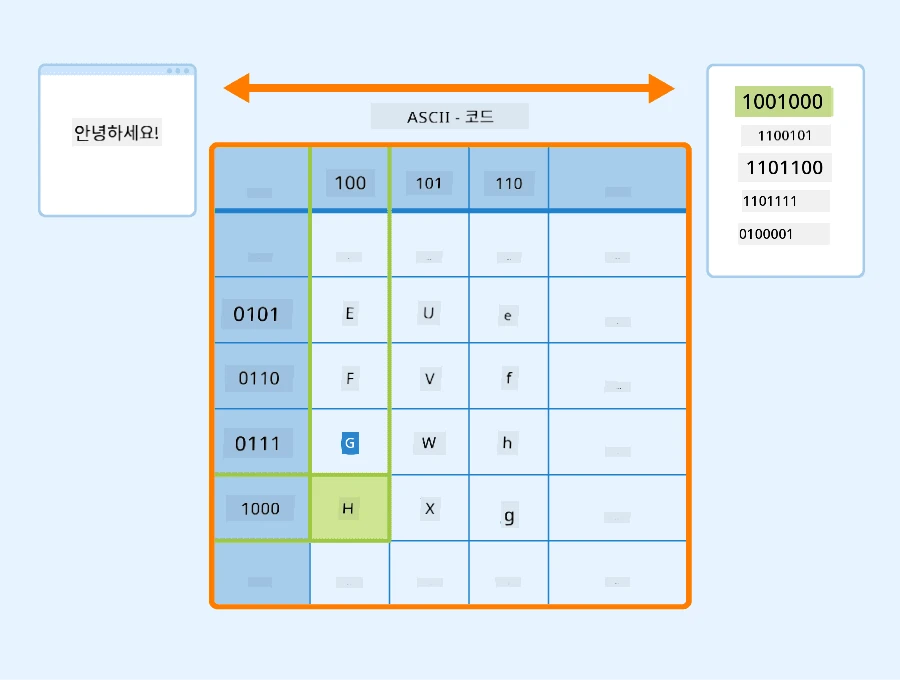
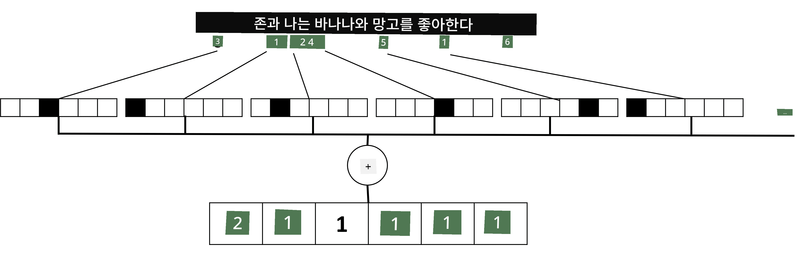

# 텍스트를 텐서로 표현하기

## [강의 전 퀴즈](https://ff-quizzes.netlify.app/en/ai/quiz/25)

## 텍스트 분류

이 섹션의 첫 번째 부분에서는 **텍스트 분류** 작업에 집중할 것입니다. 우리는 [AG News](https://www.kaggle.com/amananandrai/ag-news-classification-dataset) 데이터셋을 사용할 예정이며, 이 데이터셋에는 다음과 같은 뉴스 기사들이 포함되어 있습니다:

* 카테고리: 과학/기술
* 제목: Ky. 회사, 펩타이드 연구를 위한 보조금 획득 (AP)
* 본문: AP - 루이빌 대학교의 화학 연구자가 설립한 회사가 개발을 위한 보조금을 획득...

우리의 목표는 텍스트를 기반으로 뉴스 기사를 해당 카테고리 중 하나로 분류하는 것입니다.

## 텍스트 표현

신경망을 사용하여 자연어 처리(NLP) 작업을 해결하려면 텍스트를 텐서로 표현할 방법이 필요합니다. 컴퓨터는 이미 ASCII나 UTF-8과 같은 인코딩을 사용하여 화면의 글꼴에 매핑되는 숫자로 텍스트 문자를 표현합니다.

> [이미지 출처](https://www.seobility.net/en/wiki/ASCII)

사람은 각 글자가 **무엇을 나타내는지** 이해하고, 모든 문자가 함께 문장의 단어를 형성하는 방식을 이해합니다. 그러나 컴퓨터는 스스로 이러한 이해를 가지지 못하며, 신경망은 학습 중에 의미를 배워야 합니다.

따라서 텍스트를 표현할 때 다음과 같은 다양한 접근 방식을 사용할 수 있습니다:

* **문자 수준 표현**: 텍스트를 각 문자를 숫자로 취급하여 표현합니다. 텍스트 코퍼스에 *C*개의 서로 다른 문자가 있다고 가정하면, 단어 *Hello*는 5x*C* 텐서로 표현됩니다. 각 글자는 원-핫 인코딩에서 텐서 열에 해당합니다.
* **단어 수준 표현**: 텍스트의 모든 단어로 **어휘**를 생성하고, 단어를 원-핫 인코딩으로 표현합니다. 이 접근 방식은 더 나은데, 각 글자 자체는 큰 의미를 가지지 않으므로 더 높은 수준의 의미적 개념인 단어를 사용함으로써 신경망의 작업을 단순화합니다. 그러나 큰 사전 크기로 인해 고차원 희소 텐서를 처리해야 합니다.

어떤 표현을 사용하든 먼저 텍스트를 **토큰**의 시퀀스로 변환해야 합니다. 하나의 토큰은 문자, 단어 또는 때로는 단어의 일부일 수 있습니다. 그런 다음 **어휘**를 사용하여 토큰을 숫자로 변환하며, 이 숫자는 원-핫 인코딩을 통해 신경망에 입력될 수 있습니다.

## N-그램

자연어에서 단어의 정확한 의미는 문맥에서만 결정될 수 있습니다. 예를 들어, *신경망*과 *낚시망*의 의미는 완전히 다릅니다. 이를 고려하는 방법 중 하나는 단어 쌍을 기반으로 모델을 구축하고 단어 쌍을 별도의 어휘 토큰으로 간주하는 것입니다. 이렇게 하면 문장 *I like to go fishing*은 다음과 같은 토큰 시퀀스로 표현됩니다: *I like*, *like to*, *to go*, *go fishing*. 이 접근 방식의 문제는 사전 크기가 크게 증가하며, *go fishing*과 *go shopping*과 같은 조합이 서로 다른 토큰으로 표현되어 같은 동사를 사용하더라도 의미적 유사성을 공유하지 않는다는 점입니다.

경우에 따라 세 단어의 조합인 tri-grams를 사용할 수도 있습니다. 따라서 이러한 접근 방식은 **n-그램**이라고 불립니다. 또한 문자 수준 표현에서 n-그램을 사용하는 것이 의미가 있을 수 있으며, 이 경우 n-그램은 대략적으로 서로 다른 음절에 해당합니다.

## Bag-of-Words와 TF/IDF

텍스트 분류와 같은 작업을 해결할 때, 우리는 텍스트를 고정 크기의 벡터로 표현할 수 있어야 하며, 이를 최종 밀집 분류기에 입력으로 사용할 것입니다. 이를 수행하는 가장 간단한 방법 중 하나는 개별 단어 표현을 결합하는 것입니다. 예를 들어, 각 단어의 원-핫 인코딩을 더하면 텍스트 내에서 각 단어가 나타나는 빈도를 보여주는 벡터를 얻게 됩니다. 이러한 텍스트 표현을 **Bag-of-Words**(BoW)라고 합니다.

> 이미지 제공: 저자

BoW는 텍스트에 어떤 단어가 어떤 빈도로 나타나는지를 본질적으로 나타내며, 이는 텍스트가 무엇에 관한 것인지에 대한 좋은 지표가 될 수 있습니다. 예를 들어, 정치 관련 뉴스 기사는 *대통령*, *국가*와 같은 단어를 포함할 가능성이 높고, 과학 논문은 *충돌기*, *발견됨* 등의 단어를 포함할 것입니다. 따라서 단어 빈도는 많은 경우 텍스트 내용의 좋은 지표가 될 수 있습니다.

BoW의 문제는 *그리고*, *이다* 등과 같은 일반적인 단어가 대부분의 텍스트에 나타나며 가장 높은 빈도를 가지므로 실제로 중요한 단어를 가리는 것입니다. 이러한 단어의 중요도를 낮추기 위해 전체 문서 컬렉션에서 단어가 나타나는 빈도를 고려할 수 있습니다. 이것이 TF/IDF 접근 방식의 주요 아이디어이며, 이 강의에 첨부된 노트북에서 더 자세히 다룹니다.

그러나 이러한 접근 방식은 텍스트의 **의미**를 완전히 고려할 수 없습니다. 이를 위해서는 더 강력한 신경망 모델이 필요하며, 이는 이 섹션에서 나중에 논의할 것입니다.

## ✍️ 연습: 텍스트 표현

다음 노트북에서 학습을 이어가세요:

* [PyTorch를 사용한 텍스트 표현](TextRepresentationPyTorch.ipynb)
* [TensorFlow를 사용한 텍스트 표현](TextRepresentationTF.ipynb)

## 결론

지금까지 우리는 단어의 빈도 가중치를 추가할 수 있는 기술을 공부했습니다. 그러나 이러한 기술은 의미나 순서를 표현할 수 없습니다. 유명한 언어학자 J. R. Firth는 1935년에 "단어의 완전한 의미는 항상 문맥적이며, 문맥을 제외한 의미 연구는 진지하게 받아들일 수 없다"고 말했습니다. 우리는 이 과정에서 텍스트에서 문맥 정보를 캡처하는 방법을 언어 모델링을 통해 배우게 될 것입니다.

## 🚀 도전 과제

Bag-of-Words와 다양한 데이터 모델을 사용하여 다른 연습을 시도해 보세요. 이 [Kaggle 대회](https://www.kaggle.com/competitions/word2vec-nlp-tutorial/overview/part-1-for-beginners-bag-of-words)에서 영감을 받을 수 있습니다.

## [강의 후 퀴즈](https://ff-quizzes.netlify.app/en/ai/quiz/26)

## 복습 및 자기 학습

[Microsoft Learn](https://docs.microsoft.com/learn/modules/intro-natural-language-processing-pytorch/?WT.mc_id=academic-77998-cacaste)에서 텍스트 임베딩과 Bag-of-Words 기술을 연습해 보세요.

## [과제: 노트북](assignment.md)

---

