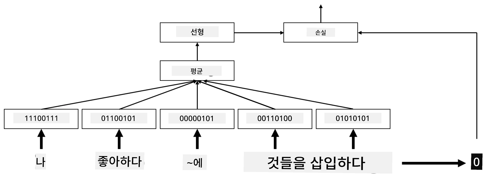
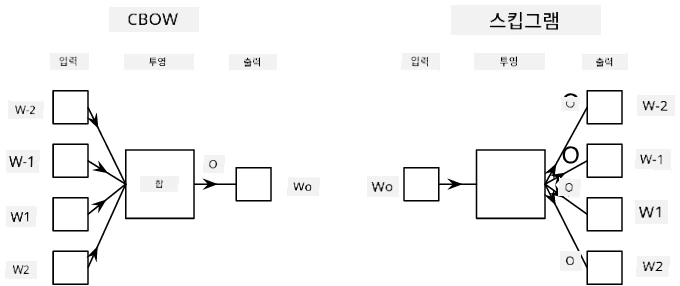

# 임베딩

## [강의 전 퀴즈](https://ff-quizzes.netlify.app/en/ai/quiz/27)

BoW 또는 TF/IDF 기반의 분류기를 훈련할 때, 우리는 `vocab_size` 길이의 고차원 bag-of-words 벡터를 사용했으며, 저차원 위치 표현 벡터를 희소한 원-핫 표현으로 명시적으로 변환했습니다. 하지만 이러한 원-핫 표현은 메모리 효율적이지 않습니다. 또한, 각 단어는 서로 독립적으로 처리되며, 원-핫 인코딩된 벡터는 단어 간의 의미적 유사성을 표현하지 못합니다.

**임베딩**의 아이디어는 단어를 저차원의 밀집 벡터로 표현하여 단어의 의미를 어느 정도 반영하는 것입니다. 나중에 의미 있는 단어 임베딩을 구축하는 방법에 대해 논의하겠지만, 지금은 임베딩을 단어 벡터의 차원을 낮추는 방법으로 생각해 봅시다.

임베딩 레이어는 단어를 입력으로 받아 지정된 `embedding_size`의 출력 벡터를 생성합니다. 이는 `Linear` 레이어와 매우 유사하지만, 원-핫 인코딩된 벡터 대신 단어 번호를 입력으로 받을 수 있어 큰 원-핫 인코딩 벡터를 생성하지 않아도 됩니다.

분류기 네트워크의 첫 번째 레이어로 임베딩 레이어를 사용하면 bag-of-words 모델에서 **embedding bag** 모델로 전환할 수 있습니다. 여기서 텍스트의 각 단어를 해당 임베딩으로 변환한 후, 이러한 모든 임베딩에 대해 `sum`, `average`, `max`와 같은 집계 함수를 계산합니다.

> 작성자 제공 이미지

## ✍️ 연습 문제: 임베딩

다음 노트북에서 학습을 이어가세요:
* [PyTorch로 임베딩](EmbeddingsPyTorch.ipynb)
* [TensorFlow로 임베딩](EmbeddingsTF.ipynb)

## 의미적 임베딩: Word2Vec

임베딩 레이어가 단어를 벡터 표현으로 매핑하는 것을 학습했지만, 이 표현이 반드시 의미적 의미를 많이 포함하고 있는 것은 아닙니다. 유사한 단어 또는 동의어가 어떤 벡터 거리(예: 유클리드 거리) 측면에서 서로 가까운 벡터에 해당하도록 벡터 표현을 학습하면 좋을 것입니다.

이를 위해서는 특정 방식으로 대규모 텍스트 컬렉션에서 임베딩 모델을 사전 훈련해야 합니다. 의미적 임베딩을 훈련하는 한 가지 방법은 [Word2Vec](https://en.wikipedia.org/wiki/Word2vec)입니다. 이는 단어의 분산 표현을 생성하는 데 사용되는 두 가지 주요 아키텍처를 기반으로 합니다:

 - **연속 bag-of-words** (CBoW) — 이 아키텍처에서는 주변 문맥에서 단어를 예측하도록 모델을 훈련합니다. ngram $(W_{-2},W_{-1},W_0,W_1,W_2)$가 주어졌을 때, 모델의 목표는 $(W_{-2},W_{-1},W_1,W_2)$로부터 $W_0$를 예측하는 것입니다.
 - **연속 skip-gram** — CBoW와 반대입니다. 모델은 주변 문맥 단어 창을 사용하여 현재 단어를 예측합니다.

CBoW는 더 빠르지만, skip-gram은 더 느리며 드문 단어를 더 잘 표현합니다.

> [이 논문](https://arxiv.org/pdf/1301.3781.pdf)에서 제공된 이미지

Word2Vec 사전 훈련된 임베딩(및 GloVe와 같은 다른 유사한 모델)은 신경망의 임베딩 레이어 대신 사용할 수도 있습니다. 하지만 어휘 문제를 처리해야 합니다. Word2Vec/GloVe를 사전 훈련하는 데 사용된 어휘는 우리의 텍스트 코퍼스에서 사용된 어휘와 다를 가능성이 높습니다. 위의 노트북을 살펴보며 이 문제를 해결하는 방법을 확인하세요.

## 문맥적 임베딩

Word2Vec와 같은 전통적인 사전 훈련된 임베딩 표현의 주요 한계는 단어 의미의 모호성 문제입니다. 사전 훈련된 임베딩은 문맥에서 단어의 일부 의미를 포착할 수 있지만, 단어의 모든 가능한 의미를 동일한 임베딩에 인코딩합니다. 이는 'play'와 같은 단어가 사용된 문맥에 따라 다른 의미를 가지기 때문에 다운스트림 모델에서 문제가 될 수 있습니다.

예를 들어, 'play'라는 단어는 다음 두 문장에서 매우 다른 의미를 가집니다:

- 나는 극장에서 **연극**을 봤다.
- 존은 친구들과 **놀고** 싶어한다.

위의 사전 훈련된 임베딩은 'play'라는 단어의 두 가지 의미를 동일한 임베딩으로 표현합니다. 이 한계를 극복하려면 **언어 모델**을 기반으로 임베딩을 구축해야 합니다. 언어 모델은 대규모 텍스트 코퍼스에서 훈련되며, 단어가 다양한 문맥에서 어떻게 조합될 수 있는지 *알고* 있습니다. 문맥적 임베딩에 대한 논의는 이 튜토리얼의 범위를 벗어나지만, 이후 강의에서 언어 모델을 다룰 때 다시 논의할 것입니다.

## 결론

이 강의에서는 TensorFlow와 PyTorch에서 임베딩 레이어를 구축하고 사용하는 방법을 배워 단어의 의미를 더 잘 반영할 수 있음을 알게 되었습니다.

## 🚀 도전 과제

Word2Vec는 노래 가사와 시를 생성하는 등 흥미로운 응용 프로그램에 사용되었습니다. [이 글](https://www.politetype.com/blog/word2vec-color-poems)을 읽어보세요. 글 작성자가 Word2Vec를 사용해 시를 생성하는 과정을 설명합니다. 또한 [Dan Shiffmann의 이 영상](https://www.youtube.com/watch?v=LSS_bos_TPI&ab_channel=TheCodingTrain)을 시청하여 이 기술에 대한 다른 설명을 확인하세요. 그런 다음 Kaggle에서 텍스트 코퍼스를 가져와 이러한 기술을 직접 적용해 보세요.

## [강의 후 퀴즈](https://ff-quizzes.netlify.app/en/ai/quiz/28)

## 복습 및 자기 학습

Word2Vec에 대한 이 논문을 읽어보세요: [Efficient Estimation of Word Representations in Vector Space](https://arxiv.org/pdf/1301.3781.pdf)

## [과제: 노트북](assignment.md)

---

