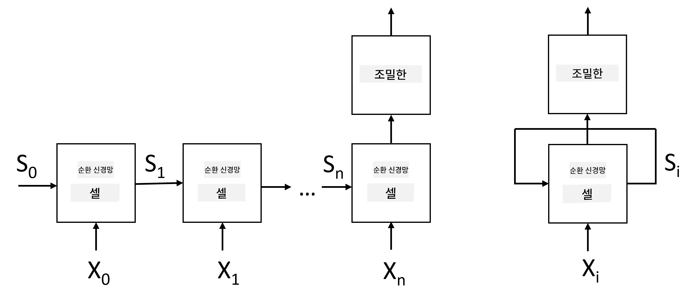
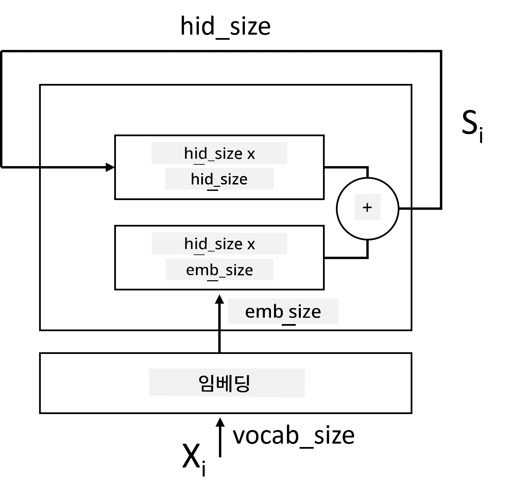
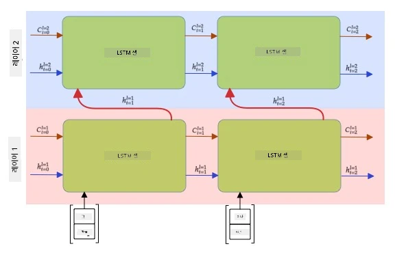

# 순환 신경망

## [강의 전 퀴즈](https://ff-quizzes.netlify.app/en/ai/quiz/31)

이전 섹션에서는 텍스트의 풍부한 의미 표현과 임베딩 위에 간단한 선형 분류기를 사용했습니다. 이 아키텍처는 문장에서 단어의 집계된 의미를 포착하지만, 임베딩 위의 집계 작업이 원본 텍스트에서 이 정보를 제거했기 때문에 단어의 **순서**를 고려하지 않습니다. 이러한 모델은 단어 순서를 모델링할 수 없기 때문에 텍스트 생성이나 질문 응답과 같은 더 복잡하거나 모호한 작업을 해결할 수 없습니다.

텍스트 시퀀스의 의미를 포착하려면 **순환 신경망**(Recurrent Neural Network, RNN)이라는 다른 신경망 아키텍처를 사용해야 합니다. RNN에서는 문장을 네트워크에 한 번에 하나의 기호씩 전달하고, 네트워크는 **상태**를 생성하며, 이를 다음 기호와 함께 네트워크에 다시 전달합니다.

> 저자 제공 이미지

토큰 입력 시퀀스 X0,...,Xn가 주어지면, RNN은 신경망 블록의 시퀀스를 생성하고, 이 시퀀스를 역전파를 통해 끝까지 훈련합니다. 각 네트워크 블록은 (Xi,Si) 쌍을 입력으로 받아들이고, 결과로 Si+1을 생성합니다. 최종 상태 Sn 또는 (출력 Yn)는 선형 분류기로 전달되어 결과를 생성합니다. 모든 네트워크 블록은 동일한 가중치를 공유하며, 하나의 역전파 패스를 통해 끝까지 훈련됩니다.

상태 벡터 S0,...,Sn가 네트워크를 통해 전달되기 때문에 단어 간의 순차적 의존성을 학습할 수 있습니다. 예를 들어, 시퀀스 어딘가에 *not*이라는 단어가 나타날 때, 상태 벡터 내 특정 요소를 부정하도록 학습하여 부정을 나타낼 수 있습니다.

> ✅ 위 그림에서 모든 RNN 블록의 가중치가 공유되므로, 동일한 그림을 오른쪽의 하나의 블록으로 표현할 수 있습니다. 이 블록은 네트워크의 출력 상태를 입력으로 다시 전달하는 순환 피드백 루프를 포함합니다.

## RNN 셀의 구조

간단한 RNN 셀이 어떻게 구성되는지 살펴보겠습니다. 이전 상태 Si-1과 현재 기호 Xi를 입력으로 받아들이며, 출력 상태 Si를 생성해야 합니다(그리고 때로는 생성 네트워크의 경우처럼 다른 출력 Yi에도 관심이 있습니다).

간단한 RNN 셀은 내부에 두 개의 가중치 행렬을 가지고 있습니다. 하나는 입력 기호를 변환하고(W라고 부르겠습니다), 다른 하나는 입력 상태를 변환합니다(H). 이 경우 네트워크의 출력은 &sigma;(W&times;Xi+H&times;Si-1+b)로 계산되며, 여기서 &sigma;는 활성화 함수이고 b는 추가적인 바이어스입니다.

> 저자 제공 이미지

많은 경우, 입력 토큰은 RNN에 들어가기 전에 임베딩 레이어를 통해 전달되어 차원을 낮춥니다. 이 경우, 입력 벡터의 차원이 *emb_size*이고 상태 벡터가 *hid_size*라면, W의 크기는 *emb_size*&times;*hid_size*이고, H의 크기는 *hid_size*&times;*hid_size*입니다.

## 장단기 메모리 (LSTM)

고전적인 RNN의 주요 문제 중 하나는 **기울기 소실** 문제입니다. RNN은 하나의 역전파 패스를 통해 끝까지 훈련되기 때문에 네트워크의 첫 번째 레이어로 오류를 전달하는 데 어려움을 겪으며, 따라서 먼 토큰 간의 관계를 학습할 수 없습니다. 이 문제를 피하는 방법 중 하나는 **게이트**를 사용하여 **명시적인 상태 관리**를 도입하는 것입니다. 이러한 종류의 잘 알려진 아키텍처로는 **장단기 메모리**(Long Short Term Memory, LSTM)와 **게이트 릴레이 유닛**(Gated Relay Unit, GRU)이 있습니다.

> 이미지 출처 TBD

LSTM 네트워크는 RNN과 유사하게 구성되지만, 레이어 간에 전달되는 두 가지 상태가 있습니다: 실제 상태 C와 숨겨진 벡터 H. 각 유닛에서 숨겨진 벡터 Hi는 입력 Xi와 결합되며, **게이트**를 통해 상태 C에서 어떤 일이 발생할지를 제어합니다. 각 게이트는 시그모이드 활성화(출력 범위 [0,1])를 가진 신경망으로, 상태 벡터와 곱해질 때 비트 마스크처럼 생각할 수 있습니다. 그림에서 왼쪽에서 오른쪽으로 다음과 같은 게이트가 있습니다:

* **Forget 게이트**는 숨겨진 벡터를 받아들여 벡터 C의 어떤 구성 요소를 잊어야 할지, 어떤 것을 통과시켜야 할지를 결정합니다.
* **Input 게이트**는 입력 및 숨겨진 벡터에서 일부 정보를 가져와 상태에 삽입합니다.
* **Output 게이트**는 상태를 *tanh* 활성화가 있는 선형 레이어를 통해 변환한 다음, 숨겨진 벡터 Hi를 사용하여 일부 구성 요소를 선택하여 새로운 상태 Ci+1을 생성합니다.

상태 C의 구성 요소는 켜고 끌 수 있는 플래그로 생각할 수 있습니다. 예를 들어, 시퀀스에서 *Alice*라는 이름을 만나면 여성 캐릭터를 나타낸다고 가정하고, 문장에서 여성 명사가 있다는 플래그를 상태에서 올릴 수 있습니다. 이후 *and Tom*이라는 구문을 만나면 복수 명사가 있다는 플래그를 올릴 수 있습니다. 따라서 상태를 조작함으로써 문장 부분의 문법적 속성을 추적할 수 있습니다.

> ✅ LSTM의 내부를 이해하는 데 훌륭한 자료는 Christopher Olah의 [Understanding LSTM Networks](https://colah.github.io/posts/2015-08-Understanding-LSTMs/)입니다.

## 양방향 및 다층 RNN

우리는 시퀀스의 시작부터 끝까지 한 방향으로 작동하는 순환 네트워크를 논의했습니다. 이는 우리가 읽고 말을 듣는 방식과 유사하기 때문에 자연스럽게 보입니다. 그러나 많은 실용적인 경우에 입력 시퀀스에 무작위로 접근할 수 있으므로 순환 계산을 양방향으로 실행하는 것이 합리적일 수 있습니다. 이러한 네트워크를 **양방향** RNN이라고 합니다. 양방향 네트워크를 다룰 때는 각 방향에 대해 하나씩 두 개의 숨겨진 상태 벡터가 필요합니다.

순환 네트워크는 단일 방향이든 양방향이든 시퀀스 내 특정 패턴을 캡처하고 이를 상태 벡터에 저장하거나 출력으로 전달할 수 있습니다. 합성곱 네트워크와 마찬가지로 첫 번째 레이어에서 추출한 저수준 패턴을 기반으로 더 높은 수준의 패턴을 캡처하기 위해 첫 번째 레이어 위에 또 다른 순환 레이어를 구축할 수 있습니다. 이는 **다층 RNN**의 개념으로 이어지며, 두 개 이상의 순환 네트워크로 구성되며 이전 레이어의 출력이 다음 레이어의 입력으로 전달됩니다.

*Fernando López의 [이 훌륭한 글](https://towardsdatascience.com/from-a-lstm-cell-to-a-multilayer-lstm-network-with-pytorch-2899eb5696f3)에서 가져온 그림*

## ✍️ 연습: 임베딩

다음 노트북에서 학습을 계속하세요:

* [PyTorch로 RNN](RNNPyTorch.ipynb)
* [TensorFlow로 RNN](RNNTF.ipynb)

## 결론

이 단원에서는 RNN이 시퀀스 분류에 사용될 수 있음을 보았지만, 실제로는 텍스트 생성, 기계 번역 등 더 많은 작업을 처리할 수 있습니다. 다음 단원에서 이러한 작업을 고려할 것입니다.

## 🚀 도전 과제

LSTM에 대한 문헌을 읽고 그 응용 사례를 고려해보세요:

- [Grid Long Short-Term Memory](https://arxiv.org/pdf/1507.01526v1.pdf)
- [Show, Attend and Tell: Neural Image Caption
Generation with Visual Attention](https://arxiv.org/pdf/1502.03044v2.pdf)

## [강의 후 퀴즈](https://ff-quizzes.netlify.app/en/ai/quiz/32)

## 복습 및 자기 학습

- Christopher Olah의 [Understanding LSTM Networks](https://colah.github.io/posts/2015-08-Understanding-LSTMs/)

## [과제: 노트북](assignment.md)

---

