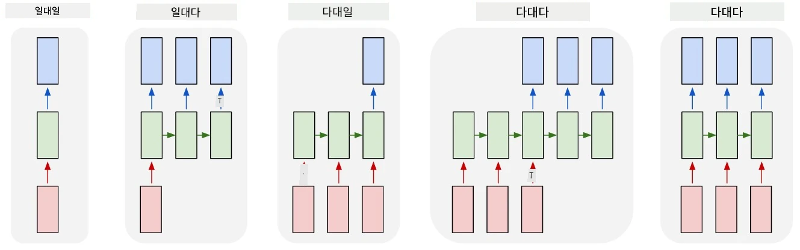

# 생성 네트워크

## [강의 전 퀴즈](https://ff-quizzes.netlify.app/en/ai/quiz/33)

순환 신경망(RNN)과 Long Short Term Memory Cells(LSTM), Gated Recurrent Units(GRU)와 같은 게이트 셀 변형은 단어 순서를 학습하고 시퀀스에서 다음 단어를 예측할 수 있는 언어 모델링 메커니즘을 제공합니다. 이를 통해 RNN을 **생성 작업**에 사용할 수 있습니다. 예를 들어 일반적인 텍스트 생성, 기계 번역, 이미지 캡션 생성 등이 가능합니다.

> ✅ 텍스트 입력 중 자동 완성 기능과 같은 생성 작업을 통해 혜택을 받은 경험을 떠올려 보세요. 좋아하는 애플리케이션이 RNN을 활용했는지 조사해 보세요.

이전 단원에서 논의한 RNN 아키텍처에서는 각 RNN 유닛이 다음 숨겨진 상태를 출력으로 생성했습니다. 하지만 각 순환 유닛에 또 다른 출력을 추가하여 **시퀀스**(원래 시퀀스와 길이가 동일)를 출력할 수도 있습니다. 또한 각 단계에서 입력을 받지 않고 초기 상태 벡터만 받아 시퀀스 출력을 생성하는 RNN 유닛을 사용할 수도 있습니다.

이를 통해 아래 그림에 표시된 다양한 신경망 아키텍처를 구현할 수 있습니다:



> 이미지 출처: [Andrej Karpaty](http://karpathy.github.io/)의 블로그 게시물 [Unreasonable Effectiveness of Recurrent Neural Networks](http://karpathy.github.io/2015/05/21/rnn-effectiveness/)

* **일대일**은 하나의 입력과 하나의 출력을 가진 전통적인 신경망입니다.
* **일대다**는 하나의 입력 값을 받아 출력 값 시퀀스를 생성하는 생성 아키텍처입니다. 예를 들어, **이미지 캡션 생성** 네트워크를 훈련시키고자 한다면, 이미지를 입력으로 받아 CNN을 통해 숨겨진 상태를 얻은 후 순환 체인을 통해 단어별로 캡션을 생성할 수 있습니다.
* **다대일**은 이전 단원에서 설명한 텍스트 분류와 같은 RNN 아키텍처에 해당합니다.
* **다대다**, 또는 **시퀀스-투-시퀀스**는 **기계 번역**과 같은 작업에 해당합니다. 여기서 첫 번째 RNN은 입력 시퀀스의 모든 정보를 숨겨진 상태에 수집하고, 다른 RNN 체인은 이 상태를 출력 시퀀스로 풀어냅니다.

이번 단원에서는 텍스트 생성을 돕는 간단한 생성 모델에 집중할 것입니다. 간단히 하기 위해 문자 수준 토큰화를 사용할 것입니다.

이 RNN을 훈련시켜 단계별로 텍스트를 생성할 것입니다. 각 단계에서 `nchars` 길이의 문자 시퀀스를 받아 각 입력 문자에 대해 다음 출력 문자를 생성하도록 네트워크에 요청합니다:


텍스트를 생성할 때(추론 중), **프롬프트**를 시작점으로 사용하여 RNN 셀을 통해 중간 상태를 생성한 후 이 상태에서 생성을 시작합니다. 한 번에 한 문자씩 생성하며, 상태와 생성된 문자를 다음 RNN 셀에 전달하여 다음 문자를 생성합니다. 이 과정을 필요한 문자 수만큼 반복합니다.


> 이미지 출처: 작성자

## ✍️ 연습: 생성 네트워크

다음 노트북에서 학습을 이어가세요:

* [PyTorch를 활용한 생성 네트워크](GenerativePyTorch.ipynb)
* [TensorFlow를 활용한 생성 네트워크](GenerativeTF.ipynb)

## 부드러운 텍스트 생성과 온도

각 RNN 셀의 출력은 문자에 대한 확률 분포입니다. 생성된 텍스트에서 항상 확률이 가장 높은 문자를 다음 문자로 선택하면 텍스트가 반복되는 패턴을 보일 수 있습니다. 예를 들어, 아래와 같은 경우입니다:

```
today of the second the company and a second the company ...
```

하지만 다음 문자에 대한 확률 분포를 보면, 가장 높은 확률과 두 번째로 높은 확률 간의 차이가 크지 않을 수 있습니다. 예를 들어, 한 문자가 확률 0.2를 가지는 반면, 다른 문자는 0.19를 가질 수 있습니다. 예를 들어, '*play*'라는 시퀀스에서 다음 문자는 공백이나 **e**(단어 *player*에서처럼)가 될 가능성이 거의 동일합니다.

따라서 항상 높은 확률의 문자를 선택하는 것이 "공정"하지 않을 수 있습니다. 두 번째로 높은 확률의 문자를 선택해도 의미 있는 텍스트를 생성할 수 있습니다. 더 현명한 방법은 네트워크 출력이 제공하는 확률 분포에서 문자를 **샘플링**하는 것입니다. 또한 **온도**라는 매개변수를 사용하여 확률 분포를 평탄화하거나, 더 가파르게 만들어 높은 확률의 문자에 더 집중할 수 있습니다.

위에 링크된 노트북에서 이 부드러운 텍스트 생성이 어떻게 구현되는지 탐구해 보세요.

## 결론

텍스트 생성 자체도 유용할 수 있지만, RNN을 사용하여 초기 특징 벡터에서 텍스트를 생성할 수 있는 능력이 주요 이점입니다. 예를 들어, 텍스트 생성은 기계 번역(시퀀스-투-시퀀스, 이 경우 *인코더*의 상태 벡터를 사용하여 번역 메시지를 생성 또는 *디코딩*함)이나 이미지의 텍스트 설명 생성(CNN 추출기로부터 특징 벡터를 얻는 경우)에 사용됩니다.

## 🚀 도전 과제

Microsoft Learn에서 이 주제에 대한 강의를 들어보세요:

* [PyTorch](https://docs.microsoft.com/learn/modules/intro-natural-language-processing-pytorch/6-generative-networks/?WT.mc_id=academic-77998-cacaste)/[TensorFlow](https://docs.microsoft.com/learn/modules/intro-natural-language-processing-tensorflow/5-generative-networks/?WT.mc_id=academic-77998-cacaste)를 활용한 텍스트 생성

## [강의 후 퀴즈](https://ff-quizzes.netlify.app/en/ai/quiz/34)

## 복습 및 자기 학습

다음 기사들을 통해 지식을 확장해 보세요:

* Markov Chain, LSTM, GPT-2를 활용한 텍스트 생성의 다양한 접근법: [블로그 게시물](https://towardsdatascience.com/text-generation-gpt-2-lstm-markov-chain-9ea371820e1e)
* [Keras 문서](https://keras.io/examples/generative/lstm_character_level_text_generation/)에서 텍스트 생성 샘플

## [과제](lab/README.md)

문자별 텍스트 생성 방법을 살펴보았습니다. 실습에서는 단어 수준 텍스트 생성을 탐구할 것입니다.

---

