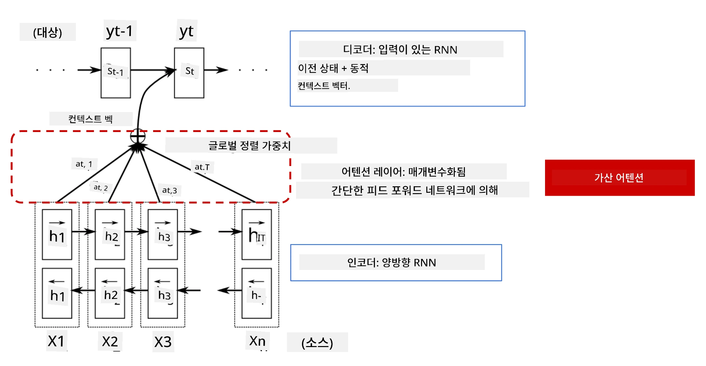
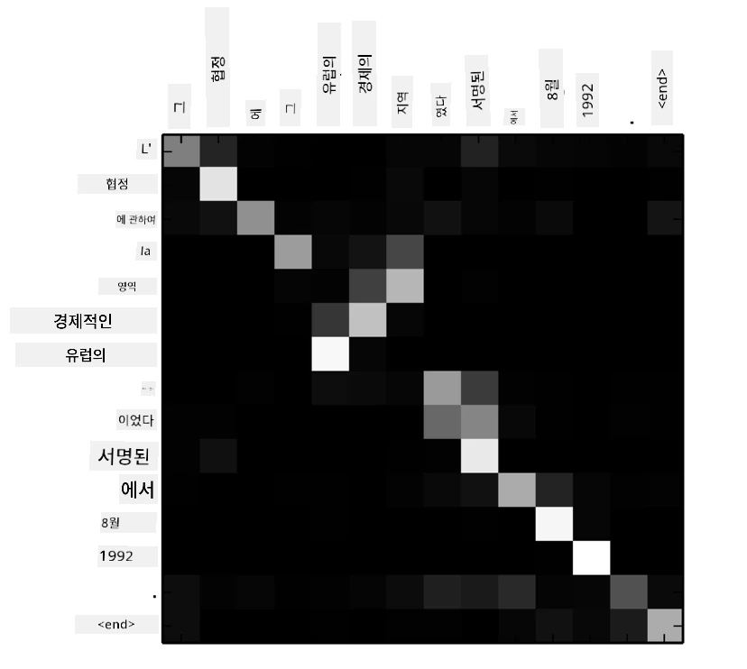
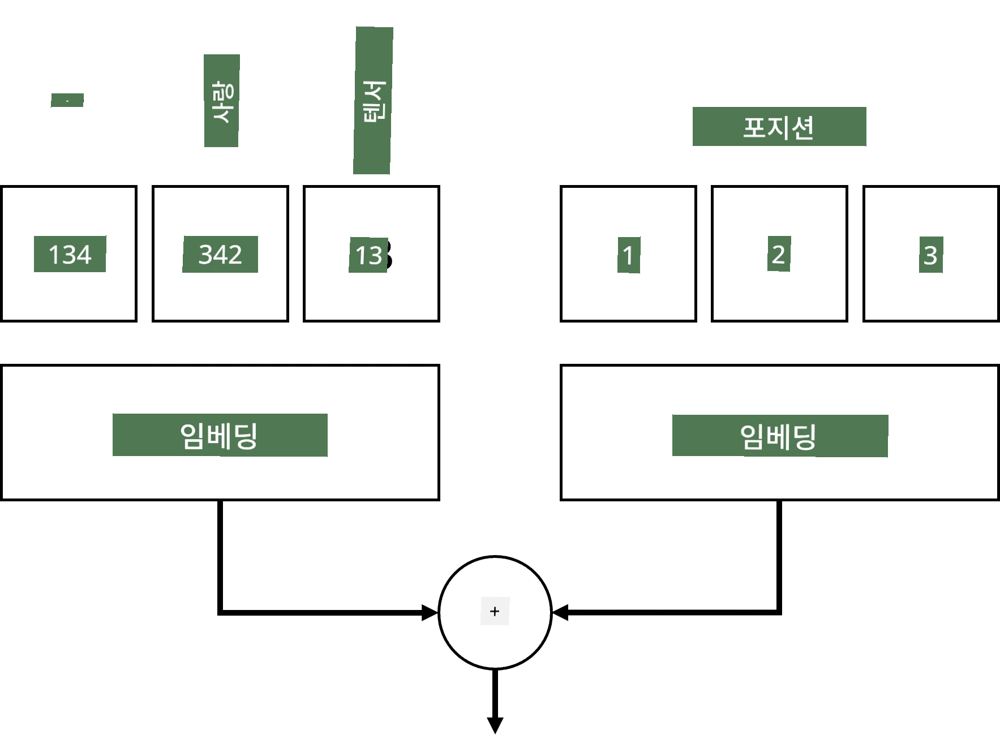
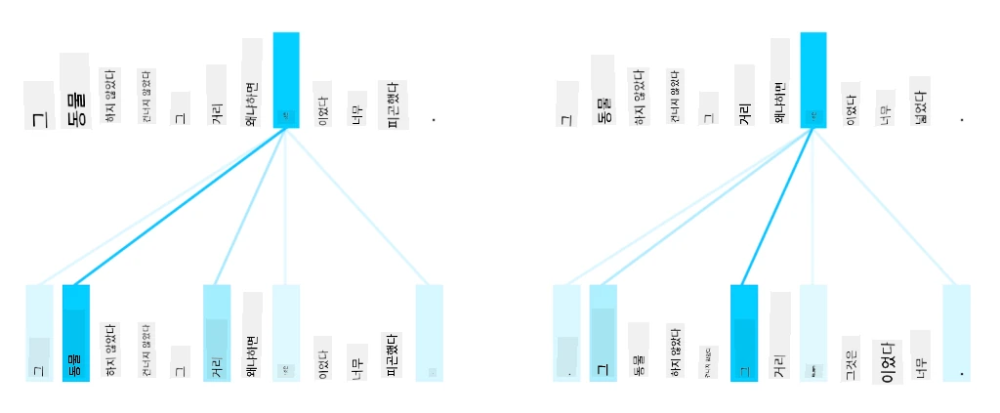
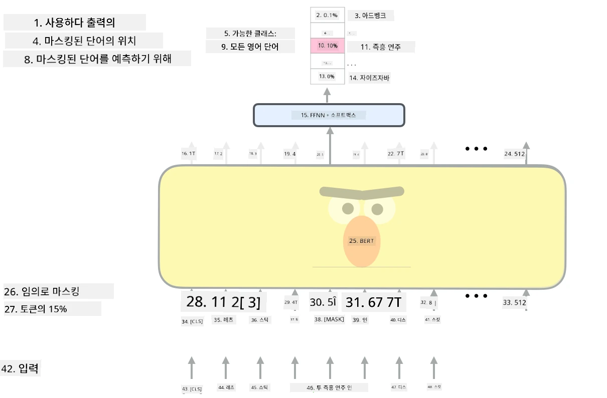

# 어텐션 메커니즘과 트랜스포머

## [강의 전 퀴즈](https://ff-quizzes.netlify.app/en/ai/quiz/35)

NLP 분야에서 가장 중요한 문제 중 하나는 **기계 번역**으로, 이는 Google 번역과 같은 도구의 핵심 과제입니다. 이 섹션에서는 기계 번역, 더 일반적으로는 **시퀀스-투-시퀀스** 작업(또는 **문장 변환**이라고도 함)에 대해 집중적으로 다룰 것입니다.

RNN을 사용하면 시퀀스-투-시퀀스 작업은 두 개의 순환 신경망으로 구현됩니다. 하나는 **인코더**로 입력 시퀀스를 은닉 상태로 압축하고, 다른 하나는 **디코더**로 이 은닉 상태를 번역된 결과로 펼칩니다. 하지만 이 접근법에는 몇 가지 문제가 있습니다:

* 인코더 네트워크의 최종 상태가 문장의 시작 부분을 기억하기 어려워, 긴 문장에 대해 모델의 품질이 저하됩니다.
* 시퀀스의 모든 단어가 결과에 동일한 영향을 미칩니다. 하지만 실제로는 입력 시퀀스의 특정 단어가 다른 단어보다 결과에 더 큰 영향을 미치는 경우가 많습니다.

**어텐션 메커니즘**은 RNN의 각 출력 예측에 대해 각 입력 벡터의 맥락적 영향을 가중치로 부여하는 방법을 제공합니다. 이는 입력 RNN의 중간 상태와 출력 RNN 사이에 지름길을 만드는 방식으로 구현됩니다. 이렇게 하면 출력 심볼 yt를 생성할 때, 서로 다른 가중치 계수 &alpha;t,i를 사용하여 모든 입력 은닉 상태 hi를 고려하게 됩니다.

> [Bahdanau et al., 2015](https://arxiv.org/pdf/1409.0473.pdf)의 어텐션 메커니즘이 포함된 인코더-디코더 모델. [이 블로그 글](https://lilianweng.github.io/lil-log/2018/06/24/attention-attention.html)에서 인용.

어텐션 행렬 {&alpha;i,j}는 출력 시퀀스의 특정 단어를 생성하는 데 특정 입력 단어가 얼마나 중요한지를 나타냅니다. 아래는 이러한 행렬의 예입니다:

> [Bahdanau et al., 2015](https://arxiv.org/pdf/1409.0473.pdf)에서 발췌 (그림 3)

어텐션 메커니즘은 현재 또는 거의 현재 NLP의 최첨단 기술에 크게 기여하고 있습니다. 하지만 어텐션을 추가하면 모델 파라미터 수가 크게 증가하여 RNN의 확장성 문제를 초래합니다. RNN의 주요 제약 조건 중 하나는 모델의 순환적 특성 때문에 학습을 배치 처리 및 병렬화하기 어렵다는 점입니다. RNN에서는 시퀀스의 각 요소를 순차적으로 처리해야 하므로 병렬화가 쉽지 않습니다.

> [Google 블로그](https://research.googleblog.com/2016/09/a-neural-network-for-machine.html)에서 발췌.

어텐션 메커니즘의 채택과 이러한 제약 조건은 오늘날 우리가 알고 사용하는 최첨단 트랜스포머 모델(BERT, Open-GPT3 등)의 탄생으로 이어졌습니다.

## 트랜스포머 모델

트랜스포머의 주요 아이디어 중 하나는 RNN의 순차적 특성을 피하고 학습 중 병렬화가 가능한 모델을 만드는 것입니다. 이는 두 가지 아이디어를 통해 구현됩니다:

* 위치 인코딩
* RNN(또는 CNN) 대신 **셀프 어텐션 메커니즘**을 사용하여 패턴을 캡처 (이 때문에 트랜스포머를 소개한 논문의 제목이 *[Attention is all you need](https://arxiv.org/abs/1706.03762)*입니다)

### 위치 인코딩/임베딩

위치 인코딩의 아이디어는 다음과 같습니다.
1. RNN을 사용할 때, 토큰의 상대적 위치는 단계 수로 표현되므로 명시적으로 표현할 필요가 없습니다.
2. 하지만 어텐션으로 전환하면, 시퀀스 내에서 토큰의 상대적 위치를 알아야 합니다.
3. 위치 인코딩을 얻기 위해, 토큰 시퀀스에 시퀀스 내 토큰 위치(예: 0, 1, ...)를 추가합니다.
4. 그런 다음, 토큰 위치를 토큰 임베딩 벡터와 혼합합니다. 위치(정수)를 벡터로 변환하려면 다음과 같은 방법을 사용할 수 있습니다:

* 토큰 임베딩과 유사한 학습 가능한 임베딩. 여기서는 이 접근법을 고려합니다. 토큰과 그 위치 모두에 임베딩 레이어를 적용하여 동일한 차원의 임베딩 벡터를 생성한 후, 이를 더합니다.
* 원 논문에서 제안된 고정 위치 인코딩 함수.

> 저자 제공 이미지

위치 임베딩을 통해 얻은 결과는 원래 토큰과 시퀀스 내 위치를 모두 포함합니다.

### 멀티-헤드 셀프 어텐션

다음으로, 시퀀스 내에서 패턴을 캡처해야 합니다. 이를 위해 트랜스포머는 **셀프 어텐션** 메커니즘을 사용합니다. 이는 입력과 출력이 동일한 시퀀스에 어텐션을 적용하는 것입니다. 셀프 어텐션을 적용하면 문장 내 **맥락**을 고려하고, 어떤 단어들이 서로 관련이 있는지 확인할 수 있습니다. 예를 들어, *it*과 같은 대명사가 참조하는 단어를 확인하고, 맥락을 반영할 수 있습니다:

> [Google 블로그](https://research.googleblog.com/2017/08/transformer-novel-neural-network.html)에서 발췌.

트랜스포머에서는 **멀티-헤드 어텐션**을 사용하여 네트워크가 여러 가지 의존성을 캡처할 수 있도록 합니다. 예를 들어, 장기적 vs. 단기적 단어 관계, 대명사 참조 vs. 기타 관계 등을 학습할 수 있습니다.

[TensorFlow 노트북](TransformersTF.ipynb)에서 트랜스포머 레이어 구현에 대한 자세한 내용을 확인할 수 있습니다.

### 인코더-디코더 어텐션

트랜스포머에서는 어텐션이 두 가지 경우에 사용됩니다:

* 셀프 어텐션을 사용하여 입력 텍스트 내 패턴을 캡처
* 시퀀스 번역 수행 - 인코더와 디코더 사이의 어텐션 레이어

인코더-디코더 어텐션은 이 섹션 초반에 설명한 RNN에서의 어텐션 메커니즘과 매우 유사합니다. 아래 애니메이션 다이어그램은 인코더-디코더 어텐션의 역할을 설명합니다.

트랜스포머는 각 입력 위치가 각 출력 위치에 독립적으로 매핑되므로, RNN보다 병렬화가 더 잘 이루어질 수 있습니다. 이는 훨씬 더 크고 표현력이 뛰어난 언어 모델을 가능하게 합니다. 각 어텐션 헤드는 단어 간의 다양한 관계를 학습하여 NLP 작업의 성능을 향상시킬 수 있습니다.

## BERT

**BERT**(Bidirectional Encoder Representations from Transformers)는 매우 큰 다층 트랜스포머 네트워크로, *BERT-base*는 12개 층, *BERT-large*는 24개 층으로 구성됩니다. 이 모델은 대규모 텍스트 데이터(Wikipedia + 책) 코퍼스에서 비지도 학습(문장에서 마스킹된 단어 예측)을 통해 사전 학습됩니다. 사전 학습 동안 모델은 상당한 수준의 언어 이해를 흡수하며, 이후 다른 데이터셋에서 미세 조정을 통해 이를 활용할 수 있습니다. 이 과정을 **전이 학습**이라고 합니다.

> 이미지 [출처](http://jalammar.github.io/illustrated-bert/)

## ✍️ 연습: 트랜스포머

다음 노트북에서 학습을 계속하세요:

* [PyTorch에서 트랜스포머](TransformersPyTorch.ipynb)
* [TensorFlow에서 트랜스포머](TransformersTF.ipynb)

## 결론

이 강의에서는 트랜스포머와 어텐션 메커니즘에 대해 배웠습니다. 이는 NLP 도구 상자에서 필수적인 도구들입니다. BERT, DistilBERT, BigBird, OpenGPT3 등 다양한 트랜스포머 아키텍처가 있으며, 이를 미세 조정할 수 있습니다. [HuggingFace 패키지](https://github.com/huggingface/)는 PyTorch와 TensorFlow 모두에서 이러한 아키텍처를 학습할 수 있는 리포지토리를 제공합니다.

## 🚀 도전 과제

## [강의 후 퀴즈](https://ff-quizzes.netlify.app/en/ai/quiz/36)

## 복습 및 자기 학습

* 트랜스포머에 대한 고전 논문 *[Attention is all you need](https://arxiv.org/abs/1706.03762)*을 설명하는 [블로그 글](https://mchromiak.github.io/articles/2017/Sep/12/Transformer-Attention-is-all-you-need/).
* 트랜스포머 아키텍처를 자세히 설명하는 [블로그 글 시리즈](https://towardsdatascience.com/transformers-explained-visually-part-1-overview-of-functionality-95a6dd460452).

## [과제](assignment.md)

---

