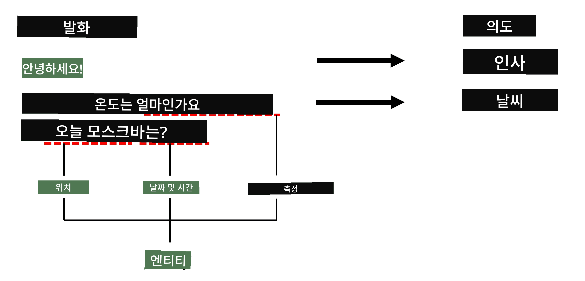

# 개체명 인식

지금까지 우리는 주로 하나의 NLP 작업인 분류에 집중해 왔습니다. 하지만 신경망을 사용하여 수행할 수 있는 다른 NLP 작업들도 있습니다. 그 중 하나가 **[개체명 인식](https://wikipedia.org/wiki/Named-entity_recognition)**(NER)으로, 텍스트 내에서 장소, 사람 이름, 날짜-시간 간격, 화학식 등 특정 개체를 인식하는 작업을 다룹니다.

## [강의 전 퀴즈](https://ff-quizzes.netlify.app/en/ai/quiz/37)

## NER 사용 예시

Amazon Alexa나 Google Assistant와 같은 자연어 챗봇을 개발하고 싶다고 가정해 봅시다. 지능형 챗봇이 작동하는 방식은 입력 문장에 대해 텍스트 분류를 수행하여 사용자가 원하는 것을 *이해*하는 것입니다. 이 분류의 결과는 챗봇이 무엇을 해야 할지를 결정하는 **의도(intent)**입니다.

> 이미지 출처: 작성자

하지만 사용자가 문구의 일부로 매개변수를 제공할 수도 있습니다. 예를 들어, 날씨를 물어볼 때 위치나 날짜를 지정할 수 있습니다. 챗봇은 이러한 개체를 이해하고, 작업을 수행하기 전에 매개변수 슬롯을 적절히 채워야 합니다. 바로 이때 NER이 필요합니다.

> ✅ 또 다른 예로는 [과학적 의학 논문 분석](https://soshnikov.com/science/analyzing-medical-papers-with-azure-and-text-analytics-for-health/)이 있습니다. 여기서 주요하게 찾아야 할 것은 질병이나 의약품과 같은 특정 의학 용어입니다. 소수의 질병은 아마도 부분 문자열 검색으로 추출할 수 있겠지만, 화학 화합물이나 약물 이름과 같은 더 복잡한 개체는 더 정교한 접근 방식이 필요합니다.

## 토큰 분류로서의 NER

NER 모델은 본질적으로 **토큰 분류 모델**입니다. 입력된 각 토큰이 개체에 속하는지 여부를 결정하고, 속한다면 어떤 개체 클래스에 속하는지를 결정해야 하기 때문입니다.

다음 논문 제목을 살펴봅시다:

**Tricuspid valve regurgitation**과 **lithium carbonate** **toxicity** in a newborn infant.

여기서 개체는 다음과 같습니다:

* Tricuspid valve regurgitation은 질병 (`DIS`)
* Lithium carbonate는 화학 물질 (`CHEM`)
* Toxicity 역시 질병 (`DIS`)

하나의 개체가 여러 토큰에 걸쳐 있을 수 있다는 점에 주목하세요. 그리고 이 경우처럼 두 개의 연속된 개체를 구별해야 할 수도 있습니다. 따라서 각 개체에 대해 두 가지 클래스를 사용하는 것이 일반적입니다. 하나는 개체의 첫 번째 토큰을 지정하는 클래스(`B-` 접두사가 사용됨, **b**eginning), 다른 하나는 개체의 나머지 부분을 지정하는 클래스(`I-`, **i**nner token). 그리고 모든 **기타** 토큰을 나타내는 `O` 클래스를 사용합니다. 이러한 토큰 태깅 방식을 [BIO 태깅](https://en.wikipedia.org/wiki/Inside%E2%80%93outside%E2%80%93beginning_(tagging)) (또는 IOB)이라고 합니다. 태깅된 제목은 다음과 같습니다:

Token | Tag
------|-----
Tricuspid | B-DIS
valve | I-DIS
regurgitation | I-DIS
and | O
lithium | B-CHEM
carbonate | I-CHEM
toxicity | B-DIS
in | O
a | O
newborn | O
infant | O
. | O

토큰과 클래스 간의 일대일 대응을 구축해야 하므로, 아래 그림에서 보이는 것처럼 **다대다** 신경망 모델을 훈련할 수 있습니다:

> *이미지 출처: [Andrej Karpathy](http://karpathy.github.io/)의 [블로그 글](http://karpathy.github.io/2015/05/21/rnn-effectiveness/). NER 토큰 분류 모델은 이 그림의 가장 오른쪽 네트워크 아키텍처에 해당합니다.*

## NER 모델 훈련

NER 모델은 본질적으로 토큰 분류 모델이기 때문에, 우리가 이미 익숙한 RNN을 이 작업에 사용할 수 있습니다. 이 경우, 순환 네트워크의 각 블록은 토큰 ID를 반환합니다. 아래의 예제 노트북은 토큰 분류를 위해 LSTM을 훈련하는 방법을 보여줍니다.

## ✍️ 예제 노트북: NER

다음 노트북에서 학습을 계속하세요:

* [TensorFlow를 사용한 NER](NER-TF.ipynb)

## 결론

NER 모델은 **토큰 분류 모델**로, 텍스트 내에서 장소, 이름, 날짜 등 특정 개체를 인식하는 데 도움을 주는 매우 일반적인 NLP 작업입니다.

## 🚀 도전 과제

아래 링크된 과제를 완료하여 의학 용어를 위한 개체명 인식 모델을 훈련한 후, 다른 데이터셋에 적용해 보세요.

## [강의 후 퀴즈](https://ff-quizzes.netlify.app/en/ai/quiz/38)

## 복습 및 자기 학습

[순환 신경망의 비합리적 효과](http://karpathy.github.io/2015/05/21/rnn-effectiveness/) 블로그 글을 읽고, 해당 글의 추가 읽기 섹션을 따라가며 지식을 심화하세요.

## [과제](lab/README.md)

이 강의의 과제에서는 의학 개체 인식 모델을 훈련해야 합니다. 이 강의에서 설명한 대로 LSTM 모델 훈련을 시작한 후, BERT 변환기 모델을 사용하는 단계로 진행하세요. 자세한 내용은 [지침](lab/README.md)을 읽어보세요.

---

