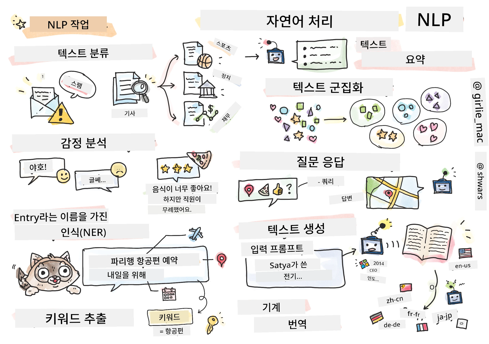

# 자연어 처리



이 섹션에서는 **자연어 처리(NLP)**와 관련된 작업을 처리하기 위해 신경망을 사용하는 방법에 대해 집중적으로 다룹니다. 컴퓨터가 해결할 수 있기를 바라는 많은 NLP 문제들이 있습니다:

* **텍스트 분류**는 텍스트 시퀀스와 관련된 전형적인 분류 문제입니다. 예를 들어, 이메일 메시지를 스팸과 비스팸으로 분류하거나, 기사를 스포츠, 비즈니스, 정치 등으로 분류하는 작업이 있습니다. 또한, 챗봇을 개발할 때 사용자가 무엇을 말하고 싶어하는지 이해해야 하는 경우가 많습니다. 이 경우 **의도 분류(intent classification)**를 다루게 됩니다. 의도 분류에서는 종종 많은 카테고리를 처리해야 합니다.
* **감정 분석**은 전형적인 회귀 문제로, 문장의 긍정적/부정적 의미를 나타내는 숫자(감정)를 부여해야 합니다. 감정 분석의 더 발전된 버전은 **측면 기반 감정 분석(ABSA)**으로, 문장 전체가 아니라 문장의 다른 부분(측면)에 감정을 부여합니다. 예: *이 레스토랑에서 요리는 마음에 들었지만 분위기는 끔찍했어요.*
* **개체명 인식(NER)**은 텍스트에서 특정 개체를 추출하는 문제를 말합니다. 예를 들어, *내일 파리로 비행기를 타야 해요*라는 문장에서 *내일*은 날짜(DATE)를, *파리*는 위치(LOCATION)를 나타낸다는 것을 이해해야 할 수 있습니다.
* **키워드 추출**은 NER과 유사하지만, 특정 개체 유형에 대해 사전 학습 없이 문장의 의미에 중요한 단어를 자동으로 추출해야 합니다.
* **텍스트 클러스터링**은 기술 지원 대화에서 유사한 요청을 그룹화하는 것처럼 유사한 문장을 함께 묶고 싶을 때 유용합니다.
* **질문 응답**은 모델이 특정 질문에 답할 수 있는 능력을 말합니다. 모델은 텍스트 단락과 질문을 입력으로 받아 질문에 대한 답이 포함된 텍스트의 위치를 제공하거나, 때로는 답변 텍스트를 생성해야 합니다.
* **텍스트 생성**은 모델이 새로운 텍스트를 생성할 수 있는 능력입니다. 이는 *텍스트 프롬프트*를 기반으로 다음 문자/단어를 예측하는 분류 작업으로 간주될 수 있습니다. GPT-3와 같은 고급 텍스트 생성 모델은 [프롬프트 프로그래밍](https://towardsdatascience.com/software-3-0-how-prompting-will-change-the-rules-of-the-game-a982fbfe1e0) 또는 [프롬프트 엔지니어링](https://medium.com/swlh/openai-gpt-3-and-prompt-engineering-dcdc2c5fcd29)이라는 기술을 사용하여 분류와 같은 다른 NLP 작업을 해결할 수 있습니다.
* **텍스트 요약**은 컴퓨터가 긴 텍스트를 "읽고" 몇 문장으로 요약하도록 하는 기술입니다.
* **기계 번역**은 한 언어에서 텍스트를 이해하고 다른 언어로 텍스트를 생성하는 작업의 조합으로 볼 수 있습니다.

초기에는 대부분의 NLP 작업이 문법과 같은 전통적인 방법을 사용하여 해결되었습니다. 예를 들어, 기계 번역에서는 구문 분석기를 사용하여 초기 문장을 구문 트리로 변환한 다음, 문장의 의미를 나타내는 상위 수준의 의미 구조를 추출하고, 이 의미와 대상 언어의 문법을 기반으로 결과를 생성했습니다. 오늘날에는 많은 NLP 작업이 신경망을 사용하여 더 효과적으로 해결되고 있습니다.

> 많은 고전적인 NLP 방법은 [Natural Language Processing Toolkit (NLTK)](https://www.nltk.org) Python 라이브러리에 구현되어 있습니다. 다양한 NLP 작업을 NLTK를 사용하여 해결하는 방법을 다룬 훌륭한 [NLTK Book](https://www.nltk.org/book/)이 온라인에서 제공됩니다.

이 강의에서는 주로 NLP를 위해 신경망을 사용하는 데 초점을 맞추고, 필요한 경우 NLTK를 사용할 것입니다.

우리는 이미 표 형식 데이터와 이미지 처리를 위해 신경망을 사용하는 방법에 대해 배웠습니다. 이러한 데이터 유형과 텍스트의 주요 차이점은 텍스트가 가변 길이의 시퀀스라는 점입니다. 반면, 이미지의 경우 입력 크기가 미리 정해져 있습니다. 합성곱 신경망은 입력 데이터에서 패턴을 추출할 수 있지만, 텍스트의 패턴은 더 복잡합니다. 예를 들어, 부정어가 주어와 여러 단어로 분리될 수 있습니다(예: *나는 오렌지를 좋아하지 않는다* vs. *나는 저 크고 화려하고 맛있는 오렌지를 좋아하지 않는다*). 이러한 경우에도 하나의 패턴으로 해석되어야 합니다. 따라서 언어를 처리하려면 *순환 신경망(recurrent networks)* 및 *트랜스포머(transformers)*와 같은 새로운 신경망 유형을 도입해야 합니다.

## 라이브러리 설치

이 강의를 로컬 Python 설치에서 실행하려는 경우, 다음 명령을 사용하여 NLP에 필요한 모든 라이브러리를 설치해야 할 수 있습니다:

**PyTorch용**
```bash
pip install -r requirements-torch.txt
```
**TensorFlow용**
```bash
pip install -r requirements-tf.txt
```

> TensorFlow를 사용한 NLP를 [Microsoft Learn](https://docs.microsoft.com/learn/modules/intro-natural-language-processing-tensorflow/?WT.mc_id=academic-77998-cacaste)에서 시도해볼 수 있습니다.

## GPU 경고

이 섹션에서는 일부 예제에서 상당히 큰 모델을 훈련시킬 것입니다.
* **GPU 지원 컴퓨터 사용**: 큰 모델 작업 시 대기 시간을 줄이기 위해 GPU 지원 컴퓨터에서 노트북을 실행하는 것이 좋습니다.
* **GPU 메모리 제약**: GPU에서 실행할 경우, 특히 큰 모델을 훈련할 때 GPU 메모리가 부족한 상황이 발생할 수 있습니다.
* **GPU 메모리 소비**: 훈련 중 소비되는 GPU 메모리 양은 미니배치 크기 등 다양한 요인에 따라 달라집니다.
* **미니배치 크기 최소화**: GPU 메모리 문제가 발생하면 코드에서 미니배치 크기를 줄이는 것을 고려해보세요.
* **TensorFlow GPU 메모리 해제**: TensorFlow의 이전 버전은 하나의 Python 커널에서 여러 모델을 훈련할 때 GPU 메모리를 올바르게 해제하지 않을 수 있습니다. GPU 메모리 사용을 효과적으로 관리하려면 TensorFlow가 필요한 경우에만 GPU 메모리를 할당하도록 설정할 수 있습니다.
* **코드 포함**: TensorFlow가 필요한 경우에만 GPU 메모리를 점진적으로 할당하도록 설정하려면 다음 코드를 노트북에 포함하세요:

```python
physical_devices = tf.config.list_physical_devices('GPU') 
if len(physical_devices)>0:
    tf.config.experimental.set_memory_growth(physical_devices[0], True) 
```

클래식 ML 관점에서 NLP를 배우고 싶다면 [이 강의 모음](https://github.com/microsoft/ML-For-Beginners/tree/main/6-NLP)을 방문하세요.

## 이 섹션에서
이 섹션에서는 다음 내용을 배웁니다:

* [텍스트를 텐서로 표현하기](13-TextRep/README.md)
* [단어 임베딩](14-Emdeddings/README.md)
* [언어 모델링](15-LanguageModeling/README.md)
* [순환 신경망](16-RNN/README.md)
* [생성 네트워크](17-GenerativeNetworks/README.md)
* [트랜스포머](18-Transformers/README.md)

**면책 조항**:  
이 문서는 AI 번역 서비스 [Co-op Translator](https://github.com/Azure/co-op-translator)를 사용하여 번역되었습니다. 정확성을 위해 최선을 다하고 있지만, 자동 번역에는 오류나 부정확성이 포함될 수 있습니다. 원본 문서를 해당 언어로 작성된 상태에서 권위 있는 자료로 간주해야 합니다. 중요한 정보의 경우, 전문적인 인간 번역을 권장합니다. 이 번역 사용으로 인해 발생하는 오해나 잘못된 해석에 대해 당사는 책임을 지지 않습니다.