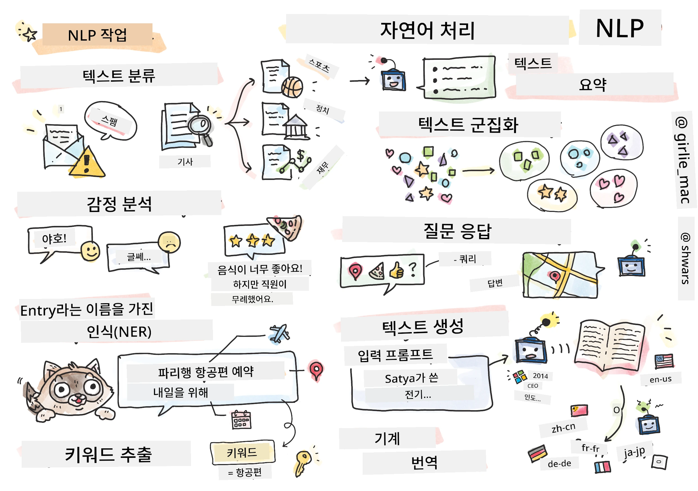

# 자연어 처리  

  

이 섹션에서는 **자연어 처리 (NLP)** 관련 작업을 다루기 위해 신경망을 사용하는 것에 집중할 것입니다. 컴퓨터가 해결할 수 있길 원하는 여러 NLP 문제가 있습니다:  

* <strong>텍스트 분류</strong>는 텍스트 시퀀스에 관련된 전형적인 분류 문제입니다. 예를 들어 이메일 메시지를 스팸 또는 스팸 아님으로 분류하거나, 기사를 스포츠, 비즈니스, 정치 등으로 분류하는 것이 있습니다. 또한 챗봇을 개발할 때는 사용자가 무엇을 말하려고 했는지를 이해해야 하는 경우가 많은데, 이 경우는 <strong>의도 분류</strong>를 다루고 있는 것입니다. 종종 의도 분류에서는 많은 카테고리를 다뤄야 합니다.  
* <strong>감성 분석</strong>은 문장의 의미가 얼마나 긍정적이거나 부정적인지를 나타내는 숫자(감성)를 할당해야 하는 전형적인 회귀 문제입니다. 감성 분석의 더 발전된 버전은 **측면 기반 감성 분석**(ABSA)이며, 문장 전체가 아니라 문장의 서로 다른 부분(측면)에 감성을 할당합니다. 예: *이 식당에서는 요리는 좋았지만 분위기는 끔찍했어요.*  
* **개체명 인식**(NER)은 텍스트에서 특정 개체를 추출하는 문제를 말합니다. 예를 들어 <em>내일 파리로 비행기를 타야 해요</em>라는 문장에서 <em>내일</em>은 날짜(DATE)를, <em>파리</em>는 장소(LOCATION)를 의미한다는 것을 이해해야 할 수 있습니다.  
* <strong>키워드 추출</strong>은 NER과 비슷하지만, 특정 개체 유형을 위한 사전 학습 없이 문장 의미에 중요한 단어들을 자동으로 추출해야 합니다.  
* <strong>텍스트 클러스터링</strong>은 비슷한 문장들을 그룹화할 때 유용할 수 있습니다. 예를 들어, 기술 지원 대화에서 비슷한 요청들을 묶을 때입니다.  
* <strong>질문 응답</strong>은 모델이 특정 질문에 답할 수 있는 능력을 말합니다. 모델은 텍스트 구절과 질문을 입력으로 받아 질문에 대한 답이 포함된 텍스트 내 위치를 제공해야 합니다(또는 때로는 답변 텍스트를 생성합니다).  
<em> <strong>텍스트 생성</strong>은 모델이 새 텍스트를 생성하는 능력입니다. 이는 어떤 </em>텍스트 프롬프트*에 기반해 다음 글자나 단어를 예측하는 분류 작업으로 볼 수 있습니다. GPT-3와 같은 고급 텍스트 생성 모델은 [프롬프트 프로그래밍](https://towardsdatascience.com/software-3-0-how-prompting-will-change-the-rules-of-the-game-a982fbfe1e0) 또는 [프롬프트 엔지니어링](https://medium.com/swlh/openai-gpt-3-and-prompt-engineering-dcdc2c5fcd29)이라고 하는 기법을 사용해 분류와 같은 다른 NLP 작업도 해결할 수 있습니다.  
* <strong>텍스트 요약</strong>은 컴퓨터가 긴 텍스트를 "읽고" 몇 문장으로 요약하게 하는 기술입니다.  
* <strong>기계 번역</strong>은 한 언어의 텍스트 이해와 다른 언어의 텍스트 생성의 결합으로 볼 수 있습니다.  

처음에는 대부분의 NLP 작업이 문법과 같은 전통적인 방법으로 해결되었습니다. 예를 들어 기계 번역에서는 파서를 사용해 초기 문장을 구문 트리로 변환한 다음, 문장의 의미를 나타내는 더 높은 수준의 의미 구조를 추출하고, 이 의미와 목표 언어의 문법을 기반으로 결과를 생성했습니다. 오늘날에는 많은 NLP 작업이 신경망을 사용해 더 효과적으로 해결됩니다.  

> 많은 고전적인 NLP 방법들이 [Natural Language Processing Toolkit (NLTK)](https://www.nltk.org) 파이썬 라이브러리로 구현되어 있습니다. 다양한 NLP 작업을 NLTK로 해결하는 방법을 다루는 훌륭한 [NLTK 책](https://www.nltk.org/book/)도 온라인에서 볼 수 있습니다.  

본 과정에서는 주로 NLP를 위해 신경망을 사용하는 데 집중하며 필요에 따라 NLTK를 사용할 것입니다.  

우리는 이미 신경망을 표 형태 데이터와 이미지 데이터를 다루는 데 사용하는 방법을 배웠습니다. 이들 데이터와 텍스트의 주요 차이점은 텍스트가 가변 길이의 시퀀스라는 점이고, 이미지의 경우 입력 크기가 미리 정해져 있다는 점입니다. 컨벌루션 네트워크가 입력 데이터에서 패턴을 추출할 수 있지만, 텍스트의 패턴은 더 복잡합니다. 예를 들어, 부정이 주어와 떨어질 수 있는데도(예: *나는 오렌지를 좋아하지 않는다* 와 *나는 그 크고 화려하며 맛있는 오렌지를 좋아하지 않는다*), 이는 하나의 패턴으로 해석되어야 합니다. 따라서 언어를 다루려면 <em>순환 신경망</em>과 <em>트랜스포머</em> 같은 새로운 신경망 유형을 도입해야 합니다.  

## 라이브러리 설치  

이 과정을 로컬 파이썬 설치에서 실행하는 경우, 다음 명령어로 NLP를 위한 모든 필요한 라이브러리를 설치해야 할 수 있습니다:  

**PyTorch용**  
```bash
pip install -r requirements-pytorch.txt
```
**TensorFlow용**  
```bash
pip install -r requirements-tf.txt
```

> [Microsoft Learn](https://docs.microsoft.com/learn/modules/intro-natural-language-processing-tensorflow/?WT.mc_id=academic-77998-cacaste)에서 TensorFlow로 NLP를 시도해 볼 수 있습니다.  

## GPU 경고  

이 섹션의 일부 예제에서는 꽤 큰 모델을 훈련할 것입니다.  
* **GPU 지원 컴퓨터 사용 권장**: 큰 모델로 작업할 때 대기 시간을 줄이기 위해 GPU 지원 컴퓨터에서 노트북을 실행하는 것이 좋습니다.  
* **GPU 메모리 제한**: GPU에서 실행 시, 특히 큰 모델 훈련 시 GPU 메모리가 부족할 수 있습니다.  
* **GPU 메모리 사용량**: 훈련 중 GPU 메모리 사용량은 미니배치 크기 등 여러 요인에 따라 달라집니다.  
* **미니배치 크기 최소화**: GPU 메모리 문제가 발생하면 코드에서 미니배치 크기를 줄이는 방법을 고려하세요.  
* **TensorFlow GPU 메모리 해제 문제**: 이전 버전의 TensorFlow는 하나의 파이썬 커널 내에서 여러 모델 훈련 시 GPU 메모리를 제대로 해제하지 않을 수 있습니다. GPU 메모리를 효과적으로 관리하려면 TensorFlow가 필요할 때만 GPU 메모리를 할당하도록 설정할 수 있습니다.  
* **코드 포함 방법**: TensorFlow가 필요 시에만 GPU 메모리 할당을 늘리도록 하려면 노트북에 다음 코드를 포함하세요:  

```python
physical_devices = tf.config.list_physical_devices('GPU') 
if len(physical_devices)>0:
    tf.config.experimental.set_memory_growth(physical_devices[0], True) 
```
  
고전적인 머신러닝 시각에서 NLP를 배우고 싶다면 [이 수업 모음](https://github.com/microsoft/ML-For-Beginners/tree/main/6-NLP)을 방문하세요.  

## 이 섹션에서  
이 섹션에서는 다음 내용을 배울 것입니다:  

* [텍스트를 텐서로 표현하기](13-TextRep/README.md)  
* [단어 임베딩](14-Embeddings/README.md)  
* [언어 모델링](15-LanguageModeling/README.md)  
* [순환 신경망](16-RNN/README.md)  
* [생성 네트워크](17-GenerativeNetworks/README.md)  
* [트랜스포머](18-Transformers/README.md)  

---

<!-- CO-OP TRANSLATOR DISCLAIMER START -->
**면책 조항**:
이 문서는 AI 번역 서비스 [Co-op Translator](https://github.com/Azure/co-op-translator)를 사용하여 번역되었습니다. 정확성을 기하기 위해 노력하고 있으나, 자동 번역은 오류나 부정확한 부분이 있을 수 있음을 유의하시기 바랍니다. 원본 문서의 원어본이 권위 있는 자료로 간주되어야 합니다. 중요한 정보의 경우, 전문가의 인간 번역을 권장합니다. 이 번역 사용으로 인해 발생하는 오해나 잘못된 해석에 대해 당사는 책임을 지지 않습니다.
<!-- CO-OP TRANSLATOR DISCLAIMER END -->