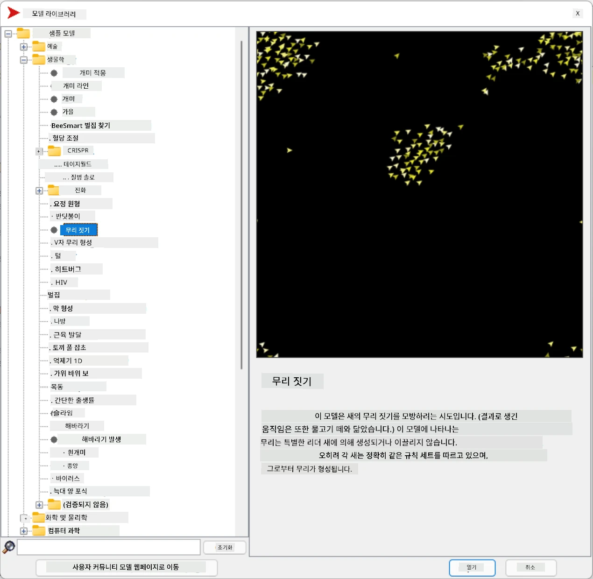
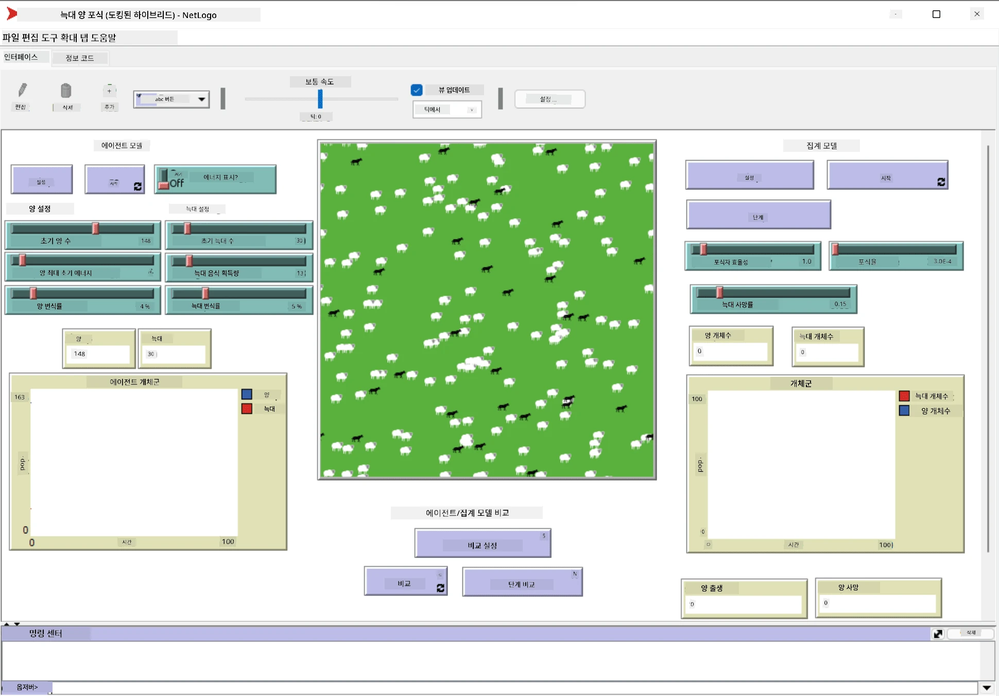

# 다중 에이전트 시스템

지능을 구현하는 한 가지 방법은 **발현적**(또는 **시너지적**) 접근법으로, 이는 비교적 간단한 여러 에이전트의 결합된 행동이 시스템 전체적으로 더 복잡하거나 지능적인 행동을 만들어낼 수 있다는 사실에 기반합니다. 이론적으로 이는 [집단 지능](https://en.wikipedia.org/wiki/Collective_intelligence), [발현주의](https://en.wikipedia.org/wiki/Global_brain), [진화적 사이버네틱스](https://en.wikipedia.org/wiki/Global_brain)의 원칙에 기반하며, 상위 시스템이 하위 시스템을 적절히 결합했을 때 추가적인 가치를 얻는다는 (*메타시스템 전환 원칙*)을 주장합니다.

## [강의 전 퀴즈](https://ff-quizzes.netlify.app/en/ai/quiz/45)

**다중 에이전트 시스템**은 1990년대 인터넷과 분산 시스템의 성장에 대응하여 AI 분야에서 등장했습니다. AI의 고전적인 교과서 중 하나인 [Artificial Intelligence: A Modern Approach](https://en.wikipedia.org/wiki/Artificial_Intelligence:_A_Modern_Approach)는 다중 에이전트 시스템 관점에서 고전적인 AI를 다룹니다.

다중 에이전트 접근법의 중심에는 **에이전트**라는 개념이 있습니다. 에이전트는 어떤 **환경**에서 살며 이를 인식하고 행동할 수 있는 존재입니다. 이 정의는 매우 광범위하며, 에이전트는 다양한 유형과 분류로 나뉠 수 있습니다:

* **추론 능력**에 따라:
   - **반응형** 에이전트는 일반적으로 간단한 요청-응답 형태의 행동을 보입니다.
   - **숙고형** 에이전트는 논리적 추론 및/또는 계획 능력을 활용합니다.
* **코드 실행 위치**에 따라:
   - **정적** 에이전트는 특정 네트워크 노드에서 작동합니다.
   - **이동형** 에이전트는 네트워크 노드 간에 코드를 이동할 수 있습니다.
* **행동 방식**에 따라:
   - **수동적 에이전트**는 특정 목표가 없습니다. 외부 자극에 반응할 수 있지만 스스로 행동을 시작하지는 않습니다.
   - **능동적 에이전트**는 추구하는 목표를 가지고 있습니다.
   - **인지적 에이전트**는 복잡한 계획과 추론을 포함합니다.

다중 에이전트 시스템은 현재 다양한 응용 분야에서 사용되고 있습니다:

* 게임에서 많은 비플레이어 캐릭터(NPC)가 AI를 활용하며, 이를 지능형 에이전트로 간주할 수 있습니다.
* 비디오 제작에서 복잡한 3D 장면을 렌더링할 때 군중을 포함한 다중 에이전트 시뮬레이션이 사용됩니다.
* 시스템 모델링에서 다중 에이전트 접근법은 복잡한 모델의 행동을 시뮬레이션하는 데 사용됩니다. 예를 들어, 다중 에이전트 접근법은 COVID-19의 전 세계적 확산을 예측하는 데 성공적으로 사용되었습니다. 유사한 접근법은 도시의 교통을 모델링하고 교통 규칙 변경에 대한 반응을 관찰하는 데도 사용할 수 있습니다.
* 복잡한 자동화 시스템에서 각 장치는 독립적인 에이전트로 작동할 수 있어 전체 시스템이 단일 구조가 아닌 더 견고한 형태를 갖게 됩니다.

우리는 다중 에이전트 시스템에 대해 깊이 다루지는 않겠지만, **다중 에이전트 모델링**의 한 가지 예를 살펴보겠습니다.

## NetLogo

[NetLogo](https://ccl.northwestern.edu/netlogo/)는 [Logo](https://en.wikipedia.org/wiki/Logo_(programming_language)) 프로그래밍 언어의 수정 버전을 기반으로 한 다중 에이전트 모델링 환경입니다. 이 언어는 어린이들에게 프로그래밍 개념을 가르치기 위해 개발되었으며, **거북이**라는 에이전트를 제어할 수 있습니다. 거북이는 이동하며 흔적을 남길 수 있어 에이전트의 행동을 시각적으로 이해하는 데 유용한 복잡한 기하학적 도형을 생성할 수 있습니다.

NetLogo에서는 `create-turtles` 명령을 사용하여 여러 거북이를 생성할 수 있습니다. 그런 다음 모든 거북이에게 특정 행동을 명령할 수 있습니다(아래 예에서는 앞으로 10 포인트 이동):

```
create-turtles 10
ask turtles [
  forward 10
]
```

물론 모든 거북이가 동일한 행동을 하는 것은 흥미롭지 않으므로 특정 지점 근처에 있는 거북이 그룹에 `ask` 명령을 사용할 수 있습니다. 또한 `breed [cats cat]` 명령을 사용하여 서로 다른 *종*의 거북이를 생성할 수 있습니다. 여기서 `cat`은 종의 이름이며, 명령의 명확성을 위해 단수와 복수 형태를 모두 지정해야 합니다.

> ✅ NetLogo 언어 자체를 배우는 데 시간을 할애하지는 않겠습니다. 더 배우고 싶다면 훌륭한 [초보자용 인터랙티브 NetLogo 사전](https://ccl.northwestern.edu/netlogo/bind/)을 방문해 보세요.

NetLogo를 [다운로드](https://ccl.northwestern.edu/netlogo/download.shtml)하여 설치하고 직접 사용해 볼 수 있습니다.

### 모델 라이브러리

NetLogo의 훌륭한 점은 작동하는 모델 라이브러리를 포함하고 있다는 것입니다. **File &rightarrow; Models Library**로 이동하면 다양한 모델 카테고리를 선택할 수 있습니다.



> Dmitry Soshnikov의 모델 라이브러리 스크린샷

모델 중 하나를 열어볼 수 있습니다. 예를 들어 **Biology &rightarrow; Flocking**을 선택하세요.

### 주요 원칙

모델을 열면 NetLogo의 주요 화면으로 이동합니다. 여기에는 유한한 자원(풀)을 고려한 늑대와 양의 개체군을 설명하는 샘플 모델이 있습니다.



> Dmitry Soshnikov의 스크린샷

이 화면에서 볼 수 있는 것은 다음과 같습니다:

* **인터페이스** 섹션:
  - 모든 에이전트가 사는 주요 필드
  - 버튼, 슬라이더 등 다양한 컨트롤
  - 시뮬레이션 매개변수를 표시할 수 있는 그래프
* **코드** 탭:
  - NetLogo 프로그램을 작성할 수 있는 편집기

대부분의 경우 인터페이스에는 시뮬레이션 상태를 초기화하는 **Setup** 버튼과 실행을 시작하는 **Go** 버튼이 있습니다. 이는 코드에서 다음과 같은 핸들러로 처리됩니다:

```
to go [
...
]
```

NetLogo의 세계는 다음과 같은 객체로 구성됩니다:

* **에이전트**(거북이): 필드를 가로질러 이동하며 행동을 수행합니다. `ask turtles [...]` 구문을 사용하여 에이전트에게 명령을 내릴 수 있으며, 대괄호 안의 코드는 모든 에이전트가 *거북이 모드*에서 실행합니다.
* **패치**: 에이전트가 사는 필드의 정사각형 영역입니다. 동일한 패치에 있는 모든 에이전트를 참조하거나 패치 색상 및 기타 속성을 변경할 수 있습니다. 또한 `ask patches`를 사용하여 패치에 작업을 수행하도록 할 수 있습니다.
* **관찰자**: 세계를 제어하는 고유한 에이전트입니다. 모든 버튼 핸들러는 *관찰자 모드*에서 실행됩니다.

> ✅ 다중 에이전트 환경의 장점은 거북이 모드 또는 패치 모드에서 실행되는 코드가 모든 에이전트에 의해 동시에 병렬로 실행된다는 점입니다. 따라서 개별 에이전트의 행동을 프로그래밍하는 간단한 코드만 작성해도 시뮬레이션 시스템 전체의 복잡한 행동을 생성할 수 있습니다.

### 군집 행동

다중 에이전트 행동의 예로 **[군집 행동](https://en.wikipedia.org/wiki/Flocking_(behavior))**을 살펴보겠습니다. 군집 행동은 새 떼가 나는 방식과 매우 유사한 복잡한 패턴입니다. 새 떼가 나는 모습을 보면 그들이 어떤 집단 알고리즘을 따르거나 *집단 지능*을 가지고 있는 것처럼 보일 수 있습니다. 그러나 이 복잡한 행동은 각 개별 에이전트(이 경우 *새*)가 가까운 거리 내의 다른 에이전트를 관찰하고 다음 세 가지 간단한 규칙을 따를 때 발생합니다:

* **정렬** - 이웃 에이전트의 평균 방향으로 조정합니다.
* **응집** - 이웃의 평균 위치로 조정하려고 합니다(*장거리 끌림*).
* **분리** - 다른 새와 너무 가까워지면 멀어지려고 합니다(*단거리 반발*).

군집 행동 예제를 실행하여 행동을 관찰할 수 있습니다. 또한 *분리 정도*나 *시야 범위*와 같은 매개변수를 조정할 수 있습니다. 시야 범위를 0으로 줄이면 모든 새가 눈이 멀어 군집 행동이 멈춥니다. 분리를 0으로 줄이면 모든 새가 일렬로 모입니다.

> ✅ **코드** 탭으로 전환하여 군집 행동의 세 가지 규칙(정렬, 응집, 분리)이 코드에서 어떻게 구현되었는지 확인하세요. 시야 내에 있는 에이전트만 참조하는 방식을 주목하세요.

### 다른 모델 보기

다음은 실험해볼 만한 몇 가지 흥미로운 모델입니다:

* **Art &rightarrow; Fireworks**는 불꽃놀이가 개별 불꽃 스트림의 집단 행동으로 간주될 수 있음을 보여줍니다.
* **Social Science &rightarrow; Traffic Basic** 및 **Social Science &rightarrow; Traffic Grid**는 교통 신호가 있는 경우와 없는 경우의 1D 및 2D 그리드에서 도시 교통 모델을 보여줍니다. 시뮬레이션에서 각 자동차는 다음 규칙을 따릅니다:
   - 앞이 비어 있으면 가속(최대 속도까지)
   - 앞에 장애물이 보이면 감속(운전자가 볼 수 있는 거리 조정 가능)
* **Social Science &rightarrow; Party**는 칵테일 파티 동안 사람들이 어떻게 그룹을 형성하는지 보여줍니다. 그룹의 행복도가 가장 빠르게 증가하는 매개변수 조합을 찾을 수 있습니다.

이러한 예에서 볼 수 있듯이 다중 에이전트 시뮬레이션은 동일하거나 유사한 논리를 따르는 개별 구성원으로 이루어진 복잡한 시스템의 행동을 이해하는 데 매우 유용할 수 있습니다. 또한 컴퓨터 게임의 [NPC](https://en.wikipedia.org/wiki/NPC)나 3D 애니메이션 세계의 에이전트를 제어하는 데도 사용할 수 있습니다.

## 숙고형 에이전트

위에서 설명한 에이전트는 환경 변화에 알고리즘을 사용하여 반응하는 매우 간단한 **반응형 에이전트**입니다. 그러나 때로는 에이전트가 추론하고 행동을 계획할 수 있으며, 이 경우 **숙고형 에이전트**라고 합니다.

전형적인 예는 인간으로부터 휴가 여행을 예약하라는 지시를 받는 개인 에이전트입니다. 인터넷에 살고 있는 여러 에이전트가 이를 도울 수 있다고 가정해 봅시다. 이 에이전트는 다른 에이전트에게 연락하여 이용 가능한 항공편, 다양한 날짜의 호텔 가격을 확인하고 최적의 가격을 협상해야 합니다. 휴가 계획이 완료되고 소유자가 확인하면 예약을 진행할 수 있습니다.

이를 위해 에이전트는 **통신**이 필요합니다. 성공적인 통신을 위해서는 다음이 필요합니다:

* [Knowledge Interchange Format](https://en.wikipedia.org/wiki/Knowledge_Interchange_Format) (KIF) 및 [Knowledge Query and Manipulation Language](https://en.wikipedia.org/wiki/Knowledge_Query_and_Manipulation_Language) (KQML)과 같은 **지식을 교환하기 위한 표준 언어**. 이러한 언어는 [발화 행위 이론](https://en.wikipedia.org/wiki/Speech_act)에 기반하여 설계되었습니다.
* **협상 프로토콜**을 포함하는 언어, 다양한 **경매 유형**에 기반.
* 동일한 개념을 참조하고 의미를 이해할 수 있는 **공통 온톨로지**.
* 다른 에이전트가 무엇을 할 수 있는지 **발견**하는 방법, 역시 온톨로지 기반.

숙고형 에이전트는 반응형 에이전트보다 훨씬 복잡합니다. 환경 변화에 반응하는 것뿐만 아니라 *행동을 시작*할 수 있어야 합니다. 숙고형 에이전트의 제안된 아키텍처 중 하나는 **Belief-Desire-Intention (BDI)** 에이전트입니다:

* **Beliefs**는 에이전트의 환경에 대한 지식 집합을 형성합니다. 이는 지식 기반이나 환경의 특정 상황에 적용할 수 있는 규칙 집합으로 구조화될 수 있습니다.
* **Desires**는 에이전트가 하고자 하는 것을 정의합니다, 즉 목표입니다. 예를 들어, 위의 개인 비서 에이전트의 목표는 여행을 예약하는 것이며, 호텔 에이전트의 목표는 이익을 극대화하는 것입니다.
* **Intentions**는 에이전트가 목표를 달성하기 위해 계획하는 특정 행동입니다. 행동은 일반적으로 환경을 변화시키고 다른 에이전트와의 통신을 유발합니다.

다중 에이전트 시스템을 구축하기 위한 플랫폼으로는 [JADE](https://jade.tilab.com/) 등이 있습니다. [이 논문](https://arxiv.org/ftp/arxiv/papers/2007/2007.08961.pdf)은 다중 에이전트 플랫폼에 대한 리뷰와 함께 다중 에이전트 시스템의 간략한 역사 및 다양한 사용 사례를 포함하고 있습니다.

## 결론

다중 에이전트 시스템은 매우 다양한 형태를 취할 수 있으며 많은 응용 분야에서 사용될 수 있습니다. 
이들은 모두 개별 에이전트의 간단한 행동에 초점을 맞추고, **시너지 효과**를 통해 전체 시스템의 더 복잡한 행동을 달성합니다.

## 🚀 도전 과제

이 수업을 실제 세계에 적용하여 문제를 해결할 수 있는 다중 에이전트 시스템을 구상해 보세요. 예를 들어, 학교 버스 경로를 최적화하기 위해 다중 에이전트 시스템이 무엇을 해야 할까요? 빵집에서는 어떻게 작동할 수 있을까요?

## [강의 후 퀴즈](https://ff-quizzes.netlify.app/en/ai/quiz/46)

## 복습 및 자기 학습

산업에서 이 유형의 시스템 사용을 검토하세요. 제조업이나 비디오 게임 산업과 같은 도메인을 선택하여 다중 에이전트 시스템이 독특한 문제를 해결하는 데 어떻게 사용될 수 있는지 알아보세요.

## [NetLogo 과제](assignment.md)

---

