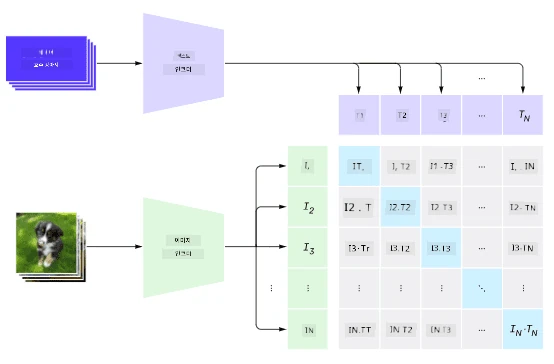
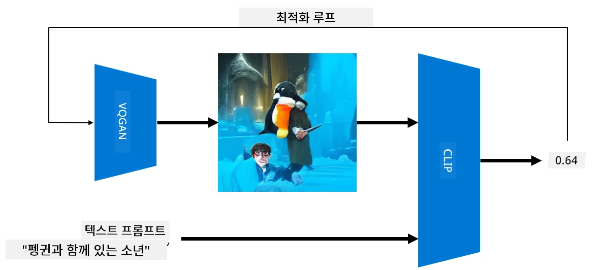

# 멀티모달 네트워크

Transformer 모델이 NLP 작업을 해결하는 데 성공한 이후, 동일하거나 유사한 아키텍처가 컴퓨터 비전 작업에도 적용되었습니다. 시각적 정보와 자연어 처리 능력을 *결합*하는 모델을 구축하려는 관심이 점점 커지고 있습니다. 이러한 시도 중 하나는 OpenAI에서 개발한 CLIP와 DALL.E입니다.

## 대조적 이미지 사전 학습 (CLIP)

CLIP의 주요 아이디어는 텍스트 프롬프트와 이미지를 비교하여 이미지가 프롬프트와 얼마나 잘 일치하는지 판단하는 것입니다.

> *[이 블로그 글](https://openai.com/blog/clip/)에서 가져온 이미지*

이 모델은 인터넷에서 얻은 이미지와 해당 캡션을 사용하여 학습됩니다. 각 배치에서 N개의 (이미지, 텍스트) 쌍을 가져와 이를 벡터 표현으로 변환합니다. 

그런 다음 이러한 표현을 서로 매칭합니다. 손실 함수는 한 쌍(예: I와 T)에 해당하는 벡터 간의 코사인 유사성을 최대화하고, 다른 모든 쌍 간의 코사인 유사성을 최소화하도록 정의됩니다. 이러한 접근 방식이 **대조적**이라고 불리는 이유입니다.

CLIP 모델/라이브러리는 [OpenAI GitHub](https://github.com/openai/CLIP)에서 사용할 수 있습니다. 이 접근 방식은 [이 블로그 글](https://openai.com/blog/clip/)과 [이 논문](https://arxiv.org/pdf/2103.00020.pdf)에서 자세히 설명되어 있습니다.

모델이 사전 학습된 후에는 이미지 배치와 텍스트 프롬프트 배치를 제공하면, 텐서 형태의 확률을 반환합니다. CLIP은 여러 작업에 사용할 수 있습니다:

**이미지 분류**

예를 들어, 고양이, 개, 인간을 분류해야 한다고 가정해 봅시다. 이 경우 모델에 이미지를 제공하고, "*고양이 사진*", "*개 사진*", "*인간 사진*"과 같은 일련의 텍스트 프롬프트를 제공합니다. 결과 벡터에서 가장 높은 값을 가진 인덱스를 선택하면 됩니다.

> *[이 블로그 글](https://openai.com/blog/clip/)에서 가져온 이미지*

**텍스트 기반 이미지 검색**

반대로도 사용할 수 있습니다. 이미지 컬렉션이 있다면, 이 컬렉션을 모델에 전달하고 텍스트 프롬프트를 제공하면, 주어진 프롬프트와 가장 유사한 이미지를 반환합니다.

## ✍️ 예제: [CLIP을 이용한 이미지 분류 및 이미지 검색](../../../../../lessons/X-Extras/X1-MultiModal/Clip.ipynb)

[Clip.ipynb](../../../../../lessons/X-Extras/X1-MultiModal/Clip.ipynb) 노트북을 열어 CLIP의 실제 사용 사례를 확인하세요.

## VQGAN+CLIP을 이용한 이미지 생성

CLIP은 텍스트 프롬프트를 기반으로 **이미지 생성**에도 사용할 수 있습니다. 이를 위해서는 **생성 모델**이 필요하며, 이 모델은 벡터 입력을 기반으로 이미지를 생성할 수 있어야 합니다. 이러한 모델 중 하나는 [VQGAN](https://compvis.github.io/taming-transformers/) (Vector-Quantized GAN)입니다.

VQGAN이 일반적인 [GAN](../../4-ComputerVision/10-GANs/README.md)과 차별화되는 주요 아이디어는 다음과 같습니다:
* 이미지 구성 요소를 생성하는 문맥이 풍부한 시각적 부분의 시퀀스를 생성하기 위해 자동회귀 Transformer 아키텍처를 사용합니다. 이러한 시각적 부분은 [CNN](../../4-ComputerVision/07-ConvNets/README.md)에 의해 학습됩니다.
* 이미지의 일부가 "진짜"인지 "가짜"인지 감지하는 서브 이미지 판별기를 사용합니다 (전통적인 GAN의 "전체 또는 없음" 접근 방식과는 다릅니다).

VQGAN에 대해 더 알아보려면 [Taming Transformers](https://compvis.github.io/taming-transformers/) 웹사이트를 방문하세요.

VQGAN과 전통적인 GAN의 중요한 차이점 중 하나는 후자가 어떤 입력 벡터로도 괜찮은 이미지를 생성할 수 있는 반면, VQGAN은 일관성이 없는 이미지를 생성할 가능성이 높다는 점입니다. 따라서 이미지 생성 과정을 추가로 안내해야 하며, 이를 CLIP을 사용하여 수행할 수 있습니다.

텍스트 프롬프트에 해당하는 이미지를 생성하려면, 먼저 VQGAN을 통해 이미지를 생성하는 임의의 인코딩 벡터로 시작합니다. 그런 다음 CLIP을 사용하여 이미지가 텍스트 프롬프트와 얼마나 잘 일치하는지 보여주는 손실 함수를 생성합니다. 이후 목표는 이 손실을 최소화하는 것이며, 역전파를 사용하여 입력 벡터 매개변수를 조정합니다.

VQGAN+CLIP을 구현한 훌륭한 라이브러리는 [Pixray](http://github.com/pixray/pixray)입니다.

 |   | 
----|----|----
프롬프트 *문학을 가르치는 젊은 남성 교사의 근접 수채화 초상화, 책을 들고 있음*으로 생성된 이미지 | 프롬프트 *컴퓨터 과학을 가르치는 젊은 여성 교사의 근접 유화 초상화, 컴퓨터와 함께 있음*으로 생성된 이미지 | 프롬프트 *수학을 가르치는 나이 든 남성 교사의 근접 유화 초상화, 칠판 앞에 있음*으로 생성된 이미지

> **Artificial Teachers** 컬렉션에서 가져온 이미지, [Dmitry Soshnikov](http://soshnikov.com)

## DALL-E
### [DALL-E 1](https://openai.com/research/dall-e)
DALL-E는 프롬프트에서 이미지를 생성하도록 훈련된 GPT-3의 버전입니다. 120억 개의 매개변수로 학습되었습니다.

CLIP과 달리, DALL-E는 텍스트와 이미지를 단일 토큰 스트림으로 처리합니다. 따라서 여러 프롬프트에서 텍스트를 기반으로 이미지를 생성할 수 있습니다.

### [DALL-E 2](https://openai.com/dall-e-2)
DALL-E 1과 2의 주요 차이점은 DALL-E 2가 더 현실적인 이미지와 예술 작품을 생성한다는 점입니다.

DALL-E를 사용한 이미지 생성 예:
 |   | 
----|----|----
프롬프트 *문학을 가르치는 젊은 남성 교사의 근접 수채화 초상화, 책을 들고 있음*으로 생성된 이미지 | 프롬프트 *컴퓨터 과학을 가르치는 젊은 여성 교사의 근접 유화 초상화, 컴퓨터와 함께 있음*으로 생성된 이미지 | 프롬프트 *수학을 가르치는 나이 든 남성 교사의 근접 유화 초상화, 칠판 앞에 있음*으로 생성된 이미지

## 참고 자료

* VQGAN 논문: [Taming Transformers for High-Resolution Image Synthesis](https://compvis.github.io/taming-transformers/paper/paper.pdf)
* CLIP 논문: [Learning Transferable Visual Models From Natural Language Supervision](https://arxiv.org/pdf/2103.00020.pdf)

**면책 조항**:  
이 문서는 AI 번역 서비스 [Co-op Translator](https://github.com/Azure/co-op-translator)를 사용하여 번역되었습니다. 정확성을 위해 최선을 다하고 있지만, 자동 번역에는 오류나 부정확성이 포함될 수 있습니다. 원본 문서의 원어 버전을 권위 있는 출처로 간주해야 합니다. 중요한 정보에 대해서는 전문적인 인간 번역을 권장합니다. 이 번역 사용으로 인해 발생하는 오해나 잘못된 해석에 대해 책임을 지지 않습니다.