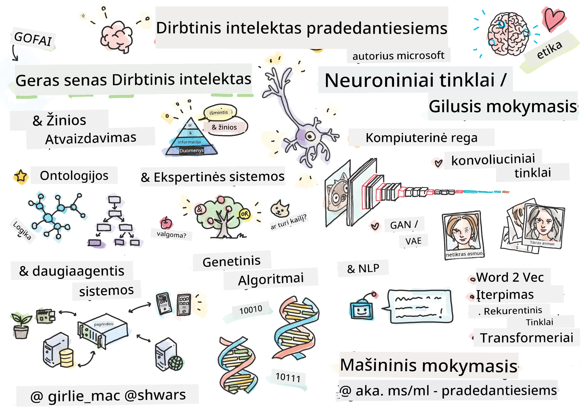

[](https://github.com/microsoft/AI-For-Beginners/blob/main/LICENSE)
[](https://GitHub.com/microsoft/AI-For-Beginners/graphs/contributors/)
[](https://GitHub.com/microsoft/AI-For-Beginners/issues/)
[](https://GitHub.com/microsoft/AI-For-Beginners/pulls/)
[](http://makeapullrequest.com)

[](https://GitHub.com/microsoft/AI-For-Beginners/watchers/)
[](https://GitHub.com/microsoft/AI-For-Beginners/network/)
[](https://GitHub.com/microsoft/AI-For-Beginners/stargazers/)
[](https://mybinder.org/v2/gh/microsoft/ai-for-beginners/HEAD)
[](https://gitter.im/Microsoft/ai-for-beginners?utm_source=badge&utm_medium=badge&utm_campaign=pr-badge)

[](https://discord.gg/nTYy5BXMWG)

# Dirbtinis intelektas pradedantiesiems - mokymo programa

||
|:---:|
| Dirbtinis intelektas pradedantiesiems - _Sketchnote by [@girlie_mac](https://twitter.com/girlie_mac)_ |

Tyrinėkite **dirbtinio intelekto** (DI) pasaulį su mūsų 12 savaičių, 24 pamokų mokymo programa! Ji apima praktines pamokas, viktorinas ir laboratorinius darbus. Mokymo programa yra pritaikyta pradedantiesiems ir apima tokias priemones kaip TensorFlow ir PyTorch, taip pat dirbtinio intelekto etiką.


### 🌐 Daugiafunkcė kalbų palaikymas

#### Palaikoma per GitHub Action (Automatizuota ir visada atnaujinta)

<!-- CO-OP TRANSLATOR LANGUAGES TABLE START -->
[Arabų](../ar/README.md) | [Bengalų](../bn/README.md) | [Bulgarų](../bg/README.md) | [Birmiečių (Mianmaras)](../my/README.md) | [Kinų (supaprastinta)](../zh-CN/README.md) | [Kinų (tradicinė, Honkongas)](../zh-HK/README.md) | [Kinų (tradicinė, Makao)](../zh-MO/README.md) | [Kinų (tradicinė, Taivanas)](../zh-TW/README.md) | [Kroatų](../hr/README.md) | [Čekų](../cs/README.md) | [Danų](../da/README.md) | [Olandų](../nl/README.md) | [Estų](../et/README.md) | [Suomių](../fi/README.md) | [Prancūzų](../fr/README.md) | [Vokiečių](../de/README.md) | [Graikų](../el/README.md) | [Hebrajų](../he/README.md) | [Hindi](../hi/README.md) | [Vengrų](../hu/README.md) | [Indoneziečių](../id/README.md) | [Italų](../it/README.md) | [Japonų](../ja/README.md) | [Kannadų](../kn/README.md) | [Korėjiečių](../ko/README.md) | [Lietuvių](./README.md) | [Malajų](../ms/README.md) | [Malajalamų](../ml/README.md) | [Maratų](../mr/README.md) | [Nepaliečių](../ne/README.md) | [Nigerijos pidžino](../pcm/README.md) | [Norvegų](../no/README.md) | [Persų (Farsi)](../fa/README.md) | [Lenkų](../pl/README.md) | [Portugalų (Brazilija)](../pt-BR/README.md) | [Portugalų (Portugalija)](../pt-PT/README.md) | [Pandžabių (Gurmukhi)](../pa/README.md) | [Rumunų](../ro/README.md) | [Rusų](../ru/README.md) | [Serbų (kirilica)](../sr/README.md) | [Slovakų](../sk/README.md) | [Slovėnų](../sl/README.md) | [Ispanų](../es/README.md) | [Svahilio](../sw/README.md) | [Švedų](../sv/README.md) | [Tagalogų (Filipinų)](../tl/README.md) | [Tamilų](../ta/README.md) | [Telugų](../te/README.md) | [Tajų](../th/README.md) | [Turkų](../tr/README.md) | [Ukrainiečių](../uk/README.md) | [Urdu](../ur/README.md) | [Vietnamiečių](../vi/README.md)

> **Norite klonuoti vietoje?**

> Ši repozitorija apima daugiau nei 50 kalbų vertimus, kurie ženkliai padidina atsisiuntimo dydį. Norėdami klonuoti be vertimų, naudokite retą atsisiuntimą:
> ```bash
> git clone --filter=blob:none --sparse https://github.com/microsoft/AI-For-Beginners.git
> cd AI-For-Beginners
> git sparse-checkout set --no-cone '/*' '!translations' '!translated_images'
> ```
> Tai suteikia jums viską, ko reikia kursui užbaigti, su daug greitesniu atsisiuntimu.
<!-- CO-OP TRANSLATOR LANGUAGES TABLE END -->

**Jei norite, kad būtų palaikomos papildomos vertimų kalbos, jos išvardytos [čia](https://github.com/Azure/co-op-translator/blob/main/getting_started/supported-languages.md)**

## Prisijunkite prie bendruomenės
[](https://discord.gg/nTYy5BXMWG)

## Ko išmoksite

**[Kurso minties žemėlapis](http://soshnikov.com/courses/ai-for-beginners/mindmap.html)**

Šioje mokymo programoje jūs išmoksite:

* Skirtingus dirbtinio intelekto požiūrius, įskaitant "gerą seną" simbolinį požiūrį su **Žinių atvaizdavimu** ir samprotavimu ([GOFAI](https://en.wikipedia.org/wiki/Symbolic_artificial_intelligence)).
* **Neuroninius tinklus** ir **gilųjį mokymąsi**, kurie yra šiuolaikinio DI pagrindas. Mes iliustruosime šių svarbių temų koncepcijas naudojant kodą dviejose populiariausiose sistemose - [TensorFlow](http://Tensorflow.org) ir [PyTorch](http://pytorch.org).
* **Neuronines architektūras** darbui su vaizdais ir tekstu. Mes aptarsime naujausius modelius, tačiau galbūt šiek tiek trūks informacijos apie naujausią pažangą.
* Mažiau populiarius DI metodus, tokius kaip **genetiniai algoritmai** ir **daugiaveiksmės sistemos**.

Ko šioje mokymo programoje neaplankysime:

> [Raskite visas papildomas išteklius šiam kursui mūsų Microsoft Learn kolekcijoje](https://learn.microsoft.com/en-us/collections/7w28iy2xrqzdj0?WT.mc_id=academic-77998-bethanycheum)

* Verslo atvejus, susijusius su **DI versle**. Apsvarstykite galimybę pasirinkti [Įvadas į DI verslo naudotojams](https://docs.microsoft.com/learn/paths/introduction-ai-for-business-users/?WT.mc_id=academic-77998-bethanycheum) mokymosi kelią Microsoft Learn, arba [DI verslo mokyklą](https://www.microsoft.com/ai/ai-business-school/?WT.mc_id=academic-77998-bethanycheum), sukurtą bendradarbiaujant su [INSEAD](https://www.insead.edu/).
* **Klasikinį mašininį mokymąsi**, kuris gerai aprašytas mūsų [Mašininio mokymosi pradedantiesiems mokymo programoje](http://github.com/Microsoft/ML-for-Beginners).
* Praktines DI taikymas naudojant **[Cognitive Services](https://azure.microsoft.com/services/cognitive-services/?WT.mc_id=academic-77998-bethanycheum)**. Tam rekomenduojame pradėti nuo Microsoft Learn modulių apie [viziją](https://docs.microsoft.com/learn/paths/create-computer-vision-solutions-azure-cognitive-services/?WT.mc_id=academic-77998-bethanycheum), [natūralios kalbos apdorojimą](https://docs.microsoft.com/learn/paths/explore-natural-language-processing/?WT.mc_id=academic-77998-bethanycheum), **[generatyvų DI su Azure OpenAI paslauga](https://learn.microsoft.com/en-us/training/paths/develop-ai-solutions-azure-openai/?WT.mc_id=academic-77998-bethanycheum)** ir kt.
* Specifines ML **debesų sistemas**, tokias kaip [Azure Machine Learning](https://azure.microsoft.com/services/machine-learning/?WT.mc_id=academic-77998-bethanycheum), [Microsoft Fabric](https://learn.microsoft.com/en-us/training/paths/get-started-fabric/?WT.mc_id=academic-77998-bethanycheum) arba [Azure Databricks](https://docs.microsoft.com/learn/paths/data-engineer-azure-databricks?WT.mc_id=academic-77998-bethanycheum). Apsvarstykite galimybę naudotis mokymosi keliais [Build and operate machine learning solutions with Azure Machine Learning](https://docs.microsoft.com/learn/paths/build-ai-solutions-with-azure-ml-service/?WT.mc_id=academic-77998-bethanycheum) ir [Build and Operate Machine Learning Solutions with Azure Databricks](https://docs.microsoft.com/learn/paths/build-operate-machine-learning-solutions-azure-databricks/?WT.mc_id=academic-77998-bethanycheum).
* **Pokalbinį DI** ir **patvirtintuvų robotus**. Tam yra atskiras [Sukurti pokalbinio DI sprendimus](https://docs.microsoft.com/learn/paths/create-conversational-ai-solutions/?WT.mc_id=academic-77998-bethanycheum) mokymosi kelias, taip pat galite kreiptis į [šį tinklaraščio įrašą](https://soshnikov.com/azure/hello-bot-conversational-ai-on-microsoft-platform/) išsamiau.
* **Gilias matematikas**, esančias už gilaus mokymosi. Tam rekomenduojame [Deep Learning](https://www.amazon.com/Deep-Learning-Adaptive-Computation-Machine/dp/0262035618) Ian Goodfellow, Yoshua Bengio ir Aaron Courville, kuris taip pat prieinamas internete adresu [https://www.deeplearningbook.org/](https://www.deeplearningbook.org/).

Norėdami švelniai įsisavinti _DI debesyse_ temas, galite pasirinkti [Pradėti dirbtinį intelektą Azure](https://docs.microsoft.com/learn/paths/get-started-with-artificial-intelligence-on-azure/?WT.mc_id=academic-77998-bethanycheum) mokymosi kelią.

# Turinys

|     |                                                                 Pamokos nuoroda                                                                  |                                           PyTorch/Keras/TensorFlow                                          | Laboratorija                                                            |
| :-: | :------------------------------------------------------------------------------------------------------------------------------------------: | :---------------------------------------------------------------------------------------------: | ------------------------------------------------------------------------------ |
| 0  |                                 [Kurso nustatymai](./lessons/0-course-setup/setup.md)                                 |                      [Sukurkite savo kūrimo aplinką](./lessons/0-course-setup/how-to-run.md)                       |   |
| I  |               [**Įvadas į DI**](./lessons/1-Intro/README.md)      | | |
| 01  |       [Įvadas ir DI istorija](./lessons/1-Intro/README.md)       |           -                            | -  |
| II |              **Simbolinis DI**              |
| 02  |       [Žinių atvaizdavimas ir ekspertinės sistemos](./lessons/2-Symbolic/README.md)       |            [Ekspertinės sistemos](./lessons/2-Symbolic/Animals.ipynb) /  [Ontologija](./lessons/2-Symbolic/FamilyOntology.ipynb) /[Koncepcijų grafas](./lessons/2-Symbolic/MSConceptGraph.ipynb)                             |  |
| III |                        [**Įvadas į neuroninius tinklus**](./lessons/3-NeuralNetworks/README.md) |||
| 03  |                [Perceptronas](./lessons/3-NeuralNetworks/03-Perceptron/README.md)                 |                       [Užrašų knygelė](./lessons/3-NeuralNetworks/03-Perceptron/Perceptron.ipynb)                      | [Laboratorija](./lessons/3-NeuralNetworks/03-Perceptron/lab/README.md) |
| 04  |                   [Daugiapakopis perceptronas ir savo karkaso kūrimas](./lessons/3-NeuralNetworks/04-OwnFramework/README.md)                   |        [Užrašų knygelė](./lessons/3-NeuralNetworks/04-OwnFramework/OwnFramework.ipynb)        | [Laboratorija](./lessons/3-NeuralNetworks/04-OwnFramework/lab/README.md) |
| 05  |            [Įvadas į karkasus (PyTorch/TensorFlow) ir persimokymas](./lessons/3-NeuralNetworks/05-Frameworks/README.md)             |           [PyTorch](./lessons/3-NeuralNetworks/05-Frameworks/IntroPyTorch.ipynb) / [Keras](./lessons/3-NeuralNetworks/05-Frameworks/IntroKeras.ipynb) / [TensorFlow](./lessons/3-NeuralNetworks/05-Frameworks/IntroKerasTF.ipynb)             | [Laboratorija](./lessons/3-NeuralNetworks/05-Frameworks/lab/README.md) |
| IV  |            [**Kompiuterinė vizija**](./lessons/4-ComputerVision/README.md)             | [PyTorch](https://docs.microsoft.com/learn/modules/intro-computer-vision-pytorch/?WT.mc_id=academic-77998-cacaste) / [TensorFlow](https://docs.microsoft.com/learn/modules/intro-computer-vision-TensorFlow/?WT.mc_id=academic-77998-cacaste)| [Tyrinėkite kompiuterinę viziją Microsoft Azure](https://learn.microsoft.com/en-us/collections/7w28iy2xrqzdj0?WT.mc_id=academic-77998-bethanycheum) |
| 06  |            [Įvadas į kompiuterinę viziją. OpenCV](./lessons/4-ComputerVision/06-IntroCV/README.md)             |           [Užrašų knygelė](./lessons/4-ComputerVision/06-IntroCV/OpenCV.ipynb)         | [Laboratorija](./lessons/4-ComputerVision/06-IntroCV/lab/README.md) |
| 07  |            [Sukonvoliuciniai neuroniniai tinklai](./lessons/4-ComputerVision/07-ConvNets/README.md) &  [SUK architektūros](./lessons/4-ComputerVision/07-ConvNets/CNN_Architectures.md)             |           [PyTorch](./lessons/4-ComputerVision/07-ConvNets/ConvNetsPyTorch.ipynb) /[TensorFlow](./lessons/4-ComputerVision/07-ConvNets/ConvNetsTF.ipynb)             | [Laboratorija](./lessons/4-ComputerVision/07-ConvNets/lab/README.md) |
| 08  |            [Iš anksto apmokyti tinklai ir perdavimo mokymasis](./lessons/4-ComputerVision/08-TransferLearning/README.md) ir [Mokymo triukai](./lessons/4-ComputerVision/08-TransferLearning/TrainingTricks.md)             |           [PyTorch](./lessons/4-ComputerVision/08-TransferLearning/TransferLearningPyTorch.ipynb) / [TensorFlow](./lessons/3-NeuralNetworks/05-Frameworks/IntroKerasTF.ipynb)             | [Laboratorija](./lessons/4-ComputerVision/08-TransferLearning/lab/README.md) |
| 09  |            [Autoenkoderiai ir VAE](./lessons/4-ComputerVision/09-Autoencoders/README.md)             |           [PyTorch](./lessons/4-ComputerVision/09-Autoencoders/AutoEncodersPyTorch.ipynb) / [TensorFlow](./lessons/4-ComputerVision/09-Autoencoders/AutoencodersTF.ipynb)             |  |
| 10  |            [Generatyviniai priešininkų tinklai ir meninio stiliaus perkėlimas](./lessons/4-ComputerVision/10-GANs/README.md)             |           [PyTorch](./lessons/4-ComputerVision/10-GANs/GANPyTorch.ipynb) / [TensorFlow](./lessons/4-ComputerVision/10-GANs/GANTF.ipynb)             |  |
| 11  |            [Objektų aptikimas](./lessons/4-ComputerVision/11-ObjectDetection/README.md)             |         [TensorFlow](./lessons/4-ComputerVision/11-ObjectDetection/ObjectDetection.ipynb)             | [Laboratorija](./lessons/4-ComputerVision/11-ObjectDetection/lab/README.md) |
| 12  |            [Semantinė segmentacija. U-Net](./lessons/4-ComputerVision/12-Segmentation/README.md)             |           [PyTorch](./lessons/4-ComputerVision/12-Segmentation/SemanticSegmentationPytorch.ipynb) / [TensorFlow](./lessons/4-ComputerVision/12-Segmentation/SemanticSegmentationTF.ipynb)             |  |
| V  |            [**Natūralios kalbos apdorojimas**](./lessons/5-NLP/README.md)             | [PyTorch](https://docs.microsoft.com/learn/modules/intro-natural-language-processing-pytorch/?WT.mc_id=academic-77998-cacaste) /[TensorFlow](https://docs.microsoft.com/learn/modules/intro-natural-language-processing-TensorFlow/?WT.mc_id=academic-77998-cacaste) | [Tyrinėkite natūralios kalbos apdorojimą Microsoft Azure](https://learn.microsoft.com/en-us/collections/7w28iy2xrqzdj0?WT.mc_id=academic-77998-bethanycheum)|
| 13  |            [Teksto atvaizdavimas. Bow/TF-IDF](./lessons/5-NLP/13-TextRep/README.md)             |           [PyTorch](https://github.com/microsoft/AI-For-Beginners/blob/main/lessons/5-NLP/13-TextRep/TextRepresentationPyTorch.ipynb) / [TensorFlow](https://github.com/microsoft/AI-For-Beginners/blob/main/lessons/5-NLP/13-TextRep/TextRepresentationTF.ipynb)             | |
| 14  |            [Semantinės žodžių įterptinės reikšmės. Word2Vec ir GloVe](./lessons/5-NLP/14-Embeddings/README.md)             |           [PyTorch](https://github.com/microsoft/AI-For-Beginners/blob/main/lessons/5-NLP/14-Embeddings/EmbeddingsPyTorch.ipynb) / [TensorFlow](https://github.com/microsoft/AI-For-Beginners/blob/main/lessons/5-NLP/14-Embeddings/EmbeddingsTF.ipynb)             |  |
| 15  |            [Kalbos modeliavimas. Savų įterptinių reikšmių mokymas](./lessons/5-NLP/15-LanguageModeling/README.md)             |           [PyTorch](https://github.com/microsoft/AI-For-Beginners/blob/main/lessons/5-NLP/15-LanguageModeling/CBoW-PyTorch.ipynb) / [TensorFlow](https://github.com/microsoft/AI-For-Beginners/blob/main/lessons/5-NLP/15-LanguageModeling/CBoW-TF.ipynb)             | [Laboratorija](./lessons/5-NLP/15-LanguageModeling/lab/README.md) |
| 16  |            [Rekurentiniai neuroniniai tinklai](./lessons/5-NLP/16-RNN/README.md)             |           [PyTorch](https://github.com/microsoft/AI-For-Beginners/blob/main/lessons/5-NLP/16-RNN/RNNPyTorch.ipynb) / [TensorFlow](https://github.com/microsoft/AI-For-Beginners/blob/main/lessons/5-NLP/16-RNN/RNNTF.ipynb)             |  |
| 17  |            [Generatyviniai rekurentiniai tinklai](./lessons/5-NLP/17-GenerativeNetworks/README.md)             |           [PyTorch](https://github.com/microsoft/AI-For-Beginners/blob/main/lessons/5-NLP/17-GenerativeNetworks/GenerativePyTorch.ipynb) / [TensorFlow](https://github.com/microsoft/AI-For-Beginners/blob/main/lessons/5-NLP/17-GenerativeNetworks/GenerativeTF.ipynb)             | [Laboratorija](./lessons/5-NLP/17-GenerativeNetworks/lab/README.md) |
| 18  |            [Transformeriai. BERT.](./lessons/5-NLP/18-Transformers/README.md)             |           [PyTorch](https://github.com/microsoft/AI-For-Beginners/blob/main/lessons/5-NLP/18-Transformers/TransformersPyTorch.ipynb) /[TensorFlow](https://github.com/microsoft/AI-For-Beginners/blob/main/lessons/5-NLP/18-Transformers/TransformersTF.ipynb)             |  |
| 19  |            [Pavadintųjų objektų atpažinimas](./lessons/5-NLP/19-NER/README.md)             |           [TensorFlow](https://microsoft.github.io/AI-For-Beginners/lessons/5-NLP/19-NER/NER-TF.ipynb)             | [Laboratorija](./lessons/5-NLP/19-NER/lab/README.md) |
| 20  |            [Dideli kalbos modeliai, komandų programavimas ir keletas užduočių po vieną pavyzdį](./lessons/5-NLP/20-LangModels/README.md)             |           [PyTorch](https://microsoft.github.io/AI-For-Beginners/lessons/5-NLP/20-LangModels/GPT-PyTorch.ipynb) | |
| VI |            **Kitos DI technikos** || |
| 21  |            [Genetiniai algoritmai](./lessons/6-Other/21-GeneticAlgorithms/README.md)             |           [Užrašų knygelė](./lessons/6-Other/21-GeneticAlgorithms/Genetic.ipynb) | |
| 22  |            [Gilus stiprinamasis mokymasis](./lessons/6-Other/22-DeepRL/README.md)             |           [PyTorch](./lessons/6-Other/22-DeepRL/CartPole-RL-PyTorch.ipynb) /[TensorFlow](./lessons/6-Other/22-DeepRL/CartPole-RL-TF.ipynb)             | [Laboratorija](./lessons/6-Other/22-DeepRL/lab/README.md) |
| 23  |            [Daugelio agentų sistemos](./lessons/6-Other/23-MultiagentSystems/README.md)             |  | |
| VII |            **DI etika** | | |
| 24  |            [DI etika ir atsakingas DI](./lessons/7-Ethics/README.md)             |           [Microsoft Learn: Atsakingo DI principai](https://docs.microsoft.com/learn/paths/responsible-ai-business-principles/?WT.mc_id=academic-77998-cacaste) | |
| IX  |            **Papildoma medžiaga** | | |
| 25  |            [Daugiaplasmės tinklai, CLIP ir VQGAN](./lessons/X-Extras/X1-MultiModal/README.md)             |           [Užrašų knygelė](./lessons/X-Extras/X1-MultiModal/Clip.ipynb)    | |

## Kiekviena pamoka apima

* Prieš skaitymą skirtą medžiagą
* Vykdomas Jupyter užrašų knygeles, kurios dažnai būna konkrečios konkrečiam karkasui (**PyTorch** arba **TensorFlow**). Vykdoma užrašų knygelė taip pat apima daug teorinės medžiagos, todėl norint suprasti temą reikia pereiti bent vieną iš užrašų knygelės versijų (PyTorch arba TensorFlow).
* Kai kuriuose skyriuose yra **laboratorijų** su galimybe išbandyti išmoktas žinias taikant jas konkrečioje užduotyje.
* Kai kurie skyriai turi nuorodų į [**MS Learn**](https://learn.microsoft.com/en-us/collections/7w28iy2xrqzdj0?WT.mc_id=academic-77998-bethanycheum) modulius, apimančius susijusias temas.

## Pradžia

### 🎯 Naujas DI? Pradėkite čia!

Jei esate visiškai naujas DI ir norite greitų, praktinių pavyzdžių, žiūrėkite mūsų [**Pradedančiųjų draugiškus pavyzdžius**](./examples/README.md)! Tai apima:

- 🌟 **Sveikas DI pasauly!** - Jūsų pirmoji DI programa (modelių atpažinimas)
- 🧠 **Paprastas neuroninis tinklas** - Sukurkite neuroninį tinklą nuo nulio  
- 🖼️ **Vaizdų klasifikatorius** - Klasifikuokite vaizdus su išsamiais komentarais  
- 💬 **Teksto nuotaika** - Analizuokite teigiamą/neigiamą tekstą  

Šie pavyzdžiai sukurti tam, kad padėtų jums suprasti DI sąvokas prieš pradedant visą mokymo programą.

### 📚 Pilna mokymo programa

- Mes sukūrėme [įdiegimo pamoką](./lessons/0-course-setup/setup.md), kad padėtume jums nustatyti kūrimo aplinką. - Mokytojams taip pat paruošėme [mokymo programų diegimo pamoką](./lessons/0-course-setup/for-teachers.md)!  
- Kaip [paleisti kodą VSCode arba Codespace](./lessons/0-course-setup/how-to-run.md)  

Sekite šiuos žingsnius:

Padarykite sau Forką: spustelėkite mygtuką „Fork“ šio puslapio viršutiniame dešiniajame kampe.

Klonavimas: `git clone https://github.com/microsoft/AI-For-Beginners.git`

Nepamirškite pažymėti (🌟) šį repozitorijų, kad vėliau lengviau jį surastumėte.

## Susipažinkite su kitais mokiniais

Prisijunkite prie mūsų [oficialaus DI Discord serverio](https://aka.ms/genai-discord?WT.mc_id=academic-105485-bethanycheum), kur galėsite susipažinti ir užmegzti ryšius su kitais šią kursą besimokančiais bei gauti pagalbą.

Jei turite produktų atsiliepimų ar klausimų kuriant, apsilankykite mūsų [Azure AI Foundry kūrėjų forume](https://aka.ms/foundry/forum)

## Testai

> **Pastaba apie testus**: Visi testai yra Quiz-app aplanke adresu etc\quiz-app arba [internete čia](https://ff-quizzes.netlify.app/). Jie yra susieti pamokose, testų programą galite paleisti vietoje arba išdiegti į Azure; vadovaukitės nurodymais `quiz-app` aplanke. Testai palaipsniui lokalizuojami.

## Reikalinga pagalba

Ar turite pasiūlymų arba radote rašybos ar kodo klaidų? Užregistruokite problemą arba sukurkite pull request.

## Specialūs padėkos žodžiai

* **✍️ Pagrindinis autorius:** [Dmitry Soshnikov](http://soshnikov.com), PhD  
* **🔥 Redaktorius:** [Jen Looper](https://twitter.com/jenlooper), PhD  
* **🎨 Iliustratorė:** [Tomomi Imura](https://twitter.com/girlie_mac)  
* **✅ Testų kūrėja:** [Lateefah Bello](https://github.com/CinnamonXI), [MLSA](https://studentambassadors.microsoft.com/)  
* **🙏 Pagrindiniai bendradarbiai:** [Evgenii Pishchik](https://github.com/Pe4enIks)  

## Kitos mokymo programos

Mūsų komanda kuria ir kitas mokymo programas! Peržiūrėkite:

<!-- CO-OP TRANSLATOR OTHER COURSES START -->
### LangChain
[](https://aka.ms/langchain4j-for-beginners)  
[](https://aka.ms/langchainjs-for-beginners?WT.mc_id=m365-94501-dwahlin)  
[](https://github.com/microsoft/langchain-for-beginners?WT.mc_id=m365-94501-dwahlin)  
---

### Azure / Edge / MCP / Agentai
[](https://github.com/microsoft/AZD-for-beginners?WT.mc_id=academic-105485-koreyst)  
[](https://github.com/microsoft/edgeai-for-beginners?WT.mc_id=academic-105485-koreyst)  
[](https://github.com/microsoft/mcp-for-beginners?WT.mc_id=academic-105485-koreyst)  
[](https://github.com/microsoft/ai-agents-for-beginners?WT.mc_id=academic-105485-koreyst)  

---

### Generatyvioji DI serija  
[](https://github.com/microsoft/generative-ai-for-beginners?WT.mc_id=academic-105485-koreyst)  
[-9333EA?style=for-the-badge&labelColor=E5E7EB&color=9333EA)](https://github.com/microsoft/Generative-AI-for-beginners-dotnet?WT.mc_id=academic-105485-koreyst)  
[-C084FC?style=for-the-badge&labelColor=E5E7EB&color=C084FC)](https://github.com/microsoft/generative-ai-for-beginners-java?WT.mc_id=academic-105485-koreyst)  
[-E879F9?style=for-the-badge&labelColor=E5E7EB&color=E879F9)](https://github.com/microsoft/generative-ai-with-javascript?WT.mc_id=academic-105485-koreyst)  

---

### Pagrindinis mokymasis  
[](https://aka.ms/ml-beginners?WT.mc_id=academic-105485-koreyst)  
[](https://aka.ms/datascience-beginners?WT.mc_id=academic-105485-koreyst)  
[](https://aka.ms/ai-beginners?WT.mc_id=academic-105485-koreyst)  
[](https://github.com/microsoft/Security-101?WT.mc_id=academic-96948-sayoung)  
[](https://aka.ms/webdev-beginners?WT.mc_id=academic-105485-koreyst)  
[](https://aka.ms/iot-beginners?WT.mc_id=academic-105485-koreyst)  
[](https://github.com/microsoft/xr-development-for-beginners?WT.mc_id=academic-105485-koreyst)  

---

### Copilot serija  
[](https://aka.ms/GitHubCopilotAI?WT.mc_id=academic-105485-koreyst)  
[](https://github.com/microsoft/mastering-github-copilot-for-dotnet-csharp-developers?WT.mc_id=academic-105485-koreyst)  
[](https://github.com/microsoft/CopilotAdventures?WT.mc_id=academic-105485-koreyst)  
<!-- CO-OP TRANSLATOR OTHER COURSES END -->

## Pagalbos gavimas

Jei įstrigote ar turite klausimų apie DI programų kūrimą, prisijunkite prie bendraminčių mokinių ir patyrusių kūrėjų diskusijose apie MCP. Čia draugiška bendruomenė, kurioje klausimai yra laukiami, o žinios laisvai dalijamos.

[](https://discord.gg/nTYy5BXMWG)

Jeigu turite produktų atsiliepimų ar klaidų kūrimo metu, apsilankykite:

[](https://aka.ms/foundry/forum)

---

<!-- CO-OP TRANSLATOR DISCLAIMER START -->
**Atsakomybės apribojimas**:
Šis dokumentas išverstas naudojant dirbtinio intelekto vertimo paslaugą [Co-op Translator](https://github.com/Azure/co-op-translator). Nors siekiame tikslumo, prašome suprasti, kad automatizuoti vertimai gali turėti klaidų ar netikslumų. Pradiniame kalbos dokumente pateikta versija yra laikoma autoritetingu šaltiniu. Jei reikia kritinės informacijos, rekomenduojamas profesionalus žmogaus vertimas. Mes nesame atsakingi už jokius nesusipratimus ar klaidingus aiškinimus, kilusius naudojant šį vertimą.
<!-- CO-OP TRANSLATOR DISCLAIMER END -->