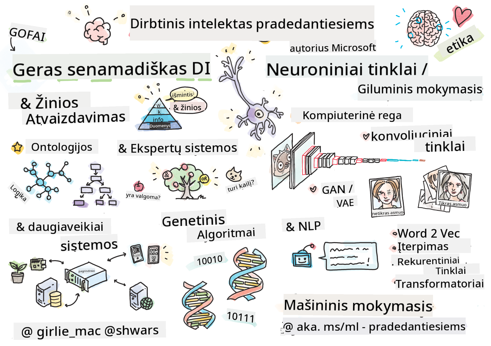

<!--
CO_OP_TRANSLATOR_METADATA:
{
  "original_hash": "14816e97d79b296c87811724f7785923",
  "translation_date": "2026-01-01T13:36:49+00:00",
  "source_file": "README.md",
  "language_code": "lt"
}
-->

# Dirbtinis intelektas pradedantiesiems - Mokymo programa

||
|:---:|
| Dirbtinis intelektas pradedantiesiems - _Sketchnote autorius [@girlie_mac](https://twitter.com/girlie_mac)_ |

Explore the world of **Dirbtinio intelekto** (DI) with our 12-week, 24-lesson curriculum!  It includes practical lessons, quizzes, and labs. The curriculum is beginner-friendly and covers tools like TensorFlow and PyTorch, as well as ethics in AI

### 🌐 Daugiakalbė parama

#### Palaikoma per GitHub Action (automatizuota ir visada atnaujinama)

<!-- CO-OP TRANSLATOR LANGUAGES TABLE START -->
[Arabų](../ar/README.md) | [Bengalų](../bn/README.md) | [Bulgarų](../bg/README.md) | [Birmos (Mianmaras)](../my/README.md) | [Kinų (supaprastintoji)](../zh/README.md) | [Kinų (tradicinė, Honkongas)](../hk/README.md) | [Kinų (tradicinė, Makao)](../mo/README.md) | [Kinų (tradicinė, Taivanas)](../tw/README.md) | [Kroatų](../hr/README.md) | [Čekų](../cs/README.md) | [Danų](../da/README.md) | [Olandų](../nl/README.md) | [Estų](../et/README.md) | [Suomių](../fi/README.md) | [Prancūzų](../fr/README.md) | [Vokiečių](../de/README.md) | [Graikų](../el/README.md) | [Hebrajų](../he/README.md) | [Hindi](../hi/README.md) | [Vengrų](../hu/README.md) | [Indoneziečių](../id/README.md) | [Italų](../it/README.md) | [Japonų](../ja/README.md) | [Kannadų](../kn/README.md) | [Korėjiečių](../ko/README.md) | [Lietuvių](./README.md) | [Malajų](../ms/README.md) | [Malajalamų](../ml/README.md) | [Maratų](../mr/README.md) | [Nepaliečių](../ne/README.md) | [Nigerijos pidžino](../pcm/README.md) | [Norvegų](../no/README.md) | [Persų (farsi)](../fa/README.md) | [Lenkų](../pl/README.md) | [Portugalų (Brazilija)](../br/README.md) | [Portugalų (Portugalija)](../pt/README.md) | [Pandžabų (Gurmukhi)](../pa/README.md) | [Rumunų](../ro/README.md) | [Rusų](../ru/README.md) | [Serbų (kirilica)](../sr/README.md) | [Slovakų](../sk/README.md) | [Slovenų](../sl/README.md) | [Ispanų](../es/README.md) | [Svahili](../sw/README.md) | [Švedų](../sv/README.md) | [Tagalog (filipiniečių)](../tl/README.md) | [Tamilų](../ta/README.md) | [Telugų](../te/README.md) | [Tajų](../th/README.md) | [Turkų](../tr/README.md) | [Ukrainiečių](../uk/README.md) | [Urdu](../ur/README.md) | [Vietnamiečių](../vi/README.md)
<!-- CO-OP TRANSLATOR LANGUAGES TABLE END -->

**Jei norite, kad būtų pridėta daugiau vertimų, palaikomos kalbos išvardytos [čia](https://github.com/Azure/co-op-translator/blob/main/getting_started/supported-languages.md)**

## Prisijunkite prie bendruomenės

## Ką išmoksite

**[Kurso minčių žemėlapis](http://soshnikov.com/courses/ai-for-beginners/mindmap.html)**

Šioje mokymo programoje jūs išmoksite:

* Skirtingi Dirbtinio intelekto požiūriai, įskaitant „seną gerą“ simbolinį požiūrį su **Žinių reprezentacija** ir samprotavimu ([GOFAI](https://en.wikipedia.org/wiki/Symbolic_artificial_intelligence)).
* **Neuroniniai tinklai** ir **gilaus mokymosi** metodai, kurie yra moderniojo DI šerdis. Paaiškinsime šių svarbių temų konceptus naudodami kodą dviejuose populiariausiuose karkasuose - [TensorFlow](http://Tensorflow.org) ir [PyTorch](http://pytorch.org).
* **Neuroninės architektūros** darbui su vaizdais ir tekstu. Aptarsime naujausius modelius, tačiau gali būti, kad nesieksime paties pažangiausio lygio.
* Mažiau populiarūs DI požiūriai, tokie kaip **genetiniai algoritmai** ir **daugiagentės sistemos**.

Ko ši mokymo programa neapims:

> [Raskite visas papildomas šio kurso medžiagas mūsų Microsoft Learn rinkinyje](https://learn.microsoft.com/en-us/collections/7w28iy2xrqzdj0?WT.mc_id=academic-77998-bethanycheum)

* Verslo atvejai, kaip naudoti **DI versle**. Apsvarstykite galimybę atlikti [Įvadą į DI verslo naudotojams](https://docs.microsoft.com/learn/paths/introduction-ai-for-business-users/?WT.mc_id=academic-77998-bethanycheum) Microsoft Learn mokymosi kelią arba [AI Business School](https://www.microsoft.com/ai/ai-business-school/?WT.mc_id=academic-77998-bethanycheum), sukurtą bendradarbiaujant su [INSEAD](https://www.insead.edu/).
* **Klasikinis mašininis mokymasis**, kuris gerai aprašytas mūsų [Mašininio mokymosi pradedantiesiems mokymo programoje](http://github.com/Microsoft/ML-for-Beginners).
* Praktinės DI programos, sukurtos naudojant **[Cognitive Services](https://azure.microsoft.com/services/cognitive-services/?WT.mc_id=academic-77998-bethanycheum)**. Tam rekomenduojame pradėti nuo Microsoft Learn modulių apie [kompiuterinį matymą](https://docs.microsoft.com/learn/paths/create-computer-vision-solutions-azure-cognitive-services/?WT.mc_id=academic-77998-bethanycheum), [natūralios kalbos apdorojimą](https://docs.microsoft.com/learn/paths/explore-natural-language-processing/?WT.mc_id=academic-77998-bethanycheum), **[Generatyvus DI su Azure OpenAI Service](https://learn.microsoft.com/en-us/training/paths/develop-ai-solutions-azure-openai/?WT.mc_id=academic-77998-bethanycheum)** ir kt.
* Konkrečios ML **debesis palaikančios platformos**, tokios kaip [Azure Machine Learning](https://azure.microsoft.com/services/machine-learning/?WT.mc_id=academic-77998-bethanycheum), [Microsoft Fabric](https://learn.microsoft.com/en-us/training/paths/get-started-fabric/?WT.mc_id=academic-77998-bethanycheum) arba [Azure Databricks](https://docs.microsoft.com/learn/paths/data-engineer-azure-databricks?WT.mc_id=academic-77998-bethanycheum). Apsvarstykite galimybę naudoti mokymosi kelius [Kurti ir valdyti mašininio mokymosi sprendimus su Azure Machine Learning](https://docs.microsoft.com/learn/paths/build-ai-solutions-with-azure-ml-service/?WT.mc_id=academic-77998-bethanycheum) ir [Kurti ir valdyti mašininio mokymosi sprendimus su Azure Databricks](https://docs.microsoft.com/learn/paths/build-operate-machine-learning-solutions-azure-databricks/?WT.mc_id=academic-77998-bethanycheum).
* **Pokalbių DI** ir **pokalbių robotai**. Yra atskiras [Sukurti pokalbių DI sprendimus](https://docs.microsoft.com/learn/paths/create-conversational-ai-solutions/?WT.mc_id=academic-77998-bethanycheum) mokymosi kelias, taip pat galite kreiptis į [šią tinklaraščio įrašą](https://soshnikov.com/azure/hello-bot-conversational-ai-on-microsoft-platform/) dėl išsamesnės informacijos.
* Gylis matematikoje, esantis už giluminio mokymosi. Tam rekomenduojame Ian Goodfellow, Yoshua Bengio ir Aaron Courville knygą [Deep Learning](https://www.amazon.com/Deep-Learning-Adaptive-Computation-Machine/dp/0262035618), kuri taip pat prieinama internete [https://www.deeplearningbook.org/](https://www.deeplearningbook.org/).

Norint paprasto įvado į _DI debesyje_ temas, apsvarstykite [Pradėti darbą su dirbtiniu intelektu Azure](https://docs.microsoft.com/learn/paths/get-started-with-artificial-intelligence-on-azure/?WT.mc_id=academic-77998-bethanycheum) mokymosi kelią.

# Turinys

|     |                                                                 Pamokos nuoroda                                                                  |                                           PyTorch/Keras/TensorFlow                                          | Laboratorija                                                            |
| :-: | :------------------------------------------------------------------------------------------------------------------------------------------: | :---------------------------------------------------------------------------------------------: | ------------------------------------------------------------------------------ |
| 0  |                                 [Kurso paruošimas](./lessons/0-course-setup/setup.md)                                 |                      [Paruoškite savo kūrimo aplinką](./lessons/0-course-setup/how-to-run.md)                       |   |
| I  |               [**Įvadas į DI**](./lessons/1-Intro/README.md)      | | |
| 01  |       [Įvadas ir DI istorija](./lessons/1-Intro/README.md)       |           -                            | -  |
| II |              **Simbolinis DI**              |
| 02  |       [Žinių reprezentacija ir ekspertinės sistemos](./lessons/2-Symbolic/README.md)       |            [Ekspertinės sistemos](./lessons/2-Symbolic/Animals.ipynb) /  [Ontologija](./lessons/2-Symbolic/FamilyOntology.ipynb) /[Konceptų grafas](./lessons/2-Symbolic/MSConceptGraph.ipynb)                             |  |
| III |                        [**Įvadas į neuroninius tinklus**](./lessons/3-NeuralNetworks/README.md) |||
| 03  |                [Perceptron](./lessons/3-NeuralNetworks/03-Perceptron/README.md)                 |                       [Užrašinė](./lessons/3-NeuralNetworks/03-Perceptron/Perceptron.ipynb)                      | [Laboratorija](./lessons/3-NeuralNetworks/03-Perceptron/lab/README.md) |
| 04  |                   [Daugiasluoksnis perceptronas ir savo karkaso kūrimas](./lessons/3-NeuralNetworks/04-OwnFramework/README.md)                   |        [Užrašinė](./lessons/3-NeuralNetworks/04-OwnFramework/OwnFramework.ipynb)        | [Laboratorija](./lessons/3-NeuralNetworks/04-OwnFramework/lab/README.md) |
| 05  |            [Įvadas į karkastus (PyTorch/TensorFlow) ir persimokymas](./lessons/3-NeuralNetworks/05-Frameworks/README.md)             |           [PyTorch](./lessons/3-NeuralNetworks/05-Frameworks/IntroPyTorch.ipynb) / [Keras](./lessons/3-NeuralNetworks/05-Frameworks/IntroKeras.ipynb) / [TensorFlow](./lessons/3-NeuralNetworks/05-Frameworks/IntroKerasTF.ipynb)             | [Laboratorija](./lessons/3-NeuralNetworks/05-Frameworks/lab/README.md) |
| IV  |            [**Kompiuterinė rega**](./lessons/4-ComputerVision/README.md)             | [PyTorch](https://docs.microsoft.com/learn/modules/intro-computer-vision-pytorch/?WT.mc_id=academic-77998-cacaste) / [TensorFlow](https://docs.microsoft.com/learn/modules/intro-computer-vision-TensorFlow/?WT.mc_id=academic-77998-cacaste)| [Tyrinėkite kompiuterinę regą Microsoft Azure](https://learn.microsoft.com/en-us/collections/7w28iy2xrqzdj0?WT.mc_id=academic-77998-bethanycheum) |
| 06  |            [Įvadas į kompiuterinę regą. OpenCV](./lessons/4-ComputerVision/06-IntroCV/README.md)             |           [Užrašinė](./lessons/4-ComputerVision/06-IntroCV/OpenCV.ipynb)         | [Laboratorija](./lessons/4-ComputerVision/06-IntroCV/lab/README.md) |
| 07  |            [Konvoliuciniai neuroniniai tinklai](./lessons/4-ComputerVision/07-ConvNets/README.md) &  [CNN Architectures](./lessons/4-ComputerVision/07-ConvNets/CNN_Architectures.md)             |           [PyTorch](./lessons/4-ComputerVision/07-ConvNets/ConvNetsPyTorch.ipynb) /[TensorFlow](./lessons/4-ComputerVision/07-ConvNets/ConvNetsTF.ipynb)             | [Laboratorija](./lessons/4-ComputerVision/07-ConvNets/lab/README.md) |
| 08  |            [Iš anksto apmokėti tinklai ir perkėlimo mokymasis](./lessons/4-ComputerVision/08-TransferLearning/README.md) and [Training Tricks](./lessons/4-ComputerVision/08-TransferLearning/TrainingTricks.md)             |           [PyTorch](./lessons/4-ComputerVision/08-TransferLearning/TransferLearningPyTorch.ipynb) / [TensorFlow](./lessons/3-NeuralNetworks/05-Frameworks/IntroKerasTF.ipynb)             | [Laboratorija](./lessons/4-ComputerVision/08-TransferLearning/lab/README.md) |
| 09  |            [Autoenkoderiai ir VAE](./lessons/4-ComputerVision/09-Autoencoders/README.md)             |           [PyTorch](./lessons/4-ComputerVision/09-Autoencoders/AutoEncodersPyTorch.ipynb) / [TensorFlow](./lessons/4-ComputerVision/09-Autoencoders/AutoencodersTF.ipynb)             |  |
| 10  |            [Generatyviniai priešininkų tinklai ir meninio stiliaus perkėlimas](./lessons/4-ComputerVision/10-GANs/README.md)             |           [PyTorch](./lessons/4-ComputerVision/10-GANs/GANPyTorch.ipynb) / [TensorFlow](./lessons/4-ComputerVision/10-GANs/GANTF.ipynb)             |  |
| 11  |            [Objektų aptikimas](./lessons/4-ComputerVision/11-ObjectDetection/README.md)             |         [TensorFlow](./lessons/4-ComputerVision/11-ObjectDetection/ObjectDetection.ipynb)             | [Laboratorija](./lessons/4-ComputerVision/11-ObjectDetection/lab/README.md) |
| 12  |            [Semantinė segmentacija. U-Net](./lessons/4-ComputerVision/12-Segmentation/README.md)             |           [PyTorch](./lessons/4-ComputerVision/12-Segmentation/SemanticSegmentationPytorch.ipynb) / [TensorFlow](./lessons/4-ComputerVision/12-Segmentation/SemanticSegmentationTF.ipynb)             |  |
| V  |            [**Natūralios kalbos apdorojimas**](./lessons/5-NLP/README.md)             | [PyTorch](https://docs.microsoft.com/learn/modules/intro-natural-language-processing-pytorch/?WT.mc_id=academic-77998-cacaste) /[TensorFlow](https://docs.microsoft.com/learn/modules/intro-natural-language-processing-TensorFlow/?WT.mc_id=academic-77998-cacaste) | [Tyrinėkite natūralios kalbos apdorojimą Microsoft Azure](https://learn.microsoft.com/en-us/collections/7w28iy2xrqzdj0?WT.mc_id=academic-77998-bethanycheum)|
| 13  |            [Teksto atvaizdavimas. BoW/TF-IDF](./lessons/5-NLP/13-TextRep/README.md)             |           [PyTorch](https://github.com/microsoft/AI-For-Beginners/blob/main/lessons/5-NLP/13-TextRep/TextRepresentationPyTorch.ipynb) / [TensorFlow](https://github.com/microsoft/AI-For-Beginners/blob/main/lessons/5-NLP/13-TextRep/TextRepresentationTF.ipynb)             | |
| 14  |            [Semantiniai žodžių įterpimai. Word2Vec ir GloVe](./lessons/5-NLP/14-Embeddings/README.md)             |           [PyTorch](https://github.com/microsoft/AI-For-Beginners/blob/main/lessons/5-NLP/14-Embeddings/EmbeddingsPyTorch.ipynb) / [TensorFlow](https://github.com/microsoft/AI-For-Beginners/blob/main/lessons/5-NLP/14-Embeddings/EmbeddingsTF.ipynb)             |  |
| 15  |            [Kalbos modeliavimas. Savo įterpimų mokymas](./lessons/5-NLP/15-LanguageModeling/README.md)             |           [PyTorch](https://github.com/microsoft/AI-For-Beginners/blob/main/lessons/5-NLP/15-LanguageModeling/CBoW-PyTorch.ipynb) / [TensorFlow](https://github.com/microsoft/AI-For-Beginners/blob/main/lessons/5-NLP/15-LanguageModeling/CBoW-TF.ipynb)             | [Laboratorija](./lessons/5-NLP/15-LanguageModeling/lab/README.md) |
| 16  |            [Rekurentiniai neuroniniai tinklai](./lessons/5-NLP/16-RNN/README.md)             |           [PyTorch](https://github.com/microsoft/AI-For-Beginners/blob/main/lessons/5-NLP/16-RNN/RNNPyTorch.ipynb) / [TensorFlow](https://github.com/microsoft/AI-For-Beginners/blob/main/lessons/5-NLP/16-RNN/RNNTF.ipynb)             |  |
| 17  |            [Generatyviniai rekurentiniai tinklai](./lessons/5-NLP/17-GenerativeNetworks/README.md)             |           [PyTorch](https://github.com/microsoft/AI-For-Beginners/blob/main/lessons/5-NLP/17-GenerativeNetworks/GenerativePyTorch.ipynb) / [TensorFlow](https://github.com/microsoft/AI-For-Beginners/blob/main/lessons/5-NLP/17-GenerativeNetworks/GenerativeTF.ipynb)             | [Laboratorija](./lessons/5-NLP/17-GenerativeNetworks/lab/README.md) |
| 18  |            [Transformeriai. BERT.](./lessons/5-NLP/18-Transformers/README.md)             |           [PyTorch](https://github.com/microsoft/AI-For-Beginners/blob/main/lessons/5-NLP/18-Transformers/TransformersPyTorch.ipynb) /[TensorFlow](https://github.com/microsoft/AI-For-Beginners/blob/main/lessons/5-NLP/18-Transformers/TransformersTF.ipynb)             |  |
| 19  |            [Vardinių vienetų atpažinimas](./lessons/5-NLP/19-NER/README.md)             |           [TensorFlow](https://microsoft.github.io/AI-For-Beginners/lessons/5-NLP/19-NER/NER-TF.ipynb)             | [Laboratorija](./lessons/5-NLP/19-NER/lab/README.md) |
| 20  |            [Dideli kalbos modeliai, užklausų programavimas ir kelių pavyzdžių (few-shot) užduotys](./lessons/5-NLP/20-LangModels/README.md)             |           [PyTorch](https://microsoft.github.io/AI-For-Beginners/lessons/5-NLP/20-LangModels/GPT-PyTorch.ipynb) | |
| VI |            **Kitos DI technikos** || |
| 21  |            [Genetiniai algoritmai](./lessons/6-Other/21-GeneticAlgorithms/README.md)             |           [Užrašinė](./lessons/6-Other/21-GeneticAlgorithms/Genetic.ipynb) | |
| 22  |            [Giluminis sustiprinimo mokymasis](./lessons/6-Other/22-DeepRL/README.md)             |           [PyTorch](./lessons/6-Other/22-DeepRL/CartPole-RL-PyTorch.ipynb) /[TensorFlow](./lessons/6-Other/22-DeepRL/CartPole-RL-TF.ipynb)             | [Laboratorija](./lessons/6-Other/22-DeepRL/lab/README.md) |
| 23  |            [Daugiagentinės sistemos](./lessons/6-Other/23-MultiagentSystems/README.md)             |  | |
| VII |            **Dirbtinio intelekto etika** | | |
| 24  |            [Dirbtinio intelekto etika ir atsakingas DI](./lessons/7-Ethics/README.md)             |           [Microsoft Learn: Atsakingo DI principai](https://docs.microsoft.com/learn/paths/responsible-ai-business-principles/?WT.mc_id=academic-77998-cacaste) | |
| IX  |            **Papildoma medžiaga** | | |
| 25  |            [Daugiamodaliniai tinklai, CLIP ir VQGAN](./lessons/X-Extras/X1-MultiModal/README.md)             |           [Užrašinė](./lessons/X-Extras/X1-MultiModal/Clip.ipynb)    | |

## Kiekviena pamoka apima

* Išankstinė medžiaga
* Vykdomieji Jupyter užrašynai, kurie dažnai yra specifiniai sistemai (**PyTorch** arba **TensorFlow**). Vykdomasis užrašynas taip pat talpina daug teorinės medžiagos, todėl norint suprasti temą reikia peržiūrėti bent vieną užrašyno versiją (arba **PyTorch**, arba **TensorFlow**).
* **Laboratorijos** prieinamos kai kurioms temoms, kurios suteikia galimybę pabandyti pritaikyti išmoktą medžiagą konkrečiai problemai.
* Kai kurie skyriai turi nuorodas į [**MS Learn**](https://learn.microsoft.com/en-us/collections/7w28iy2xrqzdj0?WT.mc_id=academic-77998-bethanycheum) modulius, apimančius susijusias temas.

## Kaip pradėti

### 🎯 Naujas DI? Pradėkite čia!

Jei esate visiškai naujas DI ir norite greitų, praktinių pavyzdžių, peržiūrėkite mūsų [**Pradedančiųjų pavyzdžius**](./examples/README.md)! Tai apima:

- 🌟 **Hello AI World** - Jūsų pirmoji DI programa (šablonų atpažinimas)
- 🧠 **Simple Neural Network** - Sukurkite neuroninį tinklą nuo nulio  
- 🖼️ **Image Classifier** - Klasifikuokite vaizdus su išsamiais komentarais
- 💬 **Teksto nuotaika** - Analizuoti teigiamą/neigiamą tekstą

These examples are designed to help you understand AI concepts before diving into the full curriculum.

### 📚 Pilno kurso nustatymas

- Mes sukūrėme a [paruošiamąją pamoką](./lessons/0-course-setup/setup.md) to help you with setting up your development environment. - Mokytojams mes taip pat sukūrėme a [programos paruošimo pamoką](./lessons/0-course-setup/for-teachers.md) for you too!
- Kaip [paleisti kodą VSCode arba Codepace](./lessons/0-course-setup/how-to-run.md)

Follow these steps:

Fork the Repository: Spustelėkite mygtuką "Fork" šio puslapio viršutiniame dešiniajame kampe.

Clone the Repository: `git clone https://github.com/microsoft/AI-For-Beginners.git`

Don't forget to star (🌟) this repo to find it easier later.

## Susipažinkite su kitais besimokančiaisiais

Prisijunkite prie mūsų [oficialaus AI Discord serverio](https://aka.ms/genai-discord?WT.mc_id=academic-105485-bethanycheum) to meet and network with other learners taking this course and get support.

If you have product feedback or questions whilst building visit our [Azure AI Foundry vystytojų forume](https://aka.ms/foundry/forum)

## Kvizai 

> **Pastaba apie kvizus**: Visi kvizai yra Quiz-app kataloge etc\quiz-app, or [Online Here](https://ff-quizzes.netlify.app/) They are linked from within the lessons the quiz app can be run locally or deployed to Azure; follow the instruction in the `quiz-app` folder. They are gradually being localized.

## Reikalinga pagalba

Ar turite pasiūlymų arba radote rašybos ar kodo klaidų? Pateikite problemą arba sukurkite pull request.

## Ypatingos padėkos

* **✍️ Pagrindinis autorius:** [Dmitry Soshnikov](http://soshnikov.com), PhD
* **🔥 Redaktorius:** [Jen Looper](https://twitter.com/jenlooper), PhD
* **🎨 Sketchnote iliustratorė:** [Tomomi Imura](https://twitter.com/girlie_mac)
* **✅ Kvizų kūrėjas:** [Lateefah Bello](https://github.com/CinnamonXI), [MLSA](https://studentambassadors.microsoft.com/)
* **🙏 Pagrindiniai indėlininkai:** [Evgenii Pishchik](https://github.com/Pe4enIks)

## Kitos programos

Our team produces other curricula! Check out:

<!-- CO-OP TRANSLATOR OTHER COURSES START -->
### LangChain

---

### Azure / Edge / MCP / Agentai

---
 
### Generatyvinė DI serija

[-9333EA?style=for-the-badge&labelColor=E5E7EB&color=9333EA)](https://github.com/microsoft/Generative-AI-for-beginners-dotnet?WT.mc_id=academic-105485-koreyst)
[-C084FC?style=for-the-badge&labelColor=E5E7EB&color=C084FC)](https://github.com/microsoft/generative-ai-for-beginners-java?WT.mc_id=academic-105485-koreyst)
[-E879F9?style=for-the-badge&labelColor=E5E7EB&color=E879F9)](https://github.com/microsoft/generative-ai-with-javascript?WT.mc_id=academic-105485-koreyst)

---
 
### Pagrindinis mokymasis

---
 
### Copilot serija

<!-- CO-OP TRANSLATOR OTHER COURSES END -->

## Kaip gauti pagalbą

If you get stuck or have any questions about building AI apps. Prisijunkite prie kitų besimokančiųjų ir patyrusių kūrėjų diskusijų apie MCP. Tai palaikanti bendruomenė, kurioje klausimai yra laukiami ir žinios dalijamos laisvai.

If you have product feedback or errors while building visit:

---

<!-- CO-OP TRANSLATOR DISCLAIMER START -->
**Atsakomybės apribojimas**:
Šis dokumentas buvo išverstas pasitelkiant dirbtinio intelekto vertimo paslaugą [Co-op Translator](https://github.com/Azure/co-op-translator). Nors siekiame tikslumo, atkreipkite dėmesį, kad automatiniai vertimai gali turėti klaidų arba netikslumų. Originalus dokumentas jo gimtąja kalba turi būti laikomas pagrindiniu ir įgaliojančiu šaltiniu. Svarbios informacijos atveju rekomenduojamas profesionalus žmogaus atliktas vertimas. Neatsakome už bet kokius nesusipratimus ar neteisingus aiškinimus, kilusius dėl šio vertimo naudojimo.
<!-- CO-OP TRANSLATOR DISCLAIMER END -->