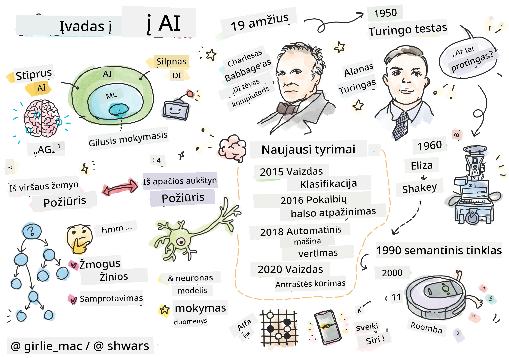
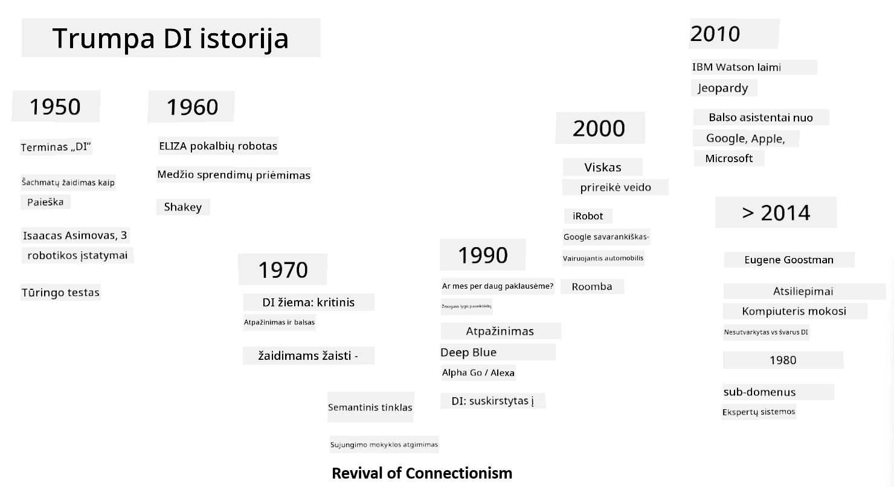

# Įvadas į dirbtinį intelektą

> Piešinys sukurtas [Tomomi Imura](https://twitter.com/girlie_mac)

## [Prieš paskaitą atlikite testą](https://ff-quizzes.netlify.app/en/ai/quiz/1)

**Dirbtinis intelektas** – tai įdomi mokslo disciplina, kuri tiria, kaip galime priversti kompiuterius demonstruoti intelektualų elgesį, pvz., atlikti tuos dalykus, kuriuos žmonės geba daryti gerai.

Iš pradžių kompiuterius išrado [Charles Babbage](https://en.wikipedia.org/wiki/Charles_Babbage), kad jie galėtų atlikti skaičiavimus pagal aiškiai apibrėžtą procedūrą – algoritmą. Šiuolaikiniai kompiuteriai, nors ir gerokai pažangesni nei XIX amžiuje pasiūlytas modelis, vis dar remiasi ta pačia kontroliuojamų skaičiavimų idėja. Todėl galima užprogramuoti kompiuterį atlikti tam tikrą užduotį, jei žinome tikslų veiksmų seką, reikalingą tikslui pasiekti.

> Nuotrauka [Vickie Soshnikova](http://twitter.com/vickievalerie)

> ✅ Nustatyti žmogaus amžių iš jo nuotraukos yra užduotis, kurios negalime aiškiai užprogramuoti, nes nežinome, kaip mūsų galvoje atsiranda tas skaičius, kai tai darome.

---

Tačiau yra užduočių, kurių sprendimo būdų mes aiškiai nežinome. Pavyzdžiui, nustatyti žmogaus amžių iš jo nuotraukos. Mes kažkaip išmokstame tai daryti, nes matėme daug įvairaus amžiaus žmonių pavyzdžių, tačiau negalime aiškiai paaiškinti, kaip tai darome, ir negalime užprogramuoti kompiuterio tai atlikti. Būtent tokios užduotys domina **dirbtinį intelektą** (trumpai – DI).

✅ Pagalvokite apie užduotis, kurias galėtumėte perduoti kompiuteriui, kad jos būtų naudingos DI. Apsvarstykite finansų, medicinos ir meno sritis – kaip šios sritys šiandien naudojasi DI?

## Silpnas DI ir stiprus DI

Silpnas DI | Stiprus DI
---------------------------------------|-------------------------------------
Silpnas DI reiškia DI sistemas, kurios sukurtos ir apmokytos atlikti konkrečią užduotį ar siaurą užduočių rinkinį.|Stiprus DI, arba dirbtinis bendrasis intelektas (AGI), reiškia DI sistemas, turinčias žmogaus lygio intelektą ir supratimą.
Šios DI sistemos nėra bendrai intelektualios; jos puikiai atlieka iš anksto apibrėžtą užduotį, tačiau neturi tikro supratimo ar sąmoningumo.|Šios DI sistemos gali atlikti bet kokią intelektualią užduotį, kurią gali atlikti žmogus, prisitaikyti prie skirtingų sričių ir turėti tam tikrą sąmoningumo ar savimonės formą.
Silpno DI pavyzdžiai yra virtualūs asistentai, tokie kaip Siri ar Alexa, rekomendacijų algoritmai, naudojami srautinio perdavimo paslaugose, ir pokalbių robotai, skirti konkrečioms klientų aptarnavimo užduotims.|Stipraus DI pasiekimas yra ilgalaikis DI tyrimų tikslas ir reikalautų sukurti DI sistemas, kurios galėtų mąstyti, mokytis, suprasti ir prisitaikyti prie įvairių užduočių ir kontekstų.
Silpnas DI yra labai specializuotas ir neturi žmogui būdingų kognityvinių gebėjimų ar bendrų problemų sprendimo galimybių už savo siaurą sritį.|Stiprus DI šiuo metu yra teorinė sąvoka, ir nė viena DI sistema dar nepasiekė šio bendrojo intelekto lygio.

Daugiau informacijos rasite **[Dirbtinis bendrasis intelektas](https://en.wikipedia.org/wiki/Artificial_general_intelligence)** (AGI).

## Intelekto apibrėžimas ir Turingo testas

Viena iš problemų, susijusių su terminu **[intelektas](https://en.wikipedia.org/wiki/Intelligence)**, yra ta, kad nėra aiškaus šio termino apibrėžimo. Galima teigti, kad intelektas susijęs su **abstrakčiu mąstymu** arba **savimone**, tačiau mes negalime jo tinkamai apibrėžti.

> [Nuotrauka](https://unsplash.com/photos/75715CVEJhI) [Amber Kipp](https://unsplash.com/@sadmax) iš Unsplash

Norėdami pamatyti, koks neaiškus yra terminas *intelektas*, pabandykite atsakyti į klausimą: „Ar katė yra intelektuali?“. Skirtingi žmonės linkę pateikti skirtingus atsakymus į šį klausimą, nes nėra visuotinai priimto testo, kuris įrodytų, kad teiginys yra teisingas ar klaidingas. O jei manote, kad toks testas yra – pabandykite priversti savo katę atlikti IQ testą...

✅ Pagalvokite minutę, kaip jūs apibrėžiate intelektą. Ar varna, kuri gali išspręsti labirintą ir pasiekti maistą, yra intelektuali? Ar vaikas yra intelektualus?

---

Kalbant apie AGI, mums reikia būdo nustatyti, ar sukūrėme tikrai intelektualią sistemą. [Alanas Turingas](https://en.wikipedia.org/wiki/Alan_Turing) pasiūlė būdą, vadinamą **[Turingo testu](https://en.wikipedia.org/wiki/Turing_test)**, kuris taip pat veikia kaip intelekto apibrėžimas. Testas lygina tam tikrą sistemą su kažkuo, kas iš prigimties yra intelektualu – tikru žmogumi, ir kadangi bet kokį automatinį palyginimą galima apeiti kompiuterine programa, naudojamas žmogus tardytojas. Taigi, jei žmogus nesugeba atskirti tikro žmogaus nuo kompiuterinės sistemos tekstiniame dialoge – sistema laikoma intelektualia.

> Pokalbių robotas, vadinamas [Eugene Goostman](https://en.wikipedia.org/wiki/Eugene_Goostman), sukurtas Sankt Peterburge, 2014 m. beveik išlaikė Turingo testą, naudodamas gudrią asmenybės taktiką. Jis iš anksto paskelbė, kad yra 13 metų ukrainietis berniukas, kas paaiškintų žinių trūkumą ir tam tikrus neatitikimus tekste. Robotas įtikino 30% teisėjų, kad jis yra žmogus po 5 minučių dialogo – tai metrika, kurią Turingas tikėjo, kad mašina galės pasiekti iki 2000 m. Tačiau reikia suprasti, kad tai nereiškia, jog sukūrėme intelektualią sistemą ar kad kompiuterinė sistema apgavo žmogų tardytoją – sistema neapgavo žmonių, o veikiau robotą sukūrę kūrėjai!

✅ Ar kada nors buvote apgauti pokalbių roboto, manydami, kad kalbate su žmogumi? Kaip jis jus įtikino?

## Skirtingi DI metodai

Jei norime, kad kompiuteris elgtųsi kaip žmogus, turime kažkaip modeliuoti mūsų mąstymo būdą kompiuteryje. Todėl turime pabandyti suprasti, kas daro žmogų intelektualų.

> Kad galėtume užprogramuoti intelektą į mašiną, turime suprasti, kaip veikia mūsų pačių sprendimų priėmimo procesai. Jei šiek tiek pasigilinsite į save, pastebėsite, kad kai kurie procesai vyksta pasąmoningai – pvz., mes galime atskirti katę nuo šuns negalvodami apie tai – o kiti apima samprotavimą.

Yra du galimi požiūriai į šią problemą:

Viršutinis požiūris (simbolinis samprotavimas) | Apatinis požiūris (neuroniniai tinklai)
---------------------------------------|-------------------------------------
Viršutinis požiūris modeliuoja, kaip žmogus samprotauja spręsdamas problemą. Tai apima **žinių** išgavimą iš žmogaus ir jų pateikimą kompiuteriui suprantama forma. Taip pat reikia sukurti būdą modeliuoti **samprotavimą** kompiuteryje. | Apatinis požiūris modeliuoja žmogaus smegenų struktūrą, sudarytą iš daugybės paprastų vienetų, vadinamų **neuronais**. Kiekvienas neuronas veikia kaip svertinis savo įėjimų vidurkis, ir mes galime išmokyti neuronų tinklą spręsti naudingas problemas, pateikdami **mokymo duomenis**.

Taip pat yra ir kitų galimų požiūrių į intelektą:

* **Emergentinis**, **sinerginis** arba **daugiaveiksmis požiūris** remiasi faktu, kad sudėtingas intelektualus elgesys gali atsirasti dėl daugybės paprastų agentų sąveikos. Pagal [evoliucinę kibernetiką](https://en.wikipedia.org/wiki/Global_brain#Evolutionary_cybernetics), intelektas gali *atsirasti* iš paprastesnio, reaktyvaus elgesio *metasistemos perėjimo* procese.

* **Evoliucinis požiūris**, arba **genetinis algoritmas**, yra optimizavimo procesas, pagrįstas evoliucijos principais.

Šiuos požiūrius aptarsime vėliau kurse, tačiau dabar sutelksime dėmesį į dvi pagrindines kryptis: viršutinį ir apatinį požiūrį.

### Viršutinis požiūris

Naudojant **viršutinį požiūrį**, mes bandome modeliuoti savo samprotavimus. Kadangi galime sekti savo mintis, kai samprotaujame, galime pabandyti formalizuoti šį procesą ir užprogramuoti jį kompiuteryje. Tai vadinama **simboliniu samprotavimu**.

Žmonės linkę turėti tam tikras taisykles savo galvoje, kurios vadovauja jų sprendimų priėmimo procesams. Pavyzdžiui, kai gydytojas diagnozuoja pacientą, jis ar ji gali pastebėti, kad žmogus turi karščiavimą, todėl gali būti uždegimas organizme. Taikydamas didelį taisyklių rinkinį konkrečiai problemai, gydytojas gali nustatyti galutinę diagnozę.

Šis požiūris labai priklauso nuo **žinių atvaizdavimo** ir **samprotavimo**. Žinių išgavimas iš žmogaus eksperto gali būti sunkiausia dalis, nes gydytojas daugeliu atvejų nežino tiksliai, kodėl jis ar ji pateikia tam tikrą diagnozę. Kartais sprendimas tiesiog atsiranda jo ar jos galvoje be aiškaus mąstymo. Kai kurios užduotys, tokios kaip žmogaus amžiaus nustatymas iš nuotraukos, apskritai negali būti sumažintos iki žinių manipuliavimo.

### Apatinis požiūris

Kita vertus, galime pabandyti modeliuoti paprasčiausius mūsų smegenų elementus – neuroną. Galime sukurti vadinamąjį **dirbtinį neuronų tinklą** kompiuteryje ir tada bandyti jį išmokyti spręsti problemas, pateikdami jam pavyzdžius. Šis procesas panašus į tai, kaip naujagimis vaikas mokosi apie savo aplinką stebėdamas.

✅ Atlikite nedidelį tyrimą apie tai, kaip mokosi kūdikiai. Kokie yra pagrindiniai kūdikio smegenų elementai?

> | O kaip su ML?         |      |
> |--------------|-----------|
> | Dirbtinio intelekto dalis, pagrįsta kompiuterio mokymusi spręsti problemą remiantis tam tikrais duomenimis, vadinama **mašininiu mokymusi**. Šiame kurse neaptarsime klasikinio mašininio mokymosi – siūlome atskirą [Mašininio mokymosi pradedantiesiems](http://aka.ms/ml-beginners) mokymo programą. |       |

## Trumpa DI istorija

Dirbtinis intelektas kaip sritis pradėtas XX amžiaus viduryje. Iš pradžių simbolinis samprotavimas buvo vyraujantis požiūris, ir jis lėmė nemažai svarbių pasiekimų, tokių kaip ekspertų sistemos – kompiuterinės programos, galinčios veikti kaip ekspertas tam tikrose ribotose problemų srityse. Tačiau netrukus tapo aišku, kad toks požiūris nėra gerai pritaikomas. Žinių išgavimas iš eksperto, jų pateikimas kompiuteryje ir žinių bazės tikslumo palaikymas pasirodė esąs labai sudėtingas ir per brangus daugeliu atvejų. Tai lėmė vadinamąją [DI žiemą](https://en.wikipedia.org/wiki/AI_winter) 1970-aisiais.

> Vaizdas sukurtas [Dmitry Soshnikov](http://soshnikov.com)

Laikui bėgant, kompiuteriniai ištekliai tapo pigesni, o duomenų atsirado daugiau, todėl neuronų tinklų metodai pradėjo demonstruoti puikius rezultatus konkuruojant su žmonėmis daugelyje sričių, tokių kaip kompiuterinė rega ar kalbos supratimas. Per pastarąjį dešimtmetį terminas „dirbtinis intelektas“ dažniausiai buvo naudojamas kaip sinonimas neuronų tinklams, nes dauguma DI sėkmių, apie kurias girdime, yra pagrįstos jais.

Galime stebėti, kaip keitėsi požiūriai, pavyzdžiui, kuriant šachmatų žaidimo kompiuterinę programą:

* Ankstyvosios šachmatų programos buvo pagrįstos paieška – programa aiškiai bandė įvertinti galimus priešininko ėjimus tam tikram skaičiui būsimų ėjimų ir pasirinkti optimalų ėjimą, remdamasi optimaliu padėties pasiekimu per kelis ėjimus. Tai lėmė vadinamojo [alfa-beta genėjimo](https://en.wikipedia.org/wiki/Alpha%E2%80%93beta_pruning) paieškos algoritmo sukūrimą.
* Paieškos strategijos gerai veikia žaidimo pabaigoje, kai paieškos erdvę riboja nedidelis galimų ėjimų skaičius. Tačiau žaidimo pradžioje paieškos erdvė yra didžiulė, ir algoritmą galima patobulinti mokantis iš esamų žmonių žaidimų. Vėlesni eksperimentai naudojo vadinamąjį [atvejų pagrindu pagrįstą samprotavimą](https://en.wikipedia.org/wiki/Case-based_reasoning), kai programa ieškojo atvejų žinių bazėje, labai panašių į dabartinę žaidimo padėtį.
* Šiuolaikinės programos, kurios laimi prieš žmones, yra pagrįstos neuronų tinklais ir [stiprinamuoju mokymusi](https://en.wikipedia.org/wiki/Reinforcement_learning), kai programos mokosi žaisti vien tik ilgą laiką žaisdamos prieš save ir mokydamosi iš savo klaidų – panašiai kaip žmonės mokosi žaisti šachmatais. Tačiau kompiuterinė programa gali sužaisti daug daugiau žaidimų per daug trumpesnį laiką ir taip mokytis daug greičiau.

✅ Atlikite nedidelį tyrimą apie kitus žaidimus, kuriuos žaidė DI.

Panašiai galime matyti, kaip keitėsi požiūris į „kalbančių programų“ (kurios galėtų išlaikyti Turingo testą) kūrimą:

* Ankstyvosios tokio tipo programos, tokios kaip [Eliza](https://en.wikipedia.org/wiki/ELIZA), buvo pagrįstos labai paprastomis gramatikos taisyklėmis ir įvesties sakinio performulavimu į klausimą.
* Šiuolaikiniai asistentai, tokie kaip Cortana, Siri ar Google Assistant, yra hibridinės sistemos, kurios naudoja neuronų tinklus, kad konvertuotų
> Vaizdas Dmitry Soshnikov, [nuotrauka](https://unsplash.com/photos/r8LmVbUKgns) Marina Abrosimova, [Unsplash](https://unsplash.com/@abrosimova_marina_foto)

## Naujausi AI tyrimai

Didžiulis neuroninių tinklų tyrimų augimas prasidėjo apie 2010 metus, kai pradėjo atsirasti didelės viešos duomenų bazės. Didžiulė vaizdų kolekcija, vadinama [ImageNet](https://en.wikipedia.org/wiki/ImageNet), kurią sudaro apie 14 milijonų pažymėtų vaizdų, paskatino [ImageNet Large Scale Visual Recognition Challenge](https://image-net.org/challenges/LSVRC/) atsiradimą.

> Vaizdas [Dmitry Soshnikov](http://soshnikov.com)

2012 metais [Konvoliuciniai neuroniniai tinklai](../4-ComputerVision/07-ConvNets/README.md) pirmą kartą buvo panaudoti vaizdų klasifikavimui, kas lėmė reikšmingą klaidų sumažėjimą (nuo beveik 30% iki 16,4%). 2015 metais „ResNet“ architektūra iš Microsoft Research [pasiekė žmogaus lygio tikslumą](https://doi.org/10.1109/ICCV.2015.123).

Nuo to laiko neuroniniai tinklai parodė labai sėkmingus rezultatus daugelyje užduočių:

---

Metai | Pasiektas žmogaus lygis
-----|--------
2015 | [Vaizdų klasifikavimas](https://doi.org/10.1109/ICCV.2015.123)
2016 | [Pokalbių kalbos atpažinimas](https://arxiv.org/abs/1610.05256)
2018 | [Automatinis mašininis vertimas](https://arxiv.org/abs/1803.05567) (iš kinų į anglų)
2020 | [Vaizdų antraščių generavimas](https://arxiv.org/abs/2009.13682)

Pastaraisiais metais matėme didžiulę pažangą su dideliais kalbos modeliais, tokiais kaip BERT ir GPT-3. Tai įvyko daugiausia dėl to, kad yra daug bendrųjų tekstinių duomenų, leidžiančių treniruoti modelius, kurie supranta tekstų struktūrą ir prasmę, iš anksto juos apmokyti bendruose tekstų rinkiniuose, o vėliau specializuoti šiuos modelius konkretesnėms užduotims. Daugiau apie tai sužinosime [Natūralios kalbos apdorojimo](../5-NLP/README.md) skyriuje vėliau šio kurso metu.

## 🚀 Iššūkis

Atlikite interneto tyrimą ir nustatykite, jūsų nuomone, kur AI yra efektyviausiai naudojamas. Ar tai žemėlapių programėlė, kalbos į tekstą paslauga ar vaizdo žaidimas? Išsiaiškinkite, kaip sistema buvo sukurta.

## [Po paskaitos testas](https://ff-quizzes.netlify.app/en/ai/quiz/2)

## Peržiūra ir savarankiškas mokymasis

Peržiūrėkite AI ir ML istoriją, perskaitydami [šią pamoką](https://github.com/microsoft/ML-For-Beginners/tree/main/1-Introduction/2-history-of-ML). Pasirinkite vieną elementą iš sketchnote, esančio šios ar tos pamokos viršuje, ir išnagrinėkite jį giliau, kad suprastumėte kultūrinį kontekstą, kuris lėmė jo evoliuciją.

**Užduotis**: [Žaidimų kūrimo maratonas](assignment.md)

---

<!-- CO-OP TRANSLATOR DISCLAIMER START -->
**Atsakomybės apribojimas**:  
Šis dokumentas buvo išverstas naudojant AI vertimo paslaugą [Co-op Translator](https://github.com/Azure/co-op-translator). Nors siekiame tikslumo, prašome atkreipti dėmesį, kad automatiniai vertimai gali turėti klaidų ar netikslumų. Originalus dokumentas jo gimtąja kalba turėtų būti laikomas autoritetingu šaltiniu. Dėl svarbios informacijos rekomenduojama profesionali žmogaus vertimo paslauga. Mes neprisiimame atsakomybės už nesusipratimus ar neteisingus aiškinimus, atsiradusius naudojant šį vertimą.
<!-- CO-OP TRANSLATOR DISCLAIMER END -->