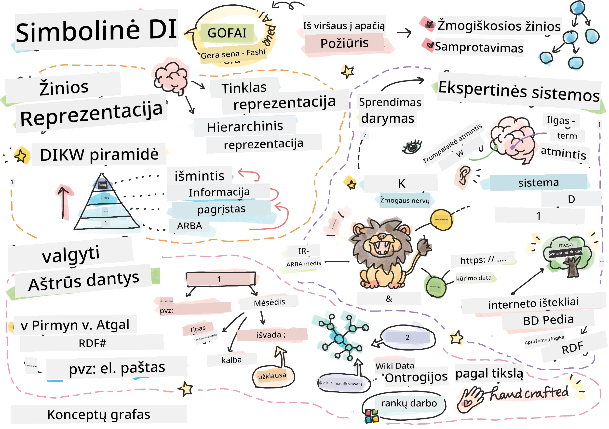
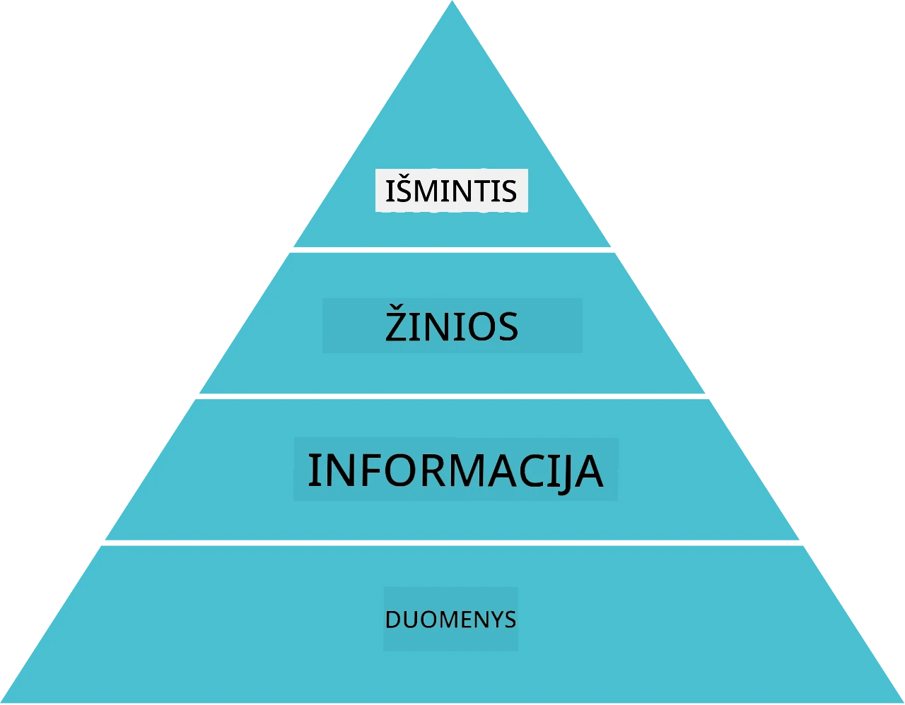
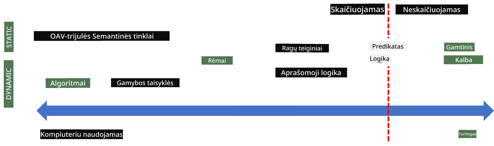
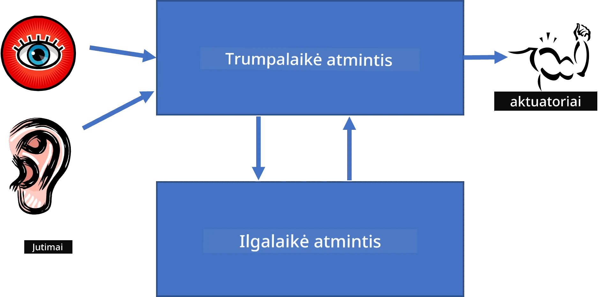
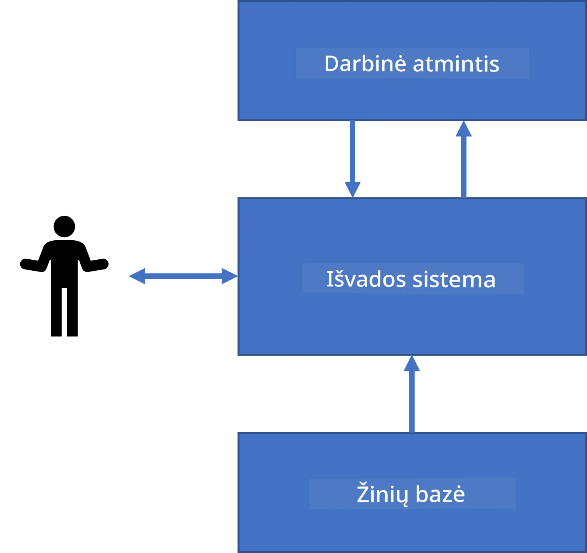
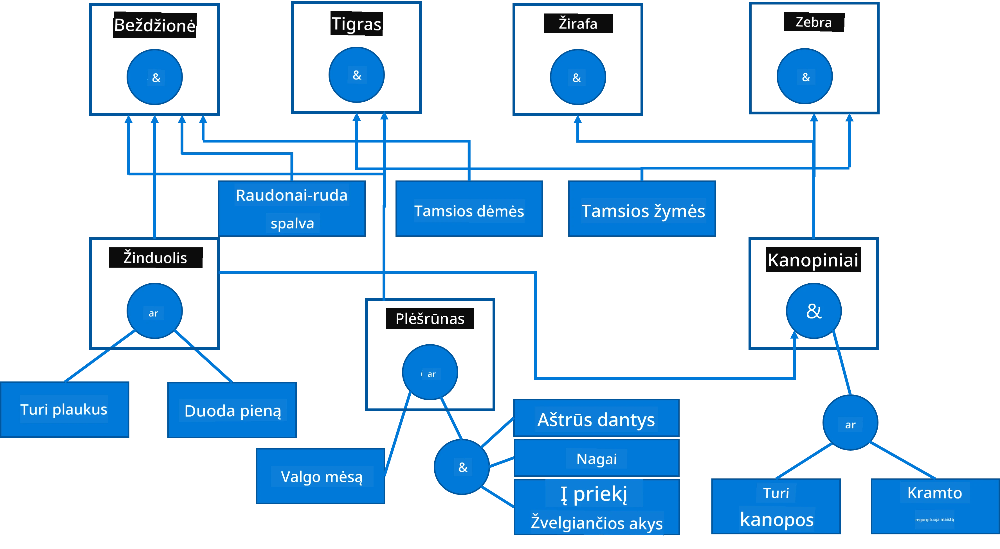
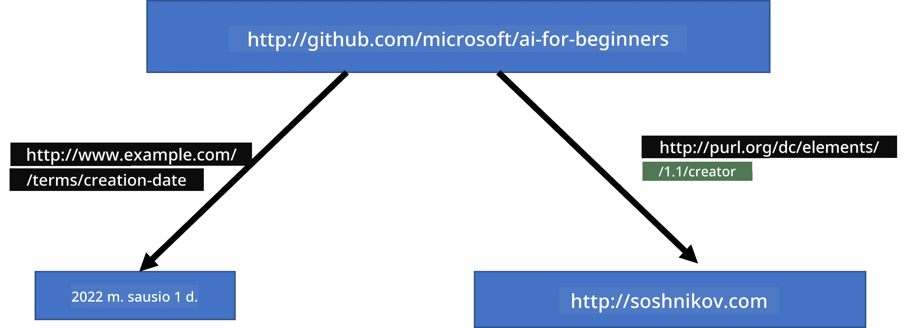
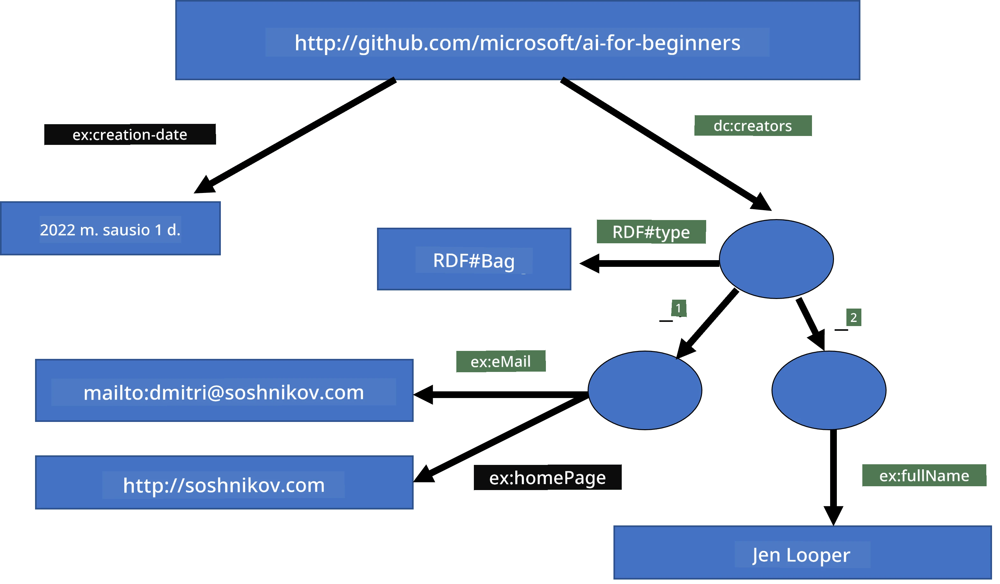
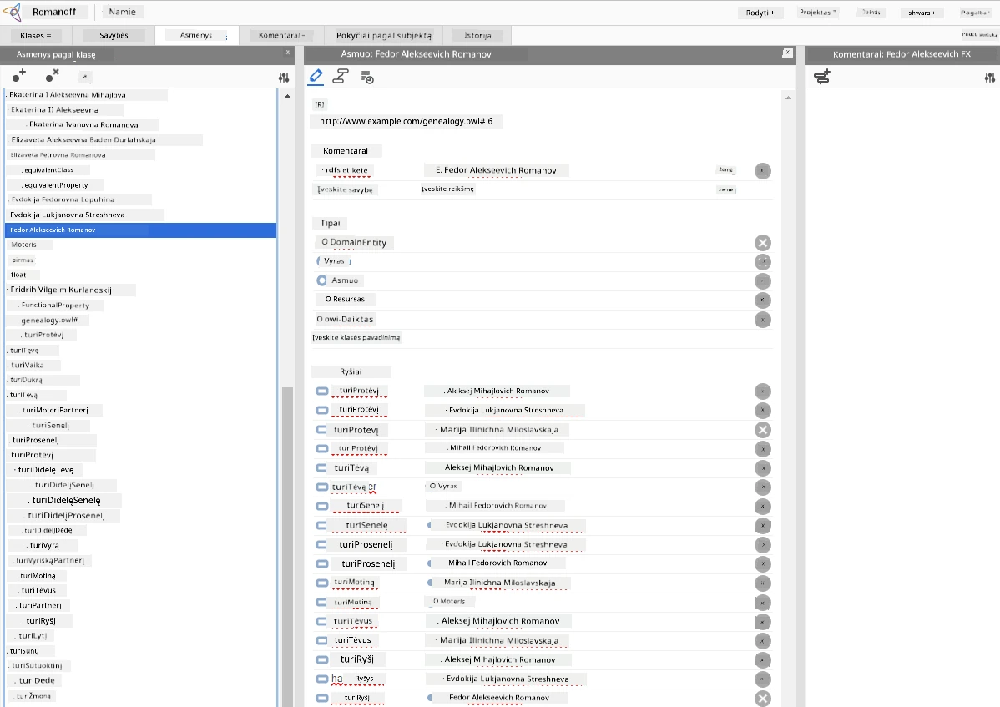

# Žinių Atstovavimas ir Ekspertų Sistemos



> Sketchnote autorius [Tomomi Imura](https://twitter.com/girlie_mac)

Dirbtinio intelekto paieška yra paremta žinių ieškojimu, siekiant suprasti pasaulį panašiai kaip žmonės. Bet kaip tai galima padaryti?

## [Prieš paskaitą - testas](https://ff-quizzes.netlify.app/en/ai/quiz/3)

Ankstyvaisiais DI laikais buvo populiarus aukštesnio lygio požiūris į išmaniųjų sistemų kūrimą (aprašytas ankstesnėje pamokoje). Idėja buvo išgauti žinias iš žmonių į mašiniam supratimui tinkamą formą ir tuomet jas naudoti problemoms automatiškai spręsti. Šis požiūris buvo pagrįstas dviem didelėmis idėjomis:

* Žinių atstovavimas
* Išvedimas

## Žinių atstovavimas

Vienas iš svarbių simbolinio DI terminų yra **žinios**. Svarbu atskirti žinias nuo *informacijos* ar *duomenų*. Pavyzdžiui, galima sakyti, kad knygos turi žinių, nes galima studijuoti knygas ir tapti ekspertu. Tačiau tai, ką knygos turi, iš tiesų vadinama *duomenimis*, o skaitydami knygas ir integruodami šiuos duomenis į savo pasaulio modelį mes juos paverčiame žiniomis.

> ✅ **Žinios** yra tai, kas yra mūsų galvoje ir reprezentuoja mūsų pasaulio supratimą. Žinios įgyjamos aktyvaus **mokymosi** proceso metu, kuris integruoja gautą informaciją į mūsų aktyvų pasaulio modelį.

Dažniausiai mes griežtai neapibrėžiame žinių, tačiau jas susiejame su kitomis gretimomis sąvokomis naudodami [DIKW piramidę](https://en.wikipedia.org/wiki/DIKW_pyramid). Ji apima šias sąvokas:

* **Duomenys** yra kažkas, kas yra atvaizduojama fizinėse laikmenose, pavyzdžiui, rašytinis tekstas ar kalbėti žodžiai. Duomenys egzistuoja nepriklausomai nuo žmogaus ir gali būti perduodami tarp žmonių.
* **Informacija** yra tai, kaip mes interpretuojame duomenis savo galvoje. Pavyzdžiui, kai išgirstame žodį *kompiuteris*, turime supratimą, kas tai yra.
* **Žinios** yra informacijos integracija į mūsų pasaulio modelį. Pavyzdžiui, kai sužinome, kas yra kompiuteris, pradedame turėti idėjų, kaip jis veikia, kiek kainuoja ir kam jis gali būti naudojamas. Šis sąvokų tinklas sudaro mūsų žinias.
* **Išmintis** yra dar aukštesnis mūsų pasaulio supratimo lygmuo, atspindintis *metazinias*, pvz., idėją, kaip ir kada naudoti žinias.



*Paveikslėlis [iš Vikipedijos](https://commons.wikimedia.org/w/index.php?curid=37705247), autorius Longlivetheux - Own work, CC BY-SA 4.0*

Taigi, problema **žinių atstovavimas** reiškia efektyvų būdą reprezentuoti žinias kompiuterio viduje kaip duomenis, kad jos būtų automatiškai panaudojamos. Tai galima matyti kaip spektrą:



> Paveikslėlis autorius [Dmitry Soshnikov](http://soshnikov.com)

* Kairėje yra labai paprasti žinių atstovavimo tipai, kuriuos kompiuteriai gali efektyviai naudoti. Paprasčiausias yra algoritminis, kai žinios pateikiamos kompiuterinės programos forma. Tačiau tai nėra geriausias būdas atstovauti žinias, nes jis nėra lankstus. Žinios mūsų galvoje dažnai nėra algoritminės.
* Dešinėje yra tokios reprezentacijos kaip natūralus tekstas. Tai yra galingiausias būdas, bet negali būti naudojamas automatiškai samprotavimui.

> ✅ Pagalvokite akimirkai, kaip jūs reprezentuojate žinias savo galvoje ir konvertuojate jas į užrašus. Ar yra tam tikras formatas, kuris jums gerai padeda išlaikyti informaciją?

## Kompiuterinių žinių atstovavimo klasifikavimas

Galime skirstyti skirtingus kompiuterinius žinių atstovavimo metodus į šias kategorijas:

* **Tinklų atstovimai** remiasi tuo, kad mūsų galvoje yra tarpusavyje susijusių sąvokų tinklas. Galime bandyti atkurti tuos pačius tinklus kaip grafinį vaizdą kompiuteryje – taip vadinamą **semantinį tinklą**.

1. **Objektas-Atributas-Reikšmė trejetai** arba **atributo-reikšmės poros**. Kadangi grafas kompiuteryje gali būti atvaizduojamas kaip mazgų ir kraštinių sąrašas, mes galime reprezentuoti semantinį tinklą kaip trejetų sąrašą, jame esančius objektus, atributus ir reikšmes. Pavyzdžiui, sudarome tokius trejetus apie programavimo kalbas:

Objektas | Atributas | Reikšmė  
--------|-----------|---------  
Python  | yra       | Netipizuota kalba  
Python  | sukūrė    | Guido van Rossum  
Python  | blokų sintaksė | įtraukimas  
Netipizuota kalba | neturi | tipo aprašų  

> ✅ Pagalvokite, kaip trejetai gali būti naudojami kitų rūšių žinioms atstovauti.

2. **Hierarchiniai atstovimai** pabrėžia, kad dažnai mūsų galvoje sukuriame objektų hierarchiją. Pavyzdžiui, žinome, kad kanarėlė yra paukštis, o visi paukščiai turi sparnus. Taip pat turime tam tikrą supratimą, koks dažniausiai yra kanarėlės spalvos ir kokiu greičiu skraido.

   - **Rėmelių atstovimas** (Frame representation) remiasi tuo, kad kiekvienas objektas arba objektų klasė yra atstovaujama kaip **rėmelis**, kuriame yra **vietos** (slots). Vietos turi galimas numatytąsias reikšmes, reikšmių apribojimus arba saugomas procedūras, kurias galima iškviesti norint gauti vietos reikšmę. Visi rėmeliai sudaro hierarchiją, panašią į objektų hierarchiją objektiniame programavime.
   - **Scenarijai** yra specialus rėmelių tipas, kuris atstovauja sudėtingas situacijas, galinčias vystytis laike.

**Python**

Vieta | Reikšmė | Numatytoji reikšmė | Intervalas  
------|---------|--------------------|------------
Pavadinimas | Python | | |
Yra-tipass | Netipizuota kalba | | |
Kintamojo rašyba | | CamelCase | |
Programos ilgis | | | 5-5000 eilučių |
Blokų sintaksė | Įtraukimas | | |

3. **Procedūriniai atstovimai** remiasi žinių reprezentavimu kaip veiksmų sąrašu, kuriuos galima vykdyti, kai įvyksta tam tikra sąlyga.
   - Produkcijos taisyklės yra if-tada teiginiai, leidžiantys daryti išvadas. Pavyzdžiui, gydytojas gali turėti taisyklę: **JEIGU** pacientui aukšta temperatūra **ARBA** aukštas C reaktyvaus baltymo lygis kraujo tyrime, **TADA** pacientas turi uždegimą. Susidūrus su viena iš sąlygų, galima priimti išvadą apie uždegimą ir tada ją naudoti tolesniam samprotavimui.
   - Algoritmai gali būti laikomi dar vienu procedūrinės reprezentacijos formų, nors jie beveik niekada nenaudojami tiesiogiai žinių sistemose.

4. **Logika** buvo pasiūlyta Aristotelio kaip būdas reprezentuoti universalias žmogaus žinias.
   - Predikatų logika kaip matematinė teorija yra per plati, kad būtų tiesiogiai apskaičiuojama, todėl paprastai naudojamas jos poaibis, pavyzdžiui, Horn klausymai, naudojami Prolog kalboje.
   - Aprašomoji logika yra loginių sistemų šeima, naudojama objektų hierarchijoms ir paskirstyto žinių atstovavimo, tokių kaip *semantinis internetas*, reprezentavimui ir samprotavimui.

## Ekspertų Sistemos

Viena iš ankstyvųjų simbolinio DI sėkmių buvo vadinamosios **ekspertų sistemos** – kompiuterinės sistemos, sukurtos veikti kaip ekspertas tam tikroje ribotoje problemų srityje. Jos buvo pagrįstos iš vieno ar kelių žmogiškųjų ekspertų išgautomis **žinių bazėmis** ir turėjo **išvedimo variklį**, kuris atlikdavo tam tikrus samprotavimus.

 | 
---------------------------------------------|------------------------------------------------
Supaprastinta žmogaus nervų sistemos struktūra | Žinių bazės sistemos architektūra

Ekspertų sistemos yra kuriamos panašiai kaip žmogaus mąstymo sistema, kuri turi **trumpalaikę atmintį** ir **ilgalaikę atmintį**. Panašiai žinių bazės sistemose išskiriami šie komponentai:

* **Problemos atmintis**: saugo žinias apie šiuo metu sprendžiamą problemą, pvz., temperatūrą ar paciento kraujospūdį, ar turi uždegimą ar ne. Šios žinios taip pat vadinamos **statinėmis žiniomis**, nes jose yra dabartinio problemos būsenos momentinė nuotrauka – taip vadinama *problemos būsena*.
* **Žinių bazė**: reprezentuoja ilgalaikes žinias apie problemų sritį. Ji yra rankiniu būdu ištraukta iš žmogiškųjų ekspertų ir nekinta nuo konsultacijos iki konsultacijos. Kadangi ši bazė leidžia judėti iš vienos problemos būsenos į kitą, ji taip pat vadinama **dinaminėmis žiniomis**.
* **Išvedimo variklis**: koordinuoja visą paieškos procesą problemų būsenų erdvėje ir, prireikus, užduoda klausimus vartotojui. Jis taip pat atsakingas už tinkamų taikomų taisyklių suradimą kiekvienai būsenai.

Pavyzdžiui, apsvarstykime ekspertų sistemą, kuri nustato gyvūną pagal jo fizines savybes:



> Paveikslėlis autorius [Dmitry Soshnikov](http://soshnikov.com)

Šis diagrama vadinama **AND-OR medis** ir yra grafinis gamybos taisyklių rinkinio atvaizdavimas. Medžio piešimas yra naudingas žinių iš ekspertų išgavimui pradžioje. Tačiau žinioms atstovauti kompiuteryje patogiau naudoti taisykles:

```
IF the animal eats meat
OR (animal has sharp teeth
    AND animal has claws
    AND animal has forward-looking eyes
) 
THEN the animal is a carnivore
```

Galite pastebėti, kad kiekviena sąlyga dešinėje taisyklės pusėje ir veiksmas iš esmės yra objektas-atributas-reikšmė (OAV) trejetai. **Darbinė atmintis** saugo OAV trejetus, kurie atitinka šiuo metu sprendžiamą problemą. **Taisyklių variklis** ieško taisyklių, kurių sąlyga yra tenkinama, ir jas taiko, pridedant naują trejetą į darbinę atmintį.

> ✅ Parašykite savo AND-OR medį patinkančia tema!

### Tiesioginis ir Atvirkštinis Išvedimas

Aprašytas procesas vadinamas **tiesioginiu išvedimu**. Jis prasideda nuo pirminių duomenų apie problemą, esančių darbinėje atmintyje, ir vykdo šį samprotavimo ciklą:

1. Jei norimas atributas yra darbinėje atmintyje – sustokite ir pateikite rezultatą
2. Ieškokite visų taisyklių, kurių sąlygos šiuo metu tenkinamos – gaunate **konflikto taisyklių rinkinį**.
3. Atlikite **konflikto sprendimą** – pasirinkite vieną taisyklę, kuri bus įvykdyta šiame žingsnyje. Yra skirtingos konflikto sprendimo strategijos:
   - Pasirinkite pirmą taikomą taisyklę žinių bazėje
   - Pasirinkite atsitiktinę taisyklę
   - Pasirinkite *specifiškesnę* taisyklę, t.y. atitinkančią daugiausiai sąlygų kairiajame šone (LHS)
4. Taikykite pasirinktą taisyklę ir įterpkite naują žinių dalį į problemos būseną
5. Kartokite nuo 1 žingsnio.

Tačiau kai kuriais atvejais norime pradėti be jokių žinių apie problemą ir užduoti klausimus, kurie padėtų priartėti prie išvados. Pavyzdžiui, medicinos diagnozės metu mes įprastai nevykdome visų medicininių tyrimų iš anksto prieš pradedant diagnozuoti pacientą. Mes atliekame tyrimus tada, kai reikia priimti sprendimą.

Šis procesas gali būti modeliuojamas naudojant **atvirkštinį išvedimą**. Jį valdo **tikslo** paieška – atributo reikšmė, kurios norime rasti:

1. Pasirinkite visas taisykles, kurios gali pateikti tikslo reikšmę (t.y. taisykles, kuriose tikslas yra dešinėje) – konfliktų rinkinys
2. Jei nėra taisyklių šiam atributui arba yra taisyklė, kuri sako, kad reikia paklausti vartotojo reikšmės – paklauskite, kitaip:
3. Panaudokite konflikto sprendimo strategiją, kad pasirinktumėte vieną taisyklę, kuri bus laikoma *hipoteze* – ją bandysime įrodyti
4. Rekursyviai kartokite procesą visiems atributams taisyklės kairėje pusėje (LHS), bandydami įrodyti juos kaip tikslus
5. Jei procesas bet kada nepavyksta – eikite prie kitos taisyklės 3 žingsnyje.

> ✅ Kokiose situacijose labiau tinka tiesioginis, o kokiose – atvirkštinis išvedimas?

### Ekspertų sistemų įgyvendinimas

Ekspertų sistemas galima įgyvendinti naudojant įvairius įrankius:

* Programavimas tiesiogiai aukšto lygio programavimo kalba. Tai nėra geriausia idėja, nes pagrindinis žinių bazės sistemos privalumas yra žinių ir išvedimo atskyrimas, o potencialiai problemų srities ekspertas turėtų galėti rašyti taisykles nesiimdamas išvedimo proceso detalių.
* Naudojant **ekspertų sistemų apvalkalą** (shell), t.y. sistemą, specialiai sukurtą būti užpildyta žiniomis naudojant tam tikrą žinių atstovavimo kalbą.

## ✍️ Užduotis: Gyvūnų atpažinimas

Žr. [Animals.ipynb](https://github.com/microsoft/AI-For-Beginners/blob/main/lessons/2-Symbolic/Animals.ipynb) kaip pavyzdį, įgyvendinant tiesioginio ir atvirkštinio išvedimo ekspertų sistemą.

> **Pastaba**: Šis pavyzdys yra gana paprastas ir tik suteikia idėją, kaip atrodo ekspertų sistema. Kai pradėsite kurti tokią sistemą, pastebėsite „protingą“ elgesį tik pasiekę tam tikrą taisyklių skaičių – apie 200+. Tam tikru momentu taisyklės tampa pernelyg sudėtingos, kad visas jas atsimintumėte, ir tuomet galite pradėti klausti, kodėl sistema priima tam tikrus sprendimus. Tačiau svarbi žinių bazės sistemų charakteristika yra ta, kad visada galite *paaiškinti*, kaip buvo priimtas bet koks sprendimas.

## Ontologijos ir semantinis internetas

XX amžiaus pabaigoje kilo iniciatyva naudoti žinių atstovavimą žiniatinklio išteklių anotavimui, kad būtų įmanoma rasti išteklius, atitinkančius labai specifinius užklausimus. Ši iniciatyva vadinta **semantiniu internetu** ir remėsi keliomis sąvokomis:

- Specialus žinių atstovavimo pagrindas, naudojantis **[aprašomąją logiką](https://en.wikipedia.org/wiki/Description_logic)** (DL). Ji panaši į rėmelių žinių atstovavimą, nes kuria objektų hierarchiją su savybėmis, tačiau turi formalią loginę semantiką ir išvedimą. Yra visa DL šeima, balansuojanti tarp išraiškingumo ir išvedimo algoritminio sudėtingumo.
- Paskirstytas žinių atstovavimas, kai visos sąvokos yra reprezentuojamos globaliu URI identifikatoriumi, leidžiančiu kurti žinių hierarchijas, apimančias visą internetą.
- XML pagrindu sukurtų kalbų šeima žinių aprašymui: RDF (Išteklių aprašymo pagrindas), RDFS (RDF schema), OWL (Ontologijų žiniatinklio kalba).

Vienas pagrindinių Semantinio tinklo konceptų yra **Ontologijos** sąvoka. Tai aiškus problemos srities formalaus žinių atvaizdavimo aprašymas. Paprasčiausia ontologija gali būti vien hierarchija objektų problemos srityje, tačiau sudėtingesnės ontologijos apims taisykles, kurias galima naudoti išvedimui.

Semantiniame tinkle visi atvaizdavimai yra paremti tripletais. Kiekvienas objektas ir kiekvienas ryšys yra unikalūs identifikuojami pagal URI. Pavyzdžiui, jei norime nurodyti faktą, kad šis DI mokymas buvo sukurtas Dmitry Soshnikov 2022 m. sausio 1 d. – štai tripletai, kuriuos galime panaudoti:



```
http://github.com/microsoft/ai-for-beginners http://www.example.com/terms/creation-date “Jan 1, 2022”
http://github.com/microsoft/ai-for-beginners http://purl.org/dc/elements/1.1/creator http://soshnikov.com
```

> ✅ Čia `http://www.example.com/terms/creation-date` ir `http://purl.org/dc/elements/1.1/creator` yra kai kurie gerai žinomi ir universaliai priimtini URI, išreiškiantys sąvokas *kūrėjas* ir *kūrimo data*.

Sudėtingesniu atveju, jei norime apibrėžti kūrėjų sąrašą, galime naudoti kai kurias RDF apibrėžtas duomenų struktūras.



> Aukščiau pateikti diagramos – [Dmitry Soshnikov](http://soshnikov.com)

Semantinio tinklo kūrimas kažkiek buvo sulėtėjęs dėl paieškos variklių ir natūralios kalbos apdorojimo technologijų sėkmės, leidžiančios iš tekstų išgauti struktūruotus duomenis. Tačiau kai kuriose srityse vis dar dedamos didelės pastangos palaikyti ontologijas ir žinių bazes. Keletas dėmesio vertų projektų:

* [WikiData](https://wikidata.org/) – tai mašinomis skaitomos žinių bazės rinkinys, susijęs su Wikipedia. Didžioji dalis duomenų gaunama iš Wikipedia *InfoBox'ų*, struktūruoto turinio dalių Wikipedia puslapiuose. Galite [užklausti](https://query.wikidata.org/) wikidata naudojant SPARQL – specialią užklausų kalbą Semantiniam tinklui. Štai pavyzdinė užklausa, rodanti populiariausias akių spalvas tarp žmonių:

```sparql
#defaultView:BubbleChart
SELECT ?eyeColorLabel (COUNT(?human) AS ?count)
WHERE
{
  ?human wdt:P31 wd:Q5.       # human instance-of homo sapiens
  ?human wdt:P1340 ?eyeColor. # human eye-color ?eyeColor
  SERVICE wikibase:label { bd:serviceParam wikibase:language "en". }
}
GROUP BY ?eyeColorLabel
```

* [DBpedia](https://www.dbpedia.org/) – dar viena pastanga, panaši į WikiData.

> ✅ Jei norite eksperimentuoti kuriant savo ontologijas arba atidarant esamas, yra puikus vizualinis ontologijų redaktorius pavadintas [Protégé](https://protege.stanford.edu/). Atsisiųskite jį arba naudokite internetu.



*Web Protégé redaktorius atidarytas su Romanovų šeimos ontologija. Nekšto Dmitry Soshnikov*

## ✍️ Užduotis: Šeimos Ontologija

Peržiūrėkite [FamilyOntology.ipynb](https://github.com/Ezana135/AI-For-Beginners/blob/main/lessons/2-Symbolic/FamilyOntology.ipynb), kuriame pateiktas pavyzdys, kaip naudojamos Semantinio tinklo technikos, siekiant spręsti šeimos santykių problemas. Naudosime šeimos medį, pateiktą įprasta GEDCOM formatu, ir šeimos santykių ontologiją, kad sudarytume visų šeimos ryšių grafą pasirinktai asmenų grupei.

## Microsoft Sąvokų Grafas

Daugeliu atvejų ontologijos yra kruopščiai kuriamos ranka. Tačiau taip pat galima **iškasti** ontologijas iš nestruktūruotų duomenų, pavyzdžiui, natūralios kalbos tekstų.

Vienas toks bandymas buvo atliktas Microsoft Research ir iš rezultatų gimė [Microsoft Concept Graph](https://blogs.microsoft.com/ai/microsoft-researchers-release-graph-that-helps-machines-conceptualize/?WT.mc_id=academic-77998-cacaste).

Tai didelė subjektų grupė, apjungta naudojant `is-a` paveldėjimo santykį. Jis leidžia atsakyti į klausimus, kaip „Kas yra Microsoft?" – kurių atsakymas būtų panašus į „įmonė su tikimybe 0.87, ir prekės ženklas su tikimybe 0.75“.

Šis grafas prieinamas per REST API arba kaip didelis atsisiunčiamas tekstinis failas, kuriame išvardyti visi subjektų poros.

## ✍️ Užduotis: Sąvokų Grafas

Išbandykite [MSConceptGraph.ipynb](https://github.com/microsoft/AI-For-Beginners/blob/main/lessons/2-Symbolic/MSConceptGraph.ipynb) užrašų knygelę, kad sužinotumėte, kaip Microsoft Sąvokų Grafas gali būti panaudotas naujienų straipsniams suskirstyti į kelias kategorijas.

## Išvados

Šiandien DI dažnai laikomas sinonimu *Mašininiam mokymuisi* ar *Neuroniniams tinklams*. Tačiau žmogus taip pat demonstruoja aiškų samprotavimą, kurio šiuo metu neuroniniai tinklai negali atlikti. Realiose sistemose aiškus samprotavimas vis dar naudojamas atliekant užduotis, kurioms reikalingi paaiškinimai arba galimybė kontroliuojamai keisti sistemos elgseną.

## 🚀 Iššūkis

Šeimos ontologijos užrašų knygelėje, susijusioje su pamoka, yra galimybė eksperimentuoti su kitais šeimos ryšiais. Pabandykite atrasti naujų ryšių tarp žmonių šeimos medyje.

## [Po paskaitos testas](https://ff-quizzes.netlify.app/en/ai/quiz/4)

## Peržiūra ir savarankiškas mokymasis

Atlikite tyrimą internete, kad atrastumėte sritis, kuriose žmonės bandė kiekybiškai apibrėžti ir kodifikuoti žinias. Pažvelkite į Bloom taksonomiją ir grįžkite istorijoje, kaip žmonės stengėsi suprasti savo pasaulį. Tyrinėkite Linnaeus darbą organizmų taksonomijai kurti, ir stebėkite, kaip Dmitrijus Mendelejevas sukūrė cheminio elementų aprašymo ir grupavimo būdą. Kokius kitus įdomius pavyzdžius galite rasti?

**Namų darbas**: [Sukurkite Ontologiją](assignment.md)

---

<!-- CO-OP TRANSLATOR DISCLAIMER START -->
**Atsakomybės apribojimas**:
Šis dokumentas buvo išverstas naudojant dirbtinio intelekto vertimo paslaugą [Co-op Translator](https://github.com/Azure/co-op-translator). Nors siekiame tikslumo, prašome atkreipti dėmesį, kad automatiniai vertimai gali turėti klaidų ar netikslumų. Originalus dokumentas gimtąja kalba turi būti laikomas autoritetingu šaltiniu. Kritinei informacijai rekomenduojame naudoti profesionalų žmogaus vertimą. Mes neatsakome už bet kokius nesusipratimus ar neteisingus aiškinimus, kylančius dėl šio vertimo naudojimo.
<!-- CO-OP TRANSLATOR DISCLAIMER END -->