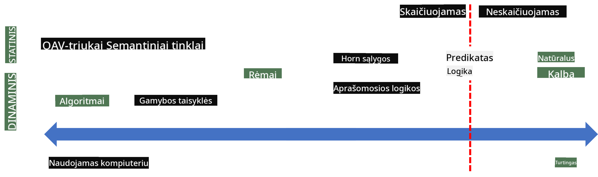
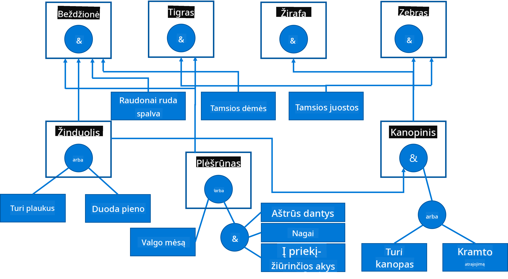

<!--
CO_OP_TRANSLATOR_METADATA:
{
  "original_hash": "7d097f7fda9166ead615e4c34552381b",
  "translation_date": "2025-09-23T15:45:24+00:00",
  "source_file": "lessons/2-Symbolic/README.md",
  "language_code": "lt"
}
-->
# Žinių Atvaizdavimas ir Ekspertinės Sistemos


> Sketchnote sukūrė [Tomomi Imura](https://twitter.com/girlie_mac)

Dirbtinio intelekto siekis grindžiamas žinių paieška, siekiant suprasti pasaulį panašiai kaip žmonės. Bet kaip tai pasiekti?

## [Prieš paskaitą vykstantis testas](https://ff-quizzes.netlify.app/en/ai/quiz/3)

Ankstyvaisiais AI laikais populiarus buvo "iš viršaus į apačią" požiūris į intelektualių sistemų kūrimą (aptartas ankstesnėje pamokoje). Idėja buvo išgauti žinias iš žmonių į mašininį formatą ir naudoti jas problemoms automatiškai spręsti. Šis požiūris buvo grindžiamas dviem pagrindinėmis idėjomis:

* Žinių Atvaizdavimas
* Samprotavimas

## Žinių Atvaizdavimas

Vienas svarbiausių simbolinio AI konceptų yra **žinios**. Svarbu atskirti žinias nuo *informacijos* ar *duomenų*. Pavyzdžiui, galima sakyti, kad knygos turi žinių, nes jas studijuodami galime tapti ekspertais. Tačiau tai, ką knygos iš tikrųjų turi, vadinama *duomenimis*, o skaitydami knygas ir integruodami šiuos duomenis į savo pasaulio modelį, mes paverčiame juos žiniomis.

> ✅ **Žinios** yra tai, kas yra mūsų galvoje ir atspindi mūsų pasaulio supratimą. Jos gaunamos aktyvaus **mokymosi** proceso metu, kuris integruoja gautą informaciją į mūsų aktyvų pasaulio modelį.

Dažniausiai mes griežtai neapibrėžiame žinių, bet jas susiejame su kitais susijusiais konceptais, naudodami [DIKW piramidę](https://en.wikipedia.org/wiki/DIKW_pyramid). Ji apima šiuos konceptus:

* **Duomenys** yra tai, kas pateikiama fizinėje laikmenoje, pvz., rašytinis tekstas ar žodžiai. Duomenys egzistuoja nepriklausomai nuo žmonių ir gali būti perduodami tarp jų.
* **Informacija** yra tai, kaip mes interpretuojame duomenis savo galvoje. Pavyzdžiui, išgirdę žodį *kompiuteris*, turime tam tikrą supratimą, kas tai yra.
* **Žinios** yra informacija, integruota į mūsų pasaulio modelį. Pavyzdžiui, kai sužinome, kas yra kompiuteris, pradedame turėti idėjų apie tai, kaip jis veikia, kiek kainuoja ir kam gali būti naudojamas. Šis tarpusavyje susijusių konceptų tinklas sudaro mūsų žinias.
* **Išmintis** yra dar vienas mūsų pasaulio supratimo lygis, kuris atspindi *metažinias*, pvz., supratimą, kaip ir kada žinios turėtų būti naudojamos.


*Vaizdas [iš Vikipedijos](https://commons.wikimedia.org/w/index.php?curid=37705247), By Longlivetheux - Own work, CC BY-SA 4.0*

Taigi, **žinių atvaizdavimo** problema yra rasti efektyvų būdą atvaizduoti žinias kompiuteryje duomenų forma, kad jos būtų automatiškai naudojamos. Tai galima laikyti spektru:



> Vaizdas sukurtas [Dmitry Soshnikov](http://soshnikov.com)

* Kairėje yra labai paprasti žinių atvaizdavimo tipai, kuriuos kompiuteriai gali efektyviai naudoti. Paprasčiausias yra algoritminis, kai žinios atvaizduojamos kompiuterio programoje. Tačiau tai nėra geriausias būdas atvaizduoti žinias, nes jis nėra lankstus. Žinios mūsų galvoje dažnai nėra algoritminės.
* Dešinėje yra tokie atvaizdavimo būdai kaip natūralus tekstas. Jis yra galingiausias, bet negali būti naudojamas automatiniam samprotavimui.

> ✅ Pagalvokite minutę, kaip jūs atvaizduojate žinias savo galvoje ir paverčiate jas užrašais. Ar yra tam tikras formatas, kuris jums padeda geriau įsiminti?

## Kompiuterinių Žinių Atvaizdavimo Klasifikavimas

Galime klasifikuoti skirtingus kompiuterinių žinių atvaizdavimo metodus į šias kategorijas:

* **Tinklo atvaizdavimai** yra pagrįsti tuo, kad mūsų galvoje yra tarpusavyje susijusių konceptų tinklas. Galime pabandyti atkurti tuos pačius tinklus kaip grafą kompiuteryje - vadinamąjį **semantinį tinklą**.

1. **Objekto-atributo-reikšmės trejetai** arba **atributo-reikšmės poros**. Kadangi grafas kompiuteryje gali būti atvaizduotas kaip mazgų ir kraštų sąrašas, semantinį tinklą galime atvaizduoti trejetų sąrašu, kuriame yra objektai, atributai ir reikšmės. Pavyzdžiui, sudarome šiuos trejetus apie programavimo kalbas:

Objektas | Atributas | Reikšmė
---------|-----------|--------
Python | yra | Netipizuota kalba
Python | sukūrė | Guido van Rossum
Python | blokų sintaksė | įtraukimas
Netipizuota kalba | neturi | tipų apibrėžimų

> ✅ Pagalvokite, kaip trejetai gali būti naudojami kitų tipų žinioms atvaizduoti.

2. **Hierarchiniai atvaizdavimai** pabrėžia tai, kad mes dažnai kuriame objektų hierarchiją savo galvoje. Pavyzdžiui, žinome, kad kanarėlė yra paukštis, o visi paukščiai turi sparnus. Taip pat turime tam tikrą supratimą, kokios spalvos dažniausiai būna kanarėlės ir koks jų skrydžio greitis.

   - **Rėmo atvaizdavimas** yra pagrįstas kiekvieno objekto ar objektų klasės atvaizdavimu kaip **rėmo**, kuris turi **lizdus**. Lizdai turi galimas numatytas reikšmes, reikšmių apribojimus arba saugomas procedūras, kurias galima iškviesti norint gauti lizdo reikšmę. Visi rėmai sudaro hierarchiją, panašią į objektų hierarchiją objektinio programavimo kalbose.
   - **Scenarijai** yra specialus rėmų tipas, kuris atvaizduoja sudėtingas situacijas, galinčias vystytis laikui bėgant.

**Python**

Lizdas | Reikšmė | Numatytoji reikšmė | Intervalas |
-------|---------|--------------------|------------|
Pavadinimas | Python | | |
Yra | Netipizuota kalba | | |
Kintamojo formatas | | CamelCase | |
Programos ilgis | | | 5-5000 eilučių |
Blokų sintaksė | Įtraukimas | | |

3. **Procedūriniai atvaizdavimai** yra pagrįsti žinių atvaizdavimu kaip veiksmų sąrašu, kurį galima vykdyti, kai atsiranda tam tikra sąlyga.
   - Produkcijos taisyklės yra if-then teiginiai, leidžiantys daryti išvadas. Pavyzdžiui, gydytojas gali turėti taisyklę, kuri sako, kad **JEI** pacientas turi aukštą temperatūrą **ARBA** aukštą C-reaktyvaus baltymo lygį kraujo tyrime **TADA** jis turi uždegimą. Kai susiduriame su viena iš sąlygų, galime padaryti išvadą apie uždegimą ir tada naudoti ją tolesniam samprotavimui.
   - Algoritmai gali būti laikomi kita procedūrinio atvaizdavimo forma, nors jie beveik niekada nėra tiesiogiai naudojami žinių pagrindu veikiančiose sistemose.

4. **Logika** buvo iš pradžių pasiūlyta Aristotelio kaip būdas atvaizduoti universalias žmonių žinias.
   - Predikatų logika kaip matematinė teorija yra per daug turtinga, kad būtų skaičiuojama, todėl paprastai naudojamas jos pogrupis, pvz., Horn sąlygos, naudojamos Prolog.
   - Aprašomoji logika yra loginių sistemų šeima, naudojama hierarchijų objektų atvaizdavimui ir samprotavimui apie paskirstytas žinių atvaizdavimo sistemas, tokias kaip *semantinis tinklas*.

## Ekspertinės Sistemos

Vienas iš ankstyvųjų simbolinio AI pasiekimų buvo vadinamosios **ekspertinės sistemos** - kompiuterinės sistemos, sukurtos veikti kaip ekspertas tam tikroje ribotoje problemų srityje. Jos buvo pagrįstos **žinių baze**, išgauta iš vieno ar daugiau žmonių ekspertų, ir turėjo **išvadų variklį**, kuris atliko tam tikrą samprotavimą remdamasis šia baze.

 | 
---------------------------------------------|------------------------------------------------
Supaprastinta žmogaus nervų sistemos struktūra | Žinių pagrindu veikiančios sistemos architektūra

Ekspertinės sistemos yra sukurtos panašiai kaip žmogaus samprotavimo sistema, kuri turi **trumpalaikę atmintį** ir **ilgalaikę atmintį**. Panašiai, žinių pagrindu veikiančiose sistemose išskiriame šiuos komponentus:

* **Problemos atmintis**: saugo žinias apie šiuo metu sprendžiamą problemą, pvz., paciento temperatūrą ar kraujospūdį, ar jis turi uždegimą ir pan. Šios žinios taip pat vadinamos **statinėmis žiniomis**, nes jos apima tai, ką šiuo metu žinome apie problemą - vadinamąją *problemos būseną*.
* **Žinių bazė**: atspindi ilgalaikes žinias apie problemų sritį. Ji rankiniu būdu išgaunama iš žmonių ekspertų ir nesikeičia nuo vienos konsultacijos iki kitos. Kadangi ji leidžia pereiti iš vienos problemos būsenos į kitą, ji taip pat vadinama **dinaminėmis žiniomis**.
* **Išvadų variklis**: koordinuoja visą procesą, ieškodamas problemos būsenos erdvėje, užduodamas klausimus vartotojui, kai reikia. Jis taip pat atsakingas už tinkamų taisyklių taikymą kiekvienai būsenai.

Kaip pavyzdį, apsvarstykime šią ekspertinę sistemą, skirtą gyvūnui nustatyti pagal jo fizines charakteristikas:



> Vaizdas sukurtas [Dmitry Soshnikov](http://soshnikov.com)

Ši diagrama vadinama **AND-OR medžiu**, ir tai yra grafinis produkcijos taisyklių rinkinio atvaizdavimas. Medžio piešimas yra naudingas pradžioje, kai išgaunamos žinios iš eksperto. Norint atvaizduoti žinias kompiuteryje, patogiau naudoti taisykles:

```
IF the animal eats meat
OR (animal has sharp teeth
    AND animal has claws
    AND animal has forward-looking eyes
) 
THEN the animal is a carnivore
```

Galite pastebėti, kad kiekviena sąlyga taisyklės kairėje pusėje ir veiksmas iš esmės yra objekto-atributo-reikšmės (OAR) trejetai. **Darbinė atmintis** saugo OAR trejetų rinkinį, kuris atitinka šiuo metu sprendžiamą problemą. **Taisyklių variklis** ieško taisyklių, kurių sąlyga yra patenkinta, ir jas taiko, pridėdamas naują trejetą į darbinę atmintį.

> ✅ Sukurkite savo AND-OR medį apie jums patinkančią temą!

### Priekinė vs. Atgalinė Išvada

Aukščiau aprašytas procesas vadinamas **priekine išvada**. Jis prasideda nuo tam tikrų pradinių duomenų apie problemą, esančių darbinėje atmintyje, ir tada vykdo šį samprotavimo ciklą:

1. Jei tikslinis atributas yra darbinėje atmintyje - sustokite ir pateikite rezultatą
2. Ieškokite visų taisyklių, kurių sąlyga šiuo metu patenkinta - gaukite **konflikto rinkinį** taisyklių.
3. Atlikite **konflikto sprendimą** - pasirinkite vieną taisyklę, kuri bus vykdoma šiame žingsnyje. Gali būti įvairios konflikto sprendimo strategijos:
   - Pasirinkite pirmą tinkamą taisyklę žinių bazėje
   - Pasirinkite atsitiktinę taisyklę
   - Pasirinkite *specifiškesnę* taisyklę, t. y. tą, kuri atitinka daugiausiai sąlygų kairėje pusėje (LHS)
4. Taikykite pasirinktą taisyklę ir įterpkite naują žinių dalį į problemos būseną
5. Kartokite nuo 1 žingsnio.

Tačiau kai kuriais atvejais galime norėti pradėti nuo tuščios žinių apie problemą ir užduoti klausimus, kurie padės pasiekti išvadą. Pavyzdžiui, atliekant medicininę diagnozę, paprastai neatliekame visų medicininių tyrimų iš anksto prieš pradedant diagnozuoti pacientą. Verčiau norime atlikti tyrimus, kai reikia priimti sprendimą.

Šį procesą galima modeliuoti naudojant **atgalinę išvadą**. Ji yra orientuota į **tikslą** - atributų reikšmę, kurią siekiame rasti:

1. Pasirinkite visas taisykles, kurios gali suteikti mums tikslinę reikšmę (t. y. su tikslu dešinėje pusėje (RHS)) - konflikto rinkinį
1. Jei nėra taisyklių šiam atributui arba yra taisyklė, sakanti, kad reikšmę turėtume paklausti vartotojo - paklauskite jos, kitaip:
1. Naudokite konflikto sprendimo strategiją, kad pasirinktumėte vieną taisyklę, kurią naudosime kaip *hipotezę* - bandysime ją įrodyti
1. Pakartotinai kartokite procesą visiems atributams taisyklės kairėje pusėje, bandydami juos įrodyti kaip tikslus
1. Jei bet kuriuo metu procesas nepavyksta - naudokite kitą taisyklę 3 žingsnyje.

> ✅ Kokiose situacijose priekinei išvadai teikiama pirmenybė? O kaip dėl atgalinės išvados?

### Ekspertinių Sistemų Įgyvendinimas

Ekspertinės sistemos gali būti įgyvendintos naudojant įvairius įrankius:

* Jas programuojant tiesiogiai aukšto lygio programavimo kalba. Tai nėra geriausia idėja, nes pagrindinis žinių pagrindu veikiančios sistemos privalumas yra tas, kad žinios yra atskirtos nuo išvadų, ir potencialiai problemų srities ekspertas turėtų galėti rašyti taisykles nesuprasdamas išvadų proceso detalių.
* Naudojant **ekspertinių sistemų apvalkalą**, t. y. sistemą, specialiai sukurtą žinioms užpildyti naudojant tam tikrą žinių atvaizdavimo kalbą.

## ✍️ Užduotis: Gyvūnų Išvada

Žr. [Animals.ipynb](https://github.com/microsoft/AI-For-Beginners/blob/main/lessons/2-Symbolic/Animals.ipynb) pavyzdį, kaip įgyvendinti priekinių ir atgalinių išvadų ekspertinę sistemą.

> **Pastaba**: Šis pavyzdys yra gana paprastas ir tik suteikia idėją, kaip atrodo ekspertinė sistema. Kai pradėsite kurti tokią sistemą, pastebėsite tam tikrą *intelektualų* elgesį tik pasiekę tam tikrą taisyklių skaičių, apie 200+. Tam tikru momentu taisyklės tampa per sudėtingos, kad visas jas galėtumėte išlaikyti galvoje, ir tada galite pradėti stebėtis, kodėl sistema priima tam tikrus sprendimus. Tačiau svarbi žinių pagrindu veikiančių sistemų savybė yra ta, kad visada galite
- XML pagrindu sukurtų kalbų šeima žinių aprašymui: RDF (Resource Description Framework), RDFS (RDF Schema), OWL (Ontology Web Language).

Pagrindinė Semantinio tinklo sąvoka yra **Ontologija**. Ji reiškia aiškų problemos srities apibrėžimą naudojant tam tikrą formalų žinių atvaizdavimą. Paprasčiausia ontologija gali būti tiesiog objektų hierarchija problemos srityje, tačiau sudėtingesnės ontologijos apima taisykles, kurios gali būti naudojamos išvadoms daryti.

Semantiniame tinkle visi atvaizdavimai yra pagrįsti trigubais. Kiekvienas objektas ir kiekvienas ryšys yra unikalus ir identifikuojamas pagal URI. Pavyzdžiui, jei norime nurodyti faktą, kad šis AI mokymo planas buvo sukurtas Dmitrijaus Soshnikovo 2022 m. sausio 1 d., štai trigubai, kuriuos galime naudoti:


```
http://github.com/microsoft/ai-for-beginners http://www.example.com/terms/creation-date “Jan 13, 2007”
http://github.com/microsoft/ai-for-beginners http://purl.org/dc/elements/1.1/creator http://soshnikov.com
```

> ✅ Čia `http://www.example.com/terms/creation-date` ir `http://purl.org/dc/elements/1.1/creator` yra gerai žinomi ir visuotinai priimti URI, skirti išreikšti *kūrėjo* ir *sukūrimo datos* sąvokas.

Sudėtingesniu atveju, jei norime apibrėžti kūrėjų sąrašą, galime naudoti tam tikras RDF apibrėžtas duomenų struktūras.


> Aukščiau pateikti diagramų autoriai: [Dmitrijus Soshnikovas](http://soshnikov.com)

Semantinio tinklo kūrimo pažangą tam tikru mastu sulėtino paieškos sistemų ir natūralios kalbos apdorojimo technikų sėkmė, kurios leidžia išgauti struktūrizuotus duomenis iš teksto. Tačiau kai kuriose srityse vis dar dedamos reikšmingos pastangos ontologijoms ir žinių bazėms palaikyti. Keletas projektų, kuriuos verta paminėti:

* [WikiData](https://wikidata.org/) yra mašininio skaitymo žinių bazių kolekcija, susijusi su Wikipedia. Dauguma duomenų yra išgaunami iš Wikipedia *InfoBoxes*, struktūrizuoto turinio dalių Wikipedia puslapiuose. WikiData galite [užklausti](https://query.wikidata.org/) naudodami SPARQL, specialią užklausų kalbą Semantiniam tinklui. Štai pavyzdinė užklausa, rodanti populiariausias žmonių akių spalvas:

```sparql
#defaultView:BubbleChart
SELECT ?eyeColorLabel (COUNT(?human) AS ?count)
WHERE
{
  ?human wdt:P31 wd:Q5.       # human instance-of homo sapiens
  ?human wdt:P1340 ?eyeColor. # human eye-color ?eyeColor
  SERVICE wikibase:label { bd:serviceParam wikibase:language "en". }
}
GROUP BY ?eyeColorLabel
```

* [DBpedia](https://www.dbpedia.org/) yra dar viena iniciatyva, panaši į WikiData.

> ✅ Jei norite eksperimentuoti kuriant savo ontologijas arba atidarant esamas, yra puikus vizualus ontologijų redaktorius, vadinamas [Protégé](https://protege.stanford.edu/). Atsisiųskite jį arba naudokite internetu.


*Web Protégé redaktorius atidarytas su Romanovų šeimos ontologija. Ekrano kopija: Dmitrijus Soshnikovas*

## ✍️ Užduotis: Šeimos ontologija

Žr. [FamilyOntology.ipynb](https://github.com/Ezana135/AI-For-Beginners/blob/main/lessons/2-Symbolic/FamilyOntology.ipynb) pavyzdį, kaip naudoti Semantinio tinklo technikas šeimos santykiams analizuoti. Mes paimsime šeimos medį, pateiktą įprastu GEDCOM formatu, ir šeimos santykių ontologiją, kad sukurtume visų šeimos santykių grafą tam tikram asmenų rinkiniui.

## Microsoft Concept Graph

Daugeliu atvejų ontologijos yra kruopščiai kuriamos rankiniu būdu. Tačiau taip pat galima **išgauti** ontologijas iš nestruktūrizuotų duomenų, pavyzdžiui, iš natūralios kalbos tekstų.

Vienas toks bandymas buvo atliktas Microsoft Research ir rezultatas – [Microsoft Concept Graph](https://blogs.microsoft.com/ai/microsoft-researchers-release-graph-that-helps-machines-conceptualize/?WT.mc_id=academic-77998-cacaste).

Tai didelė subjektų kolekcija, sugrupuota naudojant `is-a` paveldėjimo ryšį. Ji leidžia atsakyti į klausimus, tokius kaip „Kas yra Microsoft?“ – atsakymas būtų kažkas panašaus į „kompanija su tikimybe 0.87, ir prekės ženklas su tikimybe 0.75“.

Grafas yra prieinamas kaip REST API arba kaip didelis atsisiunčiamas tekstinis failas, kuriame išvardyti visi subjektų poros.

## ✍️ Užduotis: Konceptų grafas

Išbandykite [MSConceptGraph.ipynb](https://github.com/microsoft/AI-For-Beginners/blob/main/lessons/2-Symbolic/MSConceptGraph.ipynb) užrašų knygelę, kad pamatytumėte, kaip galime naudoti Microsoft Concept Graph naujienų straipsniams suskirstyti į kelias kategorijas.

## Išvada

Šiandien AI dažnai laikomas sinonimu *Mašininio mokymosi* arba *Neuroninių tinklų*. Tačiau žmogus taip pat demonstruoja aiškų samprotavimą, kuris šiuo metu nėra apdorojamas neuroninių tinklų. Realiuose projektuose aiškus samprotavimas vis dar naudojamas užduotims atlikti, kurioms reikia paaiškinimų arba galimybės kontroliuojamai keisti sistemos elgesį.

## 🚀 Iššūkis

Šeimos ontologijos užrašų knygelėje, susijusioje su šia pamoka, yra galimybė eksperimentuoti su kitais šeimos santykiais. Pabandykite atrasti naujus ryšius tarp žmonių šeimos medyje.

## [Po paskaitos testas](https://ff-quizzes.netlify.app/en/ai/quiz/4)

## Apžvalga ir savarankiškas mokymasis

Atlikite tyrimą internete, kad sužinotumėte sritis, kuriose žmonės bandė kiekybiškai įvertinti ir kodifikuoti žinias. Pažvelkite į Bloom'o taksonomiją ir grįžkite į istoriją, kad sužinotumėte, kaip žmonės bandė suprasti savo pasaulį. Išnagrinėkite Linėjaus darbą kuriant organizmų taksonomiją ir stebėkite, kaip Dmitrijus Mendelejevas sukūrė būdą cheminiams elementams aprašyti ir grupuoti. Kokius kitus įdomius pavyzdžius galite rasti?

**Užduotis**: [Sukurkite ontologiją](assignment.md)

---

