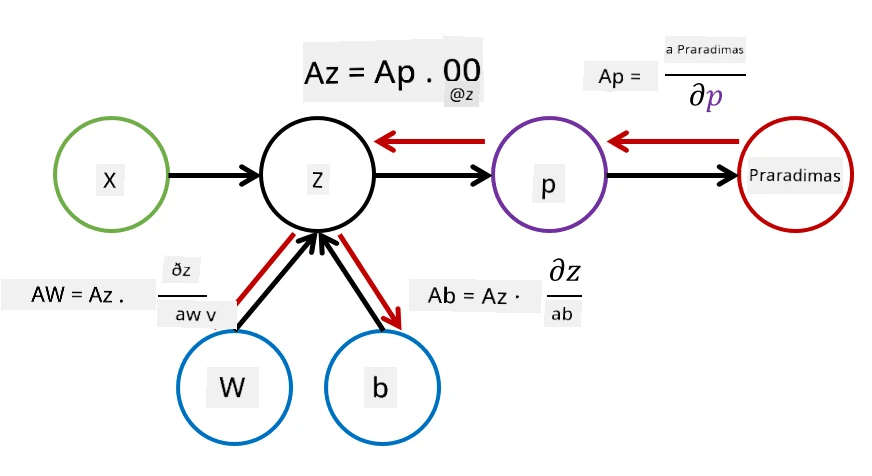

# Įvadas į neuroninius tinklus. Daugiasluoksnis perceptronas

Ankstesniame skyriuje sužinojote apie paprasčiausią neuroninio tinklo modelį – vienasluoksnį perceptroną, kuris yra linijinis dviejų klasių klasifikavimo modelis.

Šiame skyriuje išplėsime šį modelį į lankstesnę sistemą, kuri leis:

* atlikti **daugiaklasę klasifikaciją** be dviejų klasių
* spręsti **regresijos problemas** be klasifikavimo
* atskirti klases, kurios nėra linijiškai atskiriamos

Taip pat sukursime savo modulinę sistemą Python kalba, kuri leis konstruoti įvairias neuroninių tinklų architektūras.

## [Prieš paskaitą – testas](https://ff-quizzes.netlify.app/en/ai/quiz/7)

## Mašininio mokymosi formalizavimas

Pradėkime nuo mašininio mokymosi problemos formalizavimo. Tarkime, turime mokymo duomenų rinkinį **X** su žymėmis **Y**, ir mums reikia sukurti modelį *f*, kuris pateiktų kuo tikslesnes prognozes. Prognozių kokybė matuojama pagal **nuostolių funkciją** &lagran;. Dažniausiai naudojamos šios nuostolių funkcijos:

* Regresijos problemoms, kai reikia prognozuoti skaičių, galime naudoti **absoliutinę paklaidą** &sum;i|f(x(i))-y(i)| arba **kvadratinę paklaidą** &sum;i(f(x(i))-y(i))2
* Klasifikavimui naudojame **0-1 nuostolį** (kuris iš esmės yra tas pats, kas modelio **tikslumas**) arba **logistinį nuostolį**.

Vienasluoksniame perceptrone funkcija *f* buvo apibrėžta kaip linijinė funkcija *f(x)=wx+b* (čia *w* yra svorių matrica, *x* – įvesties požymių vektorius, o *b* – poslinkio vektorius). Skirtingose neuroninių tinklų architektūrose ši funkcija gali būti sudėtingesnė.

> Klasifikavimo atveju dažnai pageidaujama, kad tinklo išvestis būtų atitinkamų klasių tikimybės. Norint paversti bet kokius skaičius į tikimybes (pvz., normalizuoti išvestį), dažnai naudojame **softmax** funkciją &sigma;, ir funkcija *f* tampa *f(x)=&sigma;(wx+b)*.

Apibrėžime *f* aukščiau, *w* ir *b* vadinami **parametrais** &theta;=⟨*w,b*⟩. Turėdami duomenų rinkinį ⟨**X**,**Y**⟩, galime apskaičiuoti bendrą klaidą visam duomenų rinkiniui kaip funkciją nuo parametrų &theta;.

> ✅ **Neuroninio tinklo mokymo tikslas yra sumažinti klaidą keičiant parametrus &theta;**

## Gradientinio nusileidimo optimizavimas

Yra gerai žinomas funkcijų optimizavimo metodas, vadinamas **gradientiniu nusileidimu**. Jo idėja yra ta, kad galime apskaičiuoti nuostolių funkcijos išvestinę (daugiamatėje erdvėje vadinamą **gradientu**) pagal parametrus ir keisti parametrus taip, kad klaida sumažėtų. Tai galima formalizuoti taip:

* Inicializuokite parametrus atsitiktinėmis reikšmėmis w(0), b(0)
* Kartokite šiuos veiksmus daug kartų:
    - w(i+1) = w(i)-&eta;&part;&lagran;/&part;w
    - b(i+1) = b(i)-&eta;&part;&lagran;/&part;b

Mokymo metu optimizavimo žingsniai turėtų būti skaičiuojami atsižvelgiant į visą duomenų rinkinį (prisiminkite, kad nuostoliai skaičiuojami kaip suma per visus mokymo pavyzdžius). Tačiau realiame gyvenime imame mažas duomenų rinkinio dalis, vadinamas **minipartijomis**, ir skaičiuojame gradientus remdamiesi duomenų pogrupiu. Kadangi pogrupis kiekvieną kartą imamas atsitiktinai, toks metodas vadinamas **stochastiniu gradientiniu nusileidimu** (SGD).

## Daugiasluoksniai perceptronai ir atgalinis sklidimas

Vienasluoksnis tinklas, kaip matėme aukščiau, gali klasifikuoti linijiškai atskiriamas klases. Norėdami sukurti turtingesnį modelį, galime sujungti kelis tinklo sluoksnius. Matematiškai tai reikštų, kad funkcija *f* turėtų sudėtingesnę formą ir būtų skaičiuojama keliais etapais:
* z1=w1x+b1
* z2=w2&alpha;(z1)+b2
* f = &sigma;(z2)

Čia &alpha; yra **ne linijinė aktyvavimo funkcija**, &sigma; yra softmax funkcija, o parametrai &theta;=<*w1,b1,w2,b2*>.

Gradientinio nusileidimo algoritmas išliktų toks pat, tačiau gradientų skaičiavimas būtų sudėtingesnis. Remiantis grandinės diferencijavimo taisykle, galime apskaičiuoti išvestines taip:

* &part;&lagran;/&part;w2 = (&part;&lagran;/&part;&sigma;)(&part;&sigma;/&part;z2)(&part;z2/&part;w2)
* &part;&lagran;/&part;w1 = (&part;&lagran;/&part;&sigma;)(&part;&sigma;/&part;z2)(&part;z2/&part;&alpha;)(&part;&alpha;/&part;z1)(&part;z1/&part;w1)

> ✅ Grandinės diferencijavimo taisyklė naudojama nuostolių funkcijos išvestinėms pagal parametrus apskaičiuoti.

Atkreipkite dėmesį, kad kairiausia visų šių išraiškų dalis yra ta pati, todėl efektyviai galime apskaičiuoti išvestines, pradedant nuo nuostolių funkcijos ir einant "atgal" per skaičiavimo grafiką. Todėl daugiasluoksnio perceptrono mokymo metodas vadinamas **atgaliniu sklidimu** arba 'backprop'.

> TODO: paveikslėlio citata

> ✅ Atgalinį sklidimą išsamiau aptarsime mūsų užrašų knygelės pavyzdyje.

## Išvada

Šioje pamokoje sukūrėme savo neuroninio tinklo biblioteką ir panaudojome ją paprastai dviejų dimensijų klasifikavimo užduočiai.

## 🚀 Iššūkis

Pridedamoje užrašų knygelėje įgyvendinsite savo sistemą daugiasluoksnių perceptronų kūrimui ir mokymui. Galėsite detaliai pamatyti, kaip veikia šiuolaikiniai neuroniniai tinklai.

Pereikite prie [OwnFramework](OwnFramework.ipynb) užrašų knygelės ir ją išnagrinėkite.

## [Po paskaitos – testas](https://ff-quizzes.netlify.app/en/ai/quiz/8)

## Apžvalga ir savarankiškas mokymasis

Atgalinis sklidimas yra dažnai naudojamas algoritmas AI ir ML srityse, verta jį [išsamiau išnagrinėti](https://wikipedia.org/wiki/Backpropagation).

## [Užduotis](lab/README.md)

Šioje laboratorijoje jūsų prašoma panaudoti sistemą, kurią sukūrėte šioje pamokoje, MNIST ranka rašytų skaitmenų klasifikavimo užduočiai spręsti.

* [Instrukcijos](lab/README.md)
* [Užrašų knygelė](lab/MyFW_MNIST.ipynb)

---

