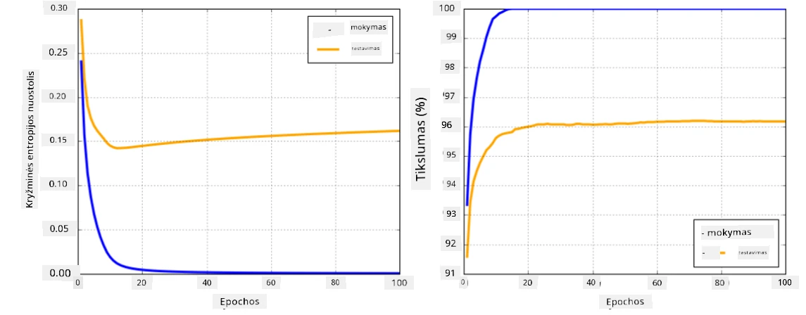

# Neuroninių tinklų karkasai

Kaip jau išmokome, norint efektyviai treniruoti neuroninius tinklus, reikia atlikti du dalykus:

* Dirbti su tensoriais, pvz., dauginti, sudėti ir skaičiuoti tam tikras funkcijas, tokias kaip sigmoidinė ar softmax
* Apskaičiuoti visų išraiškų gradientus, kad būtų galima atlikti gradientinio nusileidimo optimizaciją

## [Prieš paskaitą vykdomas testas](https://ff-quizzes.netlify.app/en/ai/quiz/9)

Nors `numpy` biblioteka gali atlikti pirmąją dalį, mums reikia mechanizmo gradientams apskaičiuoti. [Mūsų karkase](../04-OwnFramework/OwnFramework.ipynb), kurį sukūrėme ankstesniame skyriuje, turėjome rankiniu būdu programuoti visas išvestinių funkcijas `backward` metode, kuris atlieka atgalinį sklidimą. Idealiu atveju karkasas turėtų suteikti galimybę apskaičiuoti *bet kokios išraiškos* gradientus, kuriuos galime apibrėžti.

Kitas svarbus dalykas yra galimybė atlikti skaičiavimus GPU arba kitose specializuotose skaičiavimo vienetuose, pvz., [TPU](https://en.wikipedia.org/wiki/Tensor_Processing_Unit). Giliųjų neuroninių tinklų treniravimas reikalauja *daug* skaičiavimų, todėl galimybė juos paralelizuoti GPU yra labai svarbi.

> ✅ Terminas „paralelizuoti“ reiškia paskirstyti skaičiavimus per kelis įrenginius.

Šiuo metu du populiariausi neuroninių tinklų karkasai yra: [TensorFlow](http://TensorFlow.org) ir [PyTorch](https://pytorch.org/). Abu suteikia žemo lygio API darbui su tensoriais tiek CPU, tiek GPU. Be žemo lygio API, yra ir aukšto lygio API, vadinami [Keras](https://keras.io/) ir [PyTorch Lightning](https://pytorchlightning.ai) atitinkamai.

Žemo lygio API | [TensorFlow](http://TensorFlow.org) | [PyTorch](https://pytorch.org/)
---------------|-------------------------------------|--------------------------------
Aukšto lygio API| [Keras](https://keras.io/) | [PyTorch Lightning](https://pytorchlightning.ai/)

**Žemo lygio API** abiejuose karkasuose leidžia kurti vadinamuosius **skaičiavimo grafus**. Šis grafas apibrėžia, kaip apskaičiuoti išvestį (dažniausiai nuostolių funkciją) su pateiktais įvesties parametrais, ir gali būti perduotas skaičiavimui GPU, jei jis yra prieinamas. Yra funkcijos, skirtos diferencijuoti šį skaičiavimo grafą ir apskaičiuoti gradientus, kurie vėliau gali būti naudojami modelio parametrų optimizavimui.

**Aukšto lygio API** daugiausia laiko neuroninius tinklus kaip **sluoksnių seką**, todėl daugumos neuroninių tinklų konstravimas tampa daug paprastesnis. Modelio treniravimas paprastai reikalauja paruošti duomenis ir tada iškviesti funkciją `fit`, kad atliktų darbą.

Aukšto lygio API leidžia labai greitai sukurti tipinius neuroninius tinklus, nesirūpinant daugybe detalių. Tuo pačiu metu žemo lygio API suteikia daug daugiau kontrolės treniravimo procesui, todėl jie dažnai naudojami tyrimuose, kai dirbama su naujomis neuroninių tinklų architektūromis.

Taip pat svarbu suprasti, kad galite naudoti abu API kartu, pvz., galite sukurti savo tinklo sluoksnio architektūrą naudodami žemo lygio API, o tada naudoti ją didesniame tinkle, sukurtame ir treniruotame su aukšto lygio API. Arba galite apibrėžti tinklą naudodami aukšto lygio API kaip sluoksnių seką, o tada naudoti savo žemo lygio treniravimo ciklą optimizacijai atlikti. Abu API naudoja tuos pačius pagrindinius konceptus ir yra sukurti taip, kad gerai veiktų kartu.

## Mokymasis

Šiame kurse siūlome daugumą turinio tiek PyTorch, tiek TensorFlow. Galite pasirinkti savo mėgstamą karkasą ir peržiūrėti tik atitinkamus užrašus. Jei nesate tikri, kurį karkasą pasirinkti, perskaitykite diskusijas internete apie **PyTorch vs. TensorFlow**. Taip pat galite peržiūrėti abu karkasus, kad geriau suprastumėte.

Kai tik įmanoma, naudosime aukšto lygio API dėl paprastumo. Tačiau manome, kad svarbu suprasti, kaip neuroniniai tinklai veikia nuo pat pradžių, todėl pradžioje dirbsime su žemo lygio API ir tensoriais. Tačiau, jei norite greitai pradėti ir nenorite skirti daug laiko šių detalių mokymuisi, galite praleisti šiuos skyrius ir pereiti tiesiai prie aukšto lygio API užrašų.

## ✍️ Pratimai: Karkasai

Tęskite mokymąsi šiuose užrašuose:

Žemo lygio API | [TensorFlow+Keras Užrašai](IntroKerasTF.ipynb) | [PyTorch](IntroPyTorch.ipynb)
---------------|-------------------------------------|--------------------------------
Aukšto lygio API| [Keras](IntroKeras.ipynb) | *PyTorch Lightning*

Įvaldę karkasus, apžvelkime per didelio pritaikymo (overfitting) sąvoką.

# Per didelis pritaikymas (Overfitting)

Per didelis pritaikymas yra itin svarbi sąvoka mašininio mokymosi srityje, ir labai svarbu ją suprasti teisingai!

Apsvarstykite šią problemą, kurioje reikia aproksimuoti 5 taškus (grafikuose pažymėtus `x`):

 | 
-------------------------|--------------------------
**Linijinis modelis, 2 parametrai** | **Nelinijinis modelis, 7 parametrai**
Mokymo klaida = 5.3 | Mokymo klaida = 0
Validacijos klaida = 5.1 | Validacijos klaida = 20

* Kairėje matome gerą tiesės aproksimaciją. Kadangi parametrų skaičius yra tinkamas, modelis teisingai supranta taškų pasiskirstymo idėją.
* Dešinėje modelis yra per daug galingas. Kadangi turime tik 5 taškus, o modelis turi 7 parametrus, jis gali prisitaikyti taip, kad praeitų per visus taškus, todėl mokymo klaida tampa 0. Tačiau tai neleidžia modeliui suprasti teisingo duomenų modelio, todėl validacijos klaida yra labai didelė.

Labai svarbu rasti tinkamą pusiausvyrą tarp modelio sudėtingumo (parametrų skaičiaus) ir mokymo pavyzdžių skaičiaus.

## Kodėl atsiranda per didelis pritaikymas

  * Nepakankamai mokymo duomenų
  * Per daug galingas modelis
  * Per daug triukšmo įvesties duomenyse

## Kaip aptikti per didelį pritaikymą

Kaip matote iš aukščiau pateikto grafiko, per didelį pritaikymą galima aptikti pagal labai mažą mokymo klaidą ir didelę validacijos klaidą. Paprastai mokymo metu matysime, kaip tiek mokymo, tiek validacijos klaidos pradeda mažėti, o tada tam tikru momentu validacijos klaida gali nustoti mažėti ir pradėti didėti. Tai bus per didelio pritaikymo ženklas ir indikatorius, kad turėtume sustabdyti mokymą (arba bent jau išsaugoti modelio būseną).

## Kaip išvengti per didelio pritaikymo

Jei pastebite, kad atsiranda per didelis pritaikymas, galite atlikti vieną iš šių veiksmų:

 * Padidinti mokymo duomenų kiekį
 * Sumažinti modelio sudėtingumą
 * Naudoti tam tikrą [reguliavimo techniką](../../4-ComputerVision/08-TransferLearning/TrainingTricks.md), pvz., [Dropout](../../4-ComputerVision/08-TransferLearning/TrainingTricks.md#Dropout), kurią aptarsime vėliau.

## Per didelis pritaikymas ir šališkumo-variacijos kompromisas

Per didelis pritaikymas iš tiesų yra bendresnės statistikos problemos, vadinamos [šališkumo-variacijos kompromisu](https://en.wikipedia.org/wiki/Bias%E2%80%93variance_tradeoff), atvejis. Jei apsvarstysime galimus klaidų šaltinius mūsų modelyje, galime matyti dviejų tipų klaidas:

* **Šališkumo klaidos** atsiranda dėl to, kad mūsų algoritmas negali teisingai užfiksuoti ryšio tarp mokymo duomenų. Tai gali būti dėl to, kad mūsų modelis nėra pakankamai galingas (**nepakankamas pritaikymas**).
* **Variacijos klaidos**, kurios atsiranda dėl to, kad modelis aproksimuoja triukšmą įvesties duomenyse, o ne prasmingą ryšį (**per didelis pritaikymas**).

Mokymo metu šališkumo klaida mažėja (kai mūsų modelis mokosi aproksimuoti duomenis), o variacijos klaida didėja. Svarbu sustabdyti mokymą - arba rankiniu būdu (kai aptinkame per didelį pritaikymą), arba automatiškai (įvedant reguliavimą) - kad išvengtume per didelio pritaikymo.

## Išvada

Šioje pamokoje sužinojote apie skirtumus tarp įvairių API dviejuose populiariausiuose AI karkasuose, TensorFlow ir PyTorch. Be to, sužinojote apie labai svarbią temą - per didelį pritaikymą.

## 🚀 Iššūkis

Pridedamuose užrašuose rasite „užduotis“ apačioje; peržiūrėkite užrašus ir atlikite užduotis.

## [Po paskaitos vykdomas testas](https://ff-quizzes.netlify.app/en/ai/quiz/10)

## Apžvalga ir savarankiškas mokymasis

Atlikite tyrimą šiomis temomis:

- TensorFlow
- PyTorch
- Per didelis pritaikymas

Paklauskite savęs šių klausimų:

- Kuo skiriasi TensorFlow ir PyTorch?
- Kuo skiriasi per didelis pritaikymas ir nepakankamas pritaikymas?

## [Užduotis](lab/README.md)

Šioje laboratorijoje jūsų prašoma išspręsti dvi klasifikavimo problemas, naudojant vieno ir daugiapakopius visiškai sujungtus tinklus su PyTorch arba TensorFlow.

* [Instrukcijos](lab/README.md)
* [Užrašai](lab/LabFrameworks.ipynb)

---

