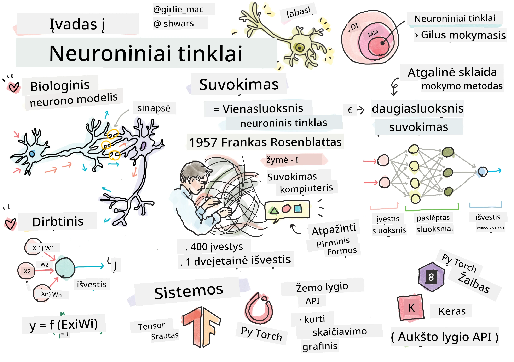
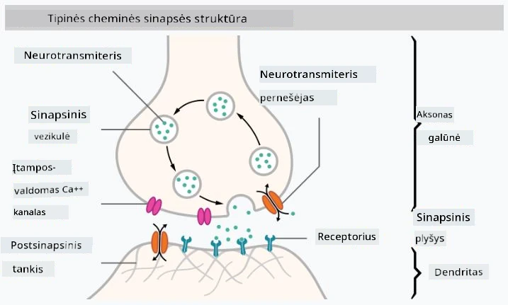
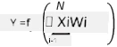

# Įvadas į neuroninius tinklus

Kaip aptarėme įvade, vienas iš būdų pasiekti intelektą yra treniruoti **kompiuterinį modelį** arba **dirbtinį smegenų modelį**. Nuo XX amžiaus vidurio mokslininkai bandė įvairius matematinius modelius, kol pastaraisiais metais šis metodas pasirodė itin sėkmingas. Tokie smegenų matematiniai modeliai vadinami **neuroniniais tinklais**.

> Kartais neuroniniai tinklai vadinami *Dirbtiniais Neuroniniais Tinklais* (ANN), siekiant pabrėžti, kad kalbame apie modelius, o ne tikrus neuronų tinklus.

## Mašininis mokymasis

Neuroniniai tinklai yra didesnės disciplinos, vadinamos **Mašininiu mokymusi**, dalis, kurios tikslas yra naudoti duomenis kompiuterinių modelių mokymui, kad jie galėtų spręsti problemas. Mašininis mokymasis sudaro didelę dirbtinio intelekto dalį, tačiau šioje mokymo programoje klasikinio mašininio mokymosi neaptariame.

> Apsilankykite mūsų atskiroje **[Mašininio mokymosi pradedantiesiems](http://github.com/microsoft/ml-for-beginners)** mokymo programoje, kad sužinotumėte daugiau apie klasikinį mašininį mokymąsi.

Mašininiame mokymesi daroma prielaida, kad turime tam tikrą pavyzdžių duomenų rinkinį **X** ir atitinkamas išvesties reikšmes **Y**. Pavyzdžiai dažnai yra N-dimensiniai vektoriai, sudaryti iš **savybių**, o išvestys vadinamos **etiketėmis**.

Mes apsvarstysime dvi dažniausiai pasitaikančias mašininio mokymosi problemas:

* **Klasifikacija**, kur reikia klasifikuoti įvesties objektą į dvi ar daugiau klasių.
* **Regresija**, kur reikia numatyti skaitinę reikšmę kiekvienam įvesties pavyzdžiui.

> Kai įvestys ir išvestys pateikiamos kaip tensoriai, įvesties duomenų rinkinys yra M&times;N dydžio matrica, kur M yra pavyzdžių skaičius, o N yra savybių skaičius. Išvesties etiketės Y yra M dydžio vektorius.

Šioje mokymo programoje mes sutelksime dėmesį tik į neuroninių tinklų modelius.

## Neurono modelis

Iš biologijos žinome, kad mūsų smegenys susideda iš neuroninių ląstelių (neuronų), kiekviena iš jų turi kelis "įėjimus" (dendritus) ir vieną "išėjimą" (aksoną). Tiek dendritai, tiek aksonai gali perduoti elektrinius signalus, o jungtys tarp jų — vadinamos sinapsėmis — gali turėti skirtingą laidumą, kurį reguliuoja neurotransmiteriai.

 | 
----|----
Tikras neuronas *([Vaizdas](https://en.wikipedia.org/wiki/Synapse#/media/File:SynapseSchematic_lines.svg) iš Vikipedijos)* | Dirbtinis neuronas *(Vaizdas autoriaus)*

Taigi, paprasčiausias matematinis neurono modelis turi kelis įėjimus X1, ..., XN ir vieną išėjimą Y, bei svorių seriją W1, ..., WN. Išėjimas apskaičiuojamas taip:

kur f yra tam tikra nelinijinė **aktyvavimo funkcija**.

> Ankstyvieji neurono modeliai buvo aprašyti klasikiniame straipsnyje [A logical calculus of the ideas immanent in nervous activity](https://www.cs.cmu.edu/~./epxing/Class/10715/reading/McCulloch.and.Pitts.pdf), kurį 1943 m. parašė Warren McCullock ir Walter Pitts. Donald Hebb savo knygoje "[The Organization of Behavior: A Neuropsychological Theory](https://books.google.com/books?id=VNetYrB8EBoC)" pasiūlė būdą, kaip šiuos tinklus galima treniruoti.

## Šiame skyriuje

Šiame skyriuje sužinosime apie:
* [Perceptroną](03-Perceptron/README.md), vieną iš ankstyviausių dviejų klasių klasifikacijos neuroninių tinklų modelių
* [Daugiasluoksnius tinklus](04-OwnFramework/README.md) su susietu užrašų knygeliu [kaip sukurti savo sistemą](04-OwnFramework/OwnFramework.ipynb)
* [Neuroninių tinklų sistemas](05-Frameworks/README.md), su šiomis užrašų knygelėmis: [PyTorch](05-Frameworks/IntroPyTorch.ipynb) ir [Keras/Tensorflow](05-Frameworks/IntroKerasTF.ipynb)
* [Perteklinio mokymosi problemą](../../../../lessons/3-NeuralNetworks/05-Frameworks)

---

**Atsakomybės atsisakymas**:  
Šis dokumentas buvo išverstas naudojant AI vertimo paslaugą [Co-op Translator](https://github.com/Azure/co-op-translator). Nors siekiame tikslumo, prašome atkreipti dėmesį, kad automatiniai vertimai gali turėti klaidų ar netikslumų. Originalus dokumentas jo gimtąja kalba turėtų būti laikomas autoritetingu šaltiniu. Kritinei informacijai rekomenduojama profesionali žmogaus vertimo paslauga. Mes neprisiimame atsakomybės už nesusipratimus ar neteisingus aiškinimus, kylančius dėl šio vertimo naudojimo.