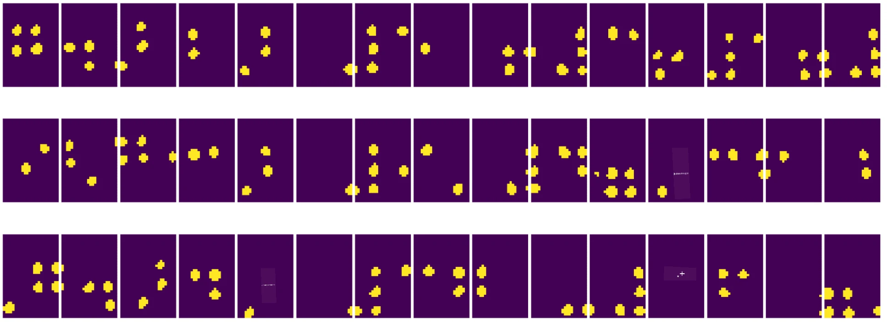

# Įvadas į kompiuterinį matymą

[Kompiuterinis matymas](https://wikipedia.org/wiki/Computer_vision) yra disciplina, kurios tikslas – suteikti kompiuteriams galimybę aukšto lygio suprasti skaitmeninius vaizdus. Tai gana plati apibrėžtis, nes *supratimas* gali reikšti daugybę skirtingų dalykų, įskaitant objekto radimą nuotraukoje (**objektų aptikimas**), supratimą, kas vyksta (**įvykių aptikimas**), nuotraukos aprašymą tekstu arba scenos rekonstrukciją 3D formatu. Taip pat yra specialių užduočių, susijusių su žmogaus vaizdais: amžiaus ir emocijų nustatymas, veido aptikimas ir identifikavimas, 3D pozos nustatymas ir kt.

## [Prieš paskaitą – testas](https://ff-quizzes.netlify.app/en/ai/quiz/11)

Viena paprasčiausių kompiuterinio matymo užduočių yra **vaizdų klasifikacija**.

Kompiuterinis matymas dažnai laikomas dirbtinio intelekto šaka. Šiais laikais dauguma kompiuterinio matymo užduočių sprendžiamos naudojant neuroninius tinklus. Šioje dalyje sužinosime daugiau apie specialų neuroninių tinklų tipą, naudojamą kompiuteriniam matymui – [konvoliucinius neuroninius tinklus](../07-ConvNets/README.md).

Tačiau prieš perduodant vaizdą neuroniniam tinklui, daugeliu atvejų verta pasinaudoti algoritminiais metodais, kad pagerintumėte vaizdo kokybę.

Yra keletas Python bibliotekų, skirtų vaizdų apdorojimui:

* **[imageio](https://imageio.readthedocs.io/en/stable/)** gali būti naudojama skirtingų vaizdų formatų skaitymui/rašymui. Ji taip pat palaiko ffmpeg – naudingą įrankį vaizdo kadrų konvertavimui į vaizdus.
* **[Pillow](https://pillow.readthedocs.io/en/stable/index.html)** (dar žinoma kaip PIL) yra šiek tiek galingesnė ir palaiko kai kurias vaizdų manipuliacijas, tokias kaip morfingas, paletės koregavimas ir kt.
* **[OpenCV](https://opencv.org/)** yra galinga vaizdų apdorojimo biblioteka, parašyta C++, kuri tapo *de facto* standartu vaizdų apdorojimui. Ji turi patogią Python sąsają.
* **[dlib](http://dlib.net/)** yra C++ biblioteka, įgyvendinanti daugelį mašininio mokymosi algoritmų, įskaitant kai kuriuos kompiuterinio matymo algoritmus. Ji taip pat turi Python sąsają ir gali būti naudojama sudėtingoms užduotims, tokioms kaip veido ir veido žymių aptikimas.

## OpenCV

[OpenCV](https://opencv.org/) laikoma *de facto* standartu vaizdų apdorojimui. Ji apima daugybę naudingų algoritmų, įgyvendintų C++. OpenCV galima naudoti ir su Python.

Geras šaltinis mokytis OpenCV yra [šis Learn OpenCV kursas](https://learnopencv.com/getting-started-with-opencv/). Mūsų mokymo programoje tikslas nėra išmokti OpenCV, o parodyti keletą pavyzdžių, kada ji gali būti naudojama ir kaip.

### Vaizdų įkėlimas

Vaizdai Python aplinkoje patogiai atvaizduojami naudojant NumPy masyvus. Pavyzdžiui, pilkos spalvos vaizdai, kurių dydis 320x200 pikselių, būtų saugomi 200x320 masyve, o spalvoti vaizdai su tais pačiais matmenimis turėtų formą 200x320x3 (3 spalvų kanalams). Norėdami įkelti vaizdą, galite naudoti šį kodą:

```python
import cv2
import matplotlib.pyplot as plt

im = cv2.imread('image.jpeg')
plt.imshow(im)
```

Tradiciškai OpenCV naudoja BGR (Mėlyna-Žalia-Raudona) kodavimą spalvotiems vaizdams, tuo tarpu kiti Python įrankiai naudoja tradicinį RGB (Raudona-Žalia-Mėlyna). Kad vaizdas atrodytų teisingai, reikia jį konvertuoti į RGB spalvų erdvę, arba keičiant dimensijas NumPy masyve, arba naudojant OpenCV funkciją:

```python
im = cv2.cvtColor(im,cv2.COLOR_BGR2RGB)
```

Ta pati `cvtColor` funkcija gali būti naudojama kitoms spalvų erdvės transformacijoms, tokioms kaip vaizdo konvertavimas į pilką spalvą arba HSV (Atspalvis-Sodrumas-Vertė) spalvų erdvę.

Taip pat galite naudoti OpenCV, kad įkeltumėte vaizdo įrašą kadrų po kadro – pavyzdys pateiktas užduotyje [OpenCV Notebook](OpenCV.ipynb).

### Vaizdų apdorojimas

Prieš perduodant vaizdą neuroniniam tinklui, gali būti naudinga atlikti kelis išankstinio apdorojimo veiksmus. OpenCV gali atlikti daugybę dalykų, įskaitant:

* **Vaizdo dydžio keitimą** naudojant `im = cv2.resize(im, (320,200),interpolation=cv2.INTER_LANCZOS)`
* **Vaizdo suliejimą** naudojant `im = cv2.medianBlur(im,3)` arba `im = cv2.GaussianBlur(im, (3,3), 0)`
* Vaizdo **ryškumo ir kontrasto** keitimą galima atlikti manipuliuojant NumPy masyvais, kaip aprašyta [šiame Stackoverflow įraše](https://stackoverflow.com/questions/39308030/how-do-i-increase-the-contrast-of-an-image-in-python-opencv).
* Naudojant [slenksčio nustatymą](https://docs.opencv.org/4.x/d7/d4d/tutorial_py_thresholding.html) su `cv2.threshold`/`cv2.adaptiveThreshold` funkcijomis, kuris dažnai yra geresnis pasirinkimas nei ryškumo ar kontrasto koregavimas.
* Taikant įvairias [transformacijas](https://docs.opencv.org/4.5.5/da/d6e/tutorial_py_geometric_transformations.html) vaizdui:
    - **[Afino transformacijos](https://docs.opencv.org/4.5.5/d4/d61/tutorial_warp_affine.html)** gali būti naudingos, jei reikia sujungti sukimosi, dydžio keitimo ir pasvirimo operacijas vaizdui, žinant trijų taškų šaltinio ir paskirties vietas vaizde. Afino transformacijos išlaiko lygiagrečias linijas lygiagrečias.
    - **[Perspektyvos transformacijos](https://medium.com/analytics-vidhya/opencv-perspective-transformation-9edffefb2143)** gali būti naudingos, kai žinote keturių taškų šaltinio ir paskirties vietas vaizde. Pavyzdžiui, jei fotografuojate stačiakampį dokumentą išmaniojo telefono kamera iš tam tikro kampo ir norite gauti stačiakampį dokumento vaizdą.
* Judėjimo supratimą vaizde naudojant **[optinį srautą](https://docs.opencv.org/4.5.5/d4/dee/tutorial_optical_flow.html)**.

## Kompiuterinio matymo naudojimo pavyzdžiai

Mūsų [OpenCV Notebook](OpenCV.ipynb) pateikiame keletą pavyzdžių, kada kompiuterinis matymas gali būti naudojamas specifinėms užduotims atlikti:

* **Brailio knygos nuotraukos išankstinis apdorojimas**. Mes sutelkiame dėmesį į tai, kaip galima naudoti slenksčio nustatymą, funkcijų aptikimą, perspektyvos transformaciją ir NumPy manipuliacijas, kad atskirtume atskirus Brailio simbolius tolimesnei klasifikacijai neuroniniu tinklu.

 |  | 
----|-----|-----

> Vaizdas iš [OpenCV.ipynb](OpenCV.ipynb)

* **Judėjimo aptikimas vaizdo įraše naudojant kadrų skirtumą**. Jei kamera yra fiksuota, tuomet kadrai iš kameros turėtų būti gana panašūs vienas į kitą. Kadangi kadrai atvaizduojami kaip masyvai, tiesiog atimant šiuos masyvus dviejų iš eilės einančių kadrų atveju gausime pikselių skirtumą, kuris turėtų būti mažas statiniams kadrams ir didėti, kai vaizde yra reikšmingas judėjimas.


> Vaizdas iš [OpenCV.ipynb](OpenCV.ipynb)

* **Judėjimo aptikimas naudojant optinį srautą**. [Optinis srautas](https://docs.opencv.org/3.4/d4/dee/tutorial_optical_flow.html) leidžia suprasti, kaip atskiri pikseliai vaizdo kadruose juda. Yra du optinio srauto tipai:

   - **Tankus optinis srautas** apskaičiuoja vektorių lauką, kuris rodo, kur kiekvienas pikselis juda.
   - **Retas optinis srautas** remiasi tam tikrų išskirtinių vaizdo bruožų (pvz., kraštų) paėmimu ir jų trajektorijos kūrimu nuo kadro iki kadro.


> Vaizdas iš [OpenCV.ipynb](OpenCV.ipynb)

## ✍️ Pavyzdiniai užrašai: OpenCV [išbandykite OpenCV veiksmuose](OpenCV.ipynb)

Atlikime keletą eksperimentų su OpenCV, tyrinėdami [OpenCV Notebook](OpenCV.ipynb).

## Išvada

Kartais, palyginti sudėtingos užduotys, tokios kaip judėjimo aptikimas ar pirštų galiukų aptikimas, gali būti išspręstos vien tik kompiuteriniu matymu. Todėl labai naudinga žinoti pagrindinius kompiuterinio matymo metodus ir ką tokios bibliotekos kaip OpenCV gali atlikti.

## 🚀 Iššūkis

Peržiūrėkite [šį vaizdo įrašą](https://docs.microsoft.com/shows/ai-show/ai-show--2021-opencv-ai-competition--grand-prize-winners--cortic-tigers--episode-32?WT.mc_id=academic-77998-cacaste) iš AI šou, kad sužinotumėte apie Cortic Tigers projektą ir kaip jie sukūrė blokų pagrindu veikiančią sprendimą, skirtą demokratizuoti kompiuterinio matymo užduotis per robotą. Atlikite tyrimą apie kitus panašius projektus, kurie padeda naujiems mokiniams įsitraukti į šią sritį.

## [Po paskaitos – testas](https://ff-quizzes.netlify.app/en/ai/quiz/12)

## Apžvalga ir savarankiškas mokymasis

Skaitykite daugiau apie optinį srautą [šiame puikiame vadove](https://learnopencv.com/optical-flow-in-opencv/).

## [Užduotis](lab/README.md)

Šioje laboratorijoje turėsite vaizdo įrašą su paprastais gestais, o jūsų tikslas bus išgauti aukštyn/žemyn/kairėn/dešinėn judesius naudojant optinį srautą.


---

