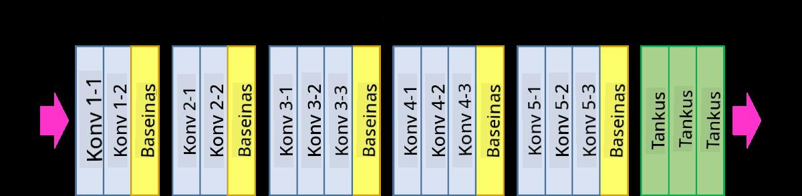
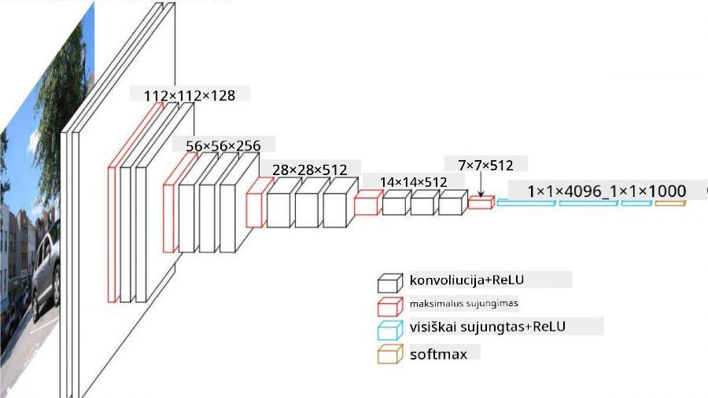

<!--
CO_OP_TRANSLATOR_METADATA:
{
  "original_hash": "2f7b97b375358cb51a1e098df306bf73",
  "translation_date": "2025-08-31T17:36:15+00:00",
  "source_file": "lessons/4-ComputerVision/07-ConvNets/CNN_Architectures.md",
  "language_code": "lt"
}
-->
# Gerai Žinomos CNN Architektūros

### VGG-16

VGG-16 yra tinklas, kuris 2014 metais pasiekė 92,7% tikslumą ImageNet top-5 klasifikacijoje. Jo sluoksnių struktūra yra tokia:

Kaip matote, VGG seka tradicinę piramidės architektūrą, kurią sudaro konvoliucijos ir sujungimo sluoksnių seka.

> Paveikslėlis iš [Researchgate](https://www.researchgate.net/figure/Vgg16-model-structure-To-get-the-VGG-NIN-model-we-replace-the-2-nd-4-th-6-th-7-th_fig2_335194493)

### ResNet

ResNet yra modelių šeima, kurią 2015 metais pasiūlė Microsoft Research. Pagrindinė ResNet idėja yra naudoti **rezidualinius blokus**:

> Paveikslėlis iš [šio straipsnio](https://arxiv.org/pdf/1512.03385.pdf)

Rezidualinio perdavimo tikslas yra leisti sluoksniui prognozuoti **skirtumą** tarp ankstesnio sluoksnio rezultato ir rezidualinio bloko išvesties - todėl jis vadinamas *rezidualiniu*. Tokius blokus yra daug lengviau treniruoti, ir galima sukurti tinklus su šimtais tokių blokų (dažniausiai naudojami variantai yra ResNet-52, ResNet-101 ir ResNet-152).

Šį tinklą taip pat galima įsivaizduoti kaip gebantį prisitaikyti prie duomenų rinkinio sudėtingumo. Pradžioje, kai tinklas tik pradedamas treniruoti, svorių reikšmės yra mažos, ir didžioji dalis signalo praeina per tapatumo sluoksnius. Treniruojant toliau ir svoriams didėjant, tinklo parametrų reikšmė auga, ir tinklas prisitaiko, kad galėtų tinkamai klasifikuoti mokymo vaizdus.

### Google Inception

Google Inception architektūra šią idėją perkelia į kitą lygį, kiekvieną tinklo sluoksnį sudarydama iš kelių skirtingų kelių kombinacijos:

> Paveikslėlis iš [Researchgate](https://www.researchgate.net/figure/Inception-module-with-dimension-reductions-left-and-schema-for-Inception-ResNet-v1_fig2_355547454)

Čia reikia pabrėžti 1x1 konvoliucijų vaidmenį, nes iš pradžių jos gali atrodyti nelogiškos. Kodėl reikėtų naudoti 1x1 filtrą vaizdui apdoroti? Tačiau reikia prisiminti, kad konvoliucijos filtrai taip pat veikia su keliais gylio kanalais (pradžioje - RGB spalvos, vėlesniuose sluoksniuose - kanalai skirtingiems filtrams), o 1x1 konvoliucija naudojama šiems įvesties kanalams maišyti naudojant skirtingus treniruojamus svorius. Tai taip pat galima laikyti kanalo dimensijos sumažinimu (sujungimu).

Štai [geras tinklaraščio įrašas](https://medium.com/analytics-vidhya/talented-mr-1x1-comprehensive-look-at-1x1-convolution-in-deep-learning-f6b355825578) šia tema ir [originalus straipsnis](https://arxiv.org/pdf/1312.4400.pdf).

### MobileNet

MobileNet yra modelių šeima, turinti sumažintą dydį, tinkama naudoti mobiliuosiuose įrenginiuose. Naudokite juos, jei turite ribotus resursus ir galite paaukoti šiek tiek tikslumo. Pagrindinė jų idėja yra vadinamoji **gylio atskirtoji konvoliucija**, kuri leidžia konvoliucijos filtrus atvaizduoti kaip erdvinių konvoliucijų ir 1x1 konvoliucijos per gylio kanalus kompoziciją. Tai žymiai sumažina parametrų skaičių, todėl tinklas tampa mažesnis ir lengviau treniruojamas su mažesniu duomenų kiekiu.

Štai [geras tinklaraščio įrašas apie MobileNet](https://medium.com/analytics-vidhya/image-classification-with-mobilenet-cc6fbb2cd470).

## Išvada

Šioje dalyje sužinojote pagrindinę kompiuterinio regėjimo neuroninių tinklų - konvoliucinių tinklų - koncepciją. Tikrojo gyvenimo architektūros, kurios naudojamos vaizdų klasifikavimui, objektų atpažinimui ir net vaizdų generavimui, visos yra pagrįstos CNN, tik su daugiau sluoksnių ir papildomais treniravimo triukais.

## 🚀 Iššūkis

Pridedamuose užrašų knygelėse apačioje yra pastabų apie tai, kaip pasiekti didesnį tikslumą. Atlikite eksperimentus ir pažiūrėkite, ar galite pasiekti didesnį tikslumą.

## [Po paskaitos testas](https://red-field-0a6ddfd03.1.azurestaticapps.net/quiz/207)

## Peržiūra ir savarankiškas mokymasis

Nors CNN dažniausiai naudojami kompiuterinio regėjimo užduotims, jie apskritai yra geri fiksuoto dydžio šablonų išgavimui. Pavyzdžiui, jei dirbame su garsais, taip pat galime naudoti CNN, kad ieškotume tam tikrų šablonų garso signale - tokiu atveju filtrai būtų vienmatiai (ir toks CNN vadinamas 1D-CNN). Taip pat kartais naudojamas 3D-CNN, norint išgauti ypatybes daugiadimensinėje erdvėje, pavyzdžiui, tam tikriems įvykiams, vykstantiems vaizdo įraše, - CNN gali užfiksuoti tam tikrus ypatybių pokyčių šablonus laikui bėgant. Atlikite peržiūrą ir savarankiškai pasimokykite apie kitas užduotis, kurias galima atlikti naudojant CNN.

## [Užduotis](lab/README.md)

Šioje laboratorijoje jums pavesta klasifikuoti skirtingas kačių ir šunų veisles. Šie vaizdai yra sudėtingesni nei MNIST duomenų rinkinys, turi didesnę dimensiją, ir yra daugiau nei 10 klasių.

---

**Atsakomybės apribojimas**:  
Šis dokumentas buvo išverstas naudojant AI vertimo paslaugą [Co-op Translator](https://github.com/Azure/co-op-translator). Nors siekiame tikslumo, prašome atkreipti dėmesį, kad automatiniai vertimai gali turėti klaidų ar netikslumų. Originalus dokumentas jo gimtąja kalba turėtų būti laikomas autoritetingu šaltiniu. Kritinei informacijai rekomenduojama profesionali žmogaus vertimo paslauga. Mes neprisiimame atsakomybės už nesusipratimus ar klaidingus interpretavimus, atsiradusius naudojant šį vertimą.