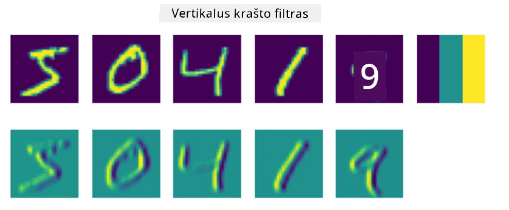
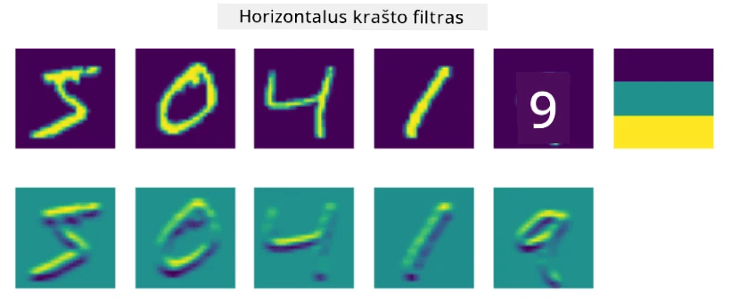
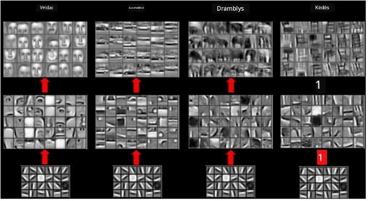
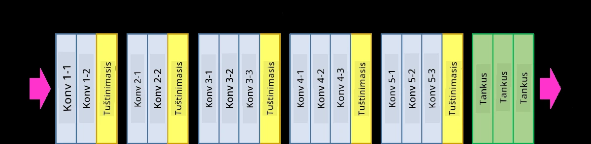
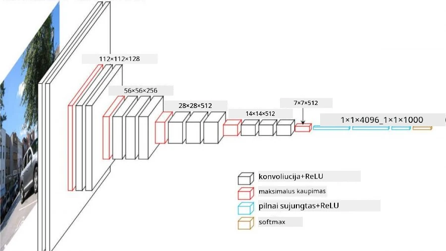

# Konvoliuciniai neuroniniai tinklai

Anksčiau matėme, kad neuroniniai tinklai gana gerai dirba su vaizdais, ir net vieno sluoksnio perceptronas sugeba atpažinti ranka rašytus skaitmenis iš MNIST duomenų rinkinio su pakankamu tikslumu. Tačiau MNIST duomenų rinkinys yra labai specifinis – visi skaitmenys yra centruoti vaizde, todėl užduotis tampa paprastesnė.

## [Klausimai prieš paskaitą](https://ff-quizzes.netlify.app/en/ai/quiz/13)

Realiame gyvenime norime atpažinti objektus nuotraukoje, nepaisant jų tikslios vietos vaizde. Kompiuterinis matymas skiriasi nuo bendro klasifikavimo, nes bandydami rasti tam tikrą objektą nuotraukoje, skenuojame vaizdą ieškodami specifinių **raštų** ir jų kombinacijų. Pavyzdžiui, ieškodami katės, pirmiausia galime ieškoti horizontalių linijų, kurios gali sudaryti ūsus, o tam tikra ūsų kombinacija gali pasakyti, kad tai iš tiesų yra katės nuotrauka. Svarbi yra santykinė tam tikrų raštų padėtis ir buvimas, o ne jų tiksli vieta vaizde.

Norėdami išgauti raštus, naudosime **konvoliucinių filtrų** sąvoką. Kaip žinote, vaizdas yra pateikiamas kaip 2D-matrica arba 3D-tensoras su spalvų gylio dimensija. Filtrą taikyti reiškia, kad imame palyginti mažą **filtrų branduolio** matricą ir kiekvienam pikseliui originaliame vaizde apskaičiuojame svertinį vidurkį su kaimyniniais taškais. Galime tai įsivaizduoti kaip mažą langą, kuris slysta per visą vaizdą ir vidutiniškai apskaičiuoja pikselius pagal filtrų branduolio matricos svorius.

 | 
----|----

> Vaizdas: Dmitry Soshnikov

Pavyzdžiui, jei taikome 3x3 vertikalų ir horizontalų kraštų filtrus MNIST skaitmenims, galime išryškinti (pvz., gauti aukštas reikšmes) vietas, kuriose yra vertikalūs ir horizontalūs kraštai originaliame vaizde. Taigi šiuos du filtrus galima naudoti "ieškant" kraštų. Panašiai galime sukurti skirtingus filtrus, kad ieškotume kitų žemo lygio raštų:

> Vaizdas: [Leung-Malik filtrų rinkinys](https://www.robots.ox.ac.uk/~vgg/research/texclass/filters.html)

Tačiau, nors galime rankiniu būdu sukurti filtrus tam tikrų raštų išgavimui, galime sukurti tinklą taip, kad jis automatiškai išmoktų raštus. Tai yra viena pagrindinių CNN idėjų.

## Pagrindinės CNN idėjos

CNN veikimas grindžiamas šiomis svarbiomis idėjomis:

* Konvoliuciniai filtrai gali išgauti raštus
* Galime sukurti tinklą taip, kad filtrai būtų mokomi automatiškai
* Galime naudoti tą patį metodą aukšto lygio savybių raštų paieškai, ne tik originaliame vaizde. Taigi CNN savybių išgavimas veikia hierarchijos principu – pradedant nuo žemo lygio pikselių kombinacijų iki aukšto lygio vaizdo dalių kombinacijų.

> Vaizdas iš [Hislop-Lynch straipsnio](https://www.semanticscholar.org/paper/Computer-vision-based-pedestrian-trajectory-Hislop-Lynch/26e6f74853fc9bbb7487b06dc2cf095d36c9021d), remiantis [jų tyrimu](https://dl.acm.org/doi/abs/10.1145/1553374.1553453)

## ✍️ Pratimai: Konvoliuciniai neuroniniai tinklai

Tęskime tyrinėjimą, kaip veikia konvoliuciniai neuroniniai tinklai ir kaip galime pasiekti mokomus filtrus, dirbdami su atitinkamais užrašais:

* [Konvoliuciniai neuroniniai tinklai - PyTorch](ConvNetsPyTorch.ipynb)
* [Konvoliuciniai neuroniniai tinklai - TensorFlow](ConvNetsTF.ipynb)

## Piramidės architektūra

Dauguma CNN, naudojamų vaizdų apdorojimui, seka vadinamąją piramidės architektūrą. Pirmasis konvoliucinis sluoksnis, taikomas originaliems vaizdams, paprastai turi palyginti mažą filtrų skaičių (8-16), kurie atitinka skirtingas pikselių kombinacijas, tokias kaip horizontalios/vertikalios linijos ar brūkšniai. Kitame lygyje sumažiname tinklo erdvinę dimensiją ir padidiname filtrų skaičių, kuris atitinka daugiau galimų paprastų savybių kombinacijų. Kiekviename sluoksnyje, judant link galutinio klasifikatoriaus, vaizdo erdvinės dimensijos mažėja, o filtrų skaičius auga.

Pavyzdžiui, pažvelkime į VGG-16 architektūrą – tinklą, kuris 2014 m. pasiekė 92,7% tikslumą ImageNet top-5 klasifikacijoje:

> Vaizdas iš [Researchgate](https://www.researchgate.net/figure/Vgg16-model-structure-To-get-the-VGG-NIN-model-we-replace-the-2-nd-4-th-6-th-7-th_fig2_335194493)

## Geriausiai žinomos CNN architektūros

[Tęskite mokymąsi apie geriausiai žinomas CNN architektūras](CNN_Architectures.md)

---

