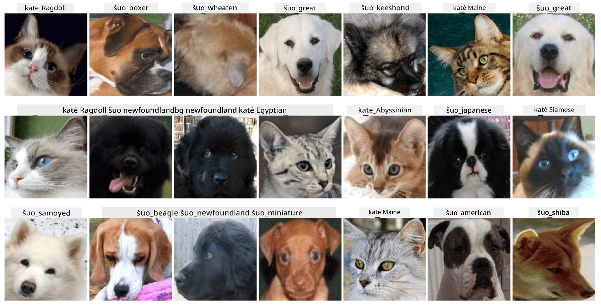

# Naminių gyvūnų veidų klasifikacija

Laboratorinis darbas iš [AI pradedantiesiems mokymo programos](https://github.com/microsoft/ai-for-beginners).

## Užduotis

Įsivaizduokite, kad jums reikia sukurti programą gyvūnų darželiui, kad būtų galima kataloguoti visus gyvūnus. Viena iš puikių tokios programos funkcijų būtų automatiškai nustatyti veislę iš nuotraukos. Tai galima sėkmingai atlikti naudojant neuroninius tinklus.

Jums reikia išmokyti konvoliucinį neuroninį tinklą klasifikuoti skirtingas kačių ir šunų veisles naudojant **Pet Faces** duomenų rinkinį.

## Duomenų rinkinys

Naudosime [Oxford-IIIT Pet Dataset](https://www.robots.ox.ac.uk/~vgg/data/pets/), kuriame yra 37 skirtingų šunų ir kačių veislių nuotraukos.



Norėdami atsisiųsti duomenų rinkinį, naudokite šį kodo fragmentą:

```python
!wget https://thor.robots.ox.ac.uk/~vgg/data/pets/images.tar.gz
!tar xfz images.tar.gz
!rm images.tar.gz
```

**Pastaba:** Oxford-IIIT Pet Dataset nuotraukos yra organizuotos pagal failo pavadinimą (pvz., `Abyssinian_1.jpg`, `Bengal_2.jpg`). Užrašų knygelėje yra kodas, kuris organizuoja šias nuotraukas į veislei specifinius aplankus, kad būtų lengviau klasifikuoti.

## Pradžios užrašų knygelė

Pradėkite laboratorinį darbą atidarydami [PetFaces.ipynb](PetFaces.ipynb)

## Rezultatas

Jūs išsprendėte gana sudėtingą vaizdų klasifikavimo problemą nuo nulio! Buvo nemažai klasių, tačiau vis tiek pavyko pasiekti pagrįstą tikslumą! Taip pat verta matuoti top-k tikslumą, nes kai kurias klases lengva supainioti, ypač tas, kurios net žmonėms nėra aiškiai skirtingos.

---

**Atsakomybės atsisakymas**:  
Šis dokumentas buvo išverstas naudojant AI vertimo paslaugą [Co-op Translator](https://github.com/Azure/co-op-translator). Nors siekiame tikslumo, prašome atkreipti dėmesį, kad automatiniai vertimai gali turėti klaidų ar netikslumų. Originalus dokumentas jo gimtąja kalba turėtų būti laikomas autoritetingu šaltiniu. Kritinei informacijai rekomenduojama naudoti profesionalų žmogaus vertimą. Mes neprisiimame atsakomybės už nesusipratimus ar neteisingus interpretavimus, atsiradusius dėl šio vertimo naudojimo.