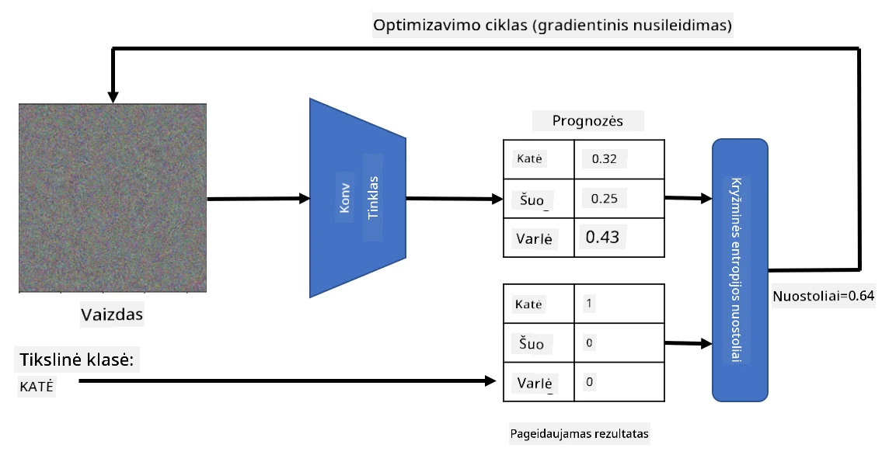

# Iš anksto apmokyti tinklai ir perkėlimo mokymasis

CNN mokymas gali užtrukti daug laiko, o tam reikia daug duomenų. Tačiau didžioji dalis laiko praleidžiama mokantis geriausių žemo lygio filtrų, kuriuos tinklas gali naudoti norėdamas išgauti vaizdų šablonus. Kyla natūralus klausimas – ar galime naudoti neuroninį tinklą, apmokytą viename duomenų rinkinyje, ir pritaikyti jį kitų vaizdų klasifikavimui, nereikalaujant pilno mokymo proceso?

## [Prieš paskaitą vykdomas testas](https://ff-quizzes.netlify.app/en/ai/quiz/15)

Šis metodas vadinamas **perkėlimo mokymusi**, nes mes perkeliam tam tikras žinias iš vieno neuroninio tinklo modelio į kitą. Perkėlimo mokymesi paprastai pradedame nuo iš anksto apmokyto modelio, kuris buvo apmokytas naudojant didelį vaizdų duomenų rinkinį, pvz., **ImageNet**. Tokie modeliai jau geba gerai išgauti įvairias savybes iš bendrų vaizdų, ir daugeliu atvejų tiesiog sukūrus klasifikatorių ant tų išgautų savybių galima pasiekti gerų rezultatų.

> ✅ Perkėlimo mokymasis yra terminas, kurį galima rasti ir kitose akademinėse srityse, pvz., švietime. Jis reiškia procesą, kai žinios iš vienos srities pritaikomos kitoje.

## Iš anksto apmokyti modeliai kaip savybių išgavimo įrankiai

Konvoliuciniai tinklai, apie kuriuos kalbėjome ankstesniame skyriuje, turi daugybę sluoksnių, kurių kiekvienas skirtas išgauti tam tikras savybes iš vaizdo, pradedant nuo žemo lygio pikselių kombinacijų (pvz., horizontalios/vertikalios linijos ar brūkšniai), iki aukštesnio lygio savybių kombinacijų, atitinkančių, pavyzdžiui, liepsnos akį. Jei apmokysime CNN su pakankamai dideliu bendrų ir įvairių vaizdų duomenų rinkiniu, tinklas turėtų išmokti išgauti tas bendras savybes.

Tiek Keras, tiek PyTorch turi funkcijas, leidžiančias lengvai įkelti iš anksto apmokytus neuroninio tinklo svorius kai kurioms įprastoms architektūroms, dauguma kurių buvo apmokytos naudojant ImageNet vaizdus. Dažniausiai naudojamos architektūros aprašytos [CNN Architektūros](../07-ConvNets/CNN_Architectures.md) puslapyje iš ankstesnės pamokos. Ypač galite apsvarstyti vieną iš šių:

* **VGG-16/VGG-19** – tai palyginti paprasti modeliai, kurie vis dar užtikrina gerą tikslumą. Dažnai VGG naudojimas kaip pirmasis bandymas yra geras pasirinkimas norint pamatyti, kaip veikia perkėlimo mokymasis.
* **ResNet** – tai modelių šeima, kurią 2015 m. pasiūlė Microsoft Research. Jie turi daugiau sluoksnių, todėl reikalauja daugiau resursų.
* **MobileNet** – tai modelių šeima su sumažintu dydžiu, tinkama mobiliesiems įrenginiams. Naudokite juos, jei turite mažai resursų ir galite paaukoti šiek tiek tikslumo.

Štai pavyzdinės savybės, išgautos iš katės nuotraukos naudojant VGG-16 tinklą:

## Kačių ir šunų duomenų rinkinys

Šiame pavyzdyje naudosime [Kačių ir šunų](https://www.microsoft.com/download/details.aspx?id=54765&WT.mc_id=academic-77998-cacaste) duomenų rinkinį, kuris yra labai artimas realaus gyvenimo vaizdų klasifikavimo scenarijui.

## ✍️ Užduotis: Perkėlimo mokymasis

Pažiūrėkime, kaip veikia perkėlimo mokymasis atitinkamuose užrašų knygelėse:

* [Perkėlimo mokymasis - PyTorch](TransferLearningPyTorch.ipynb)
* [Perkėlimo mokymasis - TensorFlow](TransferLearningTF.ipynb)

## Vizualizuojame priešišką katę

Iš anksto apmokytas neuroninis tinklas savo „smegenyse“ turi įvairius šablonus, įskaitant **idealios katės** (taip pat idealios šuns, idealios zebros ir kt.) sampratas. Būtų įdomu kažkaip **vizualizuoti šį vaizdą**. Tačiau tai nėra paprasta, nes šablonai yra išsklaidyti visame tinklo svoriuose ir taip pat organizuoti hierarchine struktūra.

Vienas iš būdų, kurį galime naudoti, yra pradėti nuo atsitiktinio vaizdo ir tada bandyti naudoti **gradientinio nusileidimo optimizavimo** techniką, kad pakoreguotume tą vaizdą taip, jog tinklas pradėtų manyti, kad tai yra katė.

Tačiau, jei tai padarysime, gausime kažką labai panašaus į atsitiktinį triukšmą. Taip yra todėl, kad *yra daug būdų, kaip tinklas gali manyti, kad įvesties vaizdas yra katė*, įskaitant kai kuriuos, kurie vizualiai neturi prasmės. Nors tie vaizdai turi daug šablonų, būdingų katei, nėra nieko, kas juos apribotų vizualiai išskirtiniais.

Norėdami pagerinti rezultatą, galime pridėti dar vieną terminą į nuostolių funkciją, vadinamą **variacijos nuostoliu**. Tai metrika, rodanti, kaip panašūs yra kaimyniniai vaizdo pikseliai. Mažinant variacijos nuostolį vaizdas tampa lygesnis ir atsikratoma triukšmo – taip atskleidžiami vizualiai patrauklesni šablonai. Štai pavyzdys tokių „idealių“ vaizdų, kurie su didele tikimybe klasifikuojami kaip katė ir kaip zebra:

 | 
-----|-----
 *Ideali katė* | *Ideali zebra*

Panašus metodas gali būti naudojamas atliekant vadinamuosius **priešiškus išpuolius** prieš neuroninį tinklą. Tarkime, norime apgauti neuroninį tinklą ir priversti šunį atrodyti kaip katę. Jei paimsime šuns vaizdą, kurį tinklas atpažįsta kaip šunį, galime šiek tiek jį pakoreguoti naudodami gradientinio nusileidimo optimizavimą, kol tinklas pradės jį klasifikuoti kaip katę:

 | 
-----|-----
*Originali šuns nuotrauka* | *Šuns nuotrauka, klasifikuojama kaip katė*

Žr. kodą, kaip atkurti aukščiau pateiktus rezultatus, šioje užrašų knygelėje:

* [Ideali ir priešiška katė - TensorFlow](AdversarialCat_TF.ipynb)

## Išvada

Naudodami perkėlimo mokymąsi, galite greitai sukurti klasifikatorių pagal individualų objektų klasifikavimo uždavinį ir pasiekti aukštą tikslumą. Matote, kad sudėtingesni uždaviniai, kuriuos sprendžiame dabar, reikalauja didesnės skaičiavimo galios ir negali būti lengvai išspręsti naudojant CPU. Kitame skyriuje bandysime naudoti lengvesnę įgyvendinimo versiją, kad apmokytume tą patį modelį naudodami mažesnius skaičiavimo resursus, kas lemia tik šiek tiek mažesnį tikslumą.

## 🚀 Iššūkis

Pridedamose užrašų knygelėse yra pastabų apačioje apie tai, kaip perkeltos žinios geriausiai veikia su šiek tiek panašiais mokymo duomenimis (pvz., naujo tipo gyvūnu). Atlikite eksperimentus su visiškai naujais vaizdų tipais, kad pamatytumėte, kaip gerai ar prastai veikia jūsų perkeltų žinių modeliai.

## [Po paskaitos vykdomas testas](https://ff-quizzes.netlify.app/en/ai/quiz/16)

## Apžvalga ir savarankiškas mokymasis

Perskaitykite [TrainingTricks.md](TrainingTricks.md), kad pagilintumėte savo žinias apie kitus būdus, kaip mokyti savo modelius.

## [Užduotis](lab/README.md)

Šiame laboratoriniame darbe naudosime realaus gyvenimo [Oxford-IIIT](https://www.robots.ox.ac.uk/~vgg/data/pets/) naminių gyvūnų duomenų rinkinį su 35 kačių ir šunų veislėmis ir sukursime perkėlimo mokymosi klasifikatorių.

---

