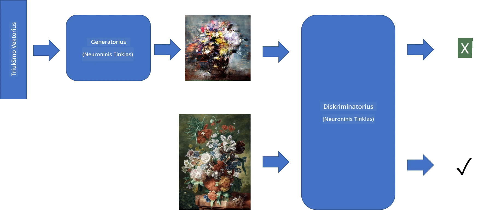
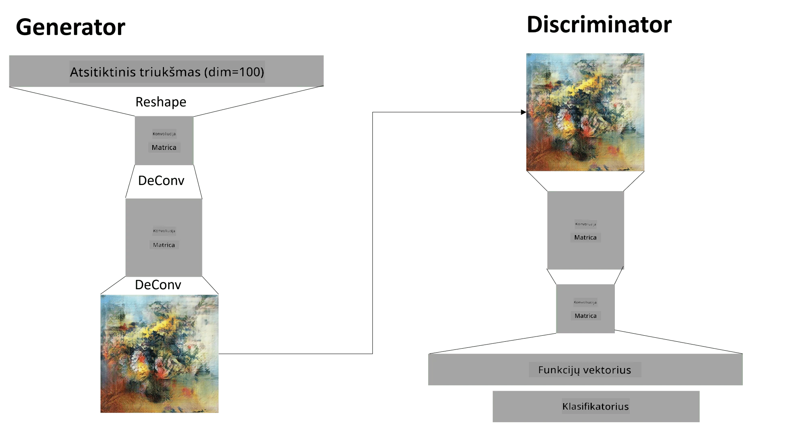

# Generatyviniai priešiški tinklai

Ankstesniame skyriuje sužinojome apie **generatyvinius modelius**: modelius, kurie gali generuoti naujus vaizdus, panašius į tuos, kurie yra mokymo duomenų rinkinyje. VAE buvo geras generatyvinio modelio pavyzdys.

## [Klausimai prieš paskaitą](https://ff-quizzes.netlify.app/en/ai/quiz/19)

Tačiau, jei bandysime generuoti kažką tikrai prasmingo, pavyzdžiui, paveikslą su tinkama raiška, naudojant VAE, pastebėsime, kad mokymas nesikonverguoja gerai. Šiam tikslui turėtume išmokti apie kitą architektūrą, specialiai skirtą generatyviniams modeliams - **Generatyviniai priešiški tinklai**, arba GAN.

Pagrindinė GAN idėja yra turėti du neuroninius tinklus, kurie bus mokomi vienas prieš kitą:

> Vaizdas sukurtas [Dmitry Soshnikov](http://soshnikov.com)

> ✅ Šiek tiek terminologijos:
> * **Generatorius** – tinklas, kuris paima atsitiktinį vektorių ir sukuria vaizdą kaip rezultatą.
> * **Diskriminatorius** – tinklas, kuris paima vaizdą ir turi nustatyti, ar tai tikras vaizdas (iš mokymo duomenų rinkinio), ar jis buvo sukurtas generatoriaus. Iš esmės tai yra vaizdų klasifikatorius.

### Diskriminatorius

Diskriminatoriaus architektūra nesiskiria nuo įprasto vaizdų klasifikavimo tinklo. Paprasčiausiu atveju tai gali būti visiškai sujungtas klasifikatorius, tačiau dažniausiai tai bus [konvoliucinis tinklas](../07-ConvNets/README.md).

> ✅ GAN, pagrįstas konvoliuciniais tinklais, vadinamas [DCGAN](https://arxiv.org/pdf/1511.06434.pdf)

CNN diskriminatorius susideda iš šių sluoksnių: keli konvoliuciniai+apjungimo sluoksniai (su mažėjančiu erdviniu dydžiu) ir vienas ar daugiau visiškai sujungtų sluoksnių, kad būtų gautas "funkcijų vektorius", galutinis dvejetainis klasifikatorius.

> ✅ „Apjungimas“ šiame kontekste yra technika, kuri sumažina vaizdo dydį. „Apjungimo sluoksniai sumažina duomenų matmenis, sujungdami neuronų grupių iš vieno sluoksnio išvestis į vieną neuroną kitame sluoksnyje.“ - [šaltinis](https://wikipedia.org/wiki/Convolutional_neural_network#Pooling_layers)

### Generatorius

Generatorius yra šiek tiek sudėtingesnis. Galite jį laikyti apverstu diskriminatoriumi. Pradedant nuo latentinio vektoriaus (vietoj funkcijų vektoriaus), jis turi visiškai sujungtą sluoksnį, kuris konvertuoja jį į reikiamą dydį/formą, po to eina dekonvoliuciniai+didinimo sluoksniai. Tai panašu į *dekoderio* dalį [autoenkoderio](../09-Autoencoders/README.md).

> ✅ Kadangi konvoliucinis sluoksnis įgyvendinamas kaip linijinis filtras, einantis per vaizdą, dekonvoliucija iš esmės yra panaši į konvoliuciją ir gali būti įgyvendinta naudojant tą pačią sluoksnio logiką.

> Vaizdas sukurtas [Dmitry Soshnikov](http://soshnikov.com)

### GAN mokymas

GAN vadinami **priešiškais**, nes generatorius ir diskriminatorius nuolat konkuruoja tarpusavyje. Šios konkurencijos metu abu tinklai tobulėja, todėl tinklas išmoksta generuoti vis geresnius vaizdus.

Mokymas vyksta dviem etapais:

* **Diskriminatoriaus mokymas**. Ši užduotis yra gana paprasta: mes generuojame vaizdų partiją su generatoriumi, pažymime juos 0, kas reiškia netikrus vaizdus, ir paimame vaizdų partiją iš įvesties duomenų rinkinio (su žyme 1, tikras vaizdas). Mes gauname tam tikrą *diskriminatoriaus nuostolį* ir atliekame atgalinį skaičiavimą.
* **Generatoriaus mokymas**. Tai šiek tiek sudėtingiau, nes mes tiesiogiai nežinome tikėtino generatoriaus išvesties. Mes paimame visą GAN tinklą, sudarytą iš generatoriaus, po kurio eina diskriminatorius, tiekiame jam atsitiktinius vektorius ir tikimės, kad rezultatas bus 1 (atitinkantis tikrus vaizdus). Tada užšaldome diskriminatoriaus parametrus (nenorime, kad jis būtų mokomas šiame žingsnyje) ir atliekame atgalinį skaičiavimą.

Šio proceso metu tiek generatoriaus, tiek diskriminatoriaus nuostoliai reikšmingai nemažėja. Idealiu atveju jie turėtų svyruoti, atspindėdami abiejų tinklų našumo gerėjimą.

## ✍️ Pratimai: GAN

* [GAN užrašų knygelė TensorFlow/Keras](GANTF.ipynb)
* [GAN užrašų knygelė PyTorch](GANPyTorch.ipynb)

### Problemos su GAN mokymu

GAN yra žinomi kaip ypač sunkiai mokomi. Štai kelios problemos:

* **Režimo susiliejimas**. Šiuo terminu apibūdinama situacija, kai generatorius išmoksta generuoti vieną sėkmingą vaizdą, kuris apgauna diskriminatorių, o ne įvairius skirtingus vaizdus.
* **Jautrumas hiperparametrams**. Dažnai galima pastebėti, kad GAN visai nesikonverguoja, o tada staiga sumažėja mokymosi greitis, dėl ko įvyksta konvergencija.
* **Balanso palaikymas** tarp generatoriaus ir diskriminatoriaus. Daugeliu atvejų diskriminatoriaus nuostolis gali greitai nukristi iki nulio, dėl ko generatorius nebegali toliau mokytis. Norint tai įveikti, galima pabandyti nustatyti skirtingus mokymosi greičius generatoriui ir diskriminatoriui arba praleisti diskriminatoriaus mokymą, jei nuostolis jau yra per mažas.
* Mokymas **aukštos raiškos** vaizdams. Atsispindint ta pačia problema kaip ir su autoenkoderiais, ši problema kyla dėl per didelio konvoliucinio tinklo sluoksnių rekonstrukcijos, dėl ko atsiranda artefaktai. Ši problema paprastai sprendžiama vadinamuoju **progresyviu augimu**, kai pirmiausia keli sluoksniai mokomi su mažos raiškos vaizdais, o tada sluoksniai „atrakinami“ arba pridedami. Kitas sprendimas būtų pridėti papildomas jungtis tarp sluoksnių ir mokyti kelias raiškas vienu metu - daugiau informacijos rasite šiame [Multi-Scale Gradient GANs straipsnyje](https://arxiv.org/abs/1903.06048).

## Stiliaus perkėlimas

GAN yra puikus būdas generuoti meninius vaizdus. Kita įdomi technika yra vadinamasis **stiliaus perkėlimas**, kuris paima vieną **turinio vaizdą** ir perpiešia jį kitu stiliumi, pritaikydamas filtrus iš **stiliaus vaizdo**.

Kaip tai veikia:
* Pradedame nuo atsitiktinio triukšmo vaizdo (arba nuo turinio vaizdo, tačiau supratimui lengviau pradėti nuo atsitiktinio triukšmo).
* Mūsų tikslas būtų sukurti tokį vaizdą, kuris būtų artimas tiek turinio vaizdui, tiek stiliaus vaizdui. Tai būtų nustatoma pagal dvi nuostolių funkcijas:
   - **Turinio nuostolis** apskaičiuojamas remiantis funkcijomis, išgautomis CNN tam tikruose sluoksniuose iš dabartinio vaizdo ir turinio vaizdo.
   - **Stiliaus nuostolis** apskaičiuojamas tarp dabartinio vaizdo ir stiliaus vaizdo sumaniai naudojant Gramo matricas (daugiau informacijos rasite [pavyzdinėje užrašų knygelėje](StyleTransfer.ipynb)).
* Kad vaizdas būtų lygesnis ir pašalintų triukšmą, taip pat įvedame **variacijos nuostolį**, kuris apskaičiuoja vidutinį atstumą tarp kaimyninių pikselių.
* Pagrindinis optimizavimo ciklas koreguoja dabartinį vaizdą, naudodamas gradientinį nusileidimą (ar kitą optimizavimo algoritmą), kad sumažintų bendrą nuostolį, kuris yra visų trijų nuostolių svertinė suma.

## ✍️ Pavyzdys: [Stiliaus perkėlimas](StyleTransfer.ipynb)

## [Klausimai po paskaitos](https://ff-quizzes.netlify.app/en/ai/quiz/20)

## Išvada

Šioje pamokoje sužinojote apie GAN ir kaip juos mokyti. Taip pat sužinojote apie specialius iššūkius, su kuriais gali susidurti šio tipo neuroniniai tinklai, ir keletą strategijų, kaip juos įveikti.

## 🚀 Iššūkis

Peržiūrėkite [Stiliaus perkėlimo užrašų knygelę](StyleTransfer.ipynb), naudodami savo vaizdus.

## Peržiūra ir savarankiškas mokymasis

Norėdami gauti daugiau informacijos apie GAN, skaitykite šiuos šaltinius:

* Marco Pasini, [10 pamokų, kurias išmokau mokydamas GAN vienerius metus](https://towardsdatascience.com/10-lessons-i-learned-training-generative-adversarial-networks-gans-for-a-year-c9071159628)
* [StyleGAN](https://en.wikipedia.org/wiki/StyleGAN), *de facto* GAN architektūra, kurią verta apsvarstyti
* [Generatyvinio meno kūrimas naudojant GAN Azure ML](https://soshnikov.com/scienceart/creating-generative-art-using-gan-on-azureml/)

## Užduotis

Peržiūrėkite vieną iš dviejų užrašų knygelių, susijusių su šia pamoka, ir iš naujo apmokykite GAN naudodami savo vaizdus. Ką galite sukurti?

---

