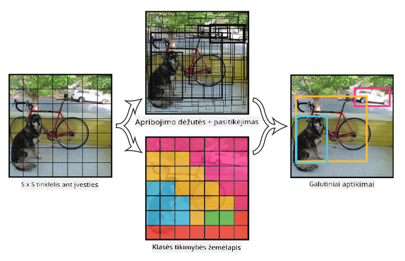

<!--
CO_OP_TRANSLATOR_METADATA:
{
  "original_hash": "d85c8b08f6d1b48fd7f35b99f93c1138",
  "translation_date": "2025-08-31T17:40:39+00:00",
  "source_file": "lessons/4-ComputerVision/11-ObjectDetection/README.md",
  "language_code": "lt"
}
-->
# Objektų atpažinimas

Vaizdų klasifikavimo modeliai, su kuriais dirbome iki šiol, paimdavo vaizdą ir pateikdavo kategorinį rezultatą, pavyzdžiui, klasę „skaičius“ MNIST užduotyje. Tačiau daugeliu atvejų mums nepakanka žinoti, kad paveikslėlyje yra objektų – mes norime nustatyti jų tikslią vietą. Būtent tai ir yra **objektų atpažinimo** esmė.

## [Prieš paskaitą: testas](https://ff-quizzes.netlify.app/en/ai/quiz/21)

> Vaizdas iš [YOLO v2 svetainės](https://pjreddie.com/darknet/yolov2/)

## Naivus požiūris į objektų atpažinimą

Tarkime, norime rasti katę paveikslėlyje. Labai naivus požiūris į objektų atpažinimą galėtų būti toks:

1. Suskaidykite paveikslėlį į daugybę plytelių.
2. Atlikite vaizdų klasifikavimą kiekvienoje plytelėje.
3. Tos plytelės, kuriose aktyvacija yra pakankamai aukšta, gali būti laikomos turinčiomis ieškomą objektą.

> *Vaizdas iš [užduočių sąsiuvinio](ObjectDetection-TF.ipynb)*

Tačiau šis metodas toli gražu nėra idealus, nes leidžia algoritmui labai netiksliai nustatyti objekto ribų dėžutę. Norint tiksliau nustatyti vietą, reikia atlikti tam tikrą **regresiją**, kad būtų galima prognozuoti ribų dėžučių koordinates – tam reikalingi specifiniai duomenų rinkiniai.

## Regresija objektų atpažinimui

[Šis tinklaraščio įrašas](https://towardsdatascience.com/object-detection-with-neural-networks-a4e2c46b4491) puikiai supažindina su formų atpažinimu.

## Duomenų rinkiniai objektų atpažinimui

Šiai užduočiai galite susidurti su šiais duomenų rinkiniais:

* [PASCAL VOC](http://host.robots.ox.ac.uk/pascal/VOC/) – 20 klasių
* [COCO](http://cocodataset.org/#home) – „Common Objects in Context“. 80 klasių, ribų dėžutės ir segmentavimo kaukės

## Objektų atpažinimo metrikos

### Sankirta per sąjungą (Intersection over Union)

Vaizdų klasifikavimui lengva išmatuoti, kaip gerai veikia algoritmas, tačiau objektų atpažinimui reikia įvertinti tiek klasės teisingumą, tiek numatytos ribų dėžutės vietos tikslumą. Pastarajam naudojame vadinamąją **sankirtą per sąjungą** (IoU), kuri matuoja, kaip gerai dvi dėžutės (ar dvi savavališkos sritys) persidengia.

> *2 pav. iš [puikaus tinklaraščio įrašo apie IoU](https://pyimagesearch.com/2016/11/07/intersection-over-union-iou-for-object-detection/)*

Idėja paprasta – padalijame dviejų figūrų sankirtos plotą iš jų sąjungos ploto. Dviejų identiškų sričių IoU būtų 1, o visiškai nesutampančių sričių – 0. Kitais atvejais reikšmė svyruos nuo 0 iki 1. Paprastai atsižvelgiame tik į tas ribų dėžutes, kurių IoU viršija tam tikrą vertę.

### Vidutinė tikslumo reikšmė (Average Precision)

Tarkime, norime įvertinti, kaip gerai atpažįstama tam tikra objektų klasė $C$. Tam naudojame **vidutinio tikslumo** metriką, kuri apskaičiuojama taip:

1. Apsvarstykite tikslumo ir atgaminimo (Precision-Recall) kreivę, kuri rodo tikslumą priklausomai nuo aptikimo slenksčio vertės (nuo 0 iki 1).
2. Priklausomai nuo slenksčio, paveikslėlyje aptinkama daugiau ar mažiau objektų, o tikslumo ir atgaminimo reikšmės skiriasi.
3. Kreivė atrodys taip:

> *Vaizdas iš [NeuroWorkshop](http://github.com/shwars/NeuroWorkshop)*

Vidutinė tikslumo reikšmė klasei $C$ yra plotas po šia kreive. Tiksliau, atgaminimo ašis paprastai padalijama į 10 dalių, o tikslumas vidurkinamas per visas šias taškus:

$$
AP = {1\over11}\sum_{i=0}^{10}\mbox{Precision}(\mbox{Recall}={i\over10})
$$

### AP ir IoU

Apsvarstysime tik tuos aptikimus, kurių IoU viršija tam tikrą vertę. Pavyzdžiui, PASCAL VOC duomenų rinkinyje paprastai $\mbox{IoU Threshold} = 0.5$, o COCO AP matuojamas skirtingoms $\mbox{IoU Threshold}$ reikšmėms.

> *Vaizdas iš [NeuroWorkshop](http://github.com/shwars/NeuroWorkshop)*

### Vidutinė vidutinio tikslumo reikšmė – mAP

Pagrindinė objektų atpažinimo metrika vadinama **vidutine vidutinio tikslumo reikšme** arba **mAP**. Tai yra vidutinio tikslumo reikšmė, vidurkinama per visas objektų klases, o kartais ir per $\mbox{IoU Threshold}$. Išsamesnis **mAP** skaičiavimo procesas aprašytas
[šiame tinklaraščio įraše](https://medium.com/@timothycarlen/understanding-the-map-evaluation-metric-for-object-detection-a07fe6962cf3), taip pat [čia su kodo pavyzdžiais](https://gist.github.com/tarlen5/008809c3decf19313de216b9208f3734).

## Skirtingi objektų atpažinimo metodai

Yra dvi pagrindinės objektų atpažinimo algoritmų klasės:

* **Regionų pasiūlymų tinklai** (R-CNN, Fast R-CNN, Faster R-CNN). Pagrindinė idėja – generuoti **dominantiesiems regionams** (ROI) ir praleisti CNN per juos, ieškant maksimalaus aktyvavimo. Tai šiek tiek panašu į naivų metodą, išskyrus tai, kad ROI generuojami protingesniu būdu. Vienas pagrindinių šių metodų trūkumų yra lėtumas, nes reikia daug CNN klasifikatoriaus praleidimų per vaizdą.
* **Vieno praleidimo** (YOLO, SSD, RetinaNet) metodai. Šiose architektūrose tinklas suprojektuotas taip, kad vienu praleidimu prognozuotų tiek klases, tiek ROI.

### R-CNN: Region-Based CNN

[R-CNN](http://islab.ulsan.ac.kr/files/announcement/513/rcnn_pami.pdf) naudoja [Selective Search](http://www.huppelen.nl/publications/selectiveSearchDraft.pdf), kad generuotų hierarchinę ROI regionų struktūrą, kuri vėliau perduodama per CNN požymių išgavimo ir SVM klasifikatorius, kad būtų nustatyta objekto klasė, o linijinė regresija naudojama *ribų dėžutės* koordinatėms nustatyti. [Oficialus straipsnis](https://arxiv.org/pdf/1506.01497v1.pdf)

> *Vaizdas iš van de Sande et al. ICCV’11*

> *Vaizdai iš [šio tinklaraščio](https://towardsdatascience.com/r-cnn-fast-r-cnn-faster-r-cnn-yolo-object-detection-algorithms-36d53571365e)*

### F-RCNN – Fast R-CNN

Šis metodas panašus į R-CNN, tačiau regionai apibrėžiami po konvoliucinių sluoksnių pritaikymo.

> Vaizdas iš [oficialaus straipsnio](https://www.cv-foundation.org/openaccess/content_iccv_2015/papers/Girshick_Fast_R-CNN_ICCV_2015_paper.pdf), [arXiv](https://arxiv.org/pdf/1504.08083.pdf), 2015

### Faster R-CNN

Pagrindinė šio metodo idėja – naudoti neuroninį tinklą ROI prognozavimui – vadinamąjį *Region Proposal Network*. [Straipsnis](https://arxiv.org/pdf/1506.01497.pdf), 2016

> Vaizdas iš [oficialaus straipsnio](https://arxiv.org/pdf/1506.01497.pdf)

### R-FCN: Region-Based Fully Convolutional Network

Šis algoritmas dar greitesnis nei Faster R-CNN. Pagrindinė idėja:

1. Išgauname požymius naudodami ResNet-101.
2. Požymiai apdorojami **Position-Sensitive Score Map**. Kiekvienas objektas iš $C$ klasių padalijamas į $k\times k$ regionus, ir mes mokome prognozuoti objektų dalis.
3. Kiekvienai daliai iš $k\times k$ regionų visi tinklai balsuoja už objektų klases, ir pasirenkama klasė su didžiausiu balsų skaičiumi.

> Vaizdas iš [oficialaus straipsnio](https://arxiv.org/abs/1605.06409)

### YOLO – You Only Look Once

YOLO yra realaus laiko vieno praleidimo algoritmas. Pagrindinė idėja:

 * Vaizdas padalijamas į $S\times S$ regionus.
 * Kiekvienam regionui **CNN** prognozuoja $n$ galimų objektų, *ribų dėžutės* koordinates ir *pasitikėjimą*=*tikimybę* * IoU.

 

> Vaizdas iš [oficialaus straipsnio](https://arxiv.org/abs/1506.02640)

### Kiti algoritmai

* RetinaNet: [oficialus straipsnis](https://arxiv.org/abs/1708.02002)
   - [PyTorch įgyvendinimas Torchvision](https://pytorch.org/vision/stable/_modules/torchvision/models/detection/retinanet.html)
   - [Keras įgyvendinimas](https://github.com/fizyr/keras-retinanet)
   - [Objektų atpažinimas su RetinaNet](https://keras.io/examples/vision/retinanet/) Keras pavyzdžiuose
* SSD (Single Shot Detector): [oficialus straipsnis](https://arxiv.org/abs/1512.02325)

## ✍️ Pratimai: Objektų atpažinimas

Tęskite mokymąsi šiame sąsiuvinyje:

[ObjectDetection.ipynb](ObjectDetection.ipynb)

## Išvada

Šioje pamokoje greitai apžvelgėte įvairius būdus, kaip galima atlikti objektų atpažinimą!

## 🚀 Iššūkis

Perskaitykite šiuos straipsnius ir sąsiuvinius apie YOLO ir išbandykite juos patys:

* [Geras tinklaraščio įrašas](https://www.analyticsvidhya.com/blog/2018/12/practical-guide-object-detection-yolo-framewor-python/) apie YOLO
 * [Oficiali svetainė](https://pjreddie.com/darknet/yolo/)
 * Yolo: [Keras įgyvendinimas](https://github.com/experiencor/keras-yolo2), [žingsnis po žingsnio sąsiuvinis](https://github.com/experiencor/basic-yolo-keras/blob/master/Yolo%20Step-by-Step.ipynb)
 * Yolo v2: [Keras įgyvendinimas](https://github.com/experiencor/keras-yolo2), [žingsnis po žingsnio sąsiuvinis](https://github.com/experiencor/keras-yolo2/blob/master/Yolo%20Step-by-Step.ipynb)

## [Po paskaitos: testas](https://ff-quizzes.netlify.app/en/ai/quiz/22)

## Apžvalga ir savarankiškas mokymasis

* [Objektų atpažinimas](https://tjmachinelearning.com/lectures/1718/obj/) Nikhil Sardana
* [Geras objektų atpažinimo algoritmų palyginimas](https://lilianweng.github.io/lil-log/2018/12/27/object-detection-part-4.html)
* [Giliųjų mokymosi algoritmų apžvalga objektų atpažinimui](https://medium.com/comet-app/review-of-deep-learning-algorithms-for-object-detection-c1f3d437b852)
* [Žingsnis po žingsnio įvadas į pagrindinius objektų atpažinimo algoritmus](https://www.analyticsvidhya.com/blog/2018/10/a-step-by-step-introduction-to-the-basic-object-detection-algorithms-part-1/)
* [Faster R-CNN įgyvendinimas Python kalba objektų atpažinimui](https://www.analyticsvidhya.com/blog/2018/11/implementation-faster-r-cnn-python-object-detection/)

## [Užduotis: Objektų atpažinimas](lab/README.md)

---

**Atsakomybės apribojimas**:  
Šis dokumentas buvo išverstas naudojant AI vertimo paslaugą [Co-op Translator](https://github.com/Azure/co-op-translator). Nors siekiame tikslumo, prašome atkreipti dėmesį, kad automatiniai vertimai gali turėti klaidų ar netikslumų. Originalus dokumentas jo gimtąja kalba turėtų būti laikomas autoritetingu šaltiniu. Kritinei informacijai rekomenduojama profesionali žmogaus vertimo paslauga. Mes neprisiimame atsakomybės už nesusipratimus ar klaidingus interpretavimus, atsiradusius dėl šio vertimo naudojimo.