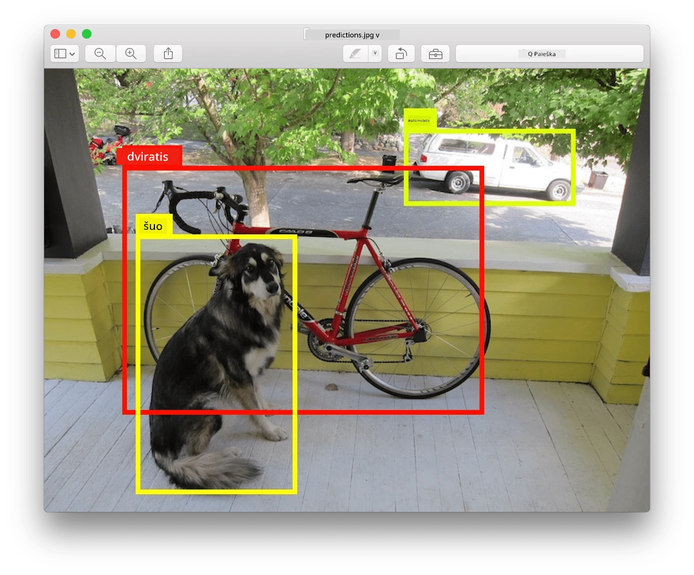
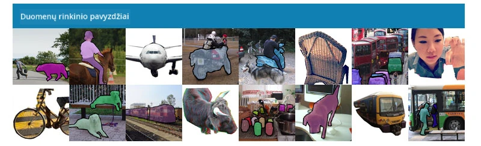
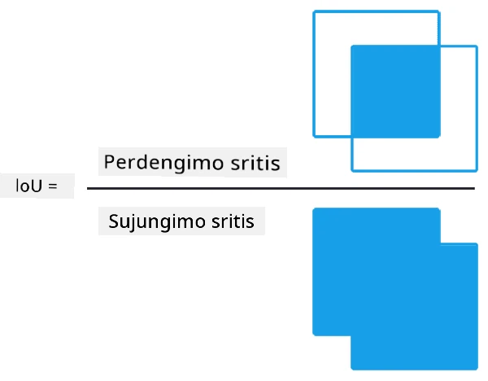
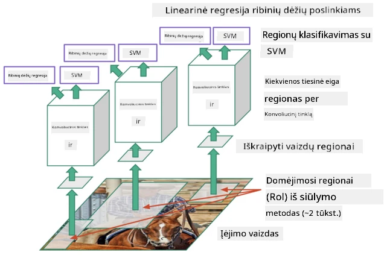
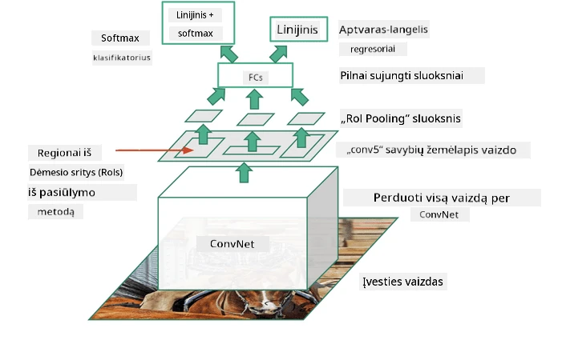
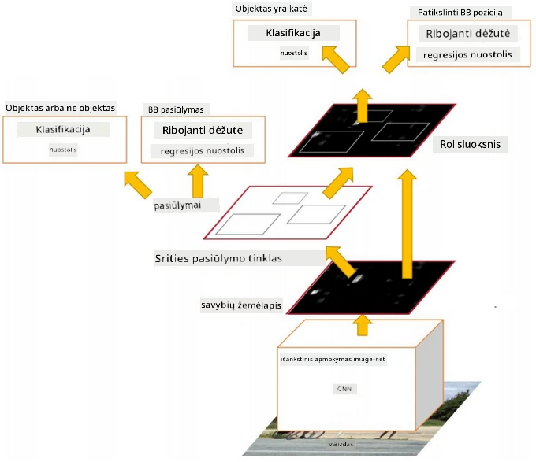
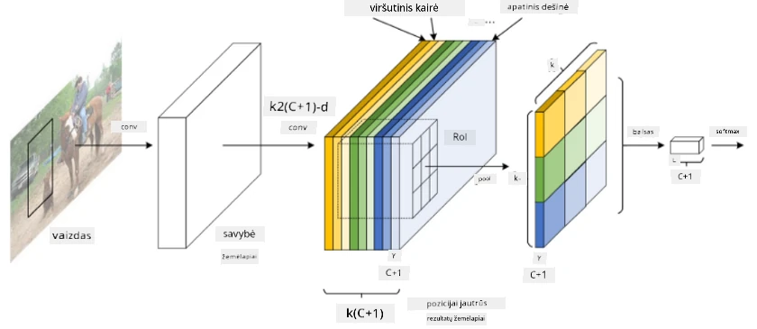
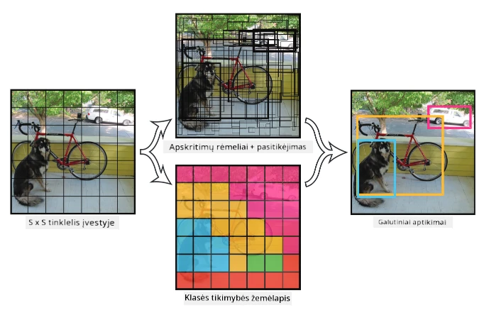

# Objektų atpažinimas

Vaizdų klasifikavimo modeliai, su kuriais dirbome iki šiol, paimdavo vaizdą ir pateikdavo kategorinį rezultatą, pavyzdžiui, klasę „skaičius“ MNIST problemos atveju. Tačiau daugeliu atvejų mums nepakanka žinoti, kad paveikslėlyje yra objektų – norime nustatyti jų tikslią vietą. Būtent tai ir yra **objektų atpažinimo** esmė.

## [Prieš paskaitą: testas](https://ff-quizzes.netlify.app/en/ai/quiz/21)

> Vaizdas iš [YOLO v2 svetainės](https://pjreddie.com/darknet/yolov2/)

## Naivus požiūris į objektų atpažinimą

Tarkime, norime rasti katę paveikslėlyje. Labai naivus požiūris į objektų atpažinimą būtų toks:

1. Suskaidyti paveikslėlį į daugybę plytelių.
2. Atlikti vaizdų klasifikavimą kiekvienoje plytelėje.
3. Tos plytelės, kurios duoda pakankamai aukštą aktyvaciją, gali būti laikomos turinčiomis ieškomą objektą.

> *Vaizdas iš [užduočių sąsiuvinio](ObjectDetection-TF.ipynb)*

Tačiau šis metodas yra toli gražu ne idealus, nes leidžia algoritmui labai netiksliai nustatyti objekto ribas. Norint tiksliau nustatyti vietą, reikia atlikti tam tikrą **regresiją**, kad būtų galima prognozuoti ribų koordinates – tam reikalingi specifiniai duomenų rinkiniai.

## Regresija objektų atpažinimui

[Šis tinklaraščio įrašas](https://towardsdatascience.com/object-detection-with-neural-networks-a4e2c46b4491) puikiai paaiškina, kaip atpažinti formas.

## Duomenų rinkiniai objektų atpažinimui

Galite susidurti su šiais duomenų rinkiniais:

* [PASCAL VOC](http://host.robots.ox.ac.uk/pascal/VOC/) – 20 klasių
* [COCO](http://cocodataset.org/#home) – Įprasti objektai kontekste. 80 klasių, ribų dėžutės ir segmentavimo kaukės

## Objektų atpažinimo metrikos

### Sankirta per sąjungą (Intersection over Union)

Vaizdų klasifikavimui lengva išmatuoti, kaip gerai veikia algoritmas, tačiau objektų atpažinimui reikia įvertinti tiek klasės teisingumą, tiek numatytos ribų dėžutės vietos tikslumą. Pastarajam naudojama vadinamoji **Sankirta per sąjungą** (IoU), kuri matuoja, kaip gerai sutampa dvi dėžutės (arba dvi savavališkos sritys).

> *2 paveikslas iš [puikaus tinklaraščio apie IoU](https://pyimagesearch.com/2016/11/07/intersection-over-union-iou-for-object-detection/)*

Idėja paprasta – padalijame dviejų figūrų sankirtos plotą iš jų sąjungos ploto. Dviem identiškoms sritims IoU būtų 1, o visiškai nesutampančioms – 0. Kitais atvejais IoU svyruos nuo 0 iki 1. Paprastai laikome tik tas ribų dėžutes, kurių IoU viršija tam tikrą vertę.

### Vidutinė tikslumas (Average Precision)

Tarkime, norime įvertinti, kaip gerai atpažįstama tam tikra objektų klasė $C$. Tam naudojame **Vidutinio tikslumo** metriką, kuri apskaičiuojama taip:

1. Tikslumo ir atpažinimo kreivė rodo tikslumą priklausomai nuo atpažinimo slenksčio vertės (nuo 0 iki 1).
2. Priklausomai nuo slenksčio, paveikslėlyje bus aptikta daugiau arba mažiau objektų, o tikslumo ir atpažinimo vertės skirsis.
3. Kreivė atrodys taip:

> *Vaizdas iš [NeuroWorkshop](http://github.com/shwars/NeuroWorkshop)*

Vidutinis tikslumas tam tikrai klasei $C$ yra plotas po šia kreive. Tiksliau, atpažinimo ašis paprastai padalijama į 10 dalių, o tikslumas vidurkinamas per visus šiuos taškus:

$$
AP = {1\over11}\sum_{i=0}^{10}\mbox{Precision}(\mbox{Recall}={i\over10})
$$

### AP ir IoU

Aptarsime tik tuos aptikimus, kurių IoU viršija tam tikrą vertę. Pavyzdžiui, PASCAL VOC duomenų rinkinyje paprastai $\mbox{IoU Threshold} = 0.5$, o COCO AP matuojamas skirtingoms $\mbox{IoU Threshold}$ vertėms.

> *Vaizdas iš [NeuroWorkshop](http://github.com/shwars/NeuroWorkshop)*

### Vidutinis vidutinis tikslumas – mAP

Pagrindinė objektų atpažinimo metrika vadinama **Vidutiniu vidutiniu tikslumu**, arba **mAP**. Tai yra vidutinio tikslumo vertė, vidurkinama per visas objektų klases, o kartais ir per $\mbox{IoU Threshold}$. Išsamiau apie **mAP** skaičiavimo procesą galite perskaityti
[šiame tinklaraščio įraše](https://medium.com/@timothycarlen/understanding-the-map-evaluation-metric-for-object-detection-a07fe6962cf3)), taip pat [čia su kodo pavyzdžiais](https://gist.github.com/tarlen5/008809c3decf19313de216b9208f3734).

## Skirtingi objektų atpažinimo metodai

Yra dvi pagrindinės objektų atpažinimo algoritmų klasės:

* **Regionų pasiūlymo tinklai** (R-CNN, Fast R-CNN, Faster R-CNN). Pagrindinė idėja – generuoti **interesų regionus** (ROI) ir per juos paleisti CNN, ieškant didžiausios aktyvacijos. Tai šiek tiek panašu į naivų metodą, išskyrus tai, kad ROI generuojami protingesniu būdu. Vienas pagrindinių tokių metodų trūkumų yra tas, kad jie yra lėti, nes reikia daug CNN klasifikatoriaus perėjimų per vaizdą.
* **Vieno perėjimo** (YOLO, SSD, RetinaNet) metodai. Šiose architektūrose tinklas sukurtas taip, kad vienu perėjimu prognozuotų tiek klases, tiek ROI.

### R-CNN: Regionais pagrįstas CNN

[R-CNN](http://islab.ulsan.ac.kr/files/announcement/513/rcnn_pami.pdf) naudoja [Selektyvų paiešką](http://www.huppelen.nl/publications/selectiveSearchDraft.pdf), kad sukurtų hierarchinę ROI regionų struktūrą, kuri vėliau perduodama per CNN funkcijų ištraukėjus ir SVM klasifikatorius, kad būtų nustatyta objekto klasė, o linijinė regresija naudojama *ribų dėžutės* koordinatėms nustatyti. [Oficialus straipsnis](https://arxiv.org/pdf/1506.01497v1.pdf)

> *Vaizdas iš van de Sande et al. ICCV’11*

> *Vaizdai iš [šio tinklaraščio](https://towardsdatascience.com/r-cnn-fast-r-cnn-faster-r-cnn-yolo-object-detection-algorithms-36d53571365e)*

### F-RCNN – Greitas R-CNN

Šis metodas panašus į R-CNN, tačiau regionai apibrėžiami po konvoliucinių sluoksnių taikymo.

> Vaizdas iš [oficialaus straipsnio](https://www.cv-foundation.org/openaccess/content_iccv_2015/papers/Girshick_Fast_R-CNN_ICCV_2015_paper.pdf), [arXiv](https://arxiv.org/pdf/1504.08083.pdf), 2015

### Greitesnis R-CNN

Pagrindinė šio metodo idėja – naudoti neuroninį tinklą ROI prognozavimui – vadinamąjį *Regionų pasiūlymo tinklą*. [Straipsnis](https://arxiv.org/pdf/1506.01497.pdf), 2016

> Vaizdas iš [oficialaus straipsnio](https://arxiv.org/pdf/1506.01497.pdf)

### R-FCN: Regionais pagrįstas visiškai konvoliucinis tinklas

Šis algoritmas yra dar greitesnis nei Greitesnis R-CNN. Pagrindinė idėja yra tokia:

1. Ištraukiame funkcijas naudodami ResNet-101.
2. Funkcijos apdorojamos **Pozicijos jautriu rezultatų žemėlapiu**. Kiekvienas objektas iš $C$ klasių padalijamas į $k\times k$ regionus, ir mes treniruojame tinklą prognozuoti objektų dalis.
3. Kiekvienai daliai iš $k\times k$ regionų visi tinklai balsuoja už objektų klases, ir klasė su didžiausiu balsų skaičiumi yra pasirinkta.

> Vaizdas iš [oficialaus straipsnio](https://arxiv.org/abs/1605.06409)

### YOLO – You Only Look Once

YOLO yra realaus laiko vieno perėjimo algoritmas. Pagrindinė idėja yra tokia:

 * Vaizdas padalijamas į $S\times S$ regionus.
 * Kiekvienam regionui **CNN** prognozuoja $n$ galimų objektų, *ribų dėžutės* koordinates ir *pasitikėjimą*=*tikimybę* * IoU.

 

> Vaizdas iš [oficialaus straipsnio](https://arxiv.org/abs/1506.02640)

### Kiti algoritmai

* RetinaNet: [oficialus straipsnis](https://arxiv.org/abs/1708.02002)
   - [PyTorch įgyvendinimas Torchvision](https://pytorch.org/vision/stable/_modules/torchvision/models/detection/retinanet.html)
   - [Keras įgyvendinimas](https://github.com/fizyr/keras-retinanet)
   - [Objektų atpažinimas su RetinaNet](https://keras.io/examples/vision/retinanet/) Keras pavyzdžiuose
* SSD (Single Shot Detector): [oficialus straipsnis](https://arxiv.org/abs/1512.02325)

## ✍️ Pratimai: Objektų atpažinimas

Tęskite mokymąsi šiame sąsiuvinyje:

[ObjectDetection.ipynb](ObjectDetection.ipynb)

## Išvada

Šioje pamokoje apžvelgėte įvairius būdus, kaip galima atlikti objektų atpažinimą!

## 🚀 Iššūkis

Perskaitykite šiuos straipsnius ir sąsiuvinius apie YOLO ir išbandykite juos patys:

* [Puikus tinklaraščio įrašas](https://www.analyticsvidhya.com/blog/2018/12/practical-guide-object-detection-yolo-framewor-python/) apie YOLO
 * [Oficiali svetainė](https://pjreddie.com/darknet/yolo/)
 * Yolo: [Keras įgyvendinimas](https://github.com/experiencor/keras-yolo2), [žingsnis po žingsnio sąsiuvinis](https://github.com/experiencor/basic-yolo-keras/blob/master/Yolo%20Step-by-Step.ipynb)
 * Yolo v2: [Keras įgyvendinimas](https://github.com/experiencor/keras-yolo2), [žingsnis po žingsnio sąsiuvinis](https://github.com/experiencor/keras-yolo2/blob/master/Yolo%20Step-by-Step.ipynb)

## [Po paskaitos: testas](https://ff-quizzes.netlify.app/en/ai/quiz/22)

## Apžvalga ir savarankiškas mokymasis

* [Objektų atpažinimas](https://tjmachinelearning.com/lectures/1718/obj/) Nikhil Sardana
* [Geras objektų atpažinimo algoritmų palyginimas](https://lilianweng.github.io/lil-log/2018/12/27/object-detection-part-4.html)
* [Giliųjų mokymosi algoritmų apžvalga objektų atpažinimui](https://medium.com/comet-app/review-of-deep-learning-algorithms-for-object-detection-c1f3d437b852)
* [Žingsnis po žingsnio įvadas į pagrindinius objektų atpažinimo algoritmus](https://www.analyticsvidhya.com/blog/2018/10/a-step-by-step-introduction-to-the-basic-object-detection-algorithms-part-1/)
* [Greitesnio R-CNN įgyvendinimas Python kalba objektų atpažinimui](https://www.analyticsvidhya.com/blog/2018/11/implementation-faster-r-cnn-python-object-detection/)

## [Užduotis: Objektų atpažinimas](lab/README.md)

---

