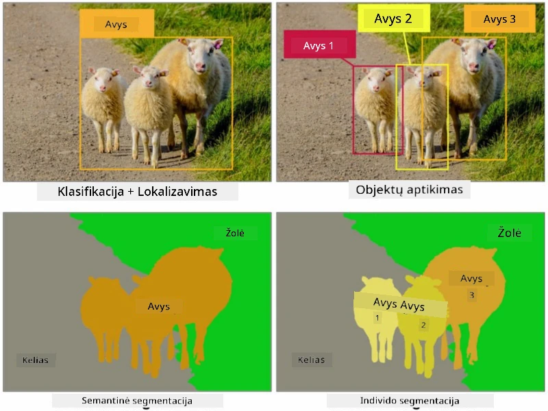
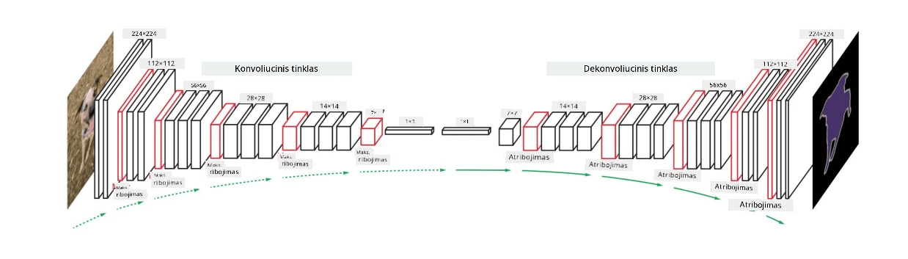

# Segmentacija

Anksčiau išmokome apie objektų aptikimą, kuris leidžia nustatyti objektų vietą vaizde, prognozuojant jų *ribinius langelius*. Tačiau kai kurioms užduotims mums reikia ne tik ribinių langelių, bet ir tikslesnės objektų lokalizacijos. Ši užduotis vadinama **segmentacija**.

## [Prieš paskaitos testą](https://ff-quizzes.netlify.app/en/ai/quiz/23)

Segmentaciją galima laikyti **pikselių klasifikacija**, kur kiekvienam vaizdo pikseliui turime prognozuoti jo klasę (*fonas* yra viena iš klasių). Yra du pagrindiniai segmentacijos algoritmai:

* **Semantinė segmentacija** nurodo tik pikselio klasę, tačiau neskiria skirtingų tos pačios klasės objektų.
* **Objektų segmentacija** padalina klases į skirtingus objektus.

Pavyzdžiui, objektų segmentacijoje šios avys yra skirtingi objektai, tačiau semantinėje segmentacijoje visos avys yra atvaizduojamos kaip viena klasė.

> Vaizdas iš [šio tinklaraščio įrašo](https://nirmalamurali.medium.com/image-classification-vs-semantic-segmentation-vs-instance-segmentation-625c33a08d50)

Yra įvairių neuroninių architektūrų segmentacijai, tačiau jos visos turi tą pačią struktūrą. Tam tikra prasme, tai panašu į autoenkoderį, apie kurį anksčiau mokėtės, tačiau vietoj originalaus vaizdo dekomponavimo mūsų tikslas yra dekomponuoti **kaukę**. Taigi, segmentacijos tinklas turi šias dalis:

* **Enkoderis** išgauna savybes iš įvesties vaizdo.
* **Dekoderis** transformuoja šias savybes į **kaukės vaizdą**, kurio dydis ir kanalų skaičius atitinka klasių skaičių.

> Vaizdas iš [šios publikacijos](https://arxiv.org/pdf/2001.05566.pdf)

Ypatingai svarbu paminėti nuostolių funkciją, naudojamą segmentacijai. Naudojant klasikinius autoenkoderius, reikia matuoti dviejų vaizdų panašumą, tam galima naudoti vidutinio kvadrato paklaidą (MSE). Segmentacijoje kiekvienas pikselis tikslinės kaukės vaizde atspindi klasės numerį (vieno karšto kodavimo būdu trečioje dimensijoje), todėl reikia naudoti klasifikacijai specifines nuostolių funkcijas - kryžminės entropijos nuostolius, vidutiniškai per visus pikselius. Jei kaukė yra dvejetainė - naudojami **dvejetainės kryžminės entropijos nuostoliai** (BCE).

> ✅ Vieno karšto kodavimas yra būdas užkoduoti klasės etiketę į vektorių, kurio ilgis lygus klasių skaičiui. Pažvelkite į [šį straipsnį](https://datagy.io/sklearn-one-hot-encode/) apie šią techniką.

## Segmentacija medicininei vaizdinimui

Šioje pamokoje pamatysime segmentaciją veiksmuose, treniruodami tinklą atpažinti žmogaus apgamus medicininiuose vaizduose. Naudosime <a href="https://www.fc.up.pt/addi/ph2%20database.html">PH2 duomenų bazę</a> dermoskopiniams vaizdams kaip vaizdų šaltinį. Šiame duomenų rinkinyje yra 200 vaizdų, suskirstytų į tris klases: tipiškas apgamas, netipiškas apgamas ir melanoma. Visi vaizdai taip pat turi atitinkamą **kaukę**, kuri apibrėžia apgamą.

> ✅ Ši technika ypač tinkama tokio tipo medicininiam vaizdinimui, tačiau kokias kitas realaus pasaulio taikymo sritis galėtumėte įsivaizduoti?

> Vaizdas iš PH2 duomenų bazės

Mes treniruosime modelį segmentuoti bet kokį apgamą nuo jo fono.

## ✍️ Pratimai: Semantinė segmentacija

Atidarykite žemiau pateiktus užrašus, kad sužinotumėte daugiau apie skirtingas semantinės segmentacijos architektūras, praktikuotumėte darbą su jomis ir pamatytumėte jas veiksmuose.

* [Semantinė segmentacija Pytorch](SemanticSegmentationPytorch.ipynb)
* [Semantinė segmentacija TensorFlow](SemanticSegmentationTF.ipynb)

## [Po paskaitos testą](https://ff-quizzes.netlify.app/en/ai/quiz/24)

## Išvada

Segmentacija yra labai galinga vaizdų klasifikavimo technika, kuri pereina nuo ribinių langelių iki pikselių lygio klasifikacijos. Ji naudojama medicininiame vaizdinime ir kitose srityse.

## 🚀 Iššūkis

Kūno segmentacija yra tik viena iš dažniausiai atliekamų užduočių su žmonių vaizdais. Kitos svarbios užduotys apima **skeletų aptikimą** ir **pozų aptikimą**. Išbandykite [OpenPose](https://github.com/CMU-Perceptual-Computing-Lab/openpose) biblioteką, kad pamatytumėte, kaip galima naudoti pozų aptikimą.

## Peržiūra ir savarankiškas mokymasis

Šis [Vikipedijos straipsnis](https://wikipedia.org/wiki/Image_segmentation) siūlo gerą įvairių šios technikos taikymo sričių apžvalgą. Sužinokite daugiau savarankiškai apie objektų segmentacijos ir panoraminės segmentacijos subdomenus šioje srityje.

## [Užduotis](lab/README.md)

Šioje laboratorijoje išbandykite **žmogaus kūno segmentaciją** naudodami [Segmentation Full Body MADS Dataset](https://www.kaggle.com/datasets/tapakah68/segmentation-full-body-mads-dataset) iš Kaggle.

---

