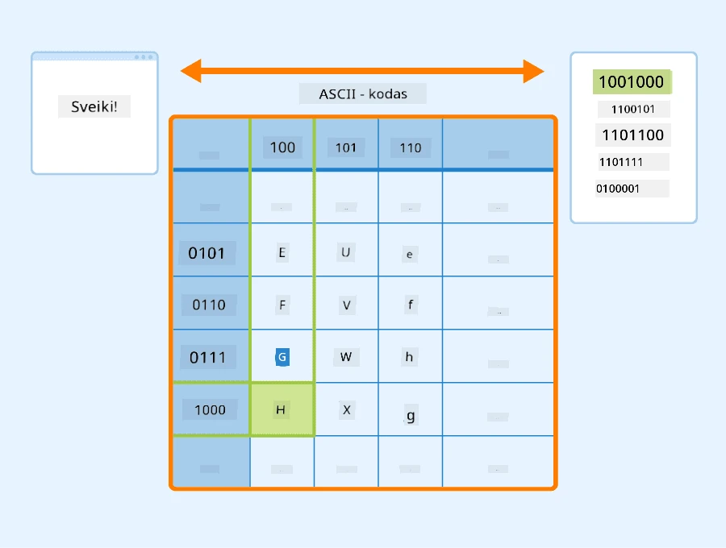

# Teksto atvaizdavimas kaip tensoriai

## [Prieš paskaitos testas](https://ff-quizzes.netlify.app/en/ai/quiz/25)

## Teksto klasifikavimas

Pirmoje šios dalies dalyje mes sutelksime dėmesį į **teksto klasifikavimo** užduotį. Naudosime [AG News](https://www.kaggle.com/amananandrai/ag-news-classification-dataset) duomenų rinkinį, kuriame yra naujienų straipsniai, tokie kaip šis:

* Kategorija: Mokslas/Technologijos
* Pavadinimas: Ky. Įmonė laimi grantą peptidų tyrimui (AP)
* Turinys: AP - Įmonė, įkurta chemijos tyrėjo iš Louisville universiteto, laimėjo grantą, skirtą plėtrai...

Mūsų tikslas bus klasifikuoti naujienų straipsnį į vieną iš kategorijų pagal tekstą.

## Teksto atvaizdavimas

Jei norime spręsti natūralios kalbos apdorojimo (NLP) užduotis naudojant neuroninius tinklus, mums reikia būdo, kaip tekstą paversti tensoriais. Kompiuteriai jau atvaizduoja tekstinius simbolius kaip skaičius, kurie ekrane susiejami su šriftais, naudojant tokius kodavimus kaip ASCII ar UTF-8.

> [Vaizdo šaltinis](https://www.seobility.net/en/wiki/ASCII)

Kaip žmonės, mes suprantame, ką kiekviena raidė **reiškia**, ir kaip visi simboliai susijungia į žodžius sakinyje. Tačiau kompiuteriai patys tokio supratimo neturi, o neuroninis tinklas turi išmokti reikšmę mokymo metu.

Todėl tekstą galima atvaizduoti įvairiais būdais:

* **Simbolių lygmens atvaizdavimas**, kai tekstą atvaizduojame kiekvieną simbolį traktuodami kaip skaičių. Turint *C* skirtingų simbolių teksto korpuse, žodis *Hello* būtų atvaizduotas kaip 5x*C* tensorius. Kiekviena raidė atitiktų tensoriaus stulpelį vieno karšto kodavimo būdu.
* **Žodžių lygmens atvaizdavimas**, kai sukuriame **žodyną** iš visų žodžių tekste ir žodžius atvaizduojame vieno karšto kodavimo būdu. Šis metodas yra šiek tiek geresnis, nes kiekviena raidė pati savaime neturi daug reikšmės, todėl naudojant aukštesnio lygio semantinius konceptus – žodžius – supaprastiname užduotį neuroniniam tinklui. Tačiau dėl didelio žodyno dydžio tenka dirbti su aukštos dimensijos retai užpildytais tensoriais.

Nepriklausomai nuo atvaizdavimo, pirmiausia reikia tekstą paversti **žetonų** seka, kur žetonas gali būti simbolis, žodis ar net žodžio dalis. Tada žetoną paverčiame skaičiumi, paprastai naudojant **žodyną**, ir šį skaičių galima perduoti neuroniniam tinklui naudojant vieno karšto kodavimo būdą.

## N-Gramai

Natūralioje kalboje tikslus žodžių reikšmės supratimas galimas tik kontekste. Pavyzdžiui, *neuroninis tinklas* ir *žvejybos tinklas* turi visiškai skirtingas reikšmes. Vienas iš būdų tai atsižvelgti yra kurti modelį remiantis žodžių poromis ir traktuoti žodžių poras kaip atskirus žodyno žetonus. Tokiu būdu sakinys *Man patinka eiti žvejoti* bus atvaizduotas tokia žetonų seka: *Man patinka*, *patinka eiti*, *eiti žvejoti*. Problema su šiuo metodu yra ta, kad žodyno dydis žymiai padidėja, o tokios kombinacijos kaip *eiti žvejoti* ir *eiti apsipirkti* pateikiamos kaip skirtingi žetonai, kurie neturi jokio semantinio panašumo, nepaisant to paties veiksmažodžio.

Kai kuriais atvejais galime apsvarstyti tri-gramų – trijų žodžių kombinacijų – naudojimą. Todėl šis metodas dažnai vadinamas **n-gramais**. Taip pat prasminga naudoti n-gramus su simbolių lygmens atvaizdavimu, tokiu atveju n-gramai apytiksliai atitiktų skiemenis.

## Žodžių maišas ir TF/IDF

Sprendžiant tokias užduotis kaip teksto klasifikavimas, mums reikia galimybės atvaizduoti tekstą vienu fiksuoto dydžio vektoriumi, kurį naudosime kaip įvestį galutiniam tankiam klasifikatoriui. Vienas paprasčiausių būdų tai padaryti yra sujungti visus atskirus žodžių atvaizdavimus, pvz., juos sudedant. Jei sudėsime kiekvieno žodžio vieno karšto kodavimą, gausime dažnių vektorių, kuris parodys, kiek kartų kiekvienas žodis pasirodo tekste. Toks teksto atvaizdavimas vadinamas **žodžių maišu** (BoW).

> Vaizdas sukurtas autoriaus

BoW iš esmės parodo, kurie žodžiai pasirodo tekste ir kokiais kiekiais, o tai gali būti geras rodiklis, apie ką tekstas yra. Pavyzdžiui, naujienų straipsnis apie politiką greičiausiai turės tokius žodžius kaip *prezidentas* ir *šalis*, o mokslinis straipsnis – tokius kaip *kolideris*, *atrasta* ir pan. Taigi, žodžių dažniai daugeliu atvejų gali būti geras teksto turinio indikatorius.

Problema su BoW yra ta, kad tam tikri dažni žodžiai, tokie kaip *ir*, *yra* ir pan., pasirodo daugumoje tekstų ir turi didžiausius dažnius, užgoždami tikrai svarbius žodžius. Šių žodžių svarbą galime sumažinti atsižvelgdami į dažnį, kuriuo žodžiai pasirodo visoje dokumentų kolekcijoje. Tai yra pagrindinė TF/IDF metodo idėja, kuri išsamiau aptariama šios pamokos pridedamuose užrašuose.

Tačiau nė vienas iš šių metodų negali visiškai atsižvelgti į teksto **semantiką**. Tam reikia galingesnių neuroninių tinklų modelių, kuriuos aptarsime vėliau šioje dalyje.

## ✍️ Pratimai: Teksto atvaizdavimas

Tęskite mokymąsi šiuose užrašuose:

* [Teksto atvaizdavimas su PyTorch](TextRepresentationPyTorch.ipynb)
* [Teksto atvaizdavimas su TensorFlow](TextRepresentationTF.ipynb)

## Išvada

Iki šiol išnagrinėjome metodus, kurie gali pridėti dažnio svorį skirtingiems žodžiams. Tačiau jie negali atvaizduoti reikšmės ar tvarkos. Kaip garsus lingvistas J. R. Firth sakė 1935 m., "Pilna žodžio reikšmė visada yra kontekstinė, ir joks reikšmės tyrimas be konteksto negali būti laikomas rimtu." Vėliau kurse sužinosime, kaip išgauti kontekstinę informaciją iš teksto naudojant kalbos modeliavimą.

## 🚀 Iššūkis

Išbandykite kitus pratimus, naudodami žodžių maišą ir skirtingus duomenų modelius. Galbūt jus įkvėps ši [Kaggle konkurencija](https://www.kaggle.com/competitions/word2vec-nlp-tutorial/overview/part-1-for-beginners-bag-of-words)

## [Po paskaitos testas](https://ff-quizzes.netlify.app/en/ai/quiz/26)

## Apžvalga ir savarankiškas mokymasis

Praktikuokite savo įgūdžius su teksto įterpimais ir žodžių maišo technikomis [Microsoft Learn](https://docs.microsoft.com/learn/modules/intro-natural-language-processing-pytorch/?WT.mc_id=academic-77998-cacaste)

## [Užduotis: Užrašai](assignment.md)

---

