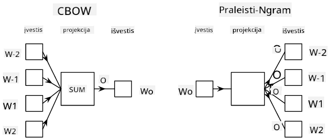

<!--
CO_OP_TRANSLATOR_METADATA:
{
  "original_hash": "e40b47ac3fd48f71304ede1474e66293",
  "translation_date": "2025-08-31T18:01:04+00:00",
  "source_file": "lessons/5-NLP/14-Embeddings/README.md",
  "language_code": "lt"
}
-->
# Įterptys

## [Prieš paskaitos testas](https://red-field-0a6ddfd03.1.azurestaticapps.net/quiz/114)

Mokant klasifikatorius, pagrįstus BoW arba TF/IDF, mes dirbome su aukštos dimensijos žodžių maišo vektoriais, kurių ilgis buvo `vocab_size`, ir aiškiai konvertavome iš žemos dimensijos pozicinių reprezentacijų vektorių į retą vieno elemento reprezentaciją. Tačiau tokia vieno elemento reprezentacija nėra efektyvi atminties atžvilgiu. Be to, kiekvienas žodis yra traktuojamas nepriklausomai nuo kitų, t. y. vieno elemento koduoti vektoriai neišreiškia jokio semantinio panašumo tarp žodžių.

**Įterpties** idėja yra reprezentuoti žodžius mažesnės dimensijos tankiais vektoriais, kurie kažkaip atspindi žodžio semantinę prasmę. Vėliau aptarsime, kaip sukurti prasmingas žodžių įterptis, tačiau dabar tiesiog galvokime apie įterptis kaip apie būdą sumažinti žodžių vektoriaus dimensiją.

Taigi, įterpties sluoksnis priims žodį kaip įvestį ir pateiks išvesties vektorių su nurodytu `embedding_size`. Tam tikra prasme, tai labai panašu į `Linear` sluoksnį, tačiau vietoj vieno elemento koduoto vektoriaus jis galės priimti žodžio numerį kaip įvestį, leidžiant mums išvengti didelių vieno elemento koduotų vektorių kūrimo.

Naudodami įterpties sluoksnį kaip pirmąjį sluoksnį mūsų klasifikatoriaus tinkle, galime pereiti nuo žodžių maišo prie **įterpties maišo** modelio, kuriame pirmiausia kiekvieną žodį mūsų tekste konvertuojame į atitinkamą įterptį, o tada apskaičiuojame tam tikrą agregavimo funkciją visoms toms įterptims, pvz., `sum`, `average` arba `max`.

> Vaizdas sukurtas autoriaus

## ✍️ Pratimai: Įterptys

Tęskite mokymąsi šiuose užrašų knygelėse:
* [Įterptys su PyTorch](EmbeddingsPyTorch.ipynb)
* [Įterptys su TensorFlow](EmbeddingsTF.ipynb)

## Semantinės įterptys: Word2Vec

Nors įterpties sluoksnis išmoko žodžius paversti vektorinėmis reprezentacijomis, ši reprezentacija nebūtinai turėjo daug semantinės prasmės. Būtų naudinga išmokti vektorinę reprezentaciją, kurioje panašūs žodžiai ar sinonimai atitiktų vektorius, kurie yra arti vienas kito pagal tam tikrą vektorinį atstumą (pvz., Euklido atstumą).

Norėdami tai pasiekti, turime iš anksto apmokyti savo įterpties modelį didelėje tekstų kolekcijoje specifiniu būdu. Vienas iš būdų mokyti semantines įterptis vadinamas [Word2Vec](https://en.wikipedia.org/wiki/Word2vec). Jis pagrįstas dviem pagrindinėmis architektūromis, kurios naudojamos žodžių paskirstytai reprezentacijai sukurti:

 - **Nuolatinis žodžių maišas** (CBoW) — šioje architektūroje modelis mokomas numatyti žodį iš aplinkinio konteksto. Turint ngramą $(W_{-2},W_{-1},W_0,W_1,W_2)$, modelio tikslas yra numatyti $W_0$ iš $(W_{-2},W_{-1},W_1,W_2)$.
 - **Nuolatinis praleidimo gramų modelis** yra priešingas CBoW. Modelis naudoja aplinkinį konteksto žodžių langą, kad numatytų dabartinį žodį.

CBoW yra greitesnis, o praleidimo gramų modelis yra lėtesnis, tačiau geriau reprezentuoja retus žodžius.

> Vaizdas iš [šio straipsnio](https://arxiv.org/pdf/1301.3781.pdf)

Iš anksto apmokytos Word2Vec įterptys (taip pat ir kiti panašūs modeliai, tokie kaip GloVe) gali būti naudojamos vietoj įterpties sluoksnio neuroniniuose tinkluose. Tačiau reikia spręsti žodynų problemas, nes žodynas, naudotas Word2Vec/GloVe išankstiniam mokymui, greičiausiai skiriasi nuo žodyno mūsų tekstų korpuse. Peržiūrėkite aukščiau pateiktas užrašų knygeles, kad pamatytumėte, kaip šią problemą galima išspręsti.

## Kontekstinės įterptys

Viena pagrindinių tradicinių iš anksto apmokytų įterpties reprezentacijų, tokių kaip Word2Vec, apribojimų yra žodžių reikšmės dviprasmiškumo problema. Nors iš anksto apmokytos įterptys gali užfiksuoti tam tikrą žodžių prasmę kontekste, kiekviena galima žodžio reikšmė yra užkoduota toje pačioje įterptyje. Tai gali sukelti problemų vėlesniuose modeliuose, nes daugelis žodžių, pvz., žodis „play“, turi skirtingas reikšmes priklausomai nuo konteksto, kuriame jie naudojami.

Pavyzdžiui, žodis „play“ šiuose dviejuose sakiniuose turi gana skirtingą reikšmę:

- Aš nuėjau į **spektaklį** teatre.
- Jonas nori **žaisti** su savo draugais.

Iš anksto apmokytos įterptys aukščiau reprezentuoja abi šias žodžio „play“ reikšmes toje pačioje įterptyje. Norėdami įveikti šį apribojimą, turime kurti įterptis, pagrįstas **kalbos modeliu**, kuris yra apmokytas dideliame tekstų korpuse ir *žino*, kaip žodžiai gali būti sudėti skirtinguose kontekstuose. Kontekstinių įterpčių aptarimas yra už šio mokymo ribų, tačiau mes grįšime prie jų, kai vėliau kurse kalbėsime apie kalbos modelius.

## Išvada

Šioje pamokoje sužinojote, kaip kurti ir naudoti įterpties sluoksnius TensorFlow ir Pytorch, kad geriau atspindėtumėte žodžių semantines prasmes.

## 🚀 Iššūkis

Word2Vec buvo naudojamas kai kurioms įdomioms programoms, įskaitant dainų tekstų ir poezijos generavimą. Peržiūrėkite [šį straipsnį](https://www.politetype.com/blog/word2vec-color-poems), kuriame aprašoma, kaip autorius naudojo Word2Vec poezijai generuoti. Taip pat pažiūrėkite [šį Dan Shiffmann vaizdo įrašą](https://www.youtube.com/watch?v=LSS_bos_TPI&ab_channel=TheCodingTrain), kad sužinotumėte kitokį šios technikos paaiškinimą. Tada pabandykite pritaikyti šias technikas savo tekstų korpusui, galbūt gautam iš Kaggle.

## [Po paskaitos testas](https://red-field-0a6ddfd03.1.azurestaticapps.net/quiz/214)

## Apžvalga ir savarankiškas mokymasis

Perskaitykite šį straipsnį apie Word2Vec: [Efektyvus žodžių reprezentacijų įvertinimas vektorinėje erdvėje](https://arxiv.org/pdf/1301.3781.pdf)

## [Užduotis: Užrašų knygelės](assignment.md)

---

**Atsakomybės apribojimas**:  
Šis dokumentas buvo išverstas naudojant dirbtinio intelekto vertimo paslaugą [Co-op Translator](https://github.com/Azure/co-op-translator). Nors siekiame tikslumo, atkreipiame dėmesį, kad automatiniai vertimai gali turėti klaidų ar netikslumų. Originalus dokumentas jo gimtąja kalba turėtų būti laikomas autoritetingu šaltiniu. Kritinei informacijai rekomenduojama naudoti profesionalų žmogaus vertimą. Mes neprisiimame atsakomybės už nesusipratimus ar klaidingus aiškinimus, kylančius dėl šio vertimo naudojimo.