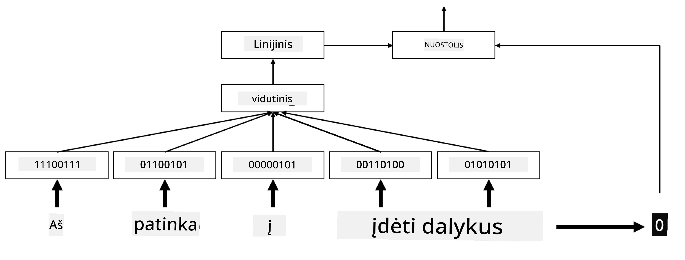

# Įterpiniai

## [Prieš paskaitos testas](https://ff-quizzes.netlify.app/en/ai/quiz/27)

Mokydami klasifikatorius, pagrįstus BoW arba TF/IDF, dirbome su aukštos dimensijos žodžių maišo vektoriais, kurių ilgis buvo `vocab_size`, ir aiškiai konvertavome iš žemos dimensijos pozicinės reprezentacijos vektorių į retą vieno elemento reprezentaciją. Tačiau tokia vieno elemento reprezentacija nėra efektyvi atminties požiūriu. Be to, kiekvienas žodis yra traktuojamas nepriklausomai nuo kitų, t. y. vieno elemento koduoti vektoriai neišreiškia jokio semantinio panašumo tarp žodžių.

**Įterpinių** idėja yra atvaizduoti žodžius mažesnės dimensijos tankiais vektoriais, kurie kažkaip atspindi žodžio semantinę prasmę. Vėliau aptarsime, kaip sukurti prasmingus žodžių įterpinius, tačiau dabar tiesiog galvokime apie įterpinius kaip apie būdą sumažinti žodžio vektoriaus dimensiją.

Taigi, įterpimo sluoksnis priims žodį kaip įvestį ir pateiks išvesties vektorių, kurio dydis yra `embedding_size`. Tam tikra prasme jis yra labai panašus į `Linear` sluoksnį, tačiau vietoj vieno elemento koduoto vektoriaus jis galės priimti žodžio numerį kaip įvestį, leidžiant mums išvengti didelių vieno elemento koduotų vektorių kūrimo.

Naudodami įterpimo sluoksnį kaip pirmąjį sluoksnį mūsų klasifikatoriaus tinkle, galime pereiti nuo žodžių maišo prie **įterpinių maišo** modelio, kuriame pirmiausia kiekvieną žodį mūsų tekste konvertuojame į atitinkamą įterpinį, o tada apskaičiuojame tam tikrą agregavimo funkciją visiems tiems įterpiniams, pvz., `sum`, `average` arba `max`.

> Vaizdas sukurtas autoriaus

## ✍️ Pratimai: Įterpiniai

Tęskite mokymąsi šiuose užrašų knygelėse:
* [Įterpiniai su PyTorch](EmbeddingsPyTorch.ipynb)
* [Įterpiniai su TensorFlow](EmbeddingsTF.ipynb)

## Semantiniai įterpiniai: Word2Vec

Nors įterpimo sluoksnis išmoko žodžius paversti vektorinėmis reprezentacijomis, ši reprezentacija nebūtinai turėjo daug semantinės prasmės. Būtų naudinga išmokti vektorinę reprezentaciją, kurioje panašūs žodžiai ar sinonimai atitiktų vektorius, kurie yra arti vienas kito pagal tam tikrą vektorinį atstumą (pvz., Euklido atstumą).

Norėdami tai pasiekti, turime iš anksto apmokyti savo įterpimo modelį didelėje tekstų kolekcijoje specifiniu būdu. Vienas iš būdų mokyti semantinius įterpinius vadinamas [Word2Vec](https://en.wikipedia.org/wiki/Word2vec). Jis pagrįstas dviem pagrindinėmis architektūromis, kurios naudojamos žodžių paskirstytai reprezentacijai sukurti:

 - **Nuolatinis žodžių maišas** (CBoW) — šioje architektūroje modelis mokomas numatyti žodį pagal aplinkinį kontekstą. Turint ngramą $(W_{-2},W_{-1},W_0,W_1,W_2)$, modelio tikslas yra numatyti $W_0$ pagal $(W_{-2},W_{-1},W_1,W_2)$.
 - **Nuolatinis praleidimo gramų modelis** yra priešingas CBoW. Modelis naudoja aplinkinį konteksto žodžių langą, kad numatytų dabartinį žodį.

CBoW yra greitesnis, o praleidimo gramų modelis yra lėtesnis, tačiau geriau reprezentuoja retus žodžius.

> Vaizdas iš [šio straipsnio](https://arxiv.org/pdf/1301.3781.pdf)

Iš anksto apmokyti Word2Vec įterpiniai (taip pat ir kiti panašūs modeliai, tokie kaip GloVe) gali būti naudojami vietoj įterpimo sluoksnio neuroniniuose tinkluose. Tačiau reikia spręsti žodynų problemas, nes žodynas, naudotas Word2Vec/GloVe išankstiniam mokymui, greičiausiai skiriasi nuo žodyno mūsų tekstų korpuse. Peržiūrėkite aukščiau pateiktas užrašų knygeles, kad pamatytumėte, kaip šią problemą galima išspręsti.

## Kontekstiniai įterpiniai

Viena iš pagrindinių tradicinių iš anksto apmokytų įterpinių, tokių kaip Word2Vec, apribojimų yra žodžių reikšmės dviprasmiškumo problema. Nors iš anksto apmokyti įterpiniai gali užfiksuoti dalį žodžių prasmės kontekste, kiekviena galima žodžio reikšmė yra užkoduota tame pačiame įterpinyje. Tai gali sukelti problemų vėlesniuose modeliuose, nes daugelis žodžių, pvz., žodis „play“, turi skirtingas reikšmes priklausomai nuo konteksto, kuriame jie naudojami.

Pavyzdžiui, žodis „play“ šiuose dviejuose sakiniuose turi visiškai skirtingas reikšmes:

- Aš nuėjau į **spektaklį** teatre.
- Jonas nori **žaisti** su savo draugais.

Iš anksto apmokyti įterpiniai aukščiau pateikia abi šias žodžio „play“ reikšmes tame pačiame įterpinyje. Norėdami įveikti šį apribojimą, turime kurti įterpinius, pagrįstus **kalbos modeliu**, kuris yra apmokytas dideliame tekstų korpuse ir *žino*, kaip žodžiai gali būti sudėti skirtinguose kontekstuose. Kontekstinių įterpinių aptarimas yra už šio mokymo ribų, tačiau grįšime prie jų, kai vėliau kurse kalbėsime apie kalbos modelius.

## Išvada

Šioje pamokoje sužinojote, kaip kurti ir naudoti įterpimo sluoksnius TensorFlow ir Pytorch, kad geriau atspindėtumėte žodžių semantines prasmes.

## 🚀 Iššūkis

Word2Vec buvo naudojamas kai kurioms įdomioms programoms, įskaitant dainų tekstų ir poezijos generavimą. Peržiūrėkite [šį straipsnį](https://www.politetype.com/blog/word2vec-color-poems), kuriame aprašoma, kaip autorius naudojo Word2Vec poezijos generavimui. Taip pat žiūrėkite [šį Dan Shiffmann vaizdo įrašą](https://www.youtube.com/watch?v=LSS_bos_TPI&ab_channel=TheCodingTrain), kad sužinotumėte kitokį šios technikos paaiškinimą. Tada pabandykite pritaikyti šias technikas savo tekstų korpusui, galbūt gautam iš Kaggle.

## [Po paskaitos testas](https://ff-quizzes.netlify.app/en/ai/quiz/28)

## Apžvalga ir savarankiškas mokymasis

Perskaitykite šį straipsnį apie Word2Vec: [Efficient Estimation of Word Representations in Vector Space](https://arxiv.org/pdf/1301.3781.pdf)

## [Užduotis: Užrašų knygelės](assignment.md)

---

