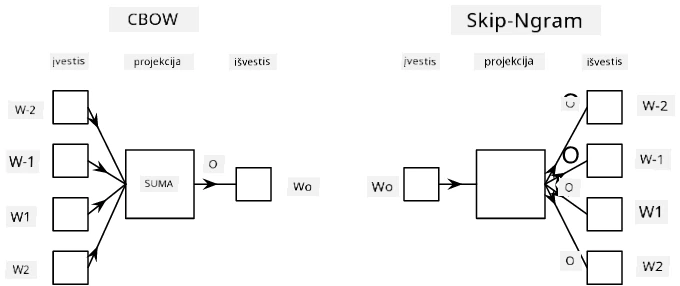

# Kalbos modeliavimas

Semantiniai įterpiniai, tokie kaip Word2Vec ir GloVe, iš tiesų yra pirmasis žingsnis link **kalbos modeliavimo** – modelių kūrimo, kurie kažkaip *supranta* (arba *atspindi*) kalbos prigimtį.

## [Prieš paskaitą vykdomas testas](https://ff-quizzes.netlify.app/en/ai/quiz/29)

Pagrindinė kalbos modeliavimo idėja yra jų mokymas naudojant nepažymėtus duomenų rinkinius nesupervizuotu būdu. Tai svarbu, nes turime didžiulius kiekius nepažymėto teksto, o pažymėto teksto kiekis visada bus ribotas dėl pastangų, reikalingų jį pažymėti. Dažniausiai galime kurti kalbos modelius, kurie gali **prognozuoti trūkstamus žodžius** tekste, nes lengva atsitiktinai užmaskuoti žodį tekste ir naudoti jį kaip mokymo pavyzdį.

## Įterpinių mokymas

Ankstesniuose pavyzdžiuose naudojome iš anksto apmokytus semantinius įterpinius, tačiau įdomu pamatyti, kaip šiuos įterpinius galima apmokyti. Yra keletas galimų idėjų, kurias galima naudoti:

* **N-Gram** kalbos modeliavimas, kai prognozuojame žodį, remdamiesi N ankstesniais žodžiais (N-grama).
* **Nuolatinis žodžių maišas** (CBoW), kai prognozuojame vidurinį žodį $W_0$ žodžių sekoje $W_{-N}$, ..., $W_N$.
* **Skip-gram**, kai prognozuojame kaimyninių žodžių rinkinį {$W_{-N},\dots, W_{-1}, W_1,\dots, W_N$} iš vidurinio žodžio $W_0$.

> Vaizdas iš [šio straipsnio](https://arxiv.org/pdf/1301.3781.pdf)

## ✍️ Pavyzdiniai užrašai: CBoW modelio mokymas

Tęskite mokymąsi naudodamiesi šiais užrašais:

* [CBoW Word2Vec mokymas su TensorFlow](CBoW-TF.ipynb)
* [CBoW Word2Vec mokymas su PyTorch](CBoW-PyTorch.ipynb)

## Išvada

Ankstesnėje pamokoje matėme, kad žodžių įterpiniai veikia kaip magija! Dabar žinome, kad žodžių įterpinių mokymas nėra labai sudėtinga užduotis, ir prireikus turėtume sugebėti apmokyti savo įterpinius specifiniam tekstui.

## [Po paskaitos vykdomas testas](https://ff-quizzes.netlify.app/en/ai/quiz/30)

## Apžvalga ir savarankiškas mokymasis

* [Oficialus PyTorch kalbos modeliavimo vadovas](https://pytorch.org/tutorials/beginner/nlp/word_embeddings_tutorial.html).
* [Oficialus TensorFlow vadovas apie Word2Vec modelio mokymą](https://www.TensorFlow.org/tutorials/text/word2vec).
* Naudojant **gensim** sistemą, dažniausiai naudojamų įterpinių mokymas keliose kodo eilutėse aprašytas [šioje dokumentacijoje](https://pytorch.org/tutorials/beginner/nlp/word_embeddings_tutorial.html).

## 🚀 [Užduotis: Skip-Gram modelio mokymas](lab/README.md)

Laboratorijoje kviečiame jus pakeisti šios pamokos kodą, kad būtų mokomas Skip-Gram modelis vietoj CBoW. [Skaitykite detales](lab/README.md)

---

