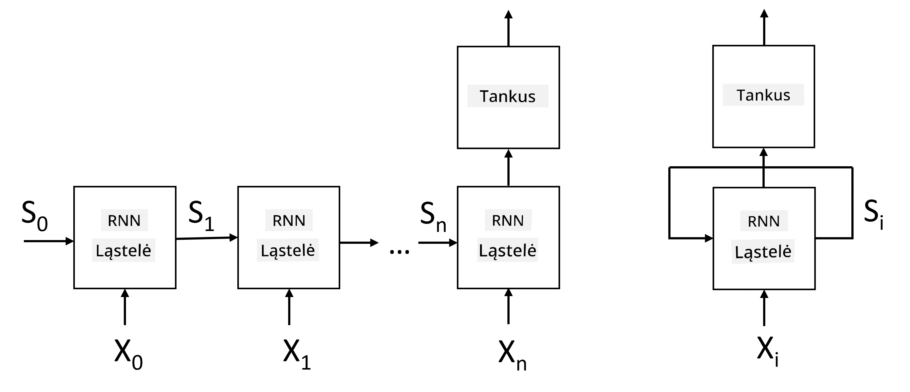
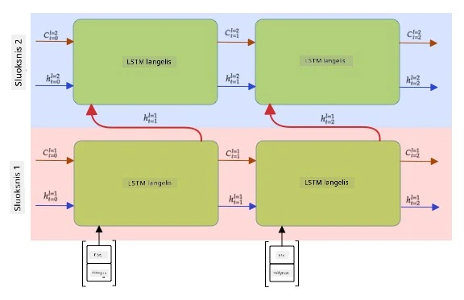

# Rekurentiniai neuroniniai tinklai

## [Prieš paskaitą: testas](https://ff-quizzes.netlify.app/en/ai/quiz/31)

Ankstesnėse dalyse naudojome turtingas semantines teksto reprezentacijas ir paprastą linijinį klasifikatorių virš įterpimų. Ši architektūra padeda užfiksuoti bendrą žodžių prasmę sakinyje, tačiau ji neatsižvelgia į **žodžių tvarką**, nes agregavimo operacija virš įterpimų pašalina šią informaciją iš originalaus teksto. Kadangi šie modeliai negali modeliuoti žodžių tvarkos, jie negali spręsti sudėtingesnių ar dviprasmiškų užduočių, tokių kaip teksto generavimas ar klausimų atsakymas.

Norint užfiksuoti teksto sekos prasmę, reikia naudoti kitą neuroninio tinklo architektūrą, vadinamą **rekurentiniais neuroniniais tinklais** (RNN). RNN tinkluose sakinį perduodame per tinklą po vieną simbolį, o tinklas generuoja tam tikrą **būseną**, kurią vėliau perduodame tinklui kartu su kitu simboliu.

> Vaizdas sukurtas autoriaus

Turint įvesties seką X0,...,Xn, RNN sukuria neuroninių tinklų blokų seką ir treniruoja šią seką nuo pradžios iki pabaigos naudojant atgalinę sklaidą. Kiekvienas tinklo blokas priima porą (Xi,Si) kaip įvestį ir generuoja Si+1 kaip rezultatą. Galutinė būsena Sn arba (išvestis Yn) perduodama linijiniam klasifikatoriui, kad būtų gautas rezultatas. Visi tinklo blokai dalijasi tais pačiais svoriais ir yra treniruojami nuo pradžios iki pabaigos vienu atgalinės sklaidos etapu.

Kadangi būsenos vektoriai S0,...,Sn perduodami per tinklą, jis gali išmokti sekos priklausomybes tarp žodžių. Pavyzdžiui, kai žodis *ne* pasirodo kažkur sekoje, tinklas gali išmokti paneigti tam tikrus elementus būsenos vektoriuje, sukeldamas neigimą.

> ✅ Kadangi visų RNN blokų svoriai aukščiau pateiktame paveikslėlyje yra bendri, tas pats paveikslėlis gali būti pateiktas kaip vienas blokas (dešinėje) su rekurentine grįžtamojo ryšio kilpa, kuri perduoda tinklo išvesties būseną atgal į įvestį.

## RNN ląstelės anatomija

Pažvelkime, kaip organizuota paprasta RNN ląstelė. Ji priima ankstesnę būseną Si-1 ir dabartinį simbolį Xi kaip įvestis ir turi generuoti išvesties būseną Si (kartais mus taip pat domina kita išvestis Yi, kaip generatyviniuose tinkluose).

Paprasta RNN ląstelė turi du svorio matricas viduje: viena transformuoja įvesties simbolį (vadinkime ją W), o kita transformuoja įvesties būseną (H). Tokiu atveju tinklo išvestis apskaičiuojama kaip &sigma;(W&times;Xi+H&times;Si-1+b), kur &sigma; yra aktyvavimo funkcija, o b yra papildomas poslinkis.

> Vaizdas sukurtas autoriaus

Daugeliu atvejų įvesties simboliai perduodami per įterpimo sluoksnį prieš patenkant į RNN, kad sumažėtų dimensija. Tokiu atveju, jei įvesties vektorių dimensija yra *emb_size*, o būsenos vektorius yra *hid_size*, W dydis yra *emb_size*&times;*hid_size*, o H dydis yra *hid_size*&times;*hid_size*.

## Ilgalaikė trumpalaikė atmintis (LSTM)

Viena pagrindinių klasikinių RNN problemų yra vadinamoji **nykstančių gradientų** problema. Kadangi RNN treniruojami nuo pradžios iki pabaigos vienu atgalinės sklaidos etapu, jiems sunku perduoti klaidą į pirmuosius tinklo sluoksnius, todėl tinklas negali išmokti ryšių tarp tolimų simbolių. Vienas iš būdų išvengti šios problemos yra įvesti **aiškų būsenos valdymą** naudojant vadinamuosius **vartus**. Yra dvi gerai žinomos tokios architektūros: **Ilgalaikė trumpalaikė atmintis** (LSTM) ir **Vartų relės vienetas** (GRU).

> Vaizdo šaltinis TBD

LSTM tinklas organizuotas panašiai kaip RNN, tačiau yra dvi būsenos, kurios perduodamos iš sluoksnio į sluoksnį: faktinė būsena C ir paslėptas vektorius H. Kiekviename vienete paslėptas vektorius Hi sujungiamas su įvestimi Xi, ir jie kontroliuoja, kas vyksta su būsena C per **vartus**. Kiekvienas vartas yra neuroninis tinklas su sigmoidine aktyvacija (išvestis diapazone [0,1]), kuris gali būti laikomas bitų kauke, kai dauginamas iš būsenos vektoriaus. Yra šie vartai (iš kairės į dešinę paveikslėlyje aukščiau):

* **Pamiršimo vartai** priima paslėptą vektorių ir nustato, kuriuos vektoriaus C komponentus reikia pamiršti, o kuriuos perduoti.
* **Įvesties vartai** paima tam tikrą informaciją iš įvesties ir paslėptų vektorių ir įterpia ją į būseną.
* **Išvesties vartai** transformuoja būseną per linijinį sluoksnį su *tanh* aktyvacija, tada pasirenka kai kuriuos jo komponentus naudodami paslėptą vektorių Hi, kad generuotų naują būseną Ci+1.

Būsenos C komponentai gali būti laikomi tam tikrais ženklais, kuriuos galima įjungti ir išjungti. Pavyzdžiui, kai sekoje sutinkame vardą *Alisa*, galime manyti, kad tai moteriškas personažas, ir įjungti ženklą būsenoje, kad sakinyje yra moteriškas daiktavardis. Kai toliau sutinkame frazę *ir Tomas*, įjungsime ženklą, kad turime daugiskaitinį daiktavardį. Taigi manipuliuodami būsena galime sekti sakinio dalių gramatines savybes.

> ✅ Puikus šaltinis, padedantis suprasti LSTM vidinę struktūrą, yra šis puikus straipsnis [Understanding LSTM Networks](https://colah.github.io/posts/2015-08-Understanding-LSTMs/) Christopher Olah.

## Dvikrypčiai ir daugiasluoksniai RNN

Aptarėme rekurentinius tinklus, kurie veikia viena kryptimi, nuo sekos pradžios iki pabaigos. Tai atrodo natūralu, nes primena, kaip skaitome ir klausome kalbos. Tačiau, kadangi daugeliu praktinių atvejų turime atsitiktinę prieigą prie įvesties sekos, gali būti prasminga vykdyti rekurentinį skaičiavimą abiem kryptimis. Tokie tinklai vadinami **dvikrypčiais** RNN. Dirbant su dvikrypčiu tinklu, mums reikės dviejų paslėptų būsenos vektorių, po vieną kiekvienai krypčiai.

Rekurentinis tinklas, nesvarbu, ar vienkryptis, ar dvikryptis, užfiksuoja tam tikrus sekos modelius ir gali juos saugoti būsenos vektoriuje arba perduoti į išvestį. Kaip ir konvoliuciniuose tinkluose, galime sukurti kitą rekurentinį sluoksnį virš pirmojo, kad užfiksuotume aukštesnio lygio modelius ir sukurtume iš žemo lygio modelių, kuriuos ištraukė pirmasis sluoksnis. Tai veda mus prie **daugiasluoksnio RNN** sąvokos, kurią sudaro du ar daugiau rekurentinių tinklų, kur ankstesnio sluoksnio išvestis perduodama kitam sluoksniui kaip įvestis.

*Paveikslas iš [šio puikaus įrašo](https://towardsdatascience.com/from-a-lstm-cell-to-a-multilayer-lstm-network-with-pytorch-2899eb5696f3) Fernando López*

## ✍️ Pratimai: Įterpimai

Tęskite mokymąsi šiuose užrašų knygelėse:

* [RNN su PyTorch](RNNPyTorch.ipynb)
* [RNN su TensorFlow](RNNTF.ipynb)

## Išvada

Šiame skyriuje matėme, kad RNN gali būti naudojami sekų klasifikavimui, tačiau iš tiesų jie gali atlikti daug daugiau užduočių, tokių kaip teksto generavimas, mašininis vertimas ir kt. Šias užduotis aptarsime kitame skyriuje.

## 🚀 Iššūkis

Perskaitykite literatūrą apie LSTM ir apsvarstykite jų taikymą:

- [Grid Long Short-Term Memory](https://arxiv.org/pdf/1507.01526v1.pdf)
- [Show, Attend and Tell: Neural Image Caption
Generation with Visual Attention](https://arxiv.org/pdf/1502.03044v2.pdf)

## [Po paskaitos: testas](https://ff-quizzes.netlify.app/en/ai/quiz/32)

## Apžvalga ir savarankiškas mokymasis

- [Understanding LSTM Networks](https://colah.github.io/posts/2015-08-Understanding-LSTMs/) Christopher Olah.

## [Užduotis: Užrašų knygelės](assignment.md)

---

